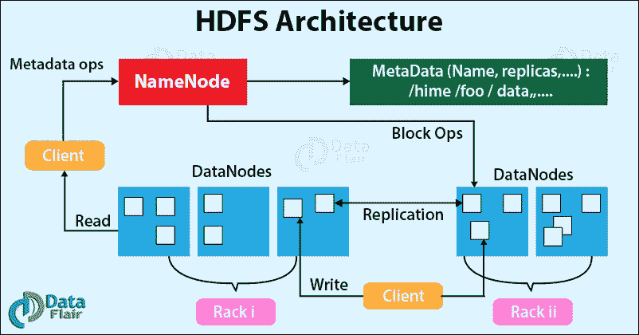
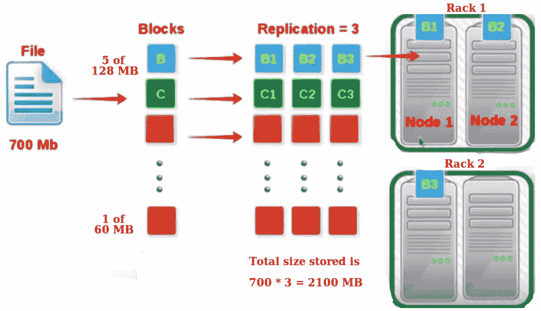
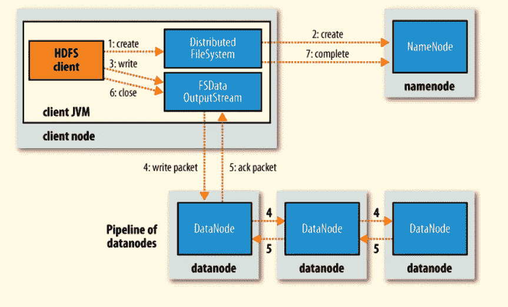
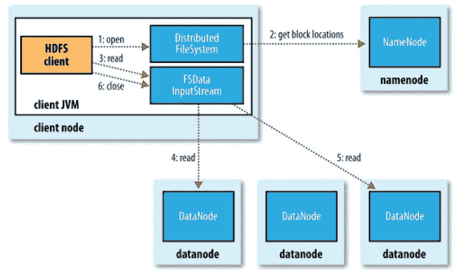

# 了解 Hadoop HDFS

> 原文：<https://medium.com/analytics-vidhya/understanding-hadoop-hdfs-e0821c5fadc3?source=collection_archive---------10----------------------->


HDFS (Hadoop 分布式文件系统)是一个分布式文件系统，用于在创纪录的时间内存储和检索带有流数据的大型文件。它是 Hadoop Apache 框架的基本组件之一，更准确地说是它的存储系统。HDFS Hadoop 是 Apache 的顶级项目之一。

# 体系结构



## 定义

**HDFS 客户端:**HDFS 客户端代表用户与 NameNode 和 Datanode 交互，完成用户请求。

**NameNode** :是 HDFS 文件系统的核心。它保存文件系统中所有文件的目录树，并跟踪文件数据在群集中的保存位置。它本身并不存储这些文件的数据，而是存储关于这些文件的数据或元数据。

**DataNode** :在【HadoopFileSystem】中存储数据。一个功能文件系统有多个 DataNode，数据在它们之间复制。

**文件和块:**文件是我们想要存储的数据，当我们将文件存储到 HDFS 时，它被分成块，每个块的默认大小在 Hadoop 2.x 中是 128/256 MB，在 Hadoop 1.x 中是 64 MB

**块复制:**复制每个块是为了提供容错和可用性，默认的副本数量是 3。



# 写操作流程图



1.  HDFS 客户端调用**分布式文件系统**上的 create()方法来创建文件。
2.  **DistributedFileSystem** 通过 RPC 调用与 NameNode 交互，在文件系统命名空间中创建一个新文件，并与(file_size，dest_path…)相关联。
3.  Namenode 确保该文件不存在，并且客户端具有创建该文件的权限。如果所有这些检查都通过了，namenode 就会记录下这个新文件。 **DistributedFileSystem** 返回 **FSDataOutputStream** 供客户端开始向 Datanode 写入数据。
4.  当客户端开始写入数据时， **DFSOutputStream** (包装在 **FSDataOutputStream** 中)将客户端的数据拆分成数据包，并将其写入一个内部队列，称为**数据**队列**队列**。然后**数据流处理器**使用这个数据队列，它负责通过选择合适的 DataNode 列表来告诉 NameNode 分配新的块。
5.  **DFSOutputStream** 还维护另一个数据包队列，称为 **ack 队列**，它正在等待来自 DataNodes 的确认。
6.  HDFS 客户端在完成数据写入时调用流上的 **close()** 方法。
7.  然后， **FSDataOutputStream** 向 NameNode 发送确认。

# 读取操作流程图



1.  HDFS 客户端调用**文件系统对象**上的 open()方法，这对于 HDFS 来说是分布式文件系统的一个实例。
2.  **DistributedFileSystem** 然后使用 RPC 调用 NameNode 来获取文件块的位置，对于每个块，NameNode 从客户端返回包含该块副本的 close Datanodes 的地址。然后**分布式文件系统**返回一个 **FSDataInputStream** 给客户端，客户端可以从这里读取数据。
3.  然后客户端调用 **FSDataInputStream** 对象上的 **read()** 方法。
4.  包含文件块地址的 **DFSInputStream** (包装在 **FSDataInputStream** )连接到最近的 DataNode 以读取文件中的第一个块。
5.  到达文件末尾后， **DFSInputStream** 关闭与该 DataNode 的连接，并为下一个块找到最合适的 DataNode。
6.  当客户端读取完数据后，调用 **FSDataInputStream** 上的 **close()** 。

# HDFS 命令

1.  **HDFS DFS–mkdir/path/directory _ name**:创建目录。
2.  **hdfs DFS-ls/path**:to**登记 HDFS 现有的文件和目录。**
3.  ****HDFS DFS-put<localsrc><dest>**:it**将文件或目录从本地文件系统复制到 Hadoop 文件系统中的目的地。****
4.  ******HDFS DFS-get<src><local dest>:**it**将文件或目录从 Hadoop 文件系统复制到本地文件系统中的目的地。******
5.  ********hdfs DFS–cat/path _ to _ file _ in _ HDFS**:**在 HDFS 中读取文件，并在控制台或 stdout 上显示文件内容。********

# ******面向 HDFS 的 Java API******

## ******在 HDFS 写作******

```
****FileSystem fileSystem = FileSystem.get(conf);
Path path = new Path("/path/to/file.ext");
if (fileSystem.exists(path)) {
  System.out.println("File " + dest + " already exists");
  return;
}
FSDataOutputStream out = fileSystem.create(path);
InputStream in = new BufferedInputStream(new FileInputStream(
new File(source)));
byte[] b = new byte[1024];
int numBytes = 0;
while ((numBytes = in.read(b)) > 0) {
   out.write(b, 0, numBytes);
}
in.close();
out.close();
fileSystem.close();****
```

## ******阅读 HDFS 的作品******

```
****FileSystem fileSystem = FileSystem.get(conf);
Path path = new Path("/path/to/file.ext");
if (!fileSystem.exists(path)) {
  System.out.println("File does not exists");
  return;
}
FSDataInputStream in = fileSystem.open(path);
int numBytes = 0;
while ((numBytes = in.read(b))> 0) {
  System.out.prinln((char)numBytes));
}
in.close();
out.close();
fileSystem.close();****
```

# ******感谢阅读！******