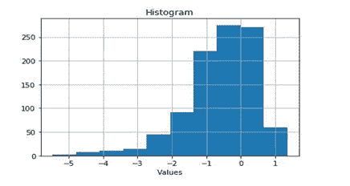
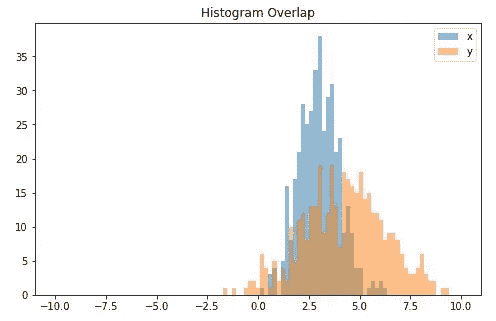
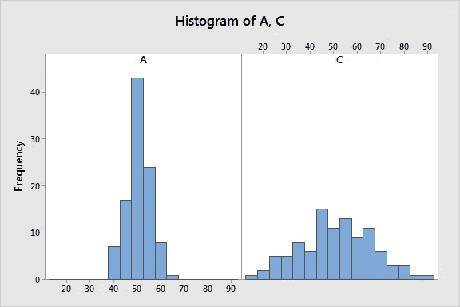
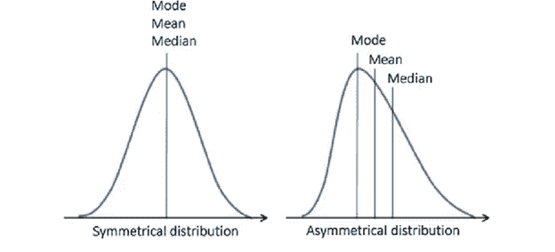
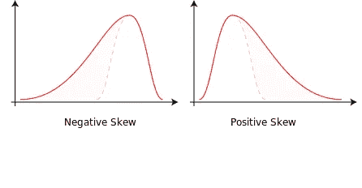
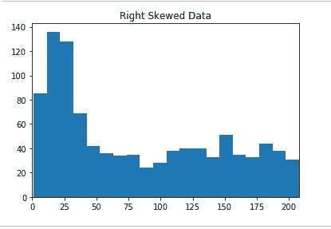
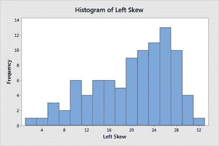
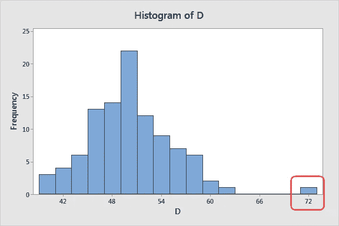
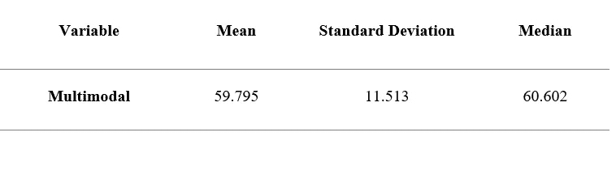
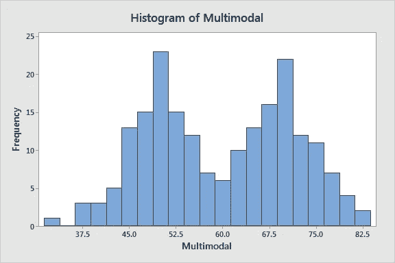

# 了解直方图

> 原文：<https://medium.com/analytics-vidhya/understanding-histograms-20326ea62744?source=collection_archive---------12----------------------->

直方图是展示连续数据分布的图表。

# 为什么要使用直方图？

直方图可以呈现关于汇总统计值(平均值、标准差等)的数据的信息。)不能。因为视觉信息可以很容易地提供关于数据的直觉，因为视觉是意识非常非常重要的组成部分。

尽管汇总统计值对于提供有关数据样本分布的信息非常有用，但这些值是数据的简化。

如果我们结合统计值使用图表(视觉信息)，如直方图，它可以提供对样本数据的非常强的理解。

# 直方图有什么用途？

直方图可用于了解连续数据的分布。

**直方图和集中趋势:**

直方图可用于寻找数据样本的中心，在下面给出的直方图中，我们可以看到数据样本的中心在'-1 和 0 '之间。

数据的中心其实是‘均值’。换句话说，直方图给出了关于数据“平均值”的信息。

直方图还可以发现两个或更多数据分布的重叠，这对于发现数据分布之间的公共值非常有用。

**直方图和变异性:**

汇总统计可能会产生一个错误的数据分布概念。

假设你有两个数据分布，唯一知道的是它们的“平均值”。如果两个数据分布的平均值相同，那么这个信息将使我们相信两个分布实际上是相等的。

但是，如果我们绘制这些数据分布图，我们会发现这两种分布并不等同，而是不同的，如下所示:

正如我们所看到的，虽然两个分布(A & C)有相同的平均值，但它们有显著的不同。分布 A 的范围是(40 到 70)，而分布 C 的范围是(10 到 90)。因此，“平均值”并不能提供我们数据的全貌，可能会产生误导。

汇总统计，如均值和标准差，仅提供部分信息，而直方图为我们提供了更多的材料来了解哪些值在数据中或多或少是常见的。

# 直方图和偏斜分布:

**了解偏态分布:**

如果数据点分布不恰当，而是更倾向于向标度的一侧聚集，则称分布是偏斜的。

偏斜分布是不对称的，因此曲线也是不对称的。换句话说，图表的右侧与左侧不同，或者我们的分布不具有“高斯钟”的形状。分布的偏斜度也会影响汇总统计值，如平均值、中值和众数。

数据分布的形状是一个关键属性，它可以控制您找到尽可能准确地反映数据中心的中心趋势的方式。

偏斜分布可以描述为:

*   右偏/正偏
*   左偏斜/负偏斜

**右偏分布:**

在右偏分布中，我们的大部分数据聚集在图的左侧，其尾部向右侧延伸。

**左偏态分布:**

左偏分布的大部分数据点聚集在图形的右侧，其尾部向左侧延伸。

H **istograms** 是寻找数据分布形状以及数据偏斜度的优秀工具。此外，数据分布的形状会影响我们将使用的参数或非参数假设检验。(这些类型我会在单独的博客里讲。)

因此，直方图在确定汇总统计值以及对我们的数据分布最有效的假设检验方面非常有用。

# 使用直方图发现异常值:

**什么是离群值？**

在 **统计**中，离群值是指远离其他观察值/数据点的观察值/数据点。由于实验误差或观察时的异常情况，数据中可能会出现异常值。或者异常值是数据可变性的精确表示。

直方图可以很容易地识别异常值，因为它们看起来像远离正态分布的孤立条。

# 识别多式联运分销

多峰分布在其概率分布图中有一个以上的峰或“峰”。众数是数据分布中最常出现的值，也是概率质量函数具有最大值的值。可以有以下类型的数据分布:

*   单峰，只有一个峰值/模式的分布。
*   双峰，具有两个峰/模式的分布。
*   多模态，具有两个或多个峰值/模态的分布

**多模态的原因:**

多峰分布表示一个图形中存在几种极值模式。两个分布的组合会导致结果分布的多模态性。

尽管不总是这样，如果两个正态分布的平均值相等，那么它们的组合将产生单峰分布。艾森伯格推导出了组合分布的单峰条件，链接如下:

 [## 双峰分布的成因

### 研究了两个正态分布的混合密度函数是双峰的条件。对于…

www.tandfonline.com](https://www.tandfonline.com/doi/abs/10.1080/00401706.1964.10490199) 

汇总统计值不提供关于给定数据分布的多模态的任何信息。

假设您的数据集具有如下所示的属性:

分布看起来很简单，但是当我们绘制直方图时，我们会发现这是一个多峰分布。

柱状图展示了为什么我们应该用图表来表示我们的数据，而不是仅仅依赖汇总统计数据。