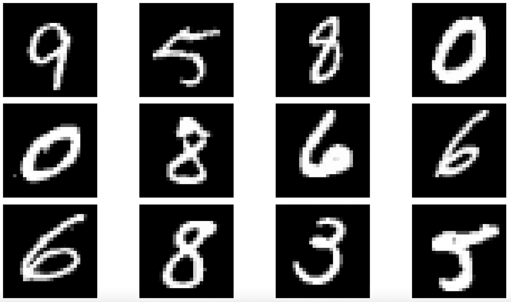
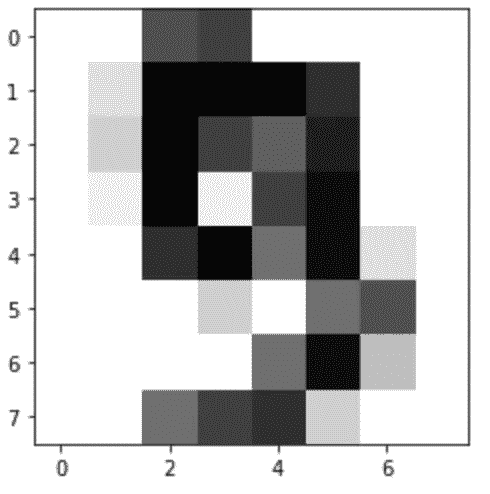
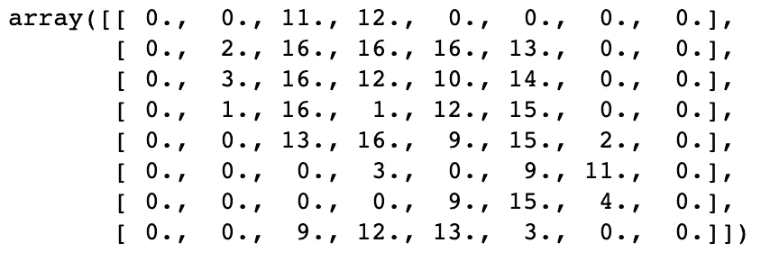
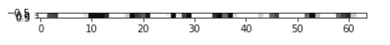
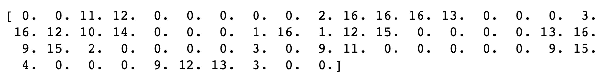
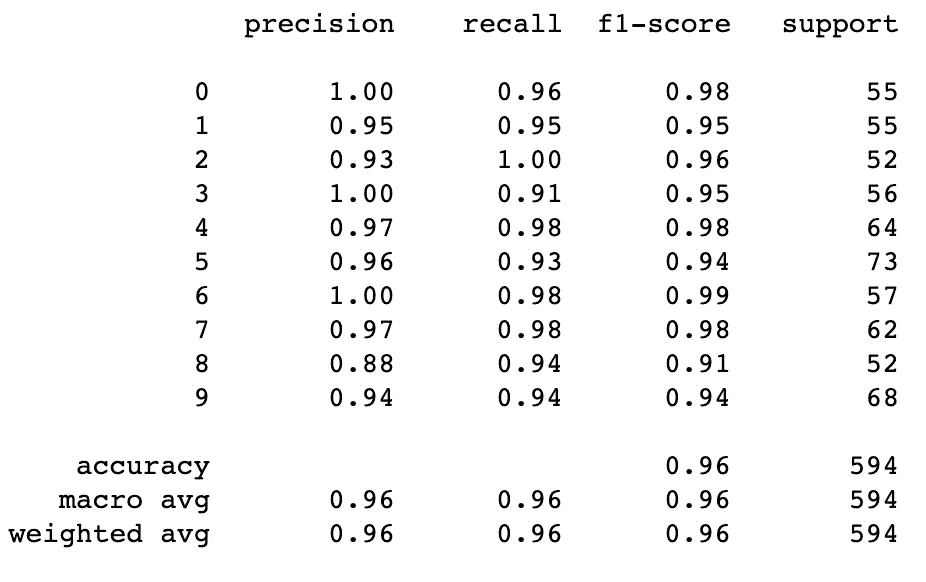

# 了解机器学习如何对手写数字进行分类

> 原文：<https://medium.com/analytics-vidhya/understanding-how-machine-learning-can-classify-handwritten-digits-e2b7838b8357?source=collection_archive---------12----------------------->

## 举例说明计算机如何理解图像



我们之前已经讨论过了。计算机理解数字。不是文字。不是视频。不是图像。

那么，机器学习模型如何从手写字符的图像中提取文本呢？

让我们看一个手写数字 9 的图像，它来自 sklearn 的数据集模块。

```
# import datasets module
from sklearn import datasets# grab the digits dataset from the module
digits = datasets.load_digits()# import pyplot to display the image based on pixel values
import matplotlib.pyplot as plt# display an image from the dataset based on index
def display_digit(index):
    image = digits.images[index]
    plt.imshow(image, cmap=plt.cm.gray_r, interpolation='nearest')
    plt.show() # run function
display_digit(9)
```



我知道看起来很糟。但我们可以看出这是一个 9。

图像实际上只是不同亮度的像素矩阵。这些像素的亮度值是我们输入到机器学习模型中的。

```
# print the matrix of pixel values
digits.images[9]
```



数字越大，像素越暗。

在把它放入模型之前，我们需要把它弄平。让我们把它显示成一个图像，只是为了好玩。

```
# flatten images
flat_images = digits.images.reshape((len(digits.images), -1))# display flattened images by index
def display_flat_digit(index):
    image = flat_images[index]
    plt.imshow([image], cmap=plt.cm.gray_r, interpolation='nearest')display_flat_digit(9)
```



没什么可看的。

扁平化矩阵。



现在让我们开始做一个分类。首先，我们像往常一样将数据分成测试集和训练集。

```
# examples
X = flat_images# labels for examples specifying which digit each image represents
y = digits.target# import an sklearn module to split data between test and train
from sklearn.model_selection import train_test_split# split the data
X_train, X_test, y_train, y_test = train_test_split(
    X, 
    y, 
    test_size=0.33, 
    random_state=42
)
```

实例化我们的模型。

```
# load a model from sklearn
from sklearn.linear_model import SGDClassifier
classifier = SGDClassifier()
```

训练模型。

```
classifier.fit(X_train, y_train)
```

预测标签。

```
y_pred = classifier.predict(X_test)
```

评估结果。

```
# classification_report prints a table with metrics for each class
from sklearn.metrics import classification_reportprint(classification_report(y_test, y_pred) )
```



我们表现如何？

我们的模型在没有任何调整和考虑小数据集的情况下做得相当好。

我们可以用另一个模型或一些调整做得更好吗？绝对的。但在这里，我们只是想通过这个过程来更好地理解机器学习对图像的分类。