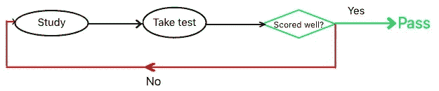
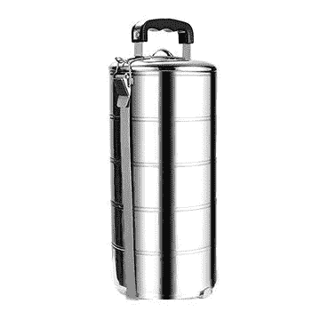
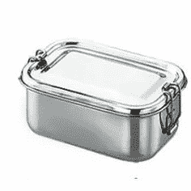
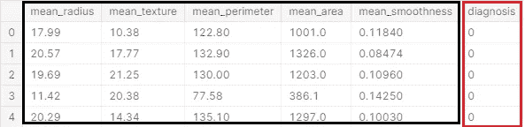
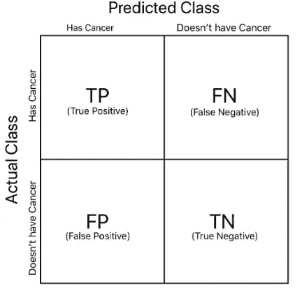
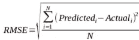
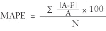

# 理解机器学习是如何像人类学习过程一样的？

> 原文：<https://medium.com/analytics-vidhya/understanding-how-machine-learning-is-just-like-the-human-learning-process-801a0bca3e56?source=collection_archive---------20----------------------->

机器学习的第一天？按照这里的内容，你很快就会自己用 Python 建立机器学习模型，并且对实现的每个部分都有足够的理解。

“预测未来不是魔法，而是人工智能。”

你已经听到了很多关于机器学习以及它正在改变几乎每个领域的现有实践的方式。

机器学习、数据科学、人工智能等术语，无论你听说过什么，都以各种方式相互重叠。但有一点是不变的:*融合了机器的处理能力和人类的智慧。*

为了解释为什么有这么多机器学习的热门话题，让我们来看看 ML 在不同行业证明其价值的几个问题。

*   **医学**:从图像中检测肿瘤，从症状中发现疾病，临床研究，疾病爆发预测等。
*   **零售**:检测销售或库存异常，预测商品需求等。
*   **电子商务**:产品推荐、客户流失、客户留存等。
*   **金融**:欺诈检测、流程自动化、预测贷款违约、计划推荐等。
*   **制造**:通过预测未来故障、供应链管理等对机器零件进行预测性维护。

除此之外，今天机器学习在研究领域取得了突破性的成就，每天都在帮助好奇的头脑创造奇迹。

**为什么 ML 面向所有人，而不仅仅是专业人士？**

我们看到我们周围的问题，我们想要为我们的目的进行猜测。让我们看一个例子。

你上班要迟到了。在离开之前，你会想到的一个问题是什么？今天我去办公室的路上会有很高的交通流量吗？你是如何解决这个日常问题的？你如何接近？你会看到所有因素对交通模式的影响。*今天是什么日子，这是一天中的高峰时间吗，今天下雨了吗，*等等。这些是你要回答的主要问题，根据你得到的组合，你试着从过去的一个月或一周中找到一些相似的例子来理解流量的趋势。然后你会得出结论，你是否应该期待高流量。用机器学习的术语来说，你应用了一个**逻辑回归模型**，其中你的**参数**是你考虑的因素，你之前对过去几天交通状况的了解是**训练数据**，你给出的答案类似于*今天是星期一，是高峰时间，今天没有下雨*将是你的测试值被传递给称为**逻辑回归**的算法，它给你二进制输出，两个类别可供选择:是或否。你的大脑是运行模型

Python 和 R 以及其他语言都有丰富的库，使得 ML 即使在没有太多知识的情况下也非常可行。医疗保健、金融等不同领域的人们利用机器学习来解决与其工作相关的日常问题。

让我们开始吧。

我们现在将看到机器学习流程是多么简单和直观。让我们从人类的学习过程中找到一些相似之处。

让我们以能够解决数学新篇章上的任何问题为例。

1.  收集学习材料
2.  看到问题并理解解释的解决方案。
3.  在看不到答案的情况下自己尝试问题
4.  用给出的正确答案验证你的答案
5.  重复 1、2、3、4，直到你理解了基本概念，并能够将其应用到与本章相关的所有场景中

这就是机器学习的确切过程。让我们了解一下基本术语，以及如何直观地与它们联系起来。

1.  **数据收集—** 收集学习资料

你计划使用机器学习模型来解决问题。考虑一个模型，在他第一天上课接受训练之前，他什么都不知道。他需要先学习，然后才能解决问题。首先，您需要收集用于训练模型的数据。这可以是官方数据，如天气数据、政府组织数据，也可以是简单的不同测试的分数数据，具体取决于您想要使用 ML 模型解决的问题。

2.**数据准备-** 一旦我们有了数据，我们需要做一些检查和处理，以使数据摆脱其缺点，并最大限度地利用它。好的数据极其重要，也很难收集。数据可能来自不同的来源，我们可以合并它，或者它可能是在一个特定的顺序，我们需要重新洗牌，以消除任何由顺序引起的偏见。*顺便说一句，你不会希望子主题中的所有问题都按顺序排列，或者你不会希望问题重复，否则会造成偏见*。根据我们收集的数据的质量，有许多方法来准备数据。

3.**选择模型-** 根据我们希望使用机器学习解决的问题类型，我们会选择一个合适的模型。如果我们想对一个类似*的问题有一个明确的答案，这个盒子是什么颜色:红色、蓝色还是绿色，*我们将使用分类模型，或者如果是一个类似*的连续值问题，下个月特定商店的销售额是多少，*将使用回归模型*。*此外，模型选择取决于许多其他因素，如我们拥有的数据质量、数据大小、数据是否有标签(我们是否有正确的答案，例如我们讨论的数学问题)。这些我们都将在后面详细讨论。

4.**训练-** 看到问题，理解解释的解决方案。

一旦我们有了准备好的数据并选择了模型，我们就会希望使用这些数据来训练模型。我们拥有的数据分为两部分:训练数据和测试数据。通常惯例是保持 70:30 或 80:20 的比率用于训练:测试。就像你看到数学章节 8/10 个例子的解答，然后留下其中两个让你自己先尝试评估你学得有多好。我们将测试数据集放在一边。在训练完成之前，这些测试数据没有用武之地。分割可以手动完成，但最好是使用 Python 或 r 等语言提供的库。预定义的函数有助于保持分割的**随机性**，这对于排除任何范围的**偏差**非常重要。

让我们通过“*数学问题”*的例子来理解为什么这很重要。如果你只学习几个特定类型的问题(因为你没有涵盖所有类型的问题，所以有偏见)，你能回答其他类型的问题吗？不对，对！这就是为什么使用随机选择的数据进行训练很重要，这些数据可以代表整个潜在的模式或概念。那么只有模型才能够回答基于数据的各种问题。

5.**评估-** 在看不到答案的情况下自己尝试问题，并用正确答案进行验证

一旦训练完成，就该检查模型学得如何了。为此，测试数据被传递给模型，模型给出的答案与数据中已经存在的正确答案相匹配。这种训练和测试的方法被称为**监督学习**，其中数据已经有了正确的标签(答案)。当数据没有标签，需要自己找出模式时，还有其他方法可以使用。

*现在整个过程都在重复，直到模型开始有好的表现。多学习或者好好学习，直到你表现得足够好。*

重复训练测试过程，直到模型开始评分良好

我们将尝试分析模型性能不佳的潜在原因。

学生表现差的原因有哪些？

*让我们首先粗略地看一下示例，然后我们将从机器学习的角度来谈论每个示例的重要性和含义。*

1.  **不适应** -学生没有很好地阅读学习材料，看不到各种不同的例子以及不同情况下解决方案的不同。他试图在任何地方都应用同样的几个概念。**结果**:不能很好的解决例题，不能解决试题(*训练准确率差，测试准确率差*)
2.  **过度拟合-****s**学生过度学习给出太具体数值和案例的例子。作为一个概念学习了变量和其他不必要的信息。试图从试题的学习材料中找到相同的变量和案例组合，但不知道只有公式和重要概念必须保持不变。**结果:**几乎能解决每一个例题，不能解决试题(训练准确率好，测试准确率差)
3.  **异常值-** 学习材料在示例中有不同的异常情况。他误认为这是潜在的概念，并试图推广它。
4.  目标班级不平衡- 这个学生在测试中没有遇到过很多类似的问题。学习材料中很少有这类例子。假设一个学生在每个问题上花了 3-5 分钟，而这种例子只有 2/100。他头脑中的整体知识不会有很大的分量。所以在测试中，他对它们的了解不足以回答问题。
5.  **错误的评估指标-** 所有测试模式不相同。每个主题都有不同的标准来判断理解的好坏。就像在语言学科中，语法和发音很重要，在数学公式和图表中，在历史日期和名称中，在编码命名惯例中，缩进，优化等等。想象一下在受试者之间改变这些标准。所以你明白了，每个模型都是用特定的数据和需要解决的特定问题构建的。必须相应地选择模型评估指标。

好了，现在我们已经看到了潜在的原因，我们应该知道这些是在机器学习过程中非常重要的概念和检查。因此，让我们借助例子更深入地理解这些概念。

*一个小问题:*你有没有因为认不出水瓶而感到困惑？就像你把水罐或谷物容器或保湿霜瓶误认为水瓶一样。希望不会！

嗯，你所谓的常识实际上是对事物的深刻理解，到了显而易见的程度。不要指望机器会这样。机器知道的和它被教会的一样多。

让我们试着理解这个问题的概念。

**问题**:水瓶识别

**数据:**各类盒子、容器、瓶子的图像。

培训用数据

通常情况下，您的数据量可能从数百到数百万不等。现在假设这是你的训练数据集。让我们将我们讨论过的每一个潜在原因形象化，看看为什么它们会使模型在测试数据中失败。

1.  **欠拟合模型:**

*   学习:水瓶应该有一个主体和一个盖子

**测试图像:**

测试数据

**结果:**是。这是一个水瓶(它有一个主体和一个盖子)

现在你看到问题了。对训练数据中的模式了解甚少并试图将其应用于测试数据导致了错误的结果。

2.过度拟合的 M **模型:**

*   学习:水瓶要有瓶身，有盖子，浅蓝色瓶身，深蓝色盖子。瓶子可以是给定的 6 种图案中的任何一种。

**测试图像:**

测试图像

**结果:**否。这不是一个水瓶(它不是蓝色的)

过多的数据学习以及不必要的模式，这些模式特定于所提供的训练数据而非一般数据

3.**有异常值的模型:**

假设数据有看起来不太像瓶子的奇特图像。这些将被称为**异常值。**一个**异常值**可能会由于一个人工错误或者一个真正的异常值而发生。

真正怪异的价值观

收集数据时出错

**学习:**以上 2 个图像也是瓶子。(它们是训练数据的一部分)

**测试数据:**

测试数据

**结果:**是的，它是一个水瓶(基于从上面两个图像的组合学习)

*   预测是由模型使用通过趋势创建的公式来完成的。离群值扭曲了将模型引向不同方向的趋势。

4.**目标类不平衡:**为了解释这一点，我们有一个完美的实际应用程序。如今，机器学习模型被用于癌症预测。

真实癌症预测数据集的前 5 行快照

**注-‘***目标’***变量是我们试图预测的列。在这里，用红色标记的列是诊断。标有黑色的列是参数。**

****训练数据:**用于确定癌症存在的各种参数的数据。**

****学习**:现在这里的问题是，大多数数据行都有未患癌症的病例(诊断:0)，只有极少数数据行有癌症(诊断:1)。所以，大部分的学习是关于没有癌症的情况。**

****检测数据:**一例存在癌症的病例**

****结果:**模型可能无法预测它，否则就声明它。类似于考试中你看了却答不上来的那个小题目。**

**这是你需要注意的事情。ML 模型不能用完整的技术术语来描述。想象一下，在 100 个测试案例中，只有 2 个是癌症案例。但是模型宣称每一个病例都是“没有癌症”。Still 模型在技术上具有 98%的准确性，这在性能方面看起来相当不错，但实际上该模型将没有任何用处。建立这个模型的全部目的是检测它不能检测的癌症病例。**

**5.**错误的评价指标:**我们举一个同样的癌症预测例子。我们看到准确率为 98%，但这并不反映模型的实际性能。你看，在这里犯一个错误的代价是非常高的，这是一个本可以被拯救的人的生命。我们需要使用一个指标来帮助确定模型的实际性能，即模型在实际中的效用。**

**有许多可能的评估指标。我们将介绍一些常用的分类模型和回归模型。**

****分类:****

**对于所有这些，请看这张分类结果的图表:**

****

**混淆矩阵**

***‘正’*是您正在为其构建模型的类别。在癌症检测中，阳性将是患有癌症的病例。**

**人们经常混淆这些 TP、TF、FP、FN 的含义。总是这样理解它们。**

*   ****真阳性(TP):** :是**真**是**阳性**(正确预测——实际阳性，预测为阳性)**
*   ****假阳性(FP):** 是**假**是**阳性**(错误预测——实际非阳性，预测为阳性)**
*   ****真阴性(TN):** 是**真**是**阴性**(正确预测——实际阴性，预测为阴性)**
*   ****假阴性(FN):** 是**假**是**阴性**(错误预测——实际非阴性，预测为阴性)**

1.  **准确性——在所有的预测中，正确的预测比例是多少？(模型基本总体性能检查)**

**`Accuracy = (TP+TN)/(TP+TN+FP+FN)`**

****何时使用**:当数据中不存在**类不平衡**时，可以使用精确度，否则模型将简单地将所有事物分类为多数类，并且仍然具有很高的精确度(在癌症检测问题中面临的问题)。再读一遍定义。**

**2.**精度**——预测阳性的比例实际上是多少？(模型可靠性检查，只关注正面的)**

**`Precision = TP /(TP+FP)`**

****何时使用**:如果资源数量较少，需要选择正数，则使用 Precision。考虑一下从 100 家公司中选择投资哪一家。如果精度较低，您将获得 45 家公司的列表，其中只有 5 家是有前途的公司。你不能投资 45 家公司来覆盖这 5 家积极的公司。你需要一个高精度的模型，它也许能给你 8 家公司，包括那 5 家。再读一遍定义。**

**3.**回想一下** -实际阳性中有多大比例可以被正确预测？(模型生产率/健壮性检查，只关注正面的)**

**`Recall = TP /(TP+FN)`**

****何时使用**:如果遗漏阳性的成本很高，那么你就使用召回。考虑癌症预测，低召回率意味着宣布癌症患者是健康的。这可能要付出生命的代价。再读一遍定义。**

**4. **F1 成绩** -在精确度和召回率方面有多平衡？(当精确度和召回率都很重要时使用)**

**`F1 Score = (2*Precision*Recall) / (Precision + Recall)`**

****何时使用**:考虑寻找目标客户。你有数百万的顾客。你不能瞄准很多客户，因为这会产生成本(低精度场景)。同时，你不希望错过需要成为目标的客户，因为这会导致业务损失(召回率低的情况)。你需要两者的平衡。再读一遍定义。**

****回归:****

*   **RMSE:均方根误差**

****

*   **MAPE:平均绝对百分比误差**

****

**我们不想在这里讨论细节，因为这会使内容冗长得令人痛苦。记住，在公式的名字里，从右到左，应用那些运算，就创建了你的公式。**

*   **r 平方**
*   **调整后的 R 平方**

**和许多其他人…**

**现在你已经学习了基础知识，是时候实现一些模型了。[这个](https://nbviewer.jupyter.org/github/Shaayan-Hussain/Python-for-ML/blob/master/Fundamental%20ML_Models-Step-by-Step-Python.ipynb)是 Jupyter Notebook(IDE)的链接，在那里我们将应用我们的理解用 Python 来构建它们。**

**让我们知道您的反馈。感谢阅读！**