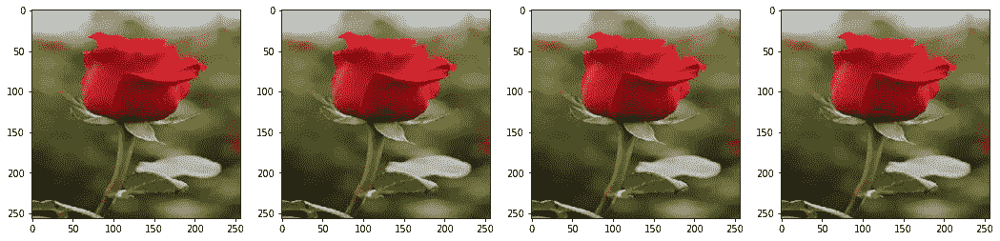

# 使用 Keras(Tensorflow)理解图像增强

> 原文：<https://medium.com/analytics-vidhya/understanding-image-augmentation-using-keras-tensorflow-a6341669d9ca?source=collection_archive---------3----------------------->

当我们想要建立任何深度学习模型时，我们需要处理更多的图像数据，但当我们的图像数量有限时，图像增强就成了比赛的一部分。**图像增强是一种通过使用多种图像处理技术(如旋转、亮度、移动图像像素、水平和垂直翻转图像等)来人工扩展图像数据集的方法。**

在狮子图像上执行的图像增强

在深度学习中，当我们拥有非常少的数据量时，如果我们训练模型，那么我们可以实现高训练精度，但我们将实现非常低的样本外精度，这可能导致模型的过度拟合。因此，为了减少这个问题，图像增强可以应用于深度学习

随着数据集大小的增加，过拟合误差减小

# 使用 Keras 实现图像增强:-

为了增加图像数据集的大小，Keras 提供了一个名为 ImageDataGenerator 的函数，在该函数中，我们可以通过更改函数内部的参数来对图像执行各种转换。首先要使用这个函数，我们需要从 keras.preprocessing.image 导入 ImageDataGenerator

导入后，我们需要用这个函数创建一个对象，在这里我们需要声明参数，通过应用不同的预处理技术来改变图像。

如果我们没有应用声明的任何参数，则应用默认参数。ImageDataGenerator 函数中的默认参数如下所示。

现在我们需要创建一个迭代器，批量获取图像和循环。有三种方法可以将图像流入 ImageDataGenerator 对象。他们是

1.  使用*流程*方法:-

其中 x，y 分别是数据和标签数组。

2.使用 *flow_from_dataframe* 方法:-

获取数据框和目录路径+生成批处理。生成的批次包含扩充/标准化的数据。

3.使用 *flow_from_directory* 方法:-

获取到一个目录的路径并生成批量的扩充数据。

创建迭代器后，我们需要调用 next()方法，该方法包含长度为 batch_size 的图像和标签数组。

完整的过程如下面的代码所示

上述代码的输出是如下所示的图像:-

# 探索 ImageDataGenerator 中的参数:-

1.  **旋转:-**

当我们用一个值指定*旋转范围*时，图像用一个从+(旋转范围)到-(旋转范围)的随机值旋转。

上述代码的输出是下面显示的图像:-

**2。高度移动:-**

当我们指定 *height_shift_range* 的值时，将发生以下情况:-

1.  如果一个值是一个浮点数，那么它将代表图像在顶部和底部任意方向随机移动的总高度分数的上限。
2.  如果一个值是一个表示像素的整数列表，那么任何值都是从这个列表中随机选取的，并且图像被随机移动这些像素。

上述代码的输出是一个如下所示的图像:-

**3。宽度移动:-**

当我们指定*高度 _ 偏移 _ 范围*的值时，将会发生以下情况

1.  如果一个值是一个浮点数，那么它将代表图像在左右任意方向随机移动的总宽度分数的上限。
2.  如果一个值是一个表示像素的整数列表，那么从这个列表中随机取出任何值，图像被随机移动这些像素。

上述代码的输出是一个如下所示的图像:-

**4。水平翻转:-**

默认情况下*水平 _ 翻转*值为**假**。如果我们将*水平翻转*值指定为**真**，那么图像将左右水平翻转。

上述代码的输出是如下所示的图像:-

**5。垂直移位:-**

默认情况下*垂直 _ 翻转*值为**假**。如果我们指定*垂直翻转*值为**真**，那么图像将垂直翻转到顶部或底部。

上述代码的输出是如下所示的图像:-

**6。剪切强度:-**

剪切变换是倾斜图像的过程。它不同于旋转，因为在旋转中，我们将旋转图像，但在剪切中，我们固定一个轴，并以某个角度拉伸图像，该角度称为剪切角。这是一种在旋转中观察不到的拉伸。shear_range 的值将是 float，它表示逆时针方向的剪切角度，单位为度。

上述代码的输出如下图所示:-

**7。缩放范围:-**

当我们指定 *zoom_range* 值时

1.  如果该值为 float，则它表示基于[1-value，1+value]范围内的随机值要放大/缩小的图像部分。
2.  如果是以[lower，higher]形式的列表，则生成的图像将在上述指定范围内缩放。基于该值，图像将被放大或缩小。

上述代码的输出是如下所示的图像:-

**8。亮度等级:-**

我们需要以列表的形式指定 *brightness_range* 【更低，更高】。所生成的图像将具有上述给定范围内的亮度。

上述代码的输出将是如下所示的图像:-

**9。重新调整:-**

Rescale 是一个值，在进行任何其他处理之前，我们会将数据乘以该值。我们的原始图像由 0–255 范围内的 RGB 系数组成，但这样的值对于我们的模型来说太大而无法处理(给定典型的学习率)，因此我们的目标值在 0 和 1 之间，而不是用 1/255 进行缩放。因素(描述摘自[https://blog . keras . io/building-powerful-image-class ification-models-using-very-little-data . html](https://blog.keras.io/building-powerful-image-classification-models-using-very-little-data.html))

上述代码的输出是一个如下所示的图像:-

如果你看到上面的图像，一切都是黑色的。为什么会发生这种情况？这怎么整改？

这里我们需要把图像转换成 float64，但是在上面的代码中，我们把它转换成 int8，所以每个值都变成 0。

下面是浮点转换代码:-

上述代码的输出是一个如下所示的图像:-

**10。预处理功能:-**

预处理函数是将应用于每个输入的函数。该功能将在图像调整大小和放大后运行。该函数应该采用一个参数:一个图像(秩为 3 的 Numpy 张量),并且应该输出具有相同形状的 Numpy 张量。

当我们使用深度学习中预训练的模型(如 VGG16、Resnet50、mobile net)时，我们需要为 ImageDataGenerator 指定预处理函数，以便根据模型对输入进行预处理。这将因型号而异。如果我们使用预先训练的模型，即移动网络 v2，则代码如下

上述代码的输出是一个如下所示的图像:-

**11。频道转换:-**

当我们指定 *channel_shift_range* 的值时，将根据上述固定值对输入图像的 RGB 颜色通道进行随机通道移位。上述代码的输出如下图所示:-

以下是 ImageDataGenerator 函数中的一些参数。

还有一些我们很少用到的论点。他们是

1.  **fill_mode** :为{"constant "、" nearest "、" reflect "或" wrap"}之一。默认值为“最近”。输入边界外的点根据给定的模式填充:—'常量':kkkkkkkkk | ABCD | kkkkkkkk(cval = k)—'最近的':aaaaaaaa|abcd|dddddddd —'反射':abcddcba|abcd|dcbaabcd —'换行':abcdabcd|abcd|abcdabcd
2.  **cval** : Float 或 Int。当`fill_mode = "constant"`时，用于边界外的点的值。
3.  **featurewise_center** :布尔值。将数据集的输入平均值设置为 0，按特征。
4.  **samplewise_center** :布尔型。将每个样本平均值设置为 0。
5.  **feature wise _ STD _ normalization**:布尔型。按要素将输入除以数据集的标准差。
6.  **sample wise _ STD _ normalization**:布尔型。将每个输入除以其标准差。
7.  **zca _ε**:ε为 zca 美白。默认值为 1e-6。
8.  **zca_whitening** :布尔型。应用 ZCA 美白。

使用图像增强生成的图像样本通常会导致现有数据样本集增加近 3 到 4 倍。这样，在 Keras 的帮助下，我们可以进行图像增强，这将在深度学习领域得到广泛应用。

如果你喜欢这篇文章，请👏。

## 参考资料:-

 [## Keras 文档:图像数据预处理

### 从目录中的图像文件生成 TF . data . dataset。如果您的目录结构是:然后调用…

keras.io](https://keras.io/api/preprocessing/image/#imagedatagenerator-class)  [## 张量流

### 一个面向所有人的端到端开源机器学习平台。探索 TensorFlow 灵活的工具生态系统…

www.tensorflow.org](https://www.tensorflow.org/)