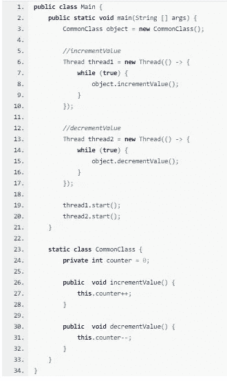
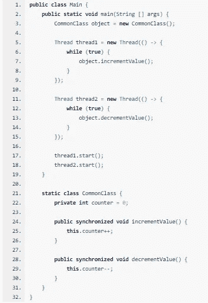
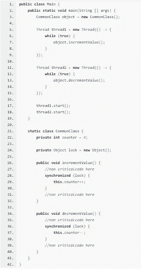
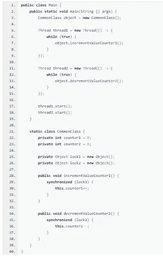
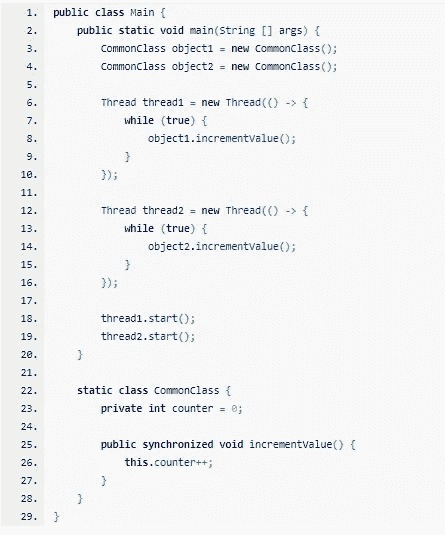

# 用方法、对象和锁理解 Java 线程同步

> 原文：<https://medium.com/analytics-vidhya/understanding-java-thread-synchronization-with-methods-vs-objects-vs-locks-5428e3342fee?source=collection_archive---------3----------------------->

想象一下我们有两个函数的情况。

一个增加计数器字段的值，另一个减少该值。我们希望使用多线程来实现这一点。

*操作系统将尝试抢占并自行调度两个线程进行优化。所以我们不能依赖线程的执行顺序。*

问题

**但是上面这段代码有一个问题。**

**问题 1 :** 我们使用两个线程来访问共享内存(common class object = new common class()在堆上分配，因此 counter 字段是共享的)，
我们在这里面临一个问题，因为我们不确定 counter 的值。
可能发生的情况是，线程 1 将值增加了两次，而线程 2 仅减少了一次。

**。**

**问题 2 :** 我们这里有非原子操作，也就是 this.counter++做三件事读取计数器值，增加它，写它。
因此，我们可能会覆盖一个线程完成的工作或读取不一致的值，因为线程上下文切换可能随时发生。

**因此，识别可能出现这些问题的代码片段非常重要。我们称之为临界区。**

**解决问题有两种主要方法:**

# **解决方案 1:对方法使用 synchronized 关键字来同步线程。**

我们知道 incrementValue 和 decrementValue 函数是这里的关键部分。它们在共享内存上执行非原子操作。
所以我们可以对函数使用 synchronized 关键字。当其他线程在其中时，这将阻止一个线程进入临界区(increment value&decrement value)。

答案 1

但是它是如何工作的呢？
*两种方法确实是同一个对象(object)的一部分，两个同步块(incrementValue 和 decrementValue)
在同一个对象上同步(****‘this’****object)。*

我们能做得更好吗？
*是的，我们可以不同步整个方法，而是使用外部锁只同步关键部分。*

# .

# 解决方案 **2:使用外部锁同步线程**

*我们可以创建一个对象(任何对象)并使用它作为外部锁。
这里我们可以使用 synchronized 关键字进行锁定。
这将阻止一个线程进入临界区(increment value&decrement value ),当其他线程在其中时。*

答案 2

但是它是如何工作的呢？
*两种方法确实是同一个对象(object)的一部分，两个同步块在同一个对象上同步(* ***锁*** *)。
即使 synchronized 关键字对于方法来说也不过是一个 synchronized on****‘this’****类的对象。*

*让我们在下面给出的示例中比较这两种解决方案。*

> ***。***

***。***

***。***

> ***示例 1*** *public synchronized void increment value(){
> this . counter++；
> }*
> 
> ***示例 2*** *public void increment value(){
> synchronized(this){ this . counter++；}
> }*

# **解决方案 3:使用不同的锁同步线程**

我们可以使用不同的锁来同步线程。
假设有两个计数器(计数器 1 和计数器 2 ),我们想增加一个，减少另一个。我们可以在这里使用多线程来并发或并行地执行它们。

*我们使用两个线程来访问共享内存(common class object = new common class()在堆上分配)
我们可以为两个部分使用两个锁。*

答案 3

但是它是如何工作的呢？
*这两种方法确实是同一个对象(object)的一部分，但是两个同步的块(incrementvaluecounter 1&decrement value counter 2)、
在不同的对象(* ***lock1 和 lock2*** *)上同步，因此不会相互影响。*

事实上，在这种情况下，我们甚至不需要锁或多线程。

# **。**

# **。**

# **解决方案 4:同步不同对象的线程**

我们使用两个线程来访问堆上的非共享内存。
对象 1 和对象 2 独立于堆。

答案 4

但是它是如何工作的呢？
*该方法确实是不同对象(object1 和 object2)的一部分，因此 synchronized 块(两个对象的 incrementValue)，
在不同对象上同步(* ***，【object1 的 this】和【object2 的 this】****)，因此不会相互影响。*

事实上在这种情况下我们甚至不需要锁。

请关注本系列，阅读更多关于 Java 多线程、并发和并行编程的文章

在这里阅读更多关于并发编程的内容

**Java 中的锁:**[https://medium . com/analytics-vid hya/understanding-Java-thread-synchron ization-with-methods-vs-objects-vs-Locks-5428 e 3342 fee](/analytics-vidhya/understanding-java-thread-synchronization-with-methods-vs-objects-vs-locks-5428e3342fee)

**重入锁:**[https://medium . com/analytics-vid hya/unlock-the-power-of-Reentrant-lock-in-Java-d55ae 9135443](/analytics-vidhya/unlock-the-power-of-reentrant-lock-in-java-d55ae9135443)