# 理解 SQL 中的连接—内部、左侧、右侧和完全连接解释

> 原文：<https://medium.com/analytics-vidhya/understanding-joins-in-sql-inner-left-right-and-full-joins-explained-93738a0d0135?source=collection_archive---------16----------------------->

# 介绍

对于初学者来说，SQL 连接可能是一个难以掌握的概念。如果你以前没有学过编程，你可能很难理解什么是 [SQL](https://courses.analyticsvidhya.com/courses/structured-query-language-sql-for-data-science?utm_source=blog&utm_medium=understanding-sql-joins) 中的连接以及不同类型的连接。

但是作为数据科学的追求者或专业人士，您需要对什么是 SQL 连接以及它们是如何工作的有一个坚实的理解。相信我，如果数据科学行业快速检索和操作不同表中的数据，您会经常用到它！

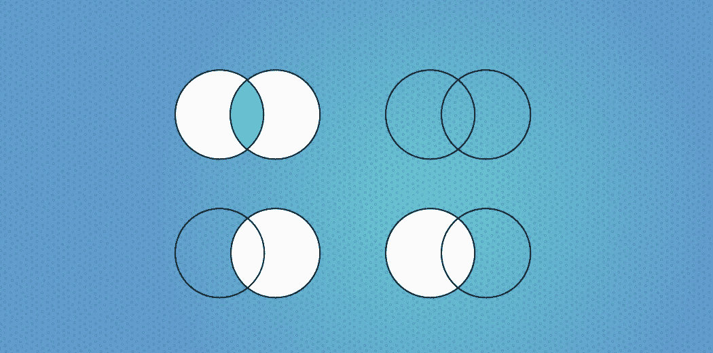

在本文中，我将展示 SQL 连接确实很容易学习。我们将首先了解什么是 SQL 连接，然后看看您需要掌握的四种不同类型的连接。

*想了解什么是 SQL 以及如何在数据科学中应用 SQL 的基础知识吗？查看热门课程* [*数据科学 SQL*](https://courses.analyticsvidhya.com/courses/structured-query-language-sql-for-data-science?utm_source=blog&utm_medium=understanding-sql-joins)*。*

# 什么是 SQL 连接？

在查看 SQL 中不同类型的连接之前，让我们先回答这个百万美元的问题。

我将举一个直观的例子来解释什么是 SQL 连接。考虑这两个集合:

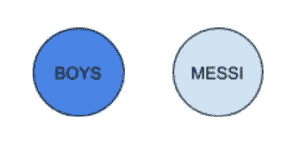

假设蓝色圆圈代表所有男生(男生)的集合，灰色代表爱看梅西踢球的人(梅西)的集合。如果我们想要一群喜欢看梅西踢球的男孩，你会怎么做？

有一个非常程序化的方法来处理这个问题:

*   首先，从 Messi 表中选择代表下面内部查询的所有不同 id
*   从男孩表中取出每个 id，并将其与这个集合进行比较
*   如果 id 与其中任何一个匹配，那么输出 Boys 表中的那一行

这非常类似于“for 循环”的概念，在 SQL 中称为子选择。

```
**SELECT** * **FROM** BOYS
**WHERE** id **IS** **IN** (**SELECT** **DISTINCT** id **FROM** MESSI);
```

但是在 SQL 中，有另一种方法来处理这个问题。

要开始理解联接，我们必须首先对我们真正想要的东西有一个不同的视角。用固定术语来说:我们想要男孩和梅西的交集。用图形术语来说，这表示为:

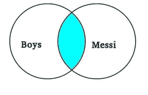

我们对浅蓝色部分感兴趣，对吗？这部分，或者说*内心*部分(提示)，都是爱看梅西的男生。我们现在要做的就是用 SQL 表达出来:

```
**SELECT** * **FROM** BOYS
**INNER** **JOIN** MESSI
**ON** BOYS.id = MESSI.id;
```

看看( *inner)* join 是做什么的？再简单不过了！这是理解连接的直观方法。

***注意*** *:维恩图不能直接应用于 SQL，因为集合(表)中的项目并不相同。但是因为它们相互引用，我们可以使用文氏图来更好地理解这个概念。*

# SQL 中不同类型的连接

现在。我们将把它扩展到大图，并了解不同类型的 SQL 连接。考虑下面的示例表:

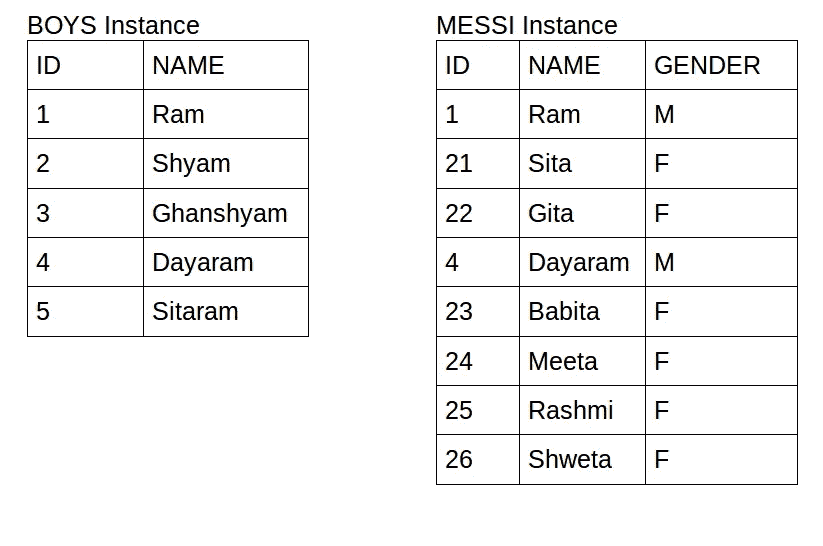

# 1.SQL 中的内部联接

这就是我们在上一节中讨论的内容。内部联接返回在两个表中都有匹配值的记录:

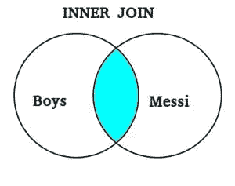

让我们用上面的例子来看看输出是什么:

```
**SELECT** * **FROM** BOYS **INNER** **JOIN** MESSI
**ON** BOYS.id = MESSI.id;
```

输出:

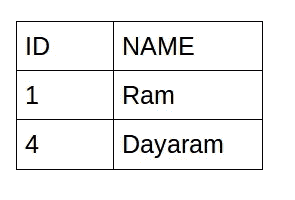

正如我上面提到的，内部连接给出了两个表的交集，即两个表中的公共行。

# 2.SQL 中的右(外)连接

假设我们想要所有喜欢看梅西踢球的人的 ID 和名字。显然，有许多方法可以编写这个查询，但是我们将借助连接来理解。

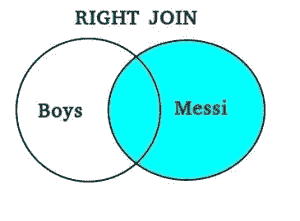

让我们看看输出是什么:

```
**SELECT**  *  **FROM** BOYS **RIGHT** **JOIN** MESSI 
**ON** BOYS.id = MESSI.id;
```

输出:

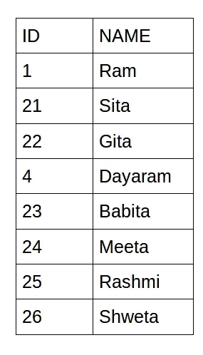

你能弄清楚这里发生了什么吗？右边的外部连接给出了两个表中的公共行以及 Messi 表中不存在于交集中的额外行。换句话说，**右连接返回右表中的所有记录和左表中的匹配记录。**

# 3.SQL 中的左(外)连接

假设我们想要一个喜欢看梅西踢球和不喜欢看梅西踢球的男孩的列表。

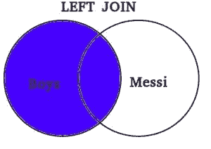

在你进一步阅读之前，我想让你猜猜最终的输出。

```
**SELECT ** *  **FROM** BOYS **LEFT** **JOIN** MESSI
**ON** BOYS.id = MESSI.id;
```

输出 **:**

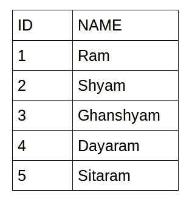

左边的外部连接给出了两个表中的公共行，以及 Boys 表中不存在于交集中的额外行。换句话说，左连接返回左表中的所有记录和右表中的匹配记录。

# 4.SQL 中的完全(外部)连接

最后，假设我们想要所有人的名单，包括爱看梅西踢球的男孩。

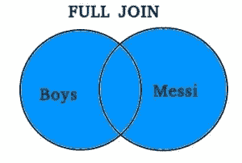

我相信你已经知道答案了！

```
**SELECT ** *  **FROM** BOYS **FULL OUTER** **JOIN** MESSI
**ON** BOYS.id = MESSI.id;
```

输出:

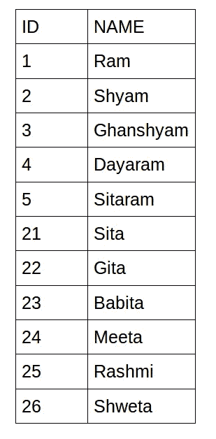

完美！完整的外部连接为我们提供了两个表中的公共行，以及两个表中不存在交集的额外行。当左表或右表上有匹配时，我们得到所有记录。

# 结束注释

你想了解 SQL 在数据科学中的应用吗？我强烈推荐学习这门令人惊叹的课程— [数据科学结构化查询语言(SQL)](https://courses.analyticsvidhya.com/courses/structured-query-language-sql-for-data-science?utm_source=blog&utm_medium=understanding-sql-joins)。

如果您对本文有任何问题或反馈，请在下面的评论区告诉我，我很乐意与您联系！

你也可以在分析 Vidhya 的 Android 应用上阅读这篇文章

*原载于 2020 年 2 月 25 日 https://www.analyticsvidhya.com*[](https://www.analyticsvidhya.com/blog/2020/02/understanding-sql-joins/)**。**