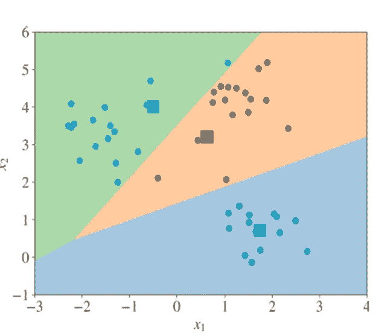

# 理解 K 均值

> 原文：<https://medium.com/analytics-vidhya/understanding-k-means-be2054cd18ea?source=collection_archive---------13----------------------->


> 我们只能看到前方不远的地方，但我们可以看到那里有很多需要做的事情~艾伦·图灵

想象一下，一家杂货店或一家银行已经积累了大量的客户数据。他们的目标可能是相似的，因为他们都想扩展或向更多的客户提供服务。也许他们想更好地了解他们的客户，并奖励他们对企业的忠诚。在这两种情况下，他们如何从数据中识别客户类型组来实现这些目标呢？本文将关注 K-Means 过程，以及 K-Means++初始化机制如何帮助 K-Means 聚类方法解决一个聚类问题。

# **集群**

C 聚类是一种无监督的机器学习方法，通过利用未标记的数据集，帮助机器学习为观察值分配标签。换句话说，聚类试图将具有相似特征或行为的观察结果分组，这些特征或行为与其他聚类或组中的观察结果的特征不同。聚类的一些应用包括模式识别、图像处理和市场细分。这可以从图 1 中观察到，图 1 说明了客户是如何根据支出分数和年收入的相似特征进行聚类的。这是一种直观的方法，可以帮助我们获得关于相似观察的深刻信息。


图 1:原始数据集散点图与聚类数据点图

K-Means、DBSCAN 和 OPTICS 等算法试图解决聚类问题，每种算法都具有独特的特征，可以根据数据集和聚类问题的应用来使用。Scikit-learn 提供了不同聚类方法及其特征的表格。

> [https://sci kit-learn . org/stable/modules/clustering . html # k-means](https://scikit-learn.org/stable/modules/clustering.html#k-means)

# **K-表示**

K-means 是数据挖掘实践中应用最广泛的聚类分析方法之一。K-means 是一个迭代过程，它试图通过 *K* 不相交的聚类 *C* 来划分 *N* 个样本。每个聚类 *C* ，也称为“质心”，代表一个聚类内样本的平均值。K-Means 的主要任务是选择使点和它们各自的质心之间的平方距离最小的质心。这个标准被称为“组内平方和”(WCSS)。Scikit-learn 的“KMeans”算法提供了一个 WCSS 作为。inertia_ '方法，稍后将在示例代码中展示。

# **K 均值过程**

> 可以从 https://www . ka ggle . com/vjchoudhary 7/customer-segmentation-tutorial-in-python 访问该流程的数据集

*这个 K 均值过程涉及一个二维数据集。*

# **第一步**

**对于二维或三维数据集，创建一个散点图来可视化数据点的分散。**

```
# Importing the necessary libraries
import numpy as np
import pandas as pd
import matplotlib.pyplot as pltdataset = pd.read_csv('Mall_Customers.csv')X = dataset.loc[:,['Annual Income (k$)','Spending Score (1-100)']].values# Visualizing the data points with a scatter plotplt.scatter(X[:,0], X[:,1], s = 100, edgecolors='black', marker='o')
plt.title('Mall Clients')
plt.xlabel('Annual Income (k$)')
plt.ylabel('Spending Score (1-100)')
plt.show()
```


图 2:商场顾客消费得分与年收入散点图

# 第二步

选择 *K* 簇。在将模型应用到数据集之前，这是需要考虑的重要步骤。我们需要一个可量化的指标来理解或评估一定数量的集群与不同数量的集群相比表现如何。

我们如何决定选择多少个集群？

*解* : **类内平方和(sk-learn:'。惯性 _ ')。**


等式:WCSS 最小化

*   WCSS 为所有聚类确定数据点与其各自质心之间的总平方距离。
*   *肘法*:肘法是 WCSS 值对聚类数的作图。通过观察我们在 WCSS 中开始看不到显著变化的点，可以确定最佳聚类数。在下面的示例中，5 个集群是集群的最佳数量。

```
# Using the elbow method to find the optimal number of clusters
# Importing the KMeans algo from sklearn library
from sklearn.cluster import KMeanswcss = []# In each iteration of this loop, we are going to do 2 things:
# 1\. We will fit the KMeans algo to our data 'X'
# 2\. We will compute the Within Cluster Sum of Squares and append to 
#    our WCSS empty listfor i in range(1,11):
    kmeans = KMeans(n_clusters = i, init = 'random', max_iter = 300,
                    n_init = 10, random_state = 0)
    kmeans.fit(X)
    wcss.append(kmeans.inertia_)

plt.plot(range(1,11), wcss)
plt.title('The Elbow Method')
plt.xlabel('Number of Clusters')
plt.ylabel('WCSS')
plt.show()
```


图 3:肘法

# **第三步**

选择随机初始 *K* 点。这些点是均匀随机选择的。在下图中，我们注意到圆圈标记被选作随机初始质心。


图 4:选择初始点的图示

# 第四步

将每个数据点分配给最近的质心。K-means 算法将点分配给它们最接近的质心。


图 5:分配给最近质心的数据点的图示

# 第五步

重新计算平均值，并为每个聚类重新分配每个质心的位置。在这一点上，每个聚类内的所有点的 x 和 y 被平均，以找到它们各自质心的新位置。对于每个聚类，然后计算新旧质心之间的差，以分配每个质心的新位置。


图 6:质心被

# 第六步

将每个数据点重新分配给新的最近质心。



图 7:重新分配给新定位的质心的点的图示

*   该算法迭代最后两步，直到算法收敛(聚类中的质心和点没有显著变化)。

```
# Applying K-Means to the mall dataset
# Note: If you need to increase the number of clusters, you need to add color names to represent each cluster. This is the only change to make the code versatilekmeans = KMeans(n_clusters= 5, init= 'random', max_iter=300, n_init=10,
                random_state=0)y_kmeans = kmeans.fit_predict(X)# Visualizing the clusters
clusters = set(y_kmeans)
colors = ['red', 'blue', 'green', 'cyan', 'magenta']
labels = ['Cluster {}'.format(i+1) for i in set(y_kmeans)]for clust, color, labels in zip(clusters, colors, labels):
    plt.scatter(X[y_kmeans == clust, 0], X[y_kmeans == clust, 1], 
                s=100, c = color, label = labels, edgecolors='black')centroids = kmeans.cluster_centers_plt.scatter(centroids[:, 0], centroids[:, 1], s = 200, c = 'yellow', 
            label = 'Centroids', edgecolors='black', marker='s')plt.title('Clusters of Clients')
plt.xlabel('Annual Income (k$)')
plt.ylabel('Spending Score (1-100)')
plt.legend()
plt.show()
```


# **K-Means 的局限性**

K-Means 适用于非常大的数据样本和中等数量的聚类。然而，算法的初始化过程限制了算法设置良好的初始化质心点的能力。例如，随机质心点可以彼此靠近放置，也可以远离数据点放置。这导致算法需要时间来收敛，尤其是当有数百万个数据点时。

# **K-Mean++算法:解**

K-Means++算法是一种随机播种技术，由 David Arthur 和 Sergei Vassilvitskii 提出，它有助于初始化中心以创建良好的聚类。该算法从数据点阵列中随机选择中心。K-Means 使用同样的方法。然而，K-Means++算法根据数据点与最近中心的平方距离(已经选定)对数据点进行加权。换句话说，它随机选择第一个质心。然后，计算离质心的距离。再次随机选择第二质心，并且以如下概率选择与新质心相关联的点:


D(x)表示从数据点到最近质心的最短距离。重复这个过程，直到找到所有初始中心。再次使用 K-Means 算法来重新定位中心并将数据点重新分配给重新定位的中心。

*   K-Means++算法可以用在 Sklearn 的‘K Means’函数中。必须在“init”或初始值设定项参数中简单声明“kmeans++”。
*   最终，K-Means++算法加快了 K-Means 算法的收敛速度。