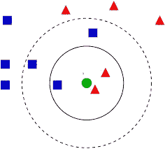

# 了解 K 个最近邻。

> 原文：<https://medium.com/analytics-vidhya/understanding-k-nearest-neighbors-962f16b62a9f?source=collection_archive---------20----------------------->

> 数据科学是讲述故事的艺术。人们需要将数据可视化来讲述它。你越形象化，故事(输出)就越好。


在 [Unsplash](https://unsplash.com?utm_source=medium&utm_medium=referral) 上由 [Rodion Kutsaev](https://unsplash.com/@frostroomhead?utm_source=medium&utm_medium=referral) 拍照

k 最近邻用于分类和回归问题。想象一下你的数据的散点图，每个点明显被许多其他点包围着。因此，KNN 所做的是，根据邻点，它会采取他们的统计模式，并预测你的测试值。

> 对于分类，它采用模式；但是在回归的情况下，它取这些点的平均值，并预测你的结果。



来源:[https://www . analyticsvidhya . com/blog/2018/03/introduction-k-neighbors-algorithm-clustering/](https://www.analyticsvidhya.com/blog/2018/03/introduction-k-neighbours-algorithm-clustering/)

KNN 是一个非参数模型。KNN 被称为懒惰的学习者，因为它没有从输入中学到任何东西。相反，它会记住整个列车数据，当您放置一个测试点/数据时，它会根据相邻列车数据的位置预测其值。

两点之间的距离由“欧几里德”距离给出。欧几里德距离是通过(x2-x1)的平方+ (y2-y1)的平方根来计算的。

它是如何工作的？

K-NN 工作可以在高层次上解释如下:

*   选择邻居的数量。
*   计算欧几里德距离。
*   在近邻中，统计每个类别中需要分类的数据点的数量。
*   将新数据点分配到特定的分类类别，对于该类别，相邻点的数量是最大的。

**KNN 的利与弊:**

**优点:**

*   好用。
*   更少的计算时间。
*   没有关于数据的假设。

**缺点:**

*   准确性取决于数据的质量。
*   必须找到一个最佳 k 值。
*   对边界处的数据点进行分类可能很困难。

**KNN？可以用在哪里？**

KNN 主要用于推荐系统和图像识别应用。

网飞和亚马逊 Prime 使用这种算法来推荐你的下一次购买，电影或书籍。

# 使用哪种距离度量？是否有多个指标？

最常用的距离度量是:

*   *欧几里德距离(最流行)*
*   *曼哈顿距离*
*   *切比雪夫距离*

**欧几里德距离:**

一维中两点间的**距离**就是它们坐标差的绝对值。换句话说，它只是 n 维特征空间中一对样本 p 和 q 之间的**距离**度量。

***曼哈顿距离:***

两个向量(或点)a 和 b 之间的曼哈顿距离定义为向量维数上的∑*I*|*ai*bi|。它被称为曼哈顿距离，因为这是一辆汽车在城市中行驶的距离，在这个城市中，建筑物呈正方形，笔直的街道以直角相交。

***切比雪夫距离:***

在[数学](https://en.wikipedia.org/wiki/Mathematics)中，切比雪夫距离(或切比雪夫距离)、最大度量或 [L∞度量](https://en.wikipedia.org/wiki/Lp_space)是在[向量空间](https://en.wikipedia.org/wiki/Vector_space)上定义的[度量](https://en.wikipedia.org/wiki/Metric_(mathematics))，其中两个[向量](https://en.wikipedia.org/wiki/Coordinate_vector)之间的[距离](https://en.wikipedia.org/wiki/Distance)是它们沿任意坐标维度的最大差异。[【2】](https://en.wikipedia.org/wiki/Chebyshev_distance#cite_note-2)因[帕夫纳蒂·切比雪夫](https://en.wikipedia.org/wiki/Pafnuty_Chebyshev)而得名。(维基百科)。

```
import pandas as pd
import numpy as np
import os
import math
```

加载数据并将数据分成 X 和 y，然后进行训练和测试。稍后，我们将构建一个 knn 模型。

```
from sklearn import datasets
from sklearn.model_selection import train_test_split
from sklearn.neighbors import KNeighborsClassifier
from sklearn.metrics import accuracy_scoredata = datasets.load_iris()
X = data.data[:, :2]
y = data.targetX_train, X_test, y_train, y_test = train_test_split(X, y, test_size = 0.3, random_state = 0)
print(‘Shape of X_train: ‘, X_train.shape, ‘Shape of X_test: ‘, X_test.shape, ‘Shape of y_train: ‘, y_train.shape, ‘Shape of y_test: ‘, y_test.shape) knn = KNeighborsClassifier(n_neighbors = 5)
knn_model = knn.fit(X_train, y_train)
knn_pred = knn_model.predict(X_test)
knn_acc = accuracy_score(knn_pred, y_test)
```

这就是如何使用 sklearn 构建 knn 模型。需要进行预处理，这是一个完全不同的主题，我们将在我接下来的文章中讨论。

> 希望你在读的时候学到了一些东西，就像我在写的时候学到的一样。

请关注我即将发表的文章:

系列:

1.  从不同类型的文件中提取文本。
2.  文本挖掘和文本清洗。
3.  在提取的文本中进行单词搜索。

文章:

1.  主题建模。
2.  关键词提取。