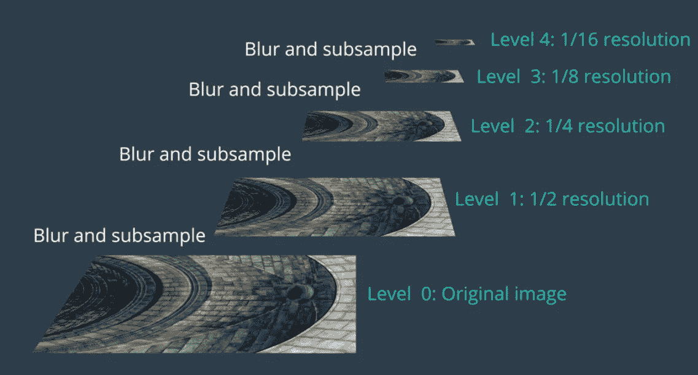

# 理解关键点和 ORB 算法

> 原文：<https://medium.com/analytics-vidhya/understanding-keypoints-and-orb-algorithm-f260e6fb640c?source=collection_archive---------0----------------------->

> 关键点是图像的一个区域，该区域是特别明显的并且识别独特的特征

关键点用于识别对象的关键区域，该关键区域用作稍后在新图像中匹配和识别该对象的基础。同一物体的图像可以在不同的条件下拍摄，如不同的照明条件、角度、比例和背景。好的关键点是对所有这些条件都不变的关键点。

## 应用程序

下面列出了一些应用

1.  实时人脸匹配
2.  目标跟踪
3.  图像轮廓
4.  图像拼接
5.  机器人学中的运动跟踪

## 详细要点

关键点是通过考虑其周围特定像素亮度的区域来计算的。使用各种不同的算法来计算关键点，ORB(面向快速和旋转简要)技术使用快速算法来计算关键点。FAST 代表来自加速段测试的 ***特征。*** FAST 通过考虑给定区域周围的像素亮度来计算关键点。考虑图像中的像素区域，让我们测试样本像素 p 是否成为关键点。

表示关键点像素 p 及其周围圆形区域的图像

考虑像素 p 周围的 16 个像素的区域。在图像中，像素 p 的强度被表示为 **ip** 并且预定阈值被表示为**h。**如果像素的亮度高于 ip+h，则该像素更亮，如果其亮度低于 ip-h，则该像素具有较低的亮度，并且如果其亮度在 ip+h 和 ip-h 的范围内，则该像素被认为具有相同的亮度

如果至少有 8 个像素的亮度高于在其周围的圆圈中标记的 16 个像素中的像素 p 的亮度，或者通过比较圆圈上的 4 个等距像素，即像素 1、5、9 和 13，可以获得相同的结果，则 FAST 将点 p 判定为关键点。这将计算关键点的时间减少了 4 倍。

关键点为我们提供了像素强度变化的位置。我们得到了一个物体的突出的角点，从这些角点我们可以把一个物体和图像中的其他物体区分开来。

我们可以看到关键点出现在眼睛、嘴唇和鼻子周围。我们可以使用关键点及其周围的像素区域来创建一个可以称为特征描述符的数字特征。ORB 使用 **BRIEF** 算法，代表 ***二进制鲁棒独立基本特征。*** 考虑阅读 [OpenCV 页面](https://opencv-python-tutroals.readthedocs.io/en/latest/py_tutorials/py_feature2d/py_brief/py_brief.html)了解更多详情

为了实现缩放不变性，ORB 通过将同一图像缩放到不同的级别来构建具有不同版本的图像金字塔

通过在同一对象的不同尺度上计算关键点，ORB 有效地计算不同尺度上的对象特征，并且 ORB 基于图像梯度的方向为每个图像分配方向。当一个对象以不同的比例或方向呈现时，这有效地工作

## 替代算法

1.  加速的健壮特征(SURF)
2.  尺度不变特征变换

## 使用 ORB 检测关键点

我们可以使用 OpenCV 库中的 ORB 类来检测关键点并计算特征描述符。首先识别关键点，然后计算二进制特征向量并将它们全部分组到 ORB 描述符中。我们将考虑下面显示的样本图像来检测关键点

采样人脸图像以检测关键点

使用 ORB 检测关键点的 Python OpenCV 实现

这是一个好主意，我们使用标准规范化技术规范化图像，然后将其转换为灰度，并将其传递给 ORB 类进行关键点检测。获得的输出如下所示

带有关键点的图像

以不同比例标识关键点的图像

ORB 是 SURF 和 SIFT 算法的一个很好的替代方案。

## 玩球体

一旦你有了关键点和 ORB 描述符，试着通过缩放、旋转和增加图像的亮度以及添加随机噪声来匹配它。

我观察到 ORB 显然能够识别所有应用条件下的人脸

## 进一步参考

1.  OpenCV [ORB 类引用](https://docs.opencv.org/3.4/db/d95/classcv_1_1ORB.html)
2.  OpenCV [教程](https://opencv-python-tutroals.readthedocs.io/en/latest/py_tutorials/py_feature2d/py_orb/py_orb.html)
3.  ORB 实现笔记本 [ORB.ipynb](https://github.com/tshanmukh/Facial-KeyPoint-Detection/blob/master/ORB.ipynb) 来自 Udacity CVND 纳米度
4.  关键点教程[图像匹配](https://ai.stanford.edu/~syyeung/cvweb/tutorial2.html)

所用图像参考自 CVND 纳米度 Udacity