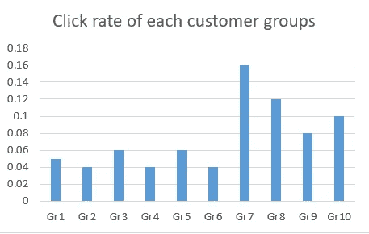
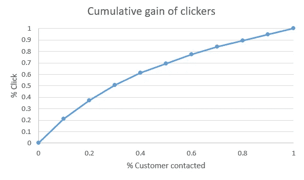
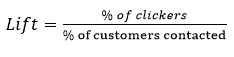
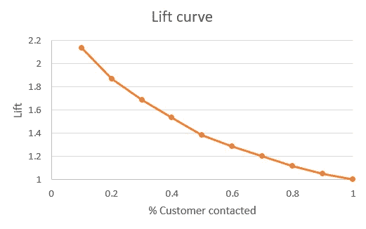

# 了解升力曲线

> 原文：<https://medium.com/analytics-vidhya/understanding-lift-curve-b674d21e426?source=collection_archive---------0----------------------->

## 提升曲线在市场营销和机器学习中的应用简介

照片由 [A](https://unsplash.com/@anniespratt) nnie Spratt 在 [Unsplash](https://unsplash.com/?utm_source=medium&utm_medium=referral)

*也许你的面试官问你关于上升曲线的问题，你差点心脏病发作，或者你对那种你听过名字的曲线很好奇？我想可能有更多的可能性，但是不要担心，我想你找到了你需要的文章！*

**简介**

在本文中，您不会发现任何代码或复杂的数学公式。我将尝试向您解释如何构建提升曲线及其在数字营销用例中的应用，以及如何使用它来评估分类模型。

简单介绍一下这个概念，升力曲线描述了一个累积人口比例的性能系数(升力)。不要怕，看完下一部分你会更好的理解那句话！

**邮寄活动中的提升曲线**

假设你有一个包含 10 000 名客户联系人的数据库，你给他们发了一封电子邮件，里面有你网站的链接。

10%的客户点击了链接，没那么糟糕(或者可能是的，但我们目前不在乎)。现在，如果你向 1000 个客户而不是 10 000 个客户发送电子邮件，你可以预期得到大致相同的数字…不太确定！事实上，如果你把 10 000 名顾客分成 10 组，每组 10 00 人，你可能会得到一组 4%的点击率，而另一组 16%。

这意味着你可以有一个更好的点击率与特定部分的客户！

让我们看看它在图表上的样子。

第 7 组和第 8 组做得相当好，这两个组的点击率略高于平均水平(分别为 16%和 12%，而平均水平为 10%)。

现在有趣的是根据接触的客户的累计百分比(x 轴)来绘制点击者的累计百分比(y 轴)。因为我们处理 10 组客户，x 轴是基于 10%的单位，我们认为上图中的组是按点击率递减排序的。

我们看到，在 50%的接触基础上，我们可以接触到几乎 70%的点击者。

提升曲线使用点击器百分比与联系客户百分比之间的比率。这意味着“点击器累积收益”图表中的每一点都将构成一个提升值。

事实上，升力由以下公式表示:

更具体地说，电梯提供了我们邮寄活动的重要信息。它让我们知道，对于联系的某个百分比的客户，客户转化(在我们的例子中是点击)增加了多少。

我们来策划一下吧！

这里，最高提升值等于 2.1 意味着，对于你的前 10%的“最佳”客户，你的点击率将比你接触随机客户时多 2.1 倍。

**对比分类模型与升力曲线**

升力曲线的另一个使用情况是在机器学习中，用于分类问题。例如，您的分类模型输出每个患者患癌症的特定概率。然后，我们可以用邮寄活动的例子做一个比较。按照降序，用已诊断患者的百分比替换已联系客户的百分比，用模型预测的百分比替换点击者的百分比。在这种情况下，您不必对患者进行不同的分组，因为您已经处理了一个百分比。然后，你可以很容易地生成你的升力曲线。

要使用提升曲线比较两个分类模型，可以使用最大提升值作为度量。此外，曲线开始处的平坦区域越长，模型就越可靠。

**超越**

多亏了 lift curve，我们发现一定比例的客户更有可能点击链接。然而，这些组是随机产生的，所以我们不能真正解释为什么他们对邮件活动有更好的反应。为了解释这一点，可以使用聚类方法来构成群体，并找到客户之间的相似特征，使他们成为点击者。

感谢您的阅读！