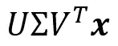

# 穿越旅程理解线性代数— —第二部分:从子空间到奇异值分解

> 原文：<https://medium.com/analytics-vidhya/understanding-linear-algebra-through-a-journey-part-%E2%85%B1-from-subspaces-to-svd-f3f4005b5314?source=collection_archive---------16----------------------->

# 关于这个故事

这是本专栏关于线性代数的第二个故事，从四个基本子空间到奇异值分解--奇异值分解。计算不是这里的主要重点，所以对于奇异值如何计算之类的我就不多讲了。这个故事只是试图回答一个简单的问题:**为什么是 SVD？**我觉得如果你掌握了****什么是 SVD****如何实现 SVD** 这个话题会更有趣更高级。**

**可能会有几个起点，从这些起点，您可以进行逻辑思考和推理，并最终得出 SVD。在这里，我将从我的角度给出其中一个关于**是什么激励人们实现 SVD，**的可接受的解释，作为那些对其领域感到困惑的人的参考。**

## ****先决条件****

**为了确保您完全理解，请确认您知道以下结论。**

1.  ****m×*n*的矩阵 *A* 将*n*-dimension*中的向量 *x* 发送到 *A* 的列空间中，因为 *A* 作用于它。*****
2.  *****在 *n* 维中的任意向量 *x* 可以唯一地分解为两个向量的和，行空间分量和空空间分量*****

***可以参考前面的故事来把握它们！***

*** [## 穿越旅程理解线性代数— —第一部分:从四个基本子空间开始

### 关于这个系列

medium.com](/swlh/understanding-linear-algebra-through-a-journey-part-ⅰ-start-from-four-fundamental-subspaces-4d3a6bda3791)*** 

## ***从我们知道的开始***

******

***记得那张大照片吗？***

***概述一下我们对 matrix *A* 的了解。它把 n 维的每个向量发送到它的列空间。并且从所有的 *n 个*维向量中，建立列空间。连接输入空间和输出空间的纽带！***

***有什么优秀的分析空间的工具？依据，对！**知道了列空间的基础，就知道了整个列空间。**我们能否从 *A* ***x*** 中获得基础(即找到一些***×***使得这些 *A* ***x*** 构造列空间的基础)？更确切地说，我们知道了基，更好的，正交基，和最佳正交基，我们能获得列空间的正交基吗？绝对可行！(整列空间来自 *A* ***x*** ，为什么不是唯一的正交基？)***

******

***知道绝对可行，还能期待更多吗？比如，输入向量也可以是正交的吗？***

***来“正式”讨论一下吧！***

## ***“正式”问题描述***

***能否找到一组 ***v*** s 和 ***u*** s ***，*** 这样， ***u*** s 都是列空间的正交基， ***v*** s 都是(巧合吗？)的标准正交基*n*-维数？(此处注意 ***v*** s 不一定在行空间中假设。)***

***到目前为止，我们还没有发现这样的期望是否是贪婪的。但是！标准正交基到标准正交基，听起来没错！然而，问题在于如果可能的话，我们如何找到它们..？***

***实际上我不知道。但是我们找到他们了呢？这很有趣，让我们暂时把这个难题放一放，而是“想象”我们已经找到了它们。***

## ***“想象”我们确实找到了我们，vs，σs***

******

***一目了然的迷茫？继续读下去，回来再考虑***

***逐一表示，找到的 ***v*** s、 ***u*** s 和比例因子 *σ* s 可列举如下:***

******

***列空间有 r 个标准正交基，所以我们可以求出 r vs 和σs***

***看到这里的每个人都会情不自禁地用矩阵的形式表现出来:***

******

***在哪里***

******

***只要把它们连接起来，它们看起来就很漂亮。另一个问题出现:**左边的空位**怎么样？***

## ***左边的空格***

***列空间的基础已经找到了，那么我们能顺便考虑一下左零空间吗？事实上，这与我们讨论*A****v****=σ****u***对于列间距几乎没有区别，除了两点:***

1.  ***等式两边都必须是 **0** 从事实来看， *A* ***v*** 必须在列空间中， *σ* ***u*** 现在在左零空间中，它们的唯一交集是零向量。***
2.  ***结果是，对于左侧， ***v*** 被限制(断言)为*A’*s 零空间中的单位向量，对于右侧，σ仅被限制(断言)为零。***

***也许你会说:“好吧，我看到了，那又怎样？为什么提到左空区？那有助于应付搜索 ***v*** *，* ***u，*** *σ* w.r.t 列空间？”***

***事实上是的。让我们把它们写下来。***

******

***在哪里***

******

***这里 ***v*** *(r+1)* 到***v****【n】*都是零空间的基，***u****(r+1)*到**(m)*都是左零空间的基，*是一个零矩阵*****

*****这样我们得到左零空间的表达式，它意味着，***v****【1】*到***v****【r】*来自于 *A* 的行空间，这是由于我们期望的 ***v*** 的正交性以及行空间和零空间的正交互补性质。*****

****好吧，让我们把它们整合起来:****

****************

****显然 *U* ， *V* 都是正交矩阵，这表示了下面众所周知的形式:****

********

## ****别胡思乱想了！****

****好了，刚才我们做了一个思维实验，这极大地有利于我们对那个难题的分析:我们如何找到 ***v*** ， ***u*** s， *σ* s？实际上现在这似乎更实际。很明显:****

********

****更清楚地说:****

********

****也就是说， ***v*** s 和 ***u*** s 来自特征向量， *σ* s 来自根特征值，所有 w.r.t A 转置 A 和 A 转置 A。****

> ****这里的一个注释是，AB 和 BA 具有相同的非零特征值和剩余的零特征值。这一点很容易验证。****

# ****摘要****

****在整篇文章中，我们可以看到，在分析中，我们假设已经找到了最重要的奇异向量。通过彻底和全面的分析，“如何找到它们”这个问题看起来就像是一个琐碎的教科书练习。****

****重新考虑我们已经完成的分析，我们将看到，奇异值分解提供了一个更好的方法来描述矩阵 a 的影响，这意味着什么？在奇异值分解过程中，我们分析了 *A* 会对我们发现的每一个 ***v*** 做什么，并将这些 ***v*** s 分成两类:****

*   ****行空间中的***v***s--转换到列空间，同时保持它们之间的正交性。****
*   ****零空间中的***v***s——发送到 **0******

****可选地，我们也可以从线性变换的角度进行分析。认为****

********

****，相当于*一* ***x.*******

1.  ****" *V* 转置次数**xT5 "执行基变换，将 ***x*** 转换为基于 *V* 的 *n* 维。也就是从前的 ***x*** 代表坐标 w.r.t 法向基，“ *V* 转置倍 ***x*** 代表坐标 w.r.t *V* 基。******
2.  ****“σ乘以它”消除了零空间坐标，缩放了列空间坐标，并在必要时补偿了维度。这很容易理解。****
3.  ****“ *U* 乘以”进行一次基变换 agian，将坐标变换为基于*U*m 的尺寸。****

# ****感谢阅读！****

****我希望我笨拙的英语不会在阅读期间打扰你。希望它能传达我想表达的关键思想。如果您刚刚了解 SVD，但对它所在的区域很好奇，我希望我的文章能为您提供一个揭开答案的视角。你也可以看到子空间在整篇文章中很重要，这也是我想指出的。现在，有了奇异值分解，面对线性代数你会感到更加吃力！****

****再次感谢你的阅读！****