# 了解线性回归-使用 MS Excel 的实用方法。

> 原文：<https://medium.com/analytics-vidhya/understanding-linear-regression-a-practical-approach-using-ms-excel-3919b2965f5d?source=collection_archive---------10----------------------->

我在浏览吴恩达教授在 coursera 上的课程。

我发现他的惊人之处在于他教授算法背后的数学的实用方法。

> 我在 MS Excel 中做了一个类似的计算，可以非常实际地用来演示线性回归。另外，这也给了你另一天远离编程的时间。

让我们来看看训练集。

Proff 中的训练集。Ng 的例子

接下来，我们使用 Excel 中的折线图快速可视化训练集。

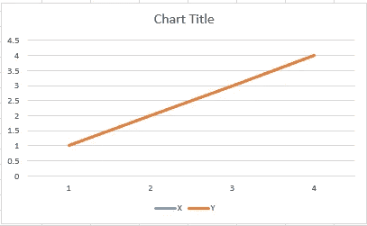

上述训练集的线图。

说到正题，我们来看看*假设函数*。**假设函数**返回我们的线性回归算法将要预测的实际值。换句话说，这是我们预测值的曲线图。

比方说，我们有两个特征 *theta_1* 和 *theta_0* ，它们预测 X 的结果为上述数据集中的 Y。这些特征被称为**预测器**。线性回归所做的是——它设置一个值 *theta_1 和 theta_0，*,以便算法可以正确预测(y)的新值(x)。

> 这种设置θ_ 1 和θ_ 2 的值被称为训练模型。基于训练，模型绘制假设函数。

为了简化计算，我们取了一个仅依赖于θ_ 1 的数据集。(即。θ_ 0 = 0)

> **h_theta=theta_1 * x + 0**

现在我们的主要目标是选择一个θ值，使假设函数图最接近实际图。

我们将通过在 Excel 中调整不同的θ值来实现这一点。

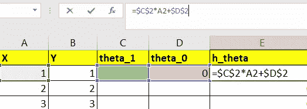

计算 h_theta

我们把公式

> h_theta = $C$2 * A2+ $D$2

将θ_ 1 的值设为 0。我们得到 x 的各个值的函数值。

当θ_ 1 为 0 时，*h _θ*的值等于 0

一旦我们得到了 *h_theta，*的一些值，这是我们看到我们的假设函数(h_theta)与实际图之间的差异的最佳时间。我们可以看到假设函数平行于 X 轴，因为所有的值都是 0。

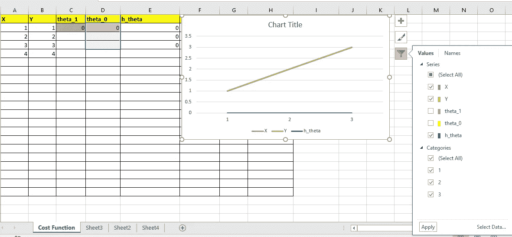

为了使算法正确工作，我们的目标是*使假设函数尽可能接近实际。*

让我们把θ_ 1 的值增加到 0.3

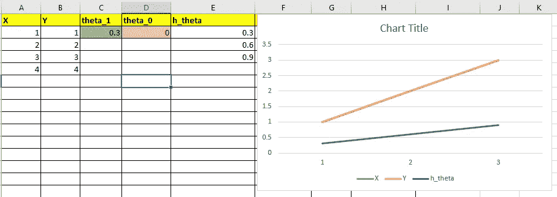

θ_ 1 = 0.3，假设图更接近实际。

我们看到假设函数开始更接近实际。在这一点上，你可以用不同的值来玩这个游戏，就像你自己看魔术一样。

你猜对了。了解 *theta_1* 的正确数值，不能是随便猜数字。因此，现在我们将看到一个非常重要的概念，称为— **成本函数。**

成本函数或 J_theta 是一种计算我们的线性回归模型精度的方法。我们必须设法使成本函数接近 0，以使模型最适合。

数学上，成本函数是

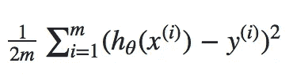

成本函数

其中 m=训练集中的数据数量。

呜！！看起来很吓人吧。为了让事情变得简单，我们将在 Excel 中逐步构建成本函数。

**第一步:**先来这个。这一项就是每一行的 h_theta(假设)和 y(实际)之差。

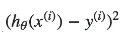

然后我们就把结果平方为[这些](http://www.quickmba.com/stats/standard-deviation/)的数学原因。

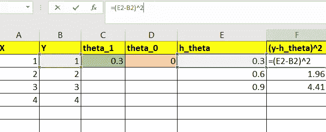

计算(h_theta -y)

**第二步:**我们对每一个 X 和 1/2*m 的倍数求和(h_theta -y)的结果

成本函数

我们首先在 excel 中取 m(数据集的计数)的值。

> =计数(A2:A4)

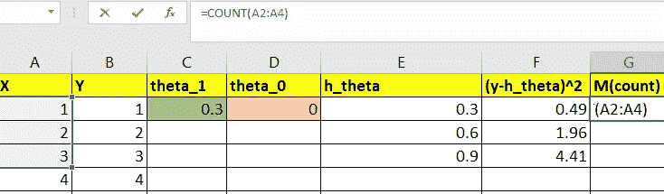

然后我们在 excel 中计算成本函数。

> =(1/(2*G2))*SUM(F2:F21)

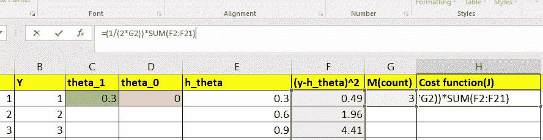

这几乎是我们所做的一切，设置事情。现在，当我们改变 *theta_1* 时，我们可以看到成本函数的变化。还要注意，θ_ 1 = 0.3 时的成本函数是 1.14。

你现在可以用不同的 *theta_1* 值进行实验，看看哪一个，使成本更接近于 0。

你会注意到

> 当θ_ 1 的值接近 1 时。成本函数趋近于 0。

我建议您从 0.1 和 0.1 开始 *theta_1* ，直到 2.0 递增 0.1，并注意相应的成本函数值。在此过程中，请密切注意假设函数。

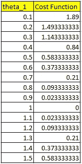

θ_ 1 和相应的成本函数

> 我们看到，当*θ_ 1*= 1 的代价函数值为 0 时。这是我们得到最佳拟合假设的点。此外，这是一个线性相关的训练集，所以我们得到的成本函数完全等于 0。在实际情况下，我们试图使成本函数接近于 0。

在下降到一个点之后，成本函数达到一个阈值，之后它再次开始增加。这个点被称为**局部最小值。**

我们将绘制θ_ 1 与成本函数的关系图，以显示局部最小值或最优解点。

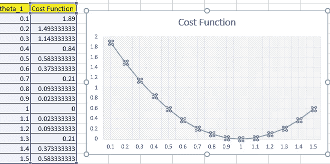

θ_ 1 与成本函数图

希望你能更好地理解线性回归。

我将在下一篇文章中讨论梯度下降——一种更好的达到局部最小值的方法。