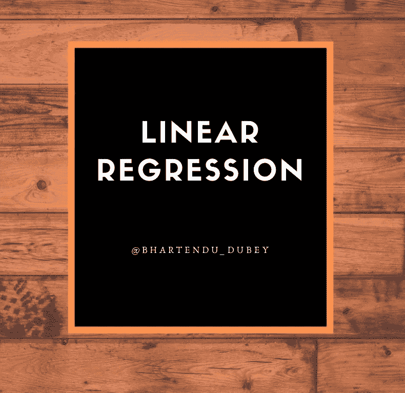
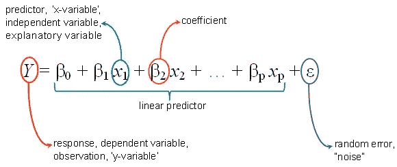
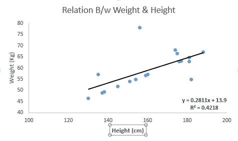
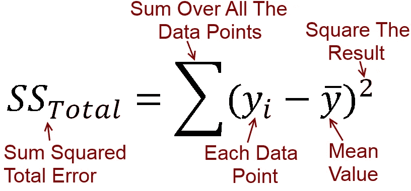
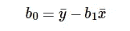
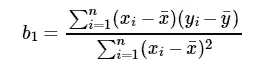
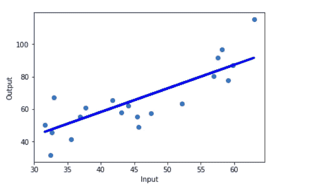
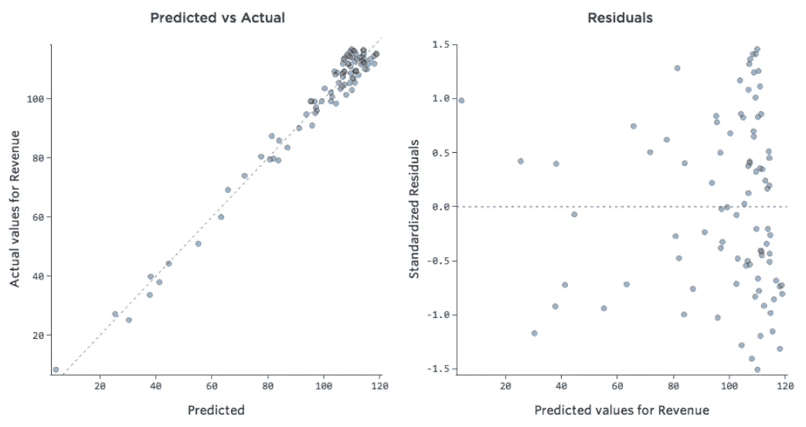

# 了解线性回归及其 python 实现

> 原文：<https://medium.com/analytics-vidhya/understanding-linear-regression-and-its-python-implementation-9f004589e1b3?source=collection_archive---------27----------------------->

# 什么是线性回归？

线性回归是一种基本且常用的预测分析类型。它用于查找目标和一个或多个预测值之间的线性关系。回归的总体思想是检查两件事:

1.  一组预测变量在预测一个结果(因变量)方面做得好吗？
2.  哪些变量是结果变量的重要预测因子，它们以何种方式影响结果变量？

这些回归估计用于解释一个*因变量*和一个或多个*自变量*之间的关系。具有一个因变量和一个自变量的回归方程的最简单形式由以下公式定义

## y = b1*x + b0，

> 在哪里
> 
> **y** =估计的因变量，
> 
> b0 =常数，
> 
> **b1** =回归系数，
> 
> **x** =自变量。

具有“p”个独立变量的多元线性回归的一般方程如下所示:

> 有两种线性回归-

*   **简单的**
*   **多个**

一元线性回归和多元线性回归的**区别**在于，多元线性回归有多个*自变量，而一元线性回归只有一个自变量。*

# 简单线性回归

简单线性回归用于寻找两个连续变量之间的关系。一个是预测器/自变量，另一个是响应/因变量。它寻找的是统计关系，而不是确定性关系(如果一个变量可以用另一个变量精确表达，那么两个变量之间的关系就是确定性的)。

> 例如，使用摄氏温度可以准确预测华氏温度。统计关系在确定两个变量之间的关系时不准确。

例如身高和体重的关系。

核心思想是获得一条**最适合**数据的线，即总预测误差尽可能小。(误差=点到回归线的距离)。

> 现在，问题是“我们如何获得最佳拟合线？”

我们知道，**Y**(pred)= B0+B1 ***x**

b0 和 b1 值的选择必须使误差最小。如果将误差平方和作为评估模型的度量标准，那么我们的目标是获得一条最能减少误差的线。

[误差计算](http://www.fairlynerdy.com/what-is-r-squared/)

> 如果我们不平方误差，那么正负点就会互相抵消。
> 
> 对于具有一个预测器模型，

计算截距

系数公式

*   如果 b1 > 0，那么 x(预测值)和 y(目标值)有一个正的关系(增加 x 会增加 y)。
*   如果 B1< 0, then x(predictor) and y(target) have a negative relationship (increase in x will decrease y).
*   If the model does not include x (i.e. x=0), then the prediction will become meaningless with only b0.
*   If there is no ‘b0’ term, then regression will be forced to pass over the origin. Both the regression co-efficient and prediction will be biased in this case.

> E.g. Consider we have a dataset that relates height(x) and weight(y). Taking x=0(that is height as 0), the equation will have only b0 value which is completely meaningless as in real-time height and weight can never be zero. This resulted due to considering the model values beyond its scope.

Linear regression

Randomness and unpredictability are the two main components of a regression model.

> Prediction = Deterministic + Statistic

De 部长部分被模型中的预测变量覆盖。

S 随机部分揭示了预期值和观测值不可预测的事实。

总会有一些信息被遗漏。这个信息可以从剩余信息中获得。

> 让我们通过一个例子来理解 ***余数*** 的概念。考虑一下，当给定一个地方的温度时，我们有一个预测果汁销售的数据集。回归方程预测的值与实际值总会有一些差异。销售额不会与真正的产值完全相符。这个差值称为**余项**。

**残基的特性:**

*   残差不显示任何模式
*   相邻残差不应相同，因为它们表明系统遗漏了一些信息。

残差图有助于使用残差值分析模型。它绘制在预测值和残差之间。他们的价值观是标准化的。该点与 0 的距离指定了该值的预测有多差。如果该值为正值，则预测值较低。如果该值为负，则预测值为高。 *0 值表示完全预测。*因此，检测残差模式可以改进模型。

残差分析

残差图的非随机模式表明该模型，

*   缺少对模型目标有重要贡献的变量
*   缺少捕捉非线性(使用多项式项)
*   模型中的术语之间没有交互

应用:

*   在[资本资产定价模型](https://en.wikipedia.org/wiki/Capital_asset_pricing_model)中用于分析和量化投资的系统风险。
*   线性回归是经济学中主要的经验工具。

> 例如，它用于预测劳动力需求和劳动力供给。

*   在加拿大，环境影响监测计划使用鱼类统计分析和[底栖生物](https://en.wikipedia.org/wiki/Benthic_zone)调查来衡量纸浆厂或金属矿废水对水生生态系统的影响。

# Python 实现

**数据集:**[*数据集*](https://github.com/bhartendudubey/Supervised-Learning-Algorithms/blob/master/dataset.csv) 包含关于在广告上花费的钱和它们产生的销售额的信息(在电视、广播和报纸广告上花费的钱)。

链接:[https://github . com/bhartendudubey/Supervised-Learning-Algorithms/blob/master/dataset . CSV](https://github.com/bhartendudubey/Supervised-Learning-Algorithms/blob/master/dataset.csv)

**目的:**目标是使用线性回归来了解广告支出如何影响销售。

图片提供:[shutterstock.com](http://shutterstock.com)

这里的 [*Jupyter 笔记本*](https://github.com/bhartendudubey/Supervised-Learning-Algorithms/blob/master/Linear_regression.ipynb) 为线性回归的 python 实现。

链接:[https://github . com/bhartendudubey/Supervised-Learning-Algorithms/blob/master/Linear _ regression . ipynb](https://github.com/bhartendudubey/Supervised-Learning-Algorithms/blob/master/Linear_regression.ipynb)