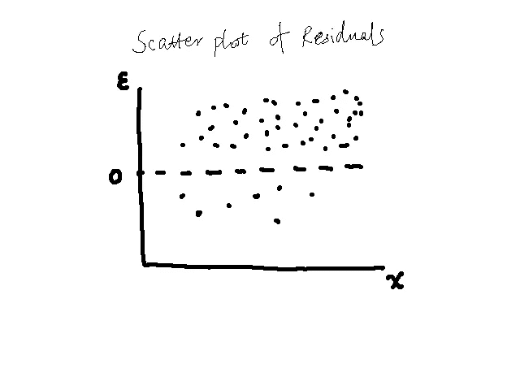
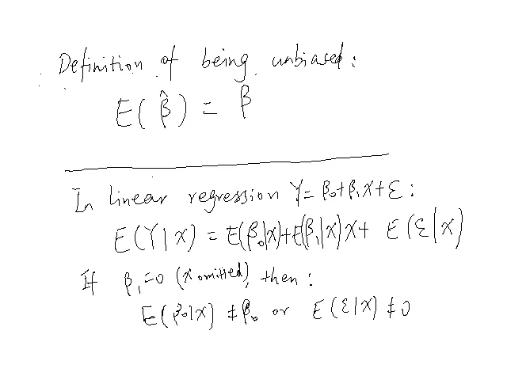
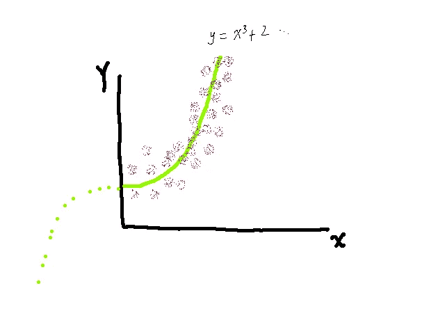

# 了解线性回归假设

> 原文：<https://medium.com/analytics-vidhya/understanding-linear-regression-assumptions-10eee3bc43de?source=collection_archive---------16----------------------->

在这篇文章中，我将向您展示线性回归系数估计值为**无偏**的必要假设，并讨论其他“值得拥有”的属性。网上有很多版本的线性回归假设。希望这篇文章能让你明白。

**“必然有”假设 1。残差的条件均值为零**

E(ε | X) = 0 意味着在给定观测数据的情况下，我们的回归的预测误差应该不存在(为零)。如果你想到无偏的定义，这是非常简单的:估计量的均值与其真实值相同。换句话说，当 E(ε | X) ≠ 0 时，我们知道β的系数估计的平均值不是β。

从视觉上看，残差的散点图应该围绕零水平线均匀分布。下面是 E(ε | X) ≠ 0 的情况，因为大多数残差是正的:

**“必然有”假设 2。残差的条件方差为常数**

这个假设更多的是关于对它们进行统计检验的可能性，而不是它们的无偏性。换句话说，如果这个假设不满足，我们甚至没有系数估计，或者至少没有可信的估计。为什么

记住，残差的方差σ是系数估计方差的一部分:var(β估计)=(X ' X)“”σ，其中‘表示转置’，“”表示逆。因此，当σ不是常数时，我们无法对β估计的方差进行可靠的估计。在这种情况下，许多假设检验统计量将是无效的，因为它们通常涉及标准误差(var 的平方根(β估计))。例如，我们不能检查系数估计的显著性，因为 t 检验和 p 值需要它的标准误差。

**“必须有”假设 3。无遗漏变量偏差**

在实践中，在一个复杂的案例研究中抓住所有起作用的变量几乎是不可能的，但是我们仍然希望避免遗漏变量偏差。**为什么？**

再次记住不偏不倚的定义:

当一个起作用的预测因子被忽略时(在这种情况下是 x)，x 的系数将被吸收到常数中(β₀或ε或两者都有)。这可能导致β₀的有偏估计或者残差的非零条件均值。

怎么查？一种常见的方法是在回归中添加回可疑的省略变量，然后观察其 p 值是否小于阈值(例如 0.05)，以及当您添加回该变量时，其他系数估计值是否发生了很大变化。p 值< 0.05 或其他系数估计值变化很大意味着您忽略了一个重要变量。另一种不常见但有效的方法是绘制 Y 与残差的关系图，看看是否有某种模式，因为残差应该吸收被忽略变量的至少一部分功效。

一般来说，如果一个变量既影响另一个预测变量又影响目标变量，那么这个变量就会被忽略。未观察到的省略变量可以用因果推理技术解决，如工具变量法。回头我写个帖子解释一下😃

这三个假设是确保线性回归中系数估计的无偏性的唯一假设。下面我解释了一个不必要的假设——我们根本不需要它；两个很好的假设。

**“不必要的”假设。Y 和 X 的线性关系**

我们需要 Y 和 X 之间的近似线性关系来开始线性回归吗？**不！**当您拥有更复杂版本的数据时，线性回归不会被禁用，因为我们可以向预测值添加指数。例如，任何多项式函数都可以通过线性回归来建模:

除了多项式，我们还可以加上相互作用项，比如 Y = c + XZ + ε，也对应一个非线性图。

**“有就好”假设 1。预测值之间的多重共线性为零或很小**

预测因子之间的多重共线性是否是一个问题，在学术界仍有争议。然而，我相信这不是问题，只要多重共线性不是完美的-预测值之间没有完美的线性关系。在现实中，很难找到完美的多重共线性或完美的零多重共线性。大多数时候，我们处于中间灰色地带。希望多重共线性尽可能低。**为什么？**

首先，记住我们如何计算β的系数估计及其方差(因为β是一个向量，所以称为“它们”):

显然，我们需要 X 的矩阵版本的逆。但是它是可逆的吗？如何检查是否可逆？回到你的线性代数课上，记住只有当 X 中的列线性无关时，X'X 才是可逆的。当 X₁和 X₂之间存在完全共线性时，x 没有满秩，因此 X'X 是不可逆的。退一步说，当 X₁和 X₂之间存在高度共线性时，X'X 几乎是不可逆的，因此β的估计值的计算可能非常困难。此外，β估计的方差会爆炸。这一次，我们如何用巨大的标准误差进行所有的统计测试？

**“有就好”假设 2。残差的正态性**

这个假设很好，只是因为高斯-马尔可夫定理，它基本上说，如果这个假设为真并且估计是无偏的(三个必要的假设也为真)，那么你的β估计是最佳线性无偏估计(“蓝色”)。就β估计的最小方差而言是“最佳”的。这里我们省略数学证明。

附:如果你喜欢我的帖子或从中学习到一些东西，请记得鼓掌！😀