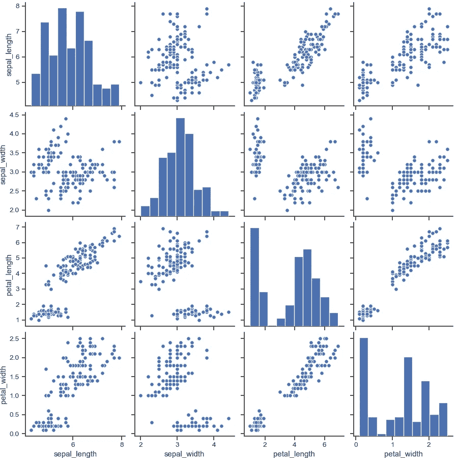

# 了解线性回归

> 原文：<https://medium.com/analytics-vidhya/understanding-linear-regression-in-depth-intuition-6c9f3b1cbb51?source=collection_archive---------8----------------------->

# 介绍

本文试图成为你在**理解使用*梯度下降*** 的*线性回归*算法时需要的参考。虽然这个算法很简单，但只有少数人真正理解它的数学和基本原理。

我希望这篇文章能找到你的书签！现在，让我们深入研究一下吧！

介绍

# 目录

*   什么是线性回归？
*   处理简单线性回归
*   什么是损失函数？
*   什么是梯度下降？
*   多元线性回归概述
*   线性回归的假设

# 什么是线性回归？

**线性**表示在特定行中，而**回归**表示关系的度量，因此线性回归是数据*(自变量)**(目标变量)*的*线性关系。*

## *线性回归的类型*

*   *简单线性回归*
*   *多元线性回归*

# *处理简单线性回归*

**

*图 1:简单的线性回归*

**简单线性回归*用于寻找两个连续变量之间的关系，即寻找自变量(预测值)和因变量(响应值)之间的关系。*

*简单线性回归算法的 ***难点*是获得最符合数据的直线。这是通过最小化损失函数来实现的。损失函数是什么？将在本博客稍后讨论。***

*图 2 显示了回归线的方程式。其中 *c* 为 y 轴截距*，m* 为直线相对于独立特征 *x* 的斜率，y 为预测值(也称为 *ŷ* )。*

**

*图 2:简单线性回归的回归线方程*

## *“m”表示什么？*

*   ***如果 m > 0** ，那么 *X* (预测值)和 *Y* (目标值)有一个**正关系**。这意味着 Y 的*值将随着 X* 值的增加而增加。*
*   ***如果 m < 0** ，那么 *X* (预测值)和 *Y* (目标值)有一个**负关系**。这意味着 Y 的*值将随着 X* 值的增加而减少。*

## ***c 表示什么**？*

*   *是 *X* =0 时 *Y* 的值。假设，如果我们绘制一个图，其中 X 轴由经验年限(独立特征)组成，Y 轴由工资组成(非独立特征)。工作年限= 0 工资是多少，这是用 c 表示的。*

*现在你已经理解了回归线的理论，让我们讨论如何使用损失函数为特定模型选择最佳的回归线。*

## *什么是损失函数？*

**

*图 3:有损失的简单线性回归*

***损失函数**是计算算法的当前输出和预期输出之间的距离的函数。这是一种评估算法如何对数据建模的方法。它可以分为两类。一个用于分类(离散值，0，1，2…)，另一个用于回归(连续值)。*

**

*损失函数的例子*

*术语**成本**和**损失函数**几乎指的是同一个东西。**成本函数**计算为**损失函数**的平均值。**损失函数**是在每个实例中计算的值。因此，对于单个训练周期,**损失**被计算多次，而**成本函数**只被计算一次。*

****注:对于依赖梯度下降优化模型参数的算法，每个选择的损失函数必须是可微的。****

*在我们的例子中，考虑损失函数是均方误差(MSE)。图 4 显示了该损失函数的公式，其中 *n* 是数据集中的样本数， *Y* 是实际值，*ŷ*是 iᵗʰ数据点的相应预测值。*

**

*图 4:均方误差公式*

## *什么是梯度下降？*

*梯度下降是一种寻找函数最小值的迭代优化算法。这里，那个函数指的是损失函数。*

*同样在使用梯度下降时，术语学习率也出现了。**学习速率**由 **α** 表示，该参数控制 m 和 c 的值在每次迭代/步骤后应该改变多少。选择合适的α值也很重要，如图 5 所示。*

**

*图 5:学习率案例*

*从 m 和 c 的初始值**为 0.0** 开始，并为学习率设置一个小值，例如 **α=0.001** ，对于该值，我们使用损失函数计算误差值。对于不同的 m 和 c 值*、*，我们将得到不同的误差值，如图 6 所示。*

**

*图 6:梯度下降工作(简单线性回归)*

*一旦选择了初始值，我们就可以通过应用链式法则找到损失函数的偏导数。*

**

*图 7:损失函数 w . r . t . m 和 c 的偏导数(斜率)*

*计算斜率后，我们现在使用图 8 所示的公式更新 m 和 c 的值。*

**

*图 8:更新 m 和 c 的公式*

*   *如果特定点的斜率为负，则 m 和 c 的值增加，该点向右移动一小段距离，如图 6 所示。*
*   *如果特定点的斜率为*正*，则 m 和 c 的值减小，该点向左侧移动一小段距离。*

*梯度下降算法不断改变 m 和 c 的值，直到损失变得非常小或变成 0(理想情况下)，这就是我们如何找到最佳拟合回归线。*

**

*渐变下降的图形表示|| [来源](https://towardsdatascience.com/linear-regression-using-gradient-descent-97a6c8700931)*

*既然你已经理解了*简单线性回归*算法的完整工作原理，让我们看看*多元线性回归*算法是如何工作的。*

# *多元线性回归概述*

**

*图 9:多元线性回归(图表)*

*在现实生活中，永远不会有一个单一的特征来预测目标。因此，我们简单地执行多元线性回归。*

*图 10 所示的方程与简单线性回归方程非常相似；简单地将独立特征/预测器的数量和它们相应的系数相加。*

**

*图 10:多元线性回归(回归平面方程)*

**注意:算法的工作方式保持不变，唯一变化的是梯度下降图。在简单线性回归中，梯度下降图呈 2D 形式，但随着独立特征/预测因子数量的增加，梯度下降图的维数也不断增加。**

*图 11 显示了 3D 格式的梯度下降图，其中 *A* 是初始权重/起点，而 *B* 是全局最小值。*

**

*图 11:梯度下降(多元线性回归)*

*图 12 显示了从 *A* 到*b*的 3D 格式梯度下降的完整工作*

**

*图 12:梯度下降工作(多元线性回归)*

# *线性回归的假设*

*以下是线性回归的基本假设，可用于回答我们是否可以对特定数据集使用线性回归算法的问题？*

*   ***特征和目标变量之间的线性关系:** 线性回归假设独立特征和目标之间的关系是线性的。它不支持任何其他内容。您可能需要转换数据以使关系呈线性(例如，指数关系的对数转换)。*

**

*线性关系示例*

*   ***要素间很少或没有多重共线性:** 当发现独立变量中度或高度相关时，多重共线性存在。在具有相关变量的模型中，找出预测值与目标变量的真实关系是一项艰巨的任务。换句话说，很难找出哪个变量实际上有助于预测响应变量。*

**

*多重共线性示例*

*   ***残差中很少或没有自相关:** 误差项中相关性的存在大大降低了模型的准确性。这通常发生在下一个时刻依赖于前一个时刻的时间序列模型中。如果误差项相关，估计的标准误差往往会低估真实的标准误差。*

**

*自相关的例子*

*   ***无异方差:** 误差项中非恒定方差的存在导致异方差。一般来说，非常数方差出现在异常值的情况下。看起来，这些值得到了太多的权重，从而不成比例地影响了模型的性能。*

**

*异方差的例子*

*   ***误差项的正态分布:** 如果误差项不是正态分布，置信区间可能会变得过宽或过窄。一旦置信区间变得不稳定，就会导致基于最小二乘法估计系数的困难。非正态分布的存在表明存在一些不寻常的数据点，必须仔细研究这些数据点才能建立更好的模型。*

**

*误差项的正态分布示例*

# *参考*

*   *[Josh star mer 的 stat quest](https://www.youtube.com/watch?v=nk2CQITm_eo&list=PLblh5JKOoLUICTaGLRoHQDuF_7q2GfuJF&index=9)*
*   *[机器学习掌握度](https://machinelearningmastery.com/linear-regression-for-machine-learning/)*
*   *[阿达什·梅农的线性回归](https://towardsdatascience.com/linear-regression-using-gradient-descent-97a6c8700931)*

# *帮我接通*

*   *[领英](https://www.linkedin.com/in/anujkvyas)*
*   *GitHub*
*   *[卡格尔](https://www.kaggle.com/anujvyas)*

*那都是乡亲们！ [**点击这里**](/analytics-vidhya/understanding-logistic-regression-in-depth-intuition-99ad14724464) 阅读我关于**逻辑回归**的博客。*

*如果你从这个博客中学到了什么，一定要给它一个👏🏼会在其他博客上和你见面，直到和平✌🏼*