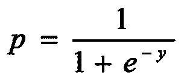
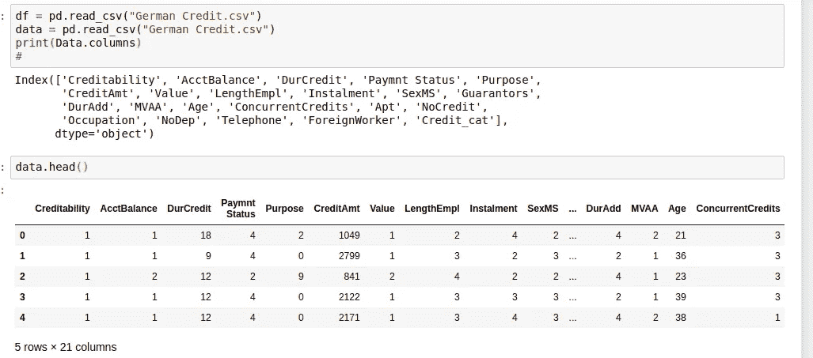
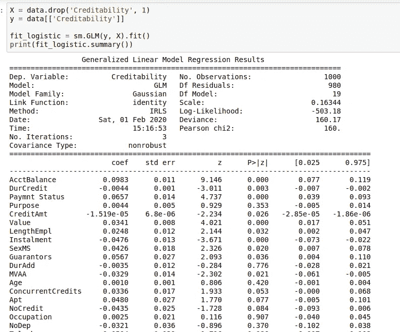
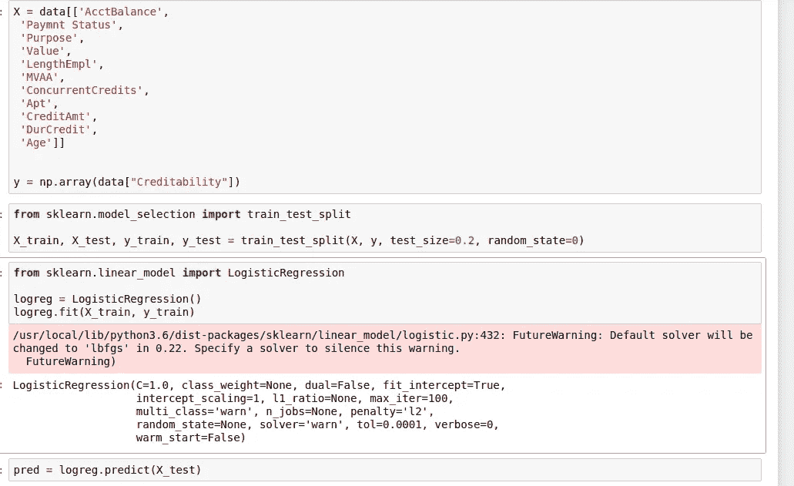
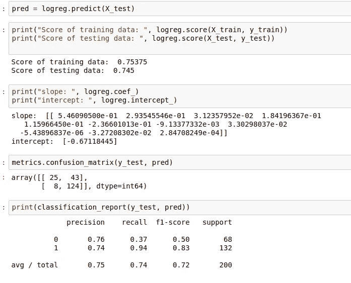
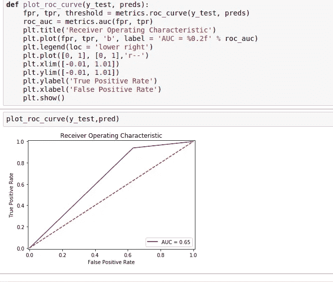

# 理解逻辑回归。

> 原文：<https://medium.com/analytics-vidhya/understanding-logistic-regression-573a65d6c20?source=collection_archive---------10----------------------->

> 它不是数据科学。我称之为“数据感”。从数据中发现意义是数据科学。

**简介:**

逻辑“回归”？那么，它属于监督学习回归吗？它只对连续值有效吗？线性回归和 logistic 回归有什么区别？两次回归相同吗？

> 要么你有和上面提到的一样的问题，要么你觉得那些问题其实是对的，那你就完全错了。

让我们看看什么是真正的逻辑回归，我们将逐一回答上述所有问题，我们将建立一个公开信用数据集的逻辑回归模型。

首先，让我们弄清楚两件事:

1.  当目标变量是连续或离散的，我们使用线性回归。
2.  当目标变量是分类/二元时，我们使用逻辑回归。

因此，用基本的外行话来说，当目标列是二进制时，就使用逻辑回归。一些例子将是:在一组贷款申请人中，如果一个人得到他的贷款或没有；如果有这款手机，你会买还是不买可以是另一个例子；一只股票会涨还是会跌？一个人是否有某种疾病？算几个例子。

> 从技术上和理论上讲，逻辑回归是一种分析数据集的统计方法，其中有一个以上的独立变量帮助确定一个结果，而只有两个可能的结果。

虽然，当有两个以上的可能结果时，有一个多类逻辑回归可以应用，关于这一点我们将在文章中进一步讨论。

逻辑回归的目标是找到描述因变量和一组自变量之间关系的最佳拟合模型。我们尝试用概率来预测二元反应:Y =成功或失败(1 或 0)。

# 逻辑回归中涉及的假设:

1.  二元逻辑回归要求目标变量是二元的。
2.  逻辑回归要求观察值相互独立。换句话说，观察值不应来自重复测量。
3.  逻辑回归要求自变量之间很少或没有多重共线性。
4.  逻辑回归假设独立变量和对数比值呈线性。
5.  逻辑回归通常需要大样本量。

**乙状结肠功能:**

如上文假设中所述，逻辑回归假设一个线性方程，其中包含独立变量和对数比值来预测一个值。预测值可以位于-∞到+∞范围内的任何位置；但是输出需要是二进制的，即 0 或 1。为了得到 0 或 1 的值，我们使用“S *igmoid 函数*”。

Sigmoid 函数的公式如下:

图片来源:[https://www . data-mania . com/blog/logistic-regression-example-in-python/](https://www.data-mania.com/blog/logistic-regression-example-in-python/)

现在，让我们导入数据集，看看数据集的头部。

这是一个“德国信用”数据集。现在让我们在这个数据集上建立一个逻辑回归模型，其中 creditability 列是目标列。我们将从 stats models library 中导入 GLM，其中 GLM 代表广义线性模型，我们将使用该模型对信用数据建立逻辑回归模型。

> 在高层次上，多类逻辑回归以这样一种方式工作，即它将多类分成二进制。即，如果我们在目标变量中有 3 个类 1、2、3，多类逻辑回归假设类 1 为 0，类 2 和 3 为 1，然后它意味着重复相同的过程，直到所有类都被覆盖。

> 用统计数据撒谎很容易，但没有统计数据就很难讲真话。

首先，我们将使用 sm.glm 构建一个模型，并拟合我们的 X 和 y，然后打印模型的摘要。然后，使用我们从数据中获得的结果，我们根据 p 值选择列(p 值大于 0.5 的任何特征都可以排除，小于 0.5 的可以使用)。因此，使用这些结果，我们选择特征，然后将数据分成相应的训练和测试，然后在剩余数据上从 sklearn 构建逻辑回归模型，并获得所需的输出。

让我们来看看所有这些是如何完成的。

这是一个广义线性模型回归结果，我们将检查 P>|z|列的 P 值。

现在我们已经得到了结果，我们检查 p 值是否大于 0.5，并删除列，保留 p 值小于 0.5 的列。

因此，我们将数据分为 X 和 y(使用 p 值小于 0.5 的列)，然后将数据分为 X_train、X_test、y_train、y_test，然后使用 sklearn.liear_model 的 LogisticRegression 构建模型。后来，我们在火车上拟合了模型，然后使用 X 检验进行了预测。

现在，让我们通过绘制混淆矩阵来检查准确性和剩余的度量。

现在我们将计算假阳性率 fpr 和真阳性率 tpr，用于我们通过绘制 ROC 曲线建立的模型。

在“受试者工作特征(ROC)曲线”中，真阳性率(灵敏度)被绘制成不同截止点的假阳性率(100 特异性)的函数。“ROC 曲线”上的每个点代表对应于特定决策阈值的灵敏度/特异性对。

> 自学很重要。你自学有巨大的价值。如果有人教你，你只能从一个角度学习，但是自学的时候，你可以学到很多其他的东西。即使你正在学习一门课程，也要留出一些时间，从其他来源进行自学。

> 希望你在读的时候学到了一些东西，就像我在写的时候学到的一样。

即将发布的文章:

1.  主题建模。
2.  文本摘要。
3.  从 pdf 和图像中提取文本。
4.  k-最近邻算法。

希望在接下来的文章中也能看到你们。祝你过得愉快。谢谢你。