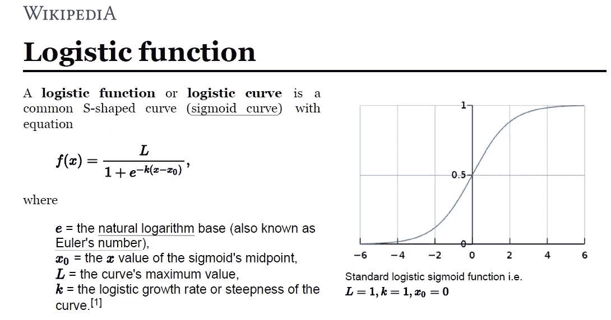

# 理解逻辑回归！！！

> 原文：<https://medium.com/analytics-vidhya/understanding-logistic-regression-b3c672deac04?source=collection_archive---------1----------------------->

在我之前的博客中，我试图解释线性回归及其工作原理。让我们看看为什么逻辑回归是需要理解的重要话题之一。
这里是我之前关于线性回归的文章 的 [**链接，以防你错过。**](/analytics-vidhya/understanding-the-linear-regression-808c1f6941c0)

# 内容

1.  什么是逻辑回归？
2.  逻辑回归的类型。
3.  逻辑回归的假设。
4.  为什么不用线性回归进行分类？
5.  逻辑模型。
6.  系数的解释。
7.  优势比和对数
8.  决策边界。
9.  逻辑回归的成本函数。
10.  逻辑回归中的梯度下降。
11.  评估逻辑回归模型。

> 我们开始吧

照片由[剂量介质](https://unsplash.com/@dose?utm_source=medium&utm_medium=referral)在 [Unsplash](https://unsplash.com?utm_source=medium&utm_medium=referral) 上拍摄

# 什么是逻辑回归？

*   逻辑回归是一种监督统计技术，用于发现因变量(变量中存在的类别)的概率。
*   逻辑回归使用名为 ***logit 函数*** *的函数，通过预测发生的概率或机会，帮助*推导因变量和自变量之间的关系。
*   逻辑函数(也称为 *sigmoid 函数*)将概率转换成可进一步用于预测的二进制值。

# **逻辑回归的类型:**

1.  **二元逻辑回归:**
    因变量只有两 2 种可能的结果/类别。
    举例——男性或女性。
2.  **多项 Logistic 回归:**
    因变量只有两个 3 或更多可能的结果/类，没有排序。
    例:预测食品质量。(好的，伟大的，坏的)。
3.  **有序逻辑回归:**
    因变量只有两个 3 或更多可能的结果/类，具有有序性。示例:星级从 1 到 5

> 现在不同类型的逻辑回归已经清楚了，让我们来看看逻辑回归的假设。在构建模型时，应该记住这些假设。

# 逻辑回归的假设:

尽管 Logistic 回归属于线性模型，但它并没有对线性回归模型做任何假设，比如:
→它不要求因变量和自变量之间存在线性关系。
→误差项不需要正态分布。
→不需要同质性。

然而，它几乎没有自己的假设:

1.  它假设自变量之间的多重共线性最小，或者没有多重共线性。
    检查多重共线性的预见性的最佳方法是执行 VIF(方差膨胀因子)。
2.  **它假设自变量与赔率的对数线性相关。** 可用箱-台试验检查。
3.  **为了更好的预测，它假设了一个大样本。**
4.  **假设观测值相互独立。**
5.  **连续预测值(自变量)中没有影响值(异常值)。** 
6.  **因变量为二元的两类逻辑回归，有序逻辑回归要求因变量有序。**

> **可能还会出现一个问题，除了使用逻辑回归，我们为什么不能简单地使用线性回归来解决分类问题，下面让我们看看为什么我们不应该使用线性回归来解决分类问题。**

照片由[艾米丽·莫特](https://unsplash.com/@emilymorter?utm_source=medium&utm_medium=referral)在 [Unsplash](https://unsplash.com?utm_source=medium&utm_medium=referral) 上拍摄

# 为什么不用线性回归进行分类？

正如我们引入逻辑回归来解决分类问题无论是二分类还是多分类问题一样， ***但是为什么我们不能使用线性回归呢？***

1.  线性回归预测连续变量，如房价，线性回归的输出范围可以从负无穷大到正无穷大。
2.  由于预测值不是概率值，而是类别的连续值，因此很难找到有助于区分类别的正确阈值。
3.  让我们假设您很幸运地找到了阈值，并为二元类问题找到了正确的阈值，但是如果问题是多类的，它将不会给出理想的预测。
4.  在一个多类问题中，不能有 n 个类，现在每个类将被标记为从 0 到 n。然而，他们将被迫在从属特征和独立特征之间建立某种关系。
5.  此外，应变量将被视为连续数字，最佳拟合线将通过点的平均值，给出可能低于 0 且可能超过 4 的连续值。

# **逻辑斯谛模型**

上述所有问题都可以通过逻辑回归来解决。
逻辑回归代替拟合最佳拟合线，压缩 0 和 1 之间的线性函数的输出。

在逻辑斯谛模型的公式中，
当 **b0+b1X == 0** 时，那么 p 将为 0.5，
同理， **b0+b1X > 0** ，那么 p 将趋向于 1，
B0+b1X<0，那么 p 将趋向于 0。

# 系数的解释

*   权重的解释不同于线性回归，因为逻辑回归的输出概率在 0 和 1 之间。
*   斜率系数(b)不是 p 随 X 变化的变化率，现在斜率系数被解释为“对数概率”随 X 变化的变化率。

要了解更多信息，请参考此[链接](https://christophm.github.io/interpretable-ml-book/logistic.html)。

现在，让我们了解什么是对数概率。

# 优势比和对数

比值比定义为有 **B** 时的比值与无 **B** 时的 **A** 的比值，反之亦然。
换句话说， ***赔率是成功概率与失败概率的比值，Logit 就是赔率的对数。*** 让我们用例子来理解这一点:

假设成功的概率是 0.6。
因此，失败的概率将是(1–0.6)= 0.4
几率由概率和 0 到 **∞** 之间的范围决定。所以，现在赔率(成功)= p/(1-p)或 p/q = 0.6/0.4 = 1.5
还有，赔率(失败)= 0.4/0.6 = 0.66667

**现在你对什么是优势比有了基本的了解，我推荐你去这个** [**的环节了解一下它是如何在逻辑回归中使用的，以及它背后的数学**](https://www.unm.edu/~schrader/biostat/bio2/Spr06/lec11.pdf) **。**

> 赔率的公式是:

> 如果我们想要二进制类之间的比值比，那么:

> Logit 函数就是概率的对数，公式是:

在逻辑回归中，我们可以计算类别之间的优势比:

现在，你已经理解了什么是优势比，让我们看看什么是决策边界:

# 判别边界

*   决策边界是分隔类别的线或边界。
*   分类算法的全部内容是找到有助于完美或接近完美地区分类别的决策边界。
*   逻辑回归决定了一个合适的决策边界，以便我们能够预测新数据将对应于哪一类。

**我强烈推荐通过这个** [链接](https://datascience.stackexchange.com/questions/49573/how-to-plot-logistic-regression-decision-boundary) **来理解逻辑回归中如何选择决策边界背后的数学原理。**

现在，您已经了解了什么是决策边界，以及如何找到它。让我们看看逻辑回归的成本函数。

# 逻辑回归的成本函数

[布雷特·乔丹](https://unsplash.com/@brett_jordan?utm_source=medium&utm_medium=referral)在 [Unsplash](https://unsplash.com?utm_source=medium&utm_medium=referral) 上的照片

**成本函数**是**针对给定数据衡量机器学习模型**性能的函数。
成本函数基本上是预测值和期望值之间的误差的计算，并且**以单个实数的形式呈现**。
很多人混淆了**成本函数**和**损失函数**，
简单来说**成本函数**是数据中 n 个样本误差的平均值**损失函数**是单个数据点的误差。换句话说，**损失函数**是针对一个训练示例的，**成本函数**是针对整个训练集的。

那么，当我们清楚成本函数是什么时，让我们继续。

我们知道逻辑函数是:

我们的主要任务是找到图像中存在的上述等式中的最佳参数(x ),以最小化误差。
现在，如果你看过决策边界背后的数学，你会知道参数(x)不仅限于逻辑函数，它也有助于决策边界的等式。

它非常类似于线性回归，定义一个成本函数来找出误差，然后执行梯度下降，以便更新参数和最小化成本函数。

但是，我们不能使用线性回归模型的成本函数。

## 为什么我们不能使用线性回归的成本函数？

尝试使用使用均方误差的线性回归模型的成本函数将给出一个非凸函数，这将给出一个形状怪异的图形，如下所示。

该图具有许多局部最小值，这使得成本函数很难达到全局最小值并最小化误差。

这是因为在逻辑回归中我们有非线性的 sigmoid 函数。

这就是为什么逻辑回归的成本函数是:

如果将上述两个方程合二为一，将得到一个凸函数，这个成本函数将帮助逻辑回归模型更快地收敛到全局最小值。

> 你一定想知道为什么在成本函数中有一个负号，
> 如果你看到，在日志中出现的值将是 0 和 1 之间的概率，所以，log1 的值是 0，log0 的值是负(-)无穷大。
> 因此，来自成本函数的值将始终为负值，这就是我们在它上面加上负号(-)的原因。

现在我们知道了逻辑回归的成本函数，让我们来了解如何最小化误差以获得高性能模型

# 逻辑回归中的梯度下降

[乌萨马·阿扎姆](https://unsplash.com/@ussamaazam?utm_source=medium&utm_medium=referral)在 [Unsplash](https://unsplash.com?utm_source=medium&utm_medium=referral) 上的照片

梯度下降是一种优化算法，用于找到使成本函数(成本)最小化的函数的参数(系数)值。

> 为了更好地了解渐变下降，我建议阅读杰森·布朗利的博客。

现在，你对梯度下降有了直觉，你可以理解为什么我们需要更新权重以达到全局最小值。

**梯度下降后获得较低成本函数的步骤:**

让我们来看看逻辑(sigmoid)函数。

> 这里，x = mx+b 或 x = b0 + b1x

→最初，m 和 b 的值将为 0，学习率(α)将被引入函数。
学习率(α)的取值很小，大约在 0.01 或 0.0001 之间。

> *学习率是优化算法中的调整参数，该优化算法确定每次迭代的步长，同时向成本函数的最小值移动。*

→然后计算成本函数的偏导数。计算后得到的方程将是。

> 熟悉微积分的人会理解这个方程是如何求导的。
> 
> *如果你不知道微积分，不要担心，只要理解它是如何工作的就足够了，直观地思考幕后发生的事情和那些想知道推导过程的人* ***看看这个*** [***博客***](https://towardsdatascience.com/gradient-descent-demystified-bc30b26e432a) ***，它显示了成本函数*** *的推导。*

→计算导数后，借助以下等式更新权重。

也可以写成:

> *如果你读过杰森·布朗利的博客* [*，你可能会理解梯度下降背后的直觉，以及它如何试图达到全局最小值(最低成本函数值)。*](https://machinelearningmastery.com/gradient-descent-for-machine-learning/)

> ***为什么要用导数减去权重(m 和 b)？*** *梯度给我们损失函数的最陡上升方向，最陡下降方向与梯度相反，这就是为什么我们从权重(m 和 b)中减去梯度*

→更新权重的过程将继续，直到成本函数达到理想值 0 或接近 0。

现在，在你完成了最佳表演模式之后。让我们看看如何检查模型的质量。

# 评估逻辑回归模型

[斯科特·格雷厄姆](https://unsplash.com/@sctgrhm?utm_source=medium&utm_medium=referral)在 [Unsplash](https://unsplash.com?utm_source=medium&utm_medium=referral) 上的照片

在建立模型之后，很明显，我们要检查我们的模型执行得有多好，它与我们的数据有多吻合。

实现这一点的方法之一是，根据一组新的自变量来衡量你预测因变量的能力。

1.  **R2(R 平方)值:**
    为逻辑回归计算的 R 平方与为线性回归模型计算的 R 平方不同。
    这些伪 R 平方有助于衡量模型的预测能力。
    有许多不同的方法来计算逻辑回归的 R 平方值，然而，没有一种方法是公认的最佳方法。但是，在所有类型的 R 平方值中**麦克法登的 R 平方是更好的方法。** [参考此链接浏览不同类型的 R 平方进行逻辑回归。](https://stats.idre.ucla.edu/other/mult-pkg/faq/general/faq-what-are-pseudo-r-squareds/#:~:text=A%20pseudo%20R%2Dsquared%20only,model%20better%20predicts%20the%20outcome.)
2.  **AIC(赤池信息准则):**
    * AIC 是模型拟合优度的估计量。
    *每当我们创建一个模型时，我们都会丢失一些信息，没有人能够创建完美的模型。AIC 估计了信息丢失的数量。
    * AIC 值越小，意味着丢失的信息越少，意味着模型越好。
    *在模型中加入变量不会增加 AIC 的价值。
    * AIC 的用途之一还在于它有助于选择型号。我们可以拟合整个数据来训练模型，并比较不同模型的 AIC 值，选择具有最佳 AIC 值的模型。
    AIC = -2/N * LL + 2*K/N
    *其中，* ***N*** *为训练数据中的样本数，* ***LL*** *为模型对训练数据的对数似然。而* ***K*** *是数据中参数的个数。*
3.  **其他方法包括混淆矩阵、Roc-Auc 曲线**。
    你可以在我的博客[中读到关于混淆矩阵和其他相关的指标计算一个 ML 模型的准确性](/analytics-vidhya/calculating-accuracy-of-an-ml-model-8ae7894802e)和理解 [AUC-ROC 曲线](/analytics-vidhya/understanding-the-auc-roc-curve-cdc754d7b58a)。

我希望这篇文章能让你对逻辑回归模型有一个大致的了解。逻辑回归中有更多的东西。然而，我们只是触及了它的表面。我推荐阅读关于逻辑回归的书籍，在谷歌上搜索，观看 youtube 视频，并尝试阅读发表在这方面的论文。

**快乐学习！！！！！**

喜欢我的文章？请为我鼓掌并分享它，因为这将增强我的信心。此外，我每周日都会发布新的文章，所以请保持联系，以获取关于数据科学和机器学习基础的未来文章。

另外，请务必通过 LinkedIn 与我联系。

[Alex](https://unsplash.com/@alx_andru?utm_source=medium&utm_medium=referral) 在 [Unsplash](https://unsplash.com?utm_source=medium&utm_medium=referral) 上的照片