# 理解逻辑回归

> 原文：<https://medium.com/analytics-vidhya/understanding-logistic-regression-in-depth-intuition-99ad14724464?source=collection_archive---------2----------------------->

# 先决条件

在直接进入本文之前，请确保您了解*线性回归*算法背后的数学原理。如果你没有，没必要担心；跟随 [**这条**](/@anujvyas/understanding-linear-regression-in-depth-intuition-6c9f3b1cbb51) 通过！

# 介绍

本文试图成为您在理解逻辑回归算法的数学和统计原理时所需要的参考。**逻辑回归**是人们用来建立机器学习模型的首批**分类算法**之一，但只有少数人真正理解其背后的数学原理。

为了解释逻辑回归实际上是做什么的，我尽可能使这篇文章简单。

介绍

# 目录

*   什么是逻辑回归？
*   为什么叫逻辑回归？
*   逻辑回归工作
*   什么是最大似然估计？
*   逻辑回归的假设

# 什么是逻辑回归？

如果你还记得， ***线性回归*** 用于确定/预测因变量的连续值，因此它是一个 ***回归算法*** 。而*的逻辑回归，则是*一般用作**的分类算法，例如预测某事是真还是假(二元分类)*。***

**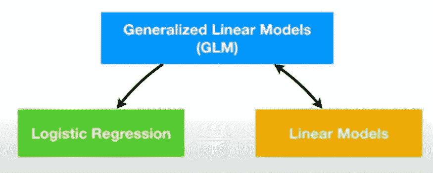**

***注:逻辑回归是一种特殊类型的广义线性模型(GLM)***

## **什么是分类算法？**

**顾名思义，这些算法仅**根据用于分类的输入预测离散值***例如，将患者分类为是否患有糖尿病、将电子邮件分类为垃圾邮件或垃圾邮件、数字分类等是最常见的分类任务。***

**同样在*线性回归*中，因变量是一组*连续值*，但在 ***逻辑回归*** 中，因变量仅由一组**特定值组成，如 0/1、真/假、垃圾/火腿等。****

## **逻辑回归的类型**

*   **二项式逻辑回归
    *用于* ***二元分类*** *:目标变量只能有* ***两个*** *可能的结果，如 0 或 1，分别代表肥胖/不肥胖、死亡/活着、垃圾邮件/非垃圾邮件等……***
*   **多项逻辑回归
    *用于* ***多类分类*** *:目标变量可以有* ***3 个或更多*** *个可能的结果，如疾病 A/疾病 B/疾病 C 或数字分类等...***

**在本文中，我们将重点讨论二项逻辑回归，也就是通常所说的逻辑回归。**

# **为什么叫逻辑回归？**

**这是许多学生/初学者问的最常见的问题，这里是我的理解。**

****

**[布鲁斯·马尔斯](https://unsplash.com/@brucemars?utm_source=medium&utm_medium=referral)在 [Unsplash](https://unsplash.com?utm_source=medium&utm_medium=referral) 上的照片**

****逻辑**由 [*逻辑函数*](https://en.wikipedia.org/wiki/Logit) 缩写而成，其工作方式与线性 ***回归*** 算法十分*相似，因此得名**逻辑回归**。***

*****阈值(默认值= 0.5)的设置是逻辑回归的一个非常重要的方面，取决于分类问题本身。*****

# ****逻辑回归工作****

****考虑将患者分类为肥胖或不肥胖的例子，其中如果输出为 1 表示患者肥胖，0 表示不肥胖。****

*******注:*** *由于线性回归使用普通的最小二乘法(OLE)来选择其最佳拟合线，这在逻辑回归的情况下无法做到，要知道为什么；观看* [*本视频*](https://www.youtube.com/watch?v=BfKanl1aSG0&list=PLblh5JKOoLUICTaGLRoHQDuF_7q2GfuJF&index=15&t=0s) *。相反，* ***逻辑回归*** *利用* ***最大似然*** *选择最佳拟合线。*****

******逻辑回归**模型首先将概率转化为[对数(odds)或我们所说的概率对数](https://www.youtube.com/watch?v=ARfXDSkQf1Y&list=PLblh5JKOoLUICTaGLRoHQDuF_7q2GfuJF&index=10)，如下图所示。****

****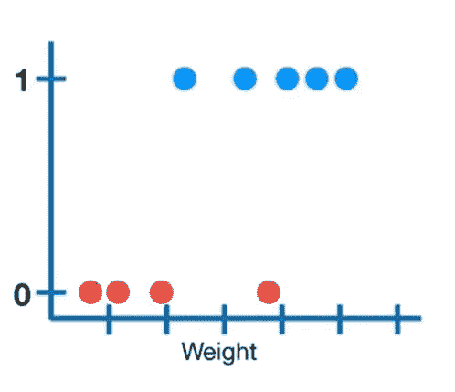********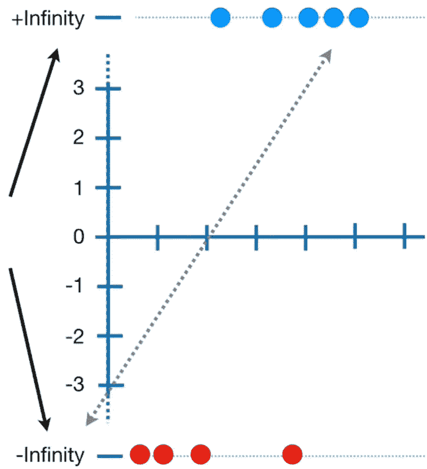****

****概率到对数的转换(odds) || [图片来源](https://www.youtube.com/watch?v=BfKanl1aSG0&list=PLblh5JKOoLUICTaGLRoHQDuF_7q2GfuJF&index=15&t=0s)****

*******注:*** *左图像的 y 轴由范围从 0 到 1 的概率组成，默认阈值为 0.5，右图像的* ***y 轴由范围从+无穷大到-无穷大的 log(odds)值*** *组成。使用* ***logit 函数完成从概率到对数(赔率)的转换。*******

****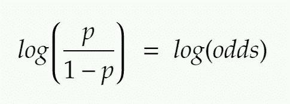****

****Logit 函数****

*******注:*** *如果我们使用默认的阈值= 0.5，代入上式，最终会得到****log(odds)= 0****这是 log(odds)图的中心。同样，代入 1 将得到答案为****+无穷大*** *，而代入 0 将得到答案为****-无穷大*** *。*****

****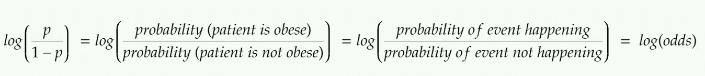****

****日志的解释(赔率)****

****为了找到每个候选人的 log(odds)值，我们将它们投影到如下所示的线上。****

****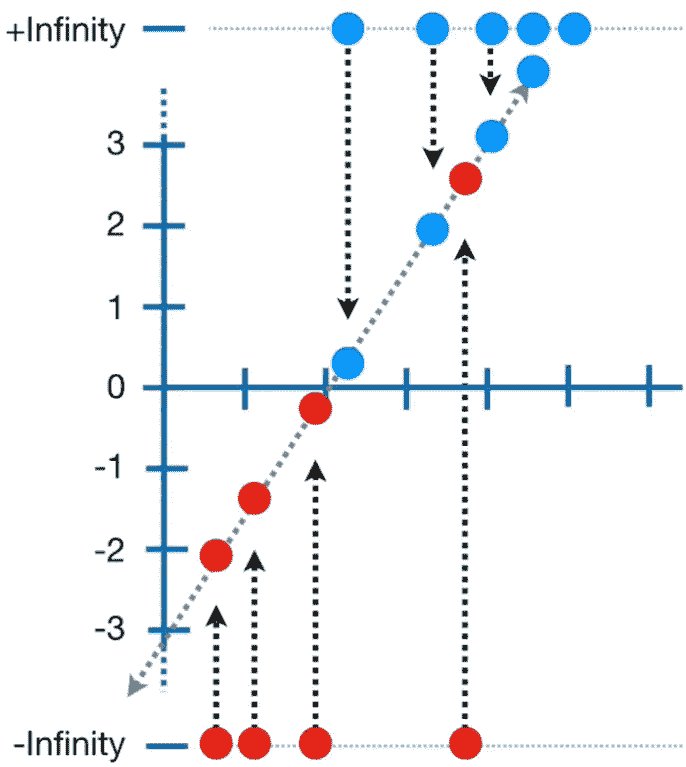****

****每个数据点的 Log(odds)值|| [图像来源](https://www.youtube.com/watch?v=BfKanl1aSG0&list=PLblh5JKOoLUICTaGLRoHQDuF_7q2GfuJF&index=15&t=0s)****

****一旦我们找到每个候选人的对数(赔率)值，我们将使用下面给出的公式将每个候选人的对数(赔率)转换回概率。 ***(乙状结肠函数)*******

****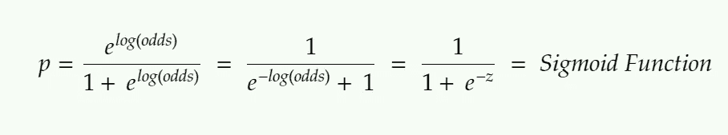********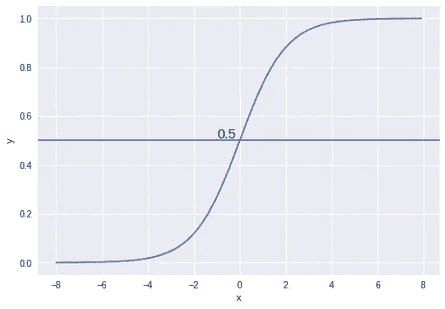********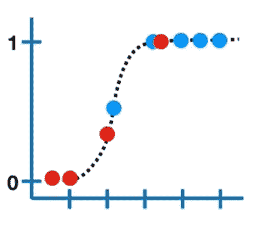****

****判决阈值= 0.5 的 Sigmoid 函数|| [图像来源](https://www.youtube.com/watch?v=BfKanl1aSG0&list=PLblh5JKOoLUICTaGLRoHQDuF_7q2GfuJF&index=15&t=0s)****

## ****什么是[最大似然估计](https://www.youtube.com/watch?v=BfKanl1aSG0&list=PLblh5JKOoLUICTaGLRoHQDuF_7q2GfuJF&index=15&t=0s)？****

> ****最大似然估计(MLE)是一种似然最大化方法，而普通最小二乘法(OLS)是一种残差最小化方法。****
> 
> ****最大化似然函数确定了最有可能产生观察数据的参数。因此，最大似然法用于选择最佳拟合线。****

****在这种情况下，可能性是所有数据点肥胖和不肥胖的概率的乘积。****

****找到第一条线的可能性后，我们将对数线旋转一点，再次计算可能性。这是使用**梯度下降**算法完成的。****

## ****Logistic 回归中的梯度下降和成本函数****

****如果你记得，线性回归中的成本函数看起来像…****

****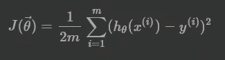****

****线性回归:成本函数|| [图片来源](https://www.internalpointers.com/post/cost-function-logistic-regression)****

****如果您试图使用线性回归的成本函数来生成逻辑回归问题中的 J(θ)，您将最终得到一个**非凸函数**，它有**多个局部最小值**:一个形状怪异的图形，不容易找到最小全局点，如下图所示。****

****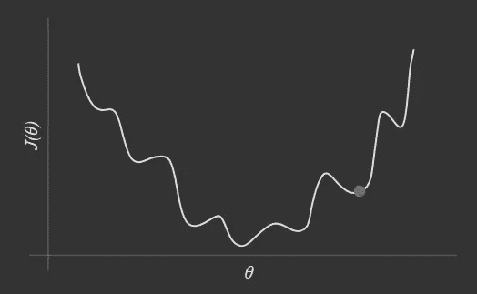****

****非凸函数|| [图像来源](https://www.internalpointers.com/post/cost-function-logistic-regression)****

****对于逻辑回归，成本函数定义如下。****

****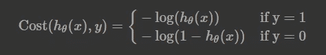****

****Logistic 回归:成本函数|| [图片来源](https://www.internalpointers.com/post/cost-function-logistic-regression)****

****我们使用这个成本函数来生成 J(θ)，这将给出下面的图形。****

****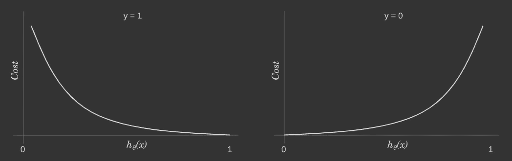****

****凸函数|| [图像来源](https://www.internalpointers.com/post/cost-function-logistic-regression)****

****重复该过程，直到找到最佳拟合对数(比值)线。****

****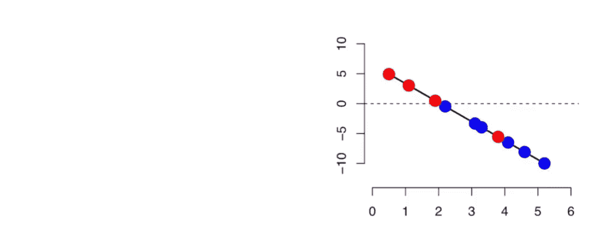****

****Sigmoid 曲线(概率)和 Log(赔率)线|| [GIF 来源](https://www.youtube.com/watch?v=BfKanl1aSG0&list=PLblh5JKOoLUICTaGLRoHQDuF_7q2GfuJF&index=15&t=0s)****

*******注:****logistic 回归模型使用 classifier.coeff_ 方法显示的系数是针对 log(odds)线而不是 sigmoid 曲线的。*****

****这就是逻辑回归的工作原理！唷…****

****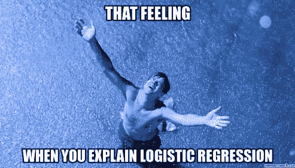****

# ****逻辑回归的假设****

*   ****因变量必须是**分类的**。****
*   ****该模型应具有**很少或没有多重共线性**，即独立变量不应相互关联。****
*   ****独立变量**与对数**线性相关(几率)。****
*   ****逻辑回归需要相当大的样本量。****

# ****参考****

*   ****[Josh Starmer 的 stats quest](https://www.youtube.com/watch?v=yIYKR4sgzI8&list=PLblh5JKOoLUICTaGLRoHQDuF_7q2GfuJF&index=12)****
*   ****[机器学习掌握度](https://machinelearningmastery.com/logistic-regression-for-machine-learning/)****
*   ****[国际点](https://www.internalpointers.com/post/cost-function-logistic-regression)的成本函数****
*   ****Animesh Agarwal 的博客****
*   ****[GeeksforGeeks](https://www.geeksforgeeks.org/understanding-logistic-regression/)****

# ****帮我接通****

*   ****[领英](https://www.linkedin.com/in/anujkvyas)****
*   ****[GitHub](https://github.com/anujvyas)****
*   ****[卡格尔](https://www.kaggle.com/anujvyas)****

****如果你从这个博客中学到了什么，一定要给它一个👏🏼
会在其他博客上和你见面，直到那时和平✌🏼****