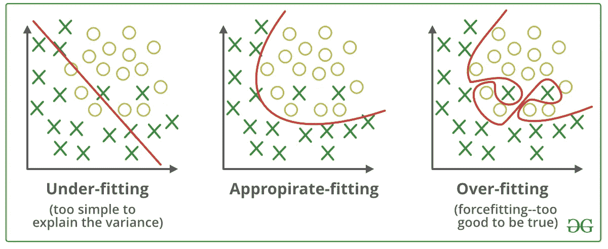

# 以几何方式理解逻辑回归！

> 原文：<https://medium.com/analytics-vidhya/understanding-logistic-regression-the-geometric-way-6538012a4449?source=collection_archive---------14----------------------->

## 逻辑回归的几何起点

## 什么是逻辑回归？

逻辑回归是解决**分类**问题的基本和流行算法之一，不像它的名字中包含回归。它被命名为“逻辑回归”，因为它的基本技术与线性回归完全相同。逻辑回归的优势之一是它可以处理各种类型的关系，而不仅限于线性关系。


逻辑回归

## 让我们试着理解逻辑回归背后的几何直觉:

理解逻辑回归的方法不止一种，主要有**概率法**、**几何法、**和**损失函数最小化法**，但在所有的**几何法**中，我个人觉得更直观理解。让我们来看看:

**假设**:逻辑回归的基本假设是数据几乎或完全线性可分，即所有(+ve)和(-ve)类都是可分的，如果不可分，只有极少数是混合的。

**目标**:我们的目标是找到一个平面( **π)** 最好的分离(+ve)和(-ve)类。

基础知识:让我们来看看一些基本术语，它们会使事情更容易理解。

我们将代表一架飞机。Pi(𝜋)并垂直于带有 **W** 的平面

平面方程:


平面可视化

**w^t*xi+b=0** ，其中 **b** 为标量， **xi** 为第 I 个观测值。如果平面通过原点，方程变成 **w^t*xi = 0，**

其中 **w^t(** 读作 Wtranspose **)** 是[行向量](https://en.wikipedia.org/wiki/Row_and_column_vectors)而 **xi** 是[列向量](https://en.wikipedia.org/wiki/Row_and_column_vectors)

## 几何解释:


分隔+ve 和-ve 类的平面

如果我们取任何+ve 类点，它们离平面的距离 di 计算如下:

(di = w^t*xi/||w||.设，范数向量(||w||)为 1)

由于 w 和 xi 在判定边界的同一侧，那么距离将是 **+ve** 。现在计算 dj = w^t*xj，因为 xj 是 w 的对边，那么距离就是 **-ve。**

通过使用 if (w^t*x >0) then +ve 类和 if (w^t*x <0) then -ve 类，我们可以很容易地将点分为-ve 点和+ve 点

所以我们的分类器是:

```
If w^t * xi > 0  :  then Y = +1    where Y is the class label
If w^t * xi < 0  :  then Y = -1    where Y is the class label
```

观察结果:

仔细观察上图中的点，我们观察到以下情况:

```
***case 1***: Yi >0 and  w^t * xi > 0
Yi = +1 means that the correct class label is +ve => **Yi* w^t * xi >0** means that we have **correctly predicted** the class label.
as +ve * +ve = +ve***case 2***: Yi <0 and  w^t * xi <0
Yi = -1 means that the correct class label is -ve => **Yi* w^t * xi >0** means that we have **correctly predicted** the class label.
as -ve * -ve = +ve***case 3***: Yi >0 and  w^t * xi <0
Yi = +1 means that the correct class label is -ve => **Yi* w^t * xi <0** means that we have **wrongly predicted** the class label.
as +ve * -ve = -ve ***case 2***: Yi <0 and  w^t * xi >0
Yi = -1 means that the correct class label is -ve => **Yi* w^t * xi <0** means that we have **wrongly predicted** the class label.
as -ve * +ve = -ve 
```

现在有无限多的平面可以用来把点或类分成+ve 和-ve。最佳平面是将更多的点分类到正确的类别中，即，为了找到最佳平面，我们需要最大化所有点的分类器的总和。
这就给出了我们的优化函数:


优化功能

## 挤压:需要逻辑函数或 S 形函数或 S 形曲线

我们已经得到了我们的优化函数，那么为什么我们还需要另一个函数呢？？

上面的优化函数有问题，为了理解什么，让我们考虑以下场景:


LR 中的异常问题

在图 1 中。平面的距离(𝜋)正确地将 d=1 处的所有点分类，除了在 d=100 处的一个异常值。平面 1 的优化函数的输出为-90°

而在图 2 中。第一个蓝色(+ve)点在 d=1 处，所有其他点彼此相距 d=1，类似地，有一个绿色点(-ve)被正确分类，并且与平面相距 d=1，而其余点被错误分类。
优化函数给出的输出为+1

直观地看一下上图，你会发现(图 1: 𝜋)比(图 2: 𝜋)更好，因为(图 1: 𝜋)正确地分类了更多的数据点，而(图 2: 𝜋)只正确地分类了一个数据点，但是根据我们的优化函数(图 2: 𝜋)，它更好，因为+1 > -90

为了解决这个由异常值引起的问题，我们需要一个稳健的函数，它不会受到异常值的太大影响。

一种这样的函数是 S 形函数或“S”形函数:


Sigmoid 函数图

## 为什么是乙状结肠函数？

1.  这是一个单调的[函数](https://en.wikipedia.org/wiki/Monotonic_function)，它挤压 0 和 1 之间的值:无论异常值是多少，它的值都不会超过 0-1，因此整个过程被称为挤压
2.  它提供了一个很好的概率解释。例如，如果一个点位于决策面上(d = 0)，那么凭直觉，它的概率应该是 1/2，因为它可以属于任何类别，这里我们也可以看到，适马(0) = 1/2。
3.  容易微分，

因此，我们需要最大化 sigmoid 函数，其定义为:


Sigmoid 函数

这为我们提供了优化函数:


优化功能

等等什么？？？？？？想知道我们怎么从 sigmoid 函数得到上面的函数？方法如下:

我们利用了 sigmoid 函数是[单调函数](https://en.wikipedia.org/wiki/Monotonic_function)的性质，并且 f(x)= log(x)也是单调函数:我们取 sigmoid 函数的 log 来简化它。

我们将使用以下属性来获得所需形式的优化函数

1.  **log(1/x) = -log(x)**
2.  **arg max(-f(x))= arg min(f(x))**ie。最大化负函数和最小化正函数是一样的。

应用以上两个性质，我们得到:


优化功能

## 最小化策略:

让我们重新审视这个等式:

```
 n
W(optimal) = argmin(∑i=1  log(1 + exp(- Yi * w^t * xi)) Let z= Yi * w^t * xi               
                     n 
W(optimal) = argmin(∑i=1  log(1 + exp(- Zi))
```


exp(-z)的图形

从上图可以看出，exp(-Zi)总是正的。

```
 exp(-Zi) — > 0 to +∞n
W(optimal) = argmin(∑i=1 log(1 + exp(- Zi)) >= 0 when exp(-Zi)-> 0 => argmin(∑i=1 log(1 + 0))  and as log(1) = 0
```

优化函数的 So-min **值是 0** ，并且当 **exp(- Zi) = 0**
时出现，因此我们的优化函数的整体最小值将出现在

`Zi -> +∞ for all i`

现在我们知道子=易* w^t * xi，这里**是特征，**是标签，唯一可以操作的就是**了**

为了将 Zi 的值移至无穷大，我们将为 w 选择一个非常大的值(要么+要么-)。

```
**case 1:** **Yi =+1**
(Yi * w^t * xi) = +1 * (very large +ve value of W ) * xi   =  Very large +ve value ~> +∞**case 2: Yi= -1**
(Yi * w^t * xi) = -1 * (very large -ve value of W ) * xi   =  Very large +ve value ~> +∞ 
```

这样就完成了使 Zi → +∞的任务

# 正规化:

上述策略的问题是，我们可以通过找到 w 的这么大的值来使 Zi →+∞为 I 的所有值。
为什么这是一个问题:这里的问题是过度拟合我们正在制作我们的模型，通过制作`Zi -> +∞`好得不真实



如果决策边界过度拟合，形状可能会严重扭曲，只适合训练数据，而无法对看不见的数据进行归纳。

因此我们使用**正则化**，因此逻辑回归的成本函数被更新以惩罚参数的高值。

有两种最常用的规范化类型:

1.  L2 正规化
2.  L1 正规化

## **L2 正规化:**

在 L2 正则化中，我们引入了一个称为正则化参数的附加术语来防止过度拟合。


L2 正则化

超参数: **λ**

*正规化术语* **:** **λW^TW**

*损失函数***:w * = arg min(∑I = 1 log(1+exp(-易 W^TXi))**

现在，如果我们试图通过增加 w 的值并使*损失项* ~ >为 0 来使 Zi →+∞，我们的*正则项*将通过变成+∞ as 来对此进行补偿，我们有 **λW^TW** 作为正则项。因此，在损失项和*调整项*之间本质上有一个权衡

## **的意义λ:**

λ在优化我们的功能方面起着关键作用。

*   如果我们显著降低λ的值，那么模型会过拟合，因为正则化项的影响变得可以忽略不计。
*   如果我们显著地增加λ的值，那么我们的模型会欠拟合，因为损失项变得可以忽略，并且正则化项不包含任何训练数据。

## L1 正规化:

L1 正则化也起到了和 L2 一样的作用，即避免过度拟合，但不同于 L2 正则化

*正则化术语* **: λ||W||**

其中| | W | | = I = 1 到 n 的所有 W 的绝对值之和

L1 正则化的重要性在于特征减少，因为 L1 正则化创建了稀疏向量，因此对于特征 fi，如果其不重要，则在 L1 正则化的情况下，其对应的权重将为 0，而在 L2 正则化中，其将显著更小但不为 0

**弹力网:**

甚至还有一个被认为是世界上和这里最好的规则

*正则化术语:* **λW^TW + λ`||W||**

_____________________ _ _ _ _ _ _ _ _ _ 结束 _ _ _ _ _ _ _ _ _ _ _ _ _ _ _ _ _ _ _ _ _

在 [LINKEDIN](https://www.linkedin.com/in/v-shaal/) 上与我联系