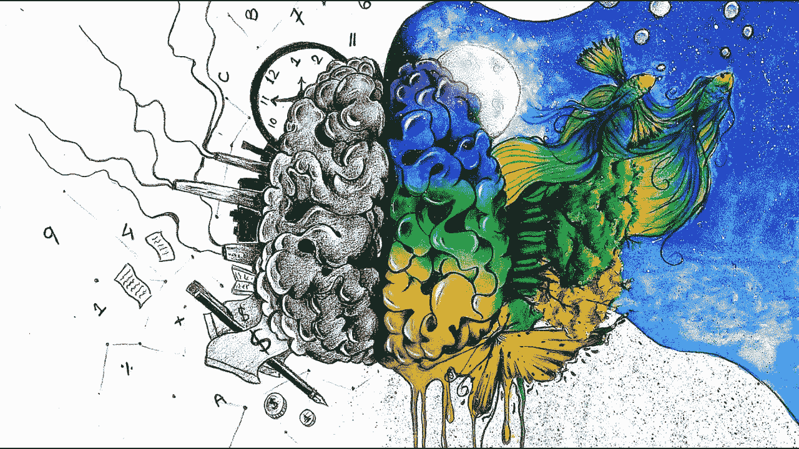
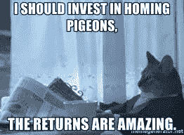
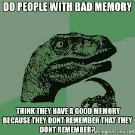
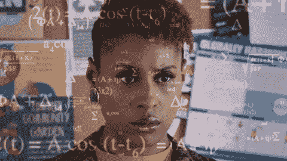
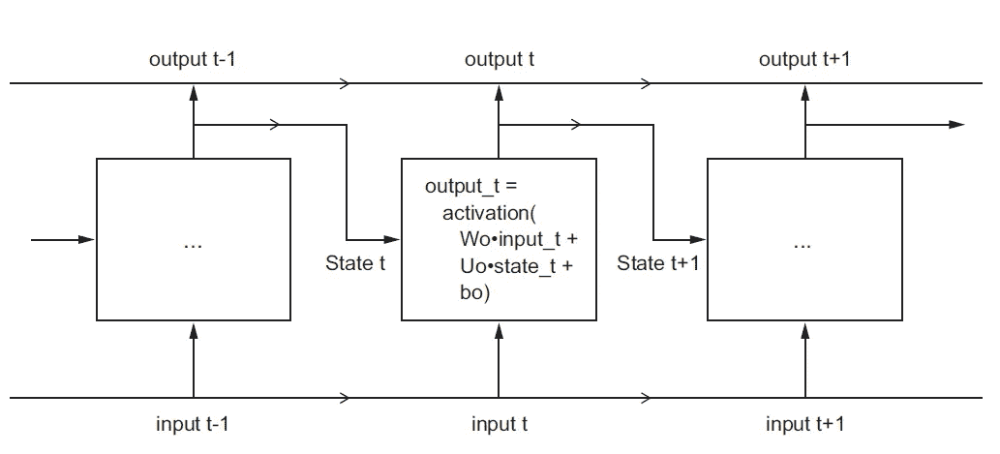
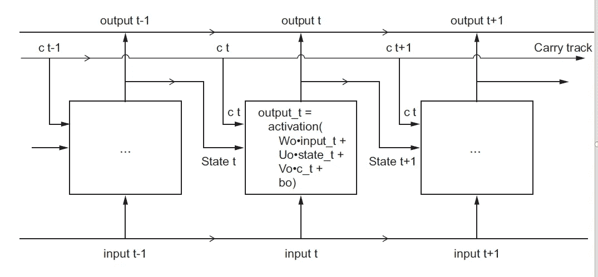
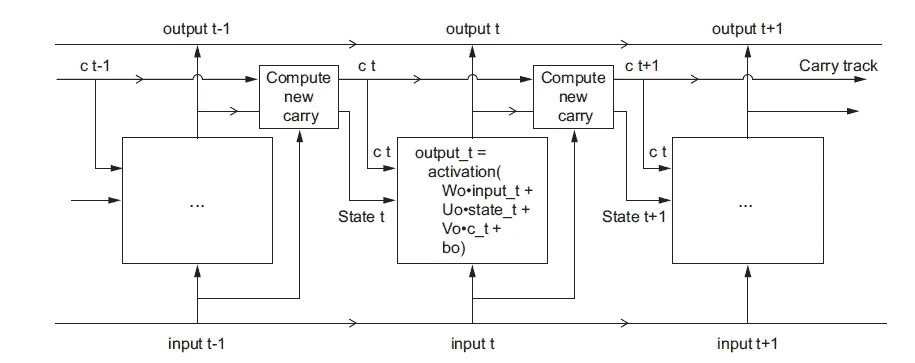

# 理解长短期记忆

> 原文：<https://medium.com/analytics-vidhya/understanding-long-short-term-memory-b2144ac64e82?source=collection_archive---------12----------------------->

在本文中，我们将看看递归神经网络(RNN)的类型，它可以克服简单的递归神经网络遭受的消失梯度问题。

信息是新的电力、黄金、汽油、钻石…

它已经成为 21 世纪最重要的财富，科技巨头们要么偷，要么买，要么要，却没有一个合适的免责声明来说明他们要用它做什么；有趣的是，它不仅在我们当前的社会中，而且在整个动物王国中一直扮演着重要的角色。

> "一般来说，生活中最成功的人是拥有最多信息的人。"——本杰明·迪斯雷利

早在一万年前，信息创造并开始发展其第一个 **GMaps** 与被称为*鸽科*的鸟类，从物种**鸽**，进化到早期的**家鸽** ( *家鸽*)。

**家鸽**是由**岩鸽**演变而来，岩鸽是世界上最古老的家养鸟类，根据美索不达米亚楔形文字记载，鸟类的驯化可以追溯到 5000 年前。家鸽在和平时期和战争时期被大量使用，因为它们惊人的归巢能力，或者按照今天的标准，也许我应该说是谷歌地图的能力；足够有趣的是，如果与谷歌地图放在一起，自然构建导航系统领先几千年，肯定会在准确性、用户界面和 UX 方面胜出，只是在销售和营销方面会失败。

> 寻的:能够在极长的距离内找到回家的路。伯德在竞技比赛中曾记录过长达 1800 公里的飞行。这整个系统不需要智能手机或任何其他电子设备(大脑除外)，只需要使用一个内部指南针就可以工作，这个指南针已经建立和发展了几千年。

研究人员认为，鸽子的这些归巢能力与**磁接收**一起工作，并使用“地图和指南针”模型，其中**指南针**功能允许鸟类确定方向，地图功能允许鸟类确定它们相对于目标地点(家庭阁楼)的位置。鸟类可以探测磁场来帮助它们找到回家的路。

> **磁感应:**是一种让生物体通过检测磁场来感知方向、高度或位置的感觉。

因此，我们可以有把握地说，它们通过接收、存储、处理和回忆**信息**来提供动力，利用它们的感官输入来捕捉信息，利用它们小小的大脑迷人的处理能力和记忆来使整个系统运转。

信息是一种伟大的工具，当开发出适当的系统，以前所未有的方式存储、处理和分析数据时，信息看起来就像纯粹的魔法。它可以让动物知道巢穴的位置，家庭范围内导航的地标，过去在哪里找到食物和水，以及以前与另一种动物的社会互动结果如何，所有这些都是塑造未来行为的关键信息。

# 记忆是如何工作的？

记忆始于感觉输入后大脑中的生化反应。

有 3 种类型的内存:

*   **短期**——它是由你大脑神经递质(化学信使)水平在突触(一种允许一个神经元向另一个神经元传递电信号或化学信号的结构)的任何短暂变化触发的。
*   **中期**——介于短期记忆和长期记忆之间，是记忆巩固阶段发生的地方(通常发生在睡眠期间)。
*   **长期** —通过强化所学事件，将对未来至关重要的信息转移到长期记忆中。

现在，回到人工智能，我们可以看到所有这些是如何与本文的主题相关联的。

# 这一切有什么联系？

在我之前的 [**文章**](/datadriveninvestor/the-brief-history-of-nlp-c90f331b6ad7?source=your_stories_page---------------------------) 中，我们简单介绍了几个用于序列处理的基本 DL 算法和方法，即:

*   **单词嵌入** —一种用于将人类语言映射到几何空间的方法
*   **递归神经网络(RNN)** —一种具有记忆的神经网络。它处理数据序列，同时记录/记忆到目前为止所看到的内容，rnn 的一些例子有:LSTM、GRU 和 BI-LSTM。
*   **1D 修道院** — 一维版的[**2D/3D conv nets**](/@prince.canuma/beyond-neural-networks-bdc68980d474)**用于计算机视觉领域。**

# **理解长短期记忆**

**在我的上一篇文章中，我们谈到了**香草 RNN** ，它是 **Tensorflow Keras** 框架中的一层，称为 SimpleRNN 或 RNN，如果你是我介绍的 **Pytorch** 的忠实粉丝，它位于名为 RNN(torch.nn.RNN)的神经网络(NN)包下。**

**这不是唯一存在的 RNN 层，让我告诉你为什么。**

**香草 RNN 有一个主要问题:尽管它能够保留在先前时间步长(t)中看到的所有信息的记忆，其中 t≥1；实际上，这样的长期依赖是不可能学会的。这是因为消失梯度问题影响了多层深度(多层堆叠)的神经网络，随着我们不断向网络添加层，网络变得不可训练，简单来说，学习能力随着层的增加而降低。**

**就像当我们学习新的话题时，我们需要不断地修改过去的信息，以便更好地学习，并防止我们忘记那些信息。**

> **对此的解决方案是将一些过去的信息注入/添加到后面的层，以便它可以修改它，并通过网络更好地传播学习信号，从而容易地训练更大的网络，并避免由网络的更深层获得的知识(*权重*)的退化。然而，当涉及到 RNN 时，我们必须计算出你希望过去的信息在多大程度上影响现在，因为记住一切没有帮助，不记住也没有帮助，所以我们必须有一个函数来决定从过去记住多少。**

> **“我们必须欢迎未来，记住它很快就会成为过去；我们必须尊重过去，记住它影响未来”——P·卡努马**

**Hochreiter、Schmidhuber 和 Bengio 在 20 世纪 90 年代早期研究了记住所有事情对 RNNs 的影响的理论原因。**

****长短期记忆** (LSTM)和**门控循环单元** (GRU)层就是为了解决这个问题而设计的。**

****

**图 1:LSTM 的起点，来自 F.chollet 的《用 python 进行深度学习》**

**SimpleRNN 是 LSTM 的起点，但是 LSTM 层的设计考虑了一些因素；本质上，LSTM 为以后保存信息，从而防止旧信号逐渐消失，它通过计算注入过去信息的百分比(概念上)来做到这一点。**

# **潜入…**

****

**现在，让我们深入图 1 的细节，更好地理解 LSTM 单元内部的数据流。**

**我们在单元格内有两个权重矩阵 **W** 和 **U** (包含我喜欢称之为“知识”),它们用字母 **o (Wo 和 Uo)** 表示*输出* **。**我们还有 **state_t** ，它是前一步 t *的*输出*。***

**此外，现在让我们添加一个额外的数据流，它携带跨时间步长(t)的信息。调用其在不同时间步长的值 *Ct，*其中 *C* 代表*进位。* 存储在 Ct 中的信息(时间 t 时所有输出的集合)将与输入(序列数据)和递归(先前输出)相结合，所有这些都是通过**密集变换**完成的:一个带有权重矩阵的点积，之后是偏置加法和激活函数的应用，它将影响发送到下一时间步的状态(通过激活函数和乘法运算)。**

**请原谅我…**

**从概念上讲，进位数据流是调制下一个输出和或状态的一种方式。**

****

**图 2:从简单到 LSTM:增加进位跟踪**

**计算 Ct(进位数据流)涉及三种不同的转换。三者都具有 SimpleRNN 单元的形式:**

****y =激活(dot(input_t，W) + dot(state_t，U) + b)****

**但是这三种变换都有自己的权重矩阵，您可以用字母 I、f 和 k 对其进行索引。**

**简单！！！看，没那么难。**

## **LSTM 的解剖**

****

**我们可以解释这些操作中的每一个打算做什么，但是解释做不了多少，因为这些操作实际上做什么是由参数化它们的权重(知识)的内容决定的；并且重量是以端到端的方式学习的，从每一轮训练开始，使得不可能有特定目的的这个或那个操作。**

**重量不同的同一个细胞可以做非常不同的事情。**

**RNN 单元决定了您的假设空间，即您在训练过程中搜索良好模型配置的空间。**因此，组成 RNN 单元的操作组合更好地解释为对您的搜索的一组约束，而不是工程意义上的设计。****

**对于研究人员来说，似乎这种约束的选择——如何实现 RNN 单元的问题——最好留给优化算法，而不是人类工程师，即遗传算法或强化学习过程，它们将使用所有可用的计算能力来找到最佳约束集(超参数)，从而为特定问题产生最佳精度。在未来，这就是神经网络的构建方式。**

# ****主要外卖****

*   **LSTM 细胞是为了让过去的信息在以后重新注入，通过计算我们允许过去的信息影响现在的信息的百分比，从而解决香草 RNN 的消失梯度问题。**

> *****注意*** :我特别为你准备了一个 **colab 笔记本**，这样你就可以了解所有的概念，实际上看到它是如何从零开始的，以及如何使用内置在 TF 和 Torch 等著名框架中的生产就绪层。**

** [## 谷歌联合实验室

### 编辑描述

colab.research.google.com](https://colab.research.google.com/drive/1IkG-iXsWtW2d23_BC4vNMDJ3CRsFeix1#scrollTo=gBo7Eb1_750Q)** 

**感谢您的阅读。如果你有任何想法，评论或批评，请在下面评论。**

**在 twitter 上关注我的 [**卡努玛**](https://twitter.com/CanumaGdt) **，**王子，这样你就可以随时了解 AI 领域的最新动态**。****

# **参考**

 **[## 记忆

### 储存的信息在许多动物的生活中起着至关重要的作用。知道巢穴的位置，地标…

www.animalbehavioronline.com](http://www.animalbehavioronline.com/memory.html)** 

*   **Francois Chollet 用 python 进行深度学习**