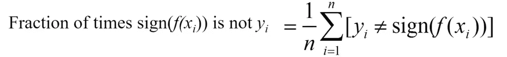
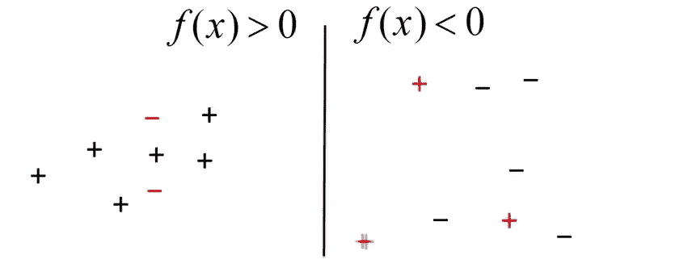
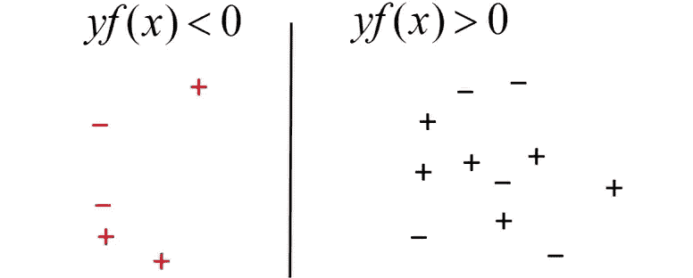
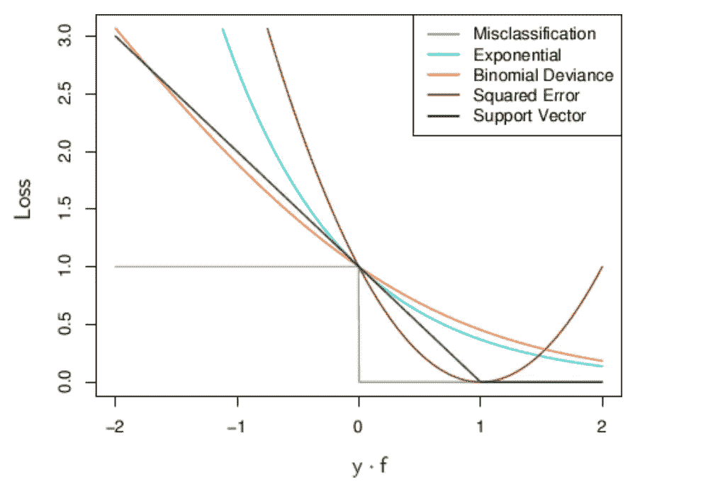
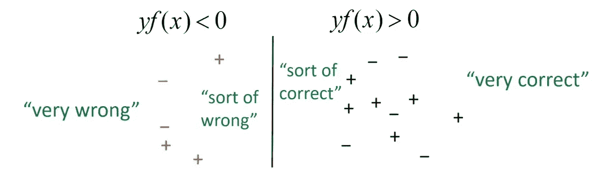

# 理解损失函数:铰链损失

> 原文：<https://medium.com/analytics-vidhya/understanding-loss-functions-hinge-loss-a0ff112b40a1?source=collection_archive---------0----------------------->

在机器学习中，我们经常会遇到损失函数。对于像我这样没有计算机科学背景的人来说，探索损失函数背后的数学概念并在我的模型中实现是很困难的。因此，在这里，我将尝试用最简单的术语解释什么是损失函数，以及它如何帮助优化我们的模型。我将只考虑分类示例，因为它更容易理解，但是这些概念可以应用于所有技术。

首先，我们需要理解任何分类模型的基本目标是正确地分类尽可能多的点。尽管有时会发生错误分类(考虑到我们没有过度拟合模型，这是好事)。现在，我们需要测量我们错误分类了多少点。这在两个方面帮助了我们。

1.  预测模型的准确性
2.  优化成本函数，以便我们从正确分类的点中获得比错误分类的点更多的价值

因此，用最简单的术语来说，损失函数可以表示如下。

图 1:错误分类点的分数

然而，数学上很难优化上述问题。我们需要一些具体的数学方程式来理解这个分数。

现在让我们直观地理解一个决策边界。

图 2:区分正负点的决策边界

左侧的点被正确分类为正，而右侧的点被分类为负。错误分类的点用红色**标记**。

现在，我们可以尝试将所有错误分类的点放在决策边界的一边。姑且称此为' ***犹太区*** '。

图 3:错误分类的点对于 yf(x)总是有一个负号

从我们的基本线性代数中，我们知道如果( **𝑦,𝑦̂** )的符号不匹配， **yf(x)** 将始终为> 0，其中“ **𝑦** 将表示我们的模型的输出，而“ **𝑦̂** 将表示实际的类标签。

现在，如果我们绘制 **yf(x)** 对损失函数，我们得到下图。

图 4:YF(x)与各种算法的损失函数的曲线图

现在让我们考虑图 3 中的错误分类图。我们可以看到，对于 **yf(x) > 0** ，我们正在指定“0”损失。这些点已被正确分类，因此我们不想对总分数做出更多贡献(参见图 1)。然而，对于那些 yf(x) < 0 的点，我们指定损失为‘1 ’,也就是说这些点要为被错误分类付出更多的代价，就像下面这样。

图 5:损失函数直觉

我希望，现在损失函数背后的直觉，以及它如何影响一个模型的总体数学成本，已经很清楚了。

几乎所有的分类模型都是基于某种模型的。例如逻辑回归有逻辑损失(图 4:指数)，SVM 有铰链损失(图 4:支持向量)等。

# H **英格损失支持向量机**

从我们的 SVM 模型中，我们知道铰链损耗= [ **0，1- yf(x)** 。

查看图 4 中 SVM 的曲线图，我们可以看到，对于 **yf(x) ≥ 1** ，铰链损耗为“ **0** ”。然而，当 **yf(x) < 1** 时，铰链损耗会大幅增加。由于 **yf(x)** 随着每个错误分类的点(图 5 中非常错误的点)而增加，铰链损耗的上界{ **1- yf(x)** }也呈指数增加。

因此，远离决策余量的点具有更大的损失值，从而对这些点不利。

*结论*:这只是对什么是损失函数，铰链损失如何工作的一个基本理解。我将很快发表对“铰链损耗”有更深理解的其他文章。

*参考文献*:

机器学习原理:[https://www.youtube.com/watch?v=r-vYJqcFxBI](https://www.youtube.com/watch?v=r-vYJqcFxBI)

普林斯顿大学:最优化与凸性讲座:[https://www . cs . Princeton . edu/courses/archive/fall 16/cos 402/lectures/402-le C5 . pdf](https://www.cs.princeton.edu/courses/archive/fall16/cos402/lectures/402-lec5.pdf)