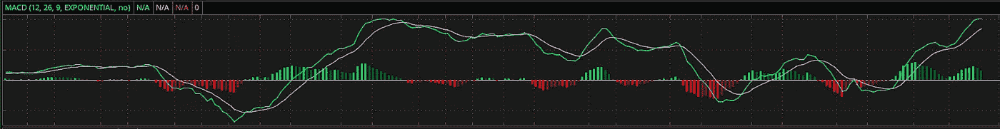
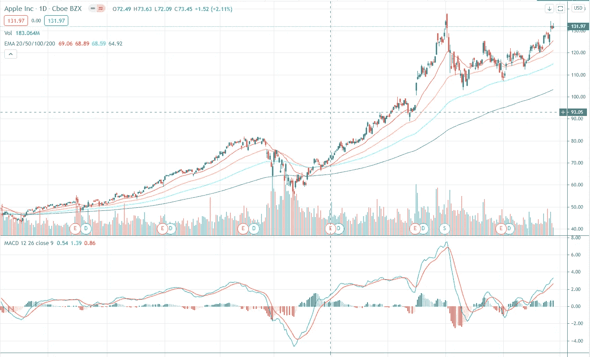

# 了解 MACD

> 原文：<https://medium.com/analytics-vidhya/understanding-macd-2ef1ff78eda3?source=collection_archive---------14----------------------->

因为没有办法准确预测未来，所以不应该有一个单一的技术指标试图预测未来而不做出两个可能的假设之一——动量或反向。另一方面，如果我们不将所有这些技术指标视为可能的“预测指标”,而是将其视为当前状况的“衡量标准”,我们实际上会获得更好的信息，因为我们不必遵循这些指标中隐含的假设。

# MACD 是如何计算的？

这是 MACD 的一个例子:

上面写着“MACD(12，26，9，指数，不)”。我们先了解这些参数，再了解蓝黄线。

> 12:用于计算快速移动平均线(SimpleMA)的周期数。
> 
> 26:用于计算慢速移动平均线(SimpleMA)的周期数。
> 
> 9:用于计算慢速移动平均线和快速移动平均线之差的移动平均线的周期数。
> 
> 指数:计算慢速移动平均线和快速移动平均线之差的指数移动平均线。
> 
> 不:我们忽略它。

蓝线是慢速移动平均线和快速移动平均线的区别。黄线是这种差异的 9 期指数移动平均线。MACD 只是表示蓝线如何围绕黄线摆动。这些条标出了蓝线和黄线的区别。

你可能已经知道了。当蓝线在黄线之上时，意味着快速均线和慢速均线之间的差异相对于指数均线来说很大，反之亦然。

# MACD 衡量趋势的强度

因此，构建就是衡量快速均线和慢速均线的差异，以及这种差异与指数均线的差异。这是衡量当前趋势有多强。蓝线高，与股价上涨很多时的黄线不同。再说一遍，这是当代的。我并不是说股价会大幅上涨。

当蓝线在黄线下方交叉时，股价不一定反转。当增长放缓时，蓝线会在黄线下方交叉。

# 裁决

通过构建，MACD 衡量趋势的强度，而不是趋势的变化。一个趋势可以变弱，然后再变强。趋势没有必要变弱然后逆转。

我实际上不相信任何一个技术指标，不管它们多么花哨，因为假定的模型，能够提供对未来股价或股票回报的一致的长期预测能力。然而，这些措施本身将提供关于当前市场状况的有效信息。如果你能把这些信息输入到你自己的模型中，就有可能对未来的股票价格做出推断。