# 理解机器学习算法—逻辑回归

> 原文：<https://medium.com/analytics-vidhya/understanding-machine-learning-algorithms-logistic-regression-362fa68e5284?source=collection_archive---------18----------------------->

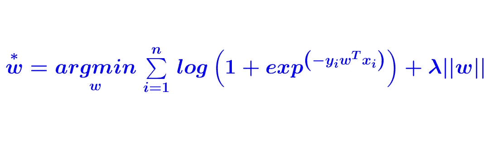

逻辑回归是一种分类算法。不要被它的名字弄糊涂了。逻辑回归有多种解释

1.  **概率解释**
2.  **几何解释**
3.  **损失函数解释**

# 你会学到什么？

在这个博客中，我们将重点放在几何解释，我们从第一原理推导逻辑回归

1.  **几何直觉**
2.  **理解逻辑回归背后的数学原理**
3.  **时间和空间复杂度**
4.  **调整、过拟合和欠拟合**
5.  **当我们有异常值时它是如何工作的**
6.  **特征重要性、可解释性和多重共线性**

## 1.几何直觉

**如果我们的数据线性可分或几乎线性可分，那么我们可以应用逻辑回归，否则我们不能应用逻辑回归**

作为数据集的一个例子，我在这里举了一些评论(产品评论)，我们都知道有正面评论和负面评论，它们都是混淆的。在 2D，如果有任何一条线将它们分成负面或正面评论，我们称之为 3D 线和面。

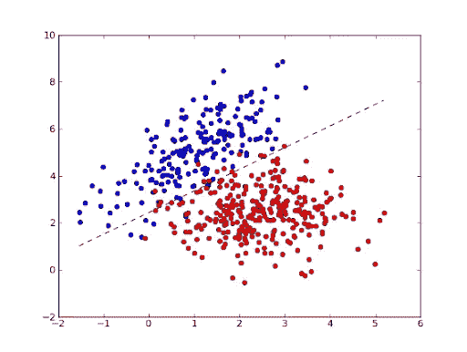

正如我们所见，上述数据可以线性分离(除了对我们来说没问题的少数数据点，我们都知道 2D 的线是 ***y = mx+c*** (其中 *c 是截距，m 是斜率*)。在逻辑回归中，分隔正点或负点的线称为**决策边界**

**3D 中的直线只不过是超平面，其中 b 是截距项，w 垂直于平面**

> **如果平面(pi)通过原点 b=0** ，那么我们就简单了

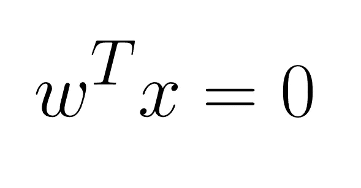

> **任务:**逻辑回归中的任务是找到已经给定的 **w** 和**b****x**(x 是正或负的数据点)找到对应于平面的 **w** & **b** 使得该平面将正的点与负的点分开

## **2。理解逻辑回归背后的数学原理**

现在，我们了解了逻辑回归中的任务，我们必须为每个数据点找到 **w 和 b** 来分隔正负数据点

> 我们将+1 视为正数据点，将-1 视为负数据点，并且我们正在计算每个数据点离平面的距离(d)

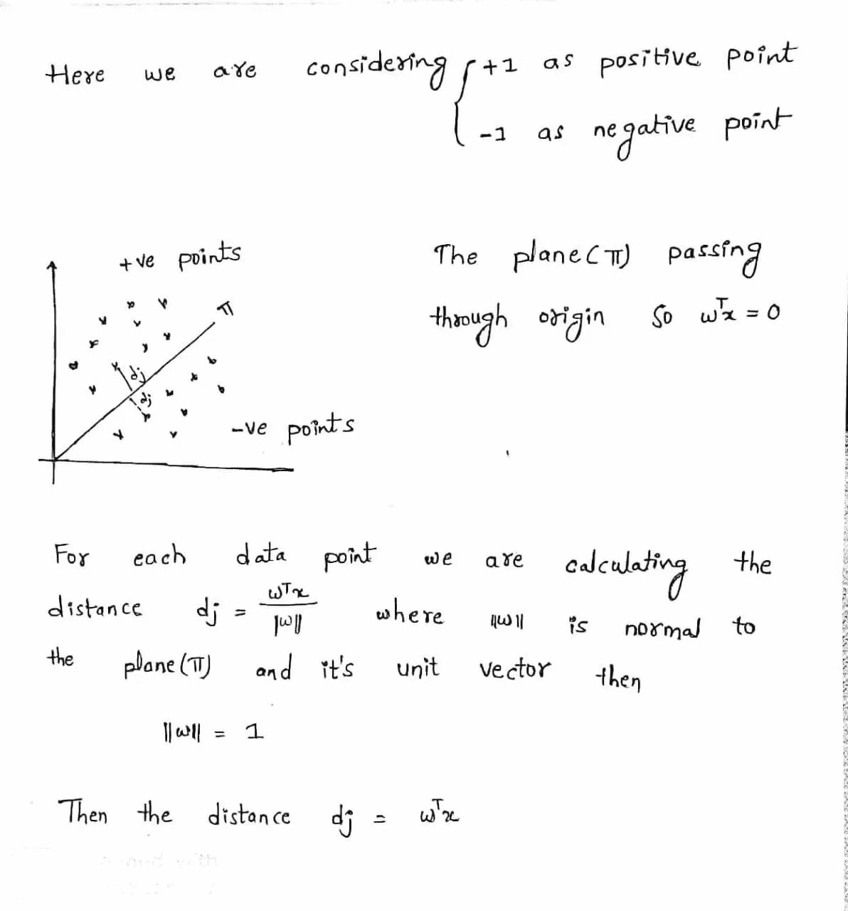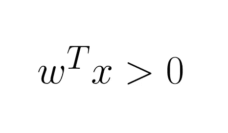

> **如果 W 转置 x 大于零，那么它是一个正点 y=1**

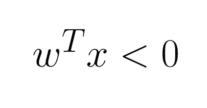

> 如果 W 转置 x 小于零，那么它是一个负点 y=-1
> 
> 请注意，平面经过原点，这就是为什么我们没有在这里加 b

## 问:我们如何知道数据点被正确分类？

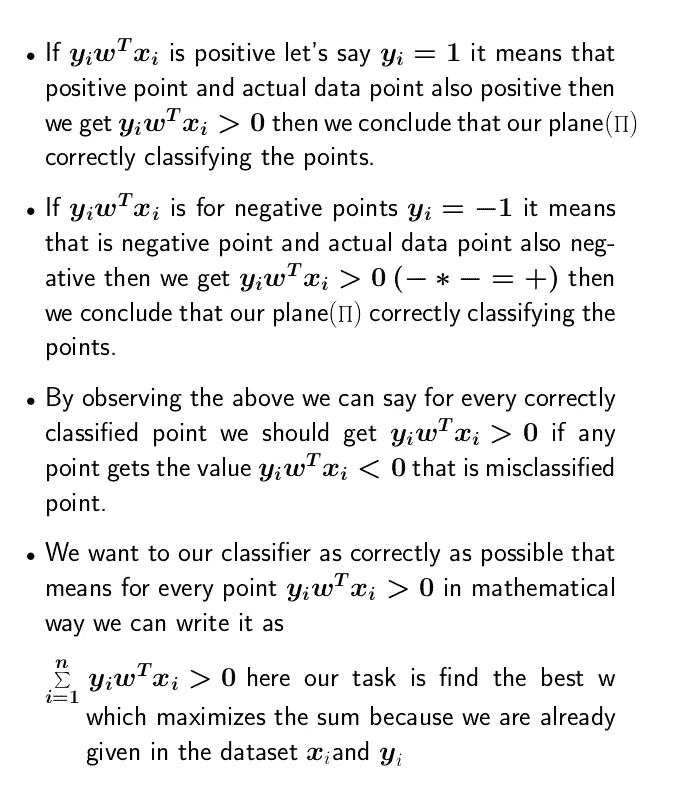

## 问:但是失败在哪里？

当我们的数据集中有异常值时，我们在这里计算距离。如果我们计算的距离是异常值和错误分类的数据点，那么我们的整个平面都会受到影响。请看下面的例子

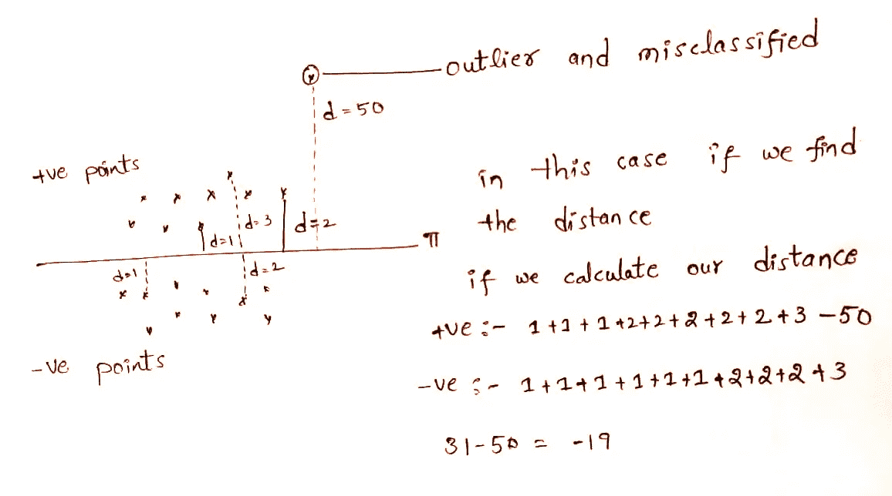

这里一个离群点影响整个平面本身，它改变了超平面或模型。

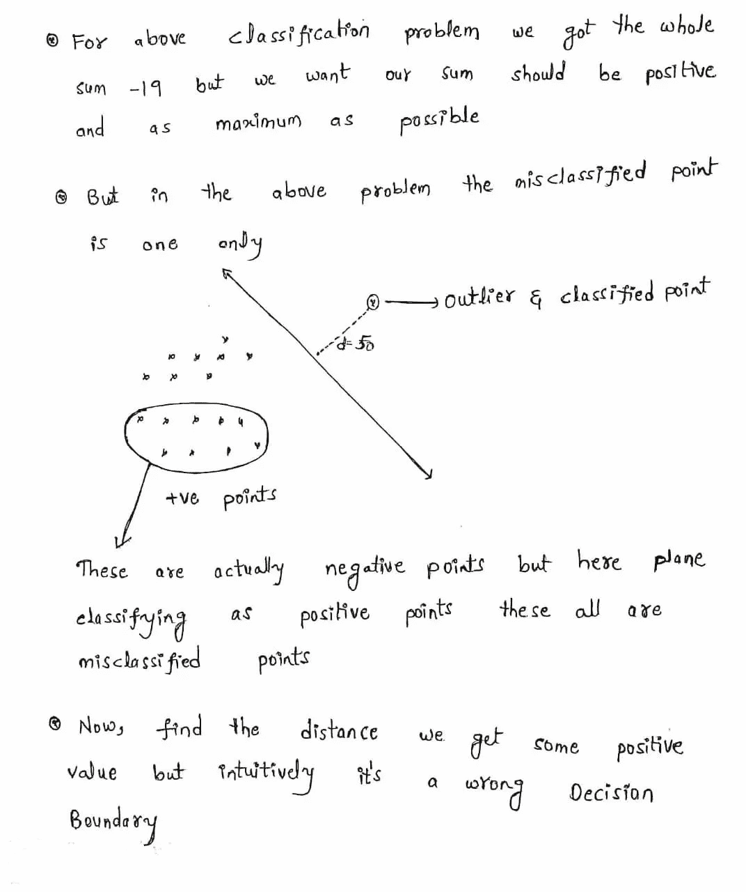

我们要摆脱谁呢？每个数据集或每个现实世界的问题中总会有一些异常值，我们必须以某种方式修改这个公式，它也适用于异常值

> **Sigmoid 函数:-**Sigmoid 函数的思想是，如果距离很小，不使用相同的距离，而是使用相同的距离，如果距离很大，则将距离变小并使用它。

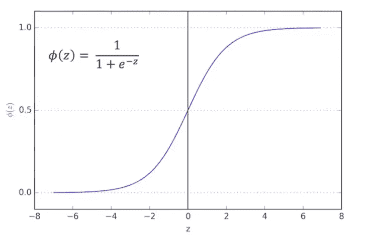

**1。最小值为 0**

**2。x 最大值的 Sigmoid 为 1**

**3。当距离为零时，sigmoid 函数值为 0.5**

**我们如何让距离变小？**
这里我们对每个点使用 Sigmoid 函数，它使上图中的每个数据点都有一些小值，这些数据点称为 z，但这里我认为是 x

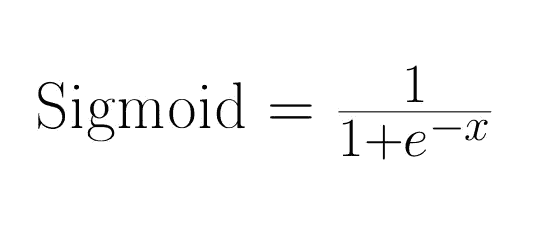

**其中-x 是数据点，对于每个数据点，我们将应用 Sigmoid 函数**

**问:为什么只使用 Sigmoid 函数，不使用其他函数？**

这种性质的函数有很多，但我们使用 Sigmoid 函数是因为

1.  **它有一个概率解释**
2.  **很容易可微**

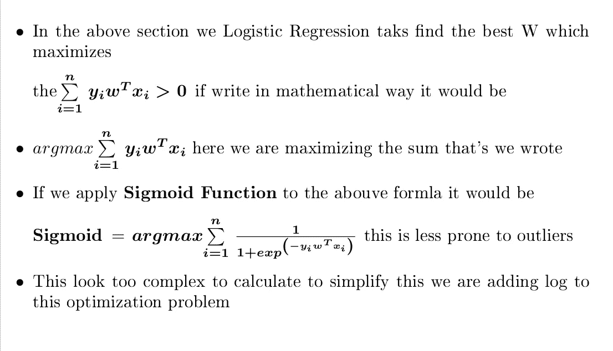

现在，我们正在计算由 Sigmoid 函数转换的点的距离，Sigmoid 函数的整体思想是去除异常值。

为了简化，我们采用 **Log** ，因为它是一个单调函数。单调函数以直观的方式如果 x 增加 g(x)也增加

**问:为什么我们应该只使用日志功能，而不使用其他功能？**

通过使用 log()，我们将使用几何方法获得的目标函数转换为与使用概率和损失最小化方法获得的逻辑回归相同的格式

**log()用于使目标函数凸起，以便于优化**

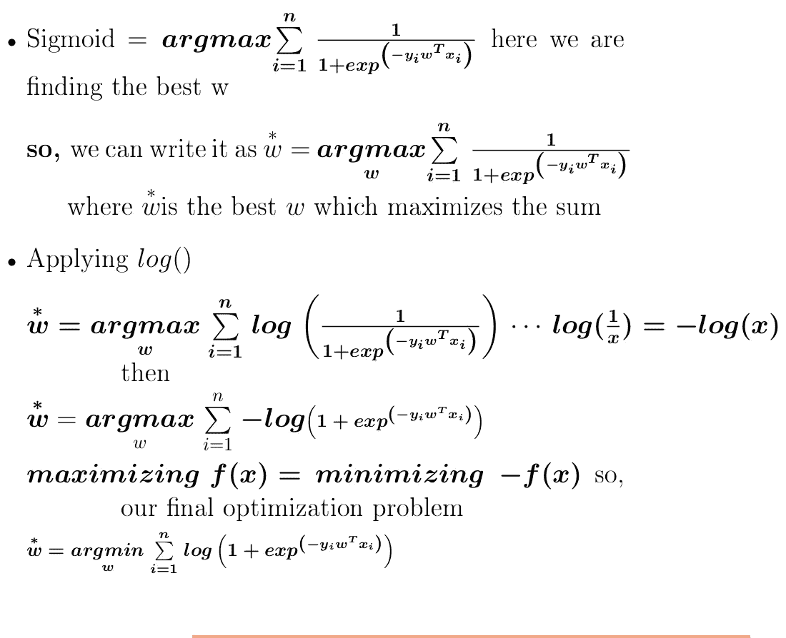

**这是我们最后的优化问题**

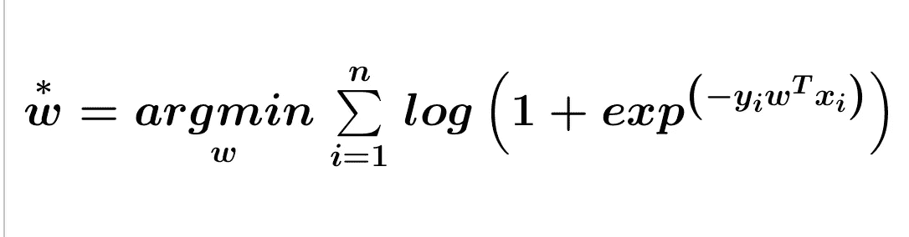

## 3.时间和空间复杂性

当我们在生产中使用机器学习项目时，训练、运行时间和时间复杂性很重要

> **训练逻辑回归:-** 训练逻辑回归无非是解决优化问题，确切地说是找到最佳的 W。它大约是 O(nd ),其中 n 是 d-train 中的点数，d 是数据的维数
> 
> **运行时间:-** 运行时间复杂性更重要，因为在现实世界中，当任何新数据点出现时，我们必须对其进行分类，无论它是正的还是负的。从逻辑回归的训练中，我们仅获得向量 W=[w1，w2，w3，w4…..wn]它是 d 维的，我们把新的数据点乘以 W

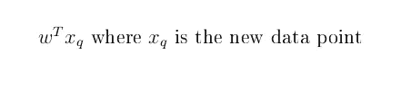

**时间复杂度也是 O(d)我们必须用维向量 W 来计算**

> **当维度很小时？**
> 
> 当我们的维数很小时，逻辑回归工作得相当好，但它太快了。当维数很小时，它是低延迟应用程序的最佳算法
> 
> **维度大的时候？**
> 
> 当我们的维数是大的逻辑回归时，它必须乘以更多的值，这需要更多的时间，但是，如果我们使用 L1 正则化，那么大多数无用的特征将为零，因为它产生了稀疏性，所以，我们可以使用 L1 正则化当维数是大的时，我们必须找到正确的λ

## 4.正则化、过拟合和欠拟合

**L2 正则化:-**

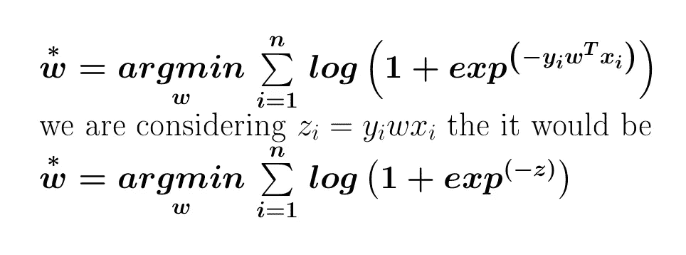

**现在，让我们看看 exp(-z)图将如何**

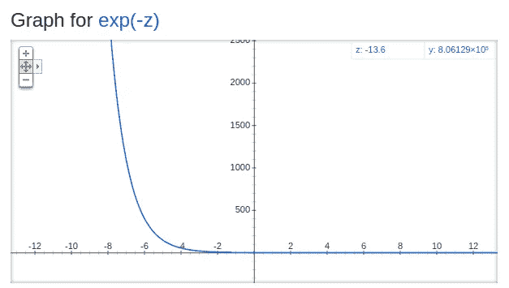

这里我们的目标是找到 exp(-z)的最小值，当最小值出现时，当我们的向量 z 趋于无穷大时，我们将得到最小值

1.  **给定任何新的查询点，Zi 为正，则它将被正确分类**
2.  **当 Zi 趋于无穷大时，我们得到最小值，这意味着零**

> **对于每个数据点，我们应用上面那些导致过度拟合且趋向于-无穷大或+无穷大的数据点，因此，为了避免这个问题，我们添加了一个称为正则化项的项**

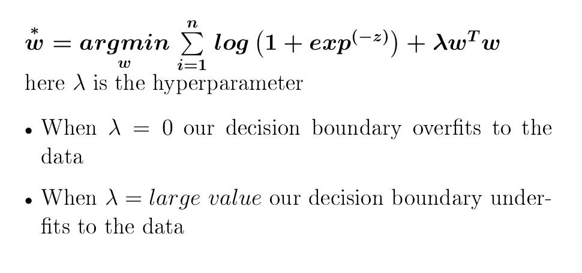

**L1 正则化:-**

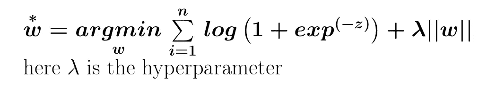

L1 正则化在向量 W 中产生稀疏性，这意味着大多数不太重要的特征将为零

## 5.当我们有异常值时它是如何工作的

在逻辑回归中，当我们的数据中有异常值时，Sigmoid 函数会处理，所以我们可以说它不容易出现异常值。

## 6.**特征重要性、可解释性和多重共线性**

**特征重要性:-** 选择正确的特征更为重要，因为一旦我们找到正确的特征，模型构建只需将所有正确的特征输入模型并找到超参数。

> **通过查看权重向量(W ),我们可以知道哪些特征比其他特征更重要。我们如何发现让我们看看？**
> 
> 假设权重向量 **Wj** 在权重向量**中，一些值是正的并且是大的值，那么得到正的概率会更大**，因为我们将权重向量值与对应的数据点相乘
> 
> 假设我们的权重向量 **Wj** 在权重向量**中，有些值是负值，如果值很大，那么得到负值的概率会更大**，因为我们将权重向量值与对应的数据点相乘

**无论是正还是负，无论权重向量值多大，这都是一个更重要的特征，这就是为什么我们采用绝对值权重向量**

**| | Wj | | = Fj(特征)对应的权重绝对值**

> **如果我们的特征是独立的，那么只有我们可以使用权重向量的绝对值，否则我们不能使用**
> 
> **模型可解释性:-** 通过查看值较大的权重向量值，我们可以说这就是相应数据点为负或为正的原因。我们可以给出为什么它是负的或正的推理，并且模型的可解释性在医学应用中更重要。

**多重共线性:-** 直觉上，共线性是指如果我们有一个要素，那么我们通过将第一个要素乘以某个常数值并添加某个值来获得第二个要素，然后我们获得第二个要素，这就是共线性。如果我们的所有要素都是这样，那么它会导致多重共线性

**多重共线性问题:-**

1.当数据集中存在多重共线性时，我们的权重向量会任意变化，因为要素不再相互独立，因此我们不能使用权重向量作为要素重要性向量

> **要确定我们的特征是否多重共线，有一种方法可以检查扰动技术**

*感谢阅读！*