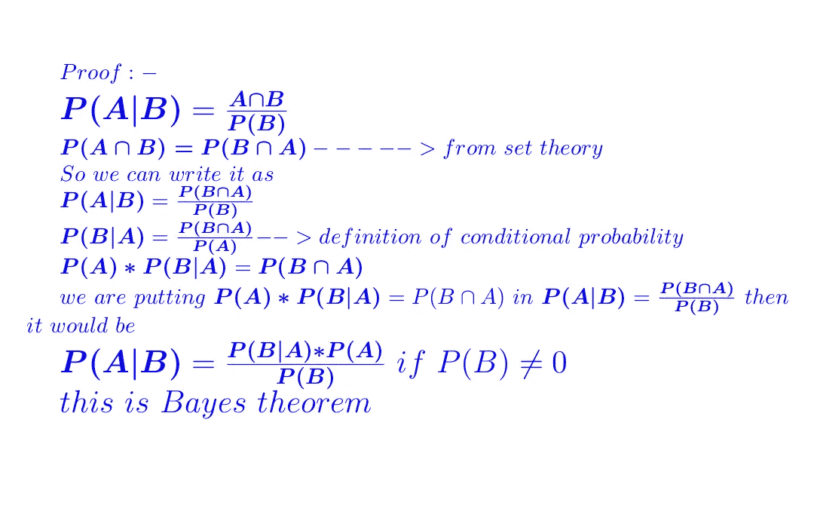
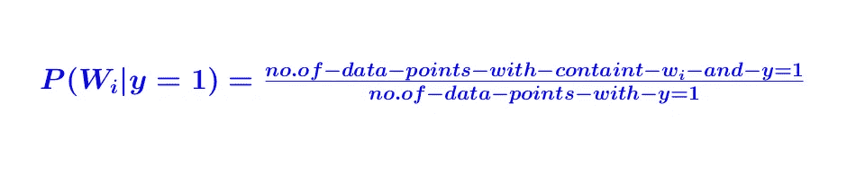

# 理解机器学习算法—朴素贝叶斯

> 原文：<https://medium.com/analytics-vidhya/understanding-machine-learning-algorithms-naive-bayes-808ed649c1ec?source=collection_archive---------13----------------------->

朴素贝叶斯可以在这个博客中用于分类，我们从基本原理中推导出朴素贝叶斯。

# 你会学到什么？

1.  **条件概率**
2.  **贝叶斯定理**
3.  **朴素贝叶斯如何工作**
4.  **对数概率和数值稳定性**
5.  **过拟合和欠拟合**
6.  **当我们有异常值和缺失值时它是如何工作的**
7.  **使用案例和限制**

# **1。条件概率**

朴素贝叶斯工作在概率的基础上，它工作在贝叶斯定理上，但是贝叶斯定理是从条件概率中推导出来的。

**直觉:-** 事件 B 发生了，或者在有或没有事件 A 的情况下发生了。那么我们正在寻找同样发生在 B 中的事件 A

现在让我们来理解一下 A 出现的频率公式，假设 B 已经出现了。我们需要找到 A 的出现次数，然后除以可能性的总数。当我们知道 B 发生了，A 发生了，确切地说是 A 和 B 都发生了，因为我们假设 B 发生了，所以总的可能性是有限的。

# **2。贝叶斯定理**

我们从条件概率中推导出贝叶斯定理

现在，理解这个公式，在这个公式中，每个术语都有特定的名称，让我们看看

> **P(A|B)是后验**
> 
> P(B|A)是一个可能性
> 
> **P(B)是一个证据**
> 
> **P(A)是先验的**

请观看视频

# **3。朴素贝叶斯如何工作**

朴素贝叶斯用在文本数据中，就像邮件是否是垃圾邮件一样，并且评论评论是积极的还是消极的，我们将看到为什么？我们以示例数据作为文本数据来解释算法

这里我们以一个项目为例来解释我们认为 **y=1 为正，y=0 为负的产品评论。**毕竟，对于每个评论的文本的预处理**我们必须计算它的先验和可能性**

我们计算给定任何评论 y=1 的概率

给定任何评论，我们计算 y=0 的概率

先验概率完成后，我们就剩下可能性了。让我们来计算可能性概率

**在训练数据的最后，我们得到先验和可能性**

但是一切都很好，有一个问题是，对于训练数据，我们有每个单词的概率，比如

p(Y = 1)；P(Y=0)

p(W1 | Y = 1)；P(W1|Y=0)等等

> **如果我们在测试的时候得到一个词，这个词在训练数据中不存在，我们在训练数据中没有这个词的概率，那么问题就来了**

在这里，新单词(在我们的训练数据中不存在)的概率将为零，因此整个概率的乘积将为零，这将是一个巨大的问题。

**拉普拉斯或加法平滑:-**

> **最初，当我们有一个在训练数据中不存在的单词时，概率将是 0/n，现在我们添加一些值α和αK**

**α可以是任何值，通常我们取α= 1**

> **当 alpha 较大时，给定单词 Y = 1 的概率和给定单词 Y=0 的概率是等概率的，这意味着随着 alpha 的增加，我们的似然概率将向均匀分布移动。**

> **当 alpha 较小时，我们将摆脱与零相乘的问题。**

# 4.对数概率和数值稳定性:-

> **当我们有高维数据时，所有这些概率值都位于 0 和 1 之间，我们将小数字彼此相乘，这导致了数值稳定性**

为了避免这个问题，我们使用每个概率的对数

# 5.过度拟合和欠拟合

朴素贝叶斯中有一个超参数是α

> **当 alpha 过小时，会导致过度拟合。**
> 
> **当α太大时会导致欠拟合，因为可能性概率变成均匀分布，我们可以说新的数据点属于哪一类。**

# **6。当我们有异常值和缺失值时它是如何工作的**

**异常值:-**

1.  在训练时，如果一个单词(Wj)出现的次数少于 10 次，那么我们就忽略它们
2.  测试时间时，拉普拉斯平滑会处理异常值

**缺失值:-**

如果我们有文本数据，没有丢失值的情况，如果我们有分类特征，我们假设还有一个数字特征类别，我们使用 morel 插补

7。使用案例和限制

1.  Naive Baye 的基本假设是特性的条件独立性，那么它工作得很好。
2.  它广泛应用于文本分类和类别特征
3.  它不用于实值特征
4.  朴素贝叶斯模型是可解释的
5.  运行时间复杂性和训练时间复杂性较低，我们可以使用低延迟应用程序
6.  它很容易过拟合，所以我们应该用拉普拉斯平滑适当地训练

感谢阅读！