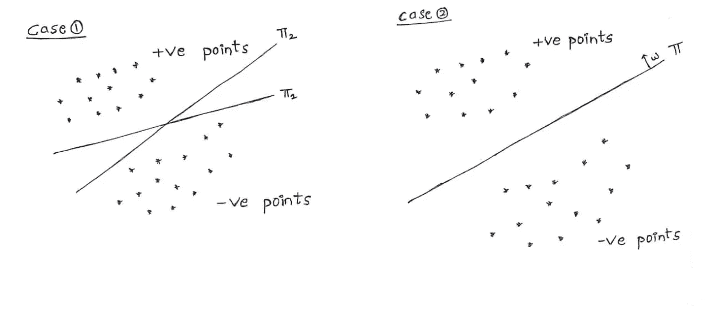
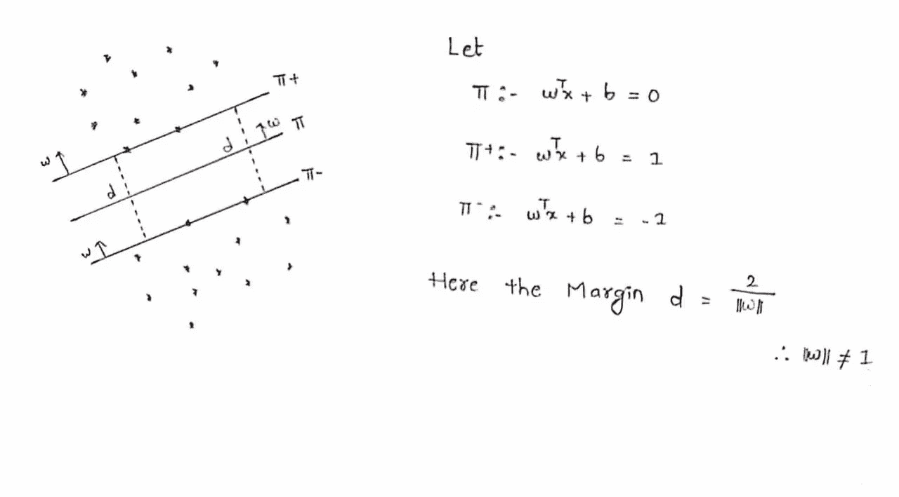
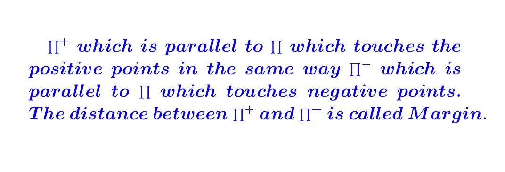
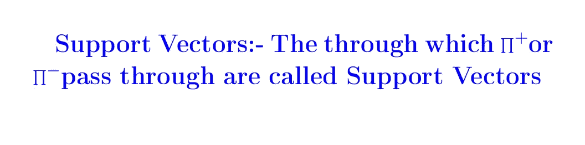
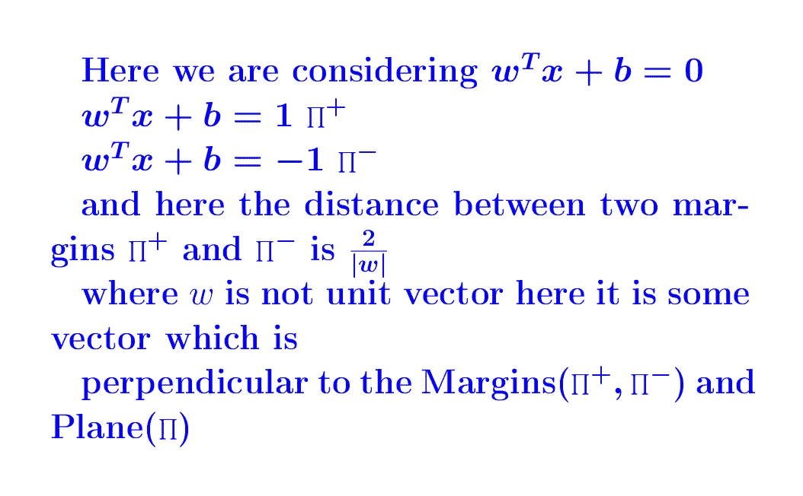
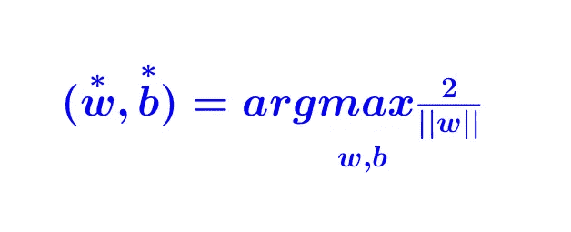
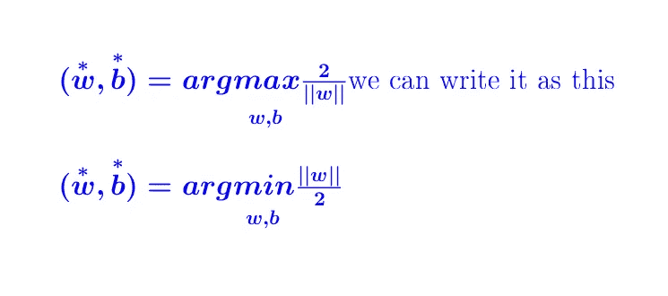
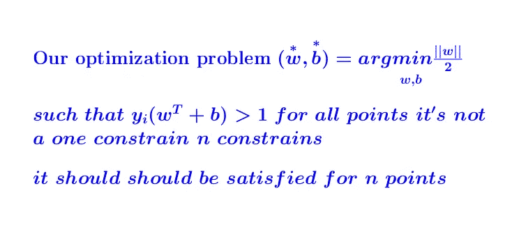
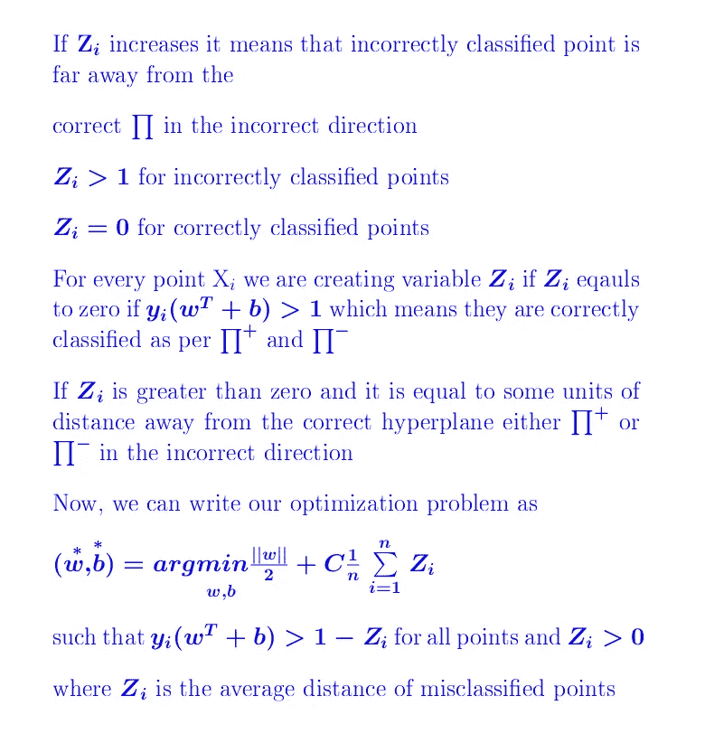
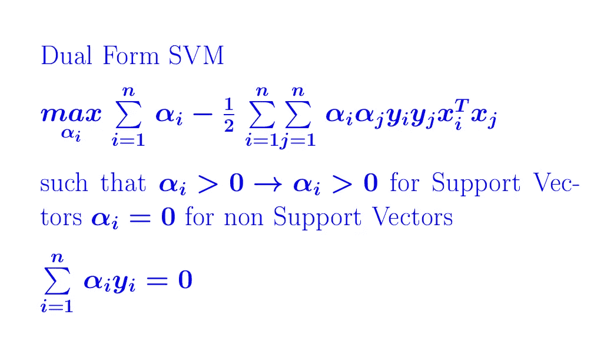

# 理解机器学习算法—支持向量机(SVM)

> 原文：<https://medium.com/analytics-vidhya/understanding-machine-learning-algorithms-support-vector-machine-svm-7790a8bce637?source=collection_archive---------12----------------------->

SVM(支持向量机)可以用于回归和分类。在这个博客中，我们从第一原理推导出 SVM。

# 你会学到什么？

1.  **几何直觉**
2.  **SVM 如何工作和数学**
3.  **内核绝招**
4.  **当我们有异常值时它是如何工作的**
5.  **SVM 的使用案例**

## **1。几何直觉**

**案例 1:** 在案例 1 中，有两个平面将这些点分开，我们对这些平面没有问题，因为这些平面无论如何都在对点进行分类。

**情况-2:** 在情况-2 中，也有一个平面直观地分隔这些点，与情况-1 分类器相比，它是一个更好的分类器，因为它以这样的方式分类，当任何新的数据点或看不见的数据点出现时，它很容易将其分类。

> **SVM 的想法:-**
> 
> **该平面试图尽可能广泛地对正负点进行分类，它被称为边缘最大化超平面。在上面的例-2 中，正负分尽可能广泛地分类。**

## **2。SVM 如何工作和数学**

> **任务:-任务是找到 W 和 b，使得最大化边距距离，我们可以用数学方法写出来**

对于通过正点的点的支持向量，该点是正的，并且支持向量是正的，所以它是 wT+b=1。对于负点，该点是负的，并且支持向量是负的，所以 wT+b=1。

> **因此，我们可以得出，对于距离支持向量正侧或负侧的每个远点，它将大于一个 wT+b > 1，对于正确分类的点，它应该满足这个条件，如果它小于 wT+b < 1，这意味着该点被错误分类，我们可以写为数学上…..**

> **这里有一个问题，我们在正区域有一些负的点，或者在负区域有一些正的点，它不满足约束，它不会找到 w 和 b**

# 我们如何修改它的原始 SVM？

我们正在为错误分类的点创建一个变量 **Zi** ，如果任何点在负区域或正区域中被错误分类，那么 **Zi** 将为正，否则对于正确分类的点将为 0。

这里，C 是超参数，随着 C 的增加，我们越来越重视不犯错误，所以它会过度拟合训练数据，而随着 C 的减少，我们越来越不重视犯错误，所以我们的模型对训练数据的拟合不足。这种形式的 SVM 被称为原始 SVM

# SVM 的双重形式

在使用数学的最优化理论中，我们可以证明 SVM 的这个原始形式等于 SVM 的对偶形式，而不是求解 SVM 的原始形式，我们求解 SVM 的对偶形式是因为。在 SVM **的对偶形式中，Xi 的**以**的形式出现，**转置**的 Xj。**

## 3.内核技巧

> **在 SVM 的对偶公式中我们可以使用任何相似函数 sim(Xi，Xj)而不是使用 Xi 转置 Xj。这里，一类相似性函数是核函数，因此这通常由 K(Xi，Xj)** 代替

SVM 最重要的思想是核技巧，它非常重要，因为在超平面的软 SVM 中，除了我们的边际最大化思想之外，它非常类似于逻辑回归，所以如果我们不应用核技巧，我们就称它为线性 SVM。

因此，使 SVM 如此强大的线性 SVM 的内核技巧在某些情况下会失败，如果我们的数据不是线性分离的，但如果我们应用内核 SVM，它工作得相当好。

# 内核 Trick 是做什么的？

使用核技巧的核 SVM 可以解决非线性可分数据。Kernel-SVM 从字面上看，它将数据转换到不同的空间，并在该空间中找到超平面。有许多可用的核，如多项式，RBF 等…

## 4.**当我们有异常值时它是如何工作的**

离群值对我们的模型影响很小，因为支持向量对我们的模型很重要，如果我们的数据中有离群值，影响是非常小的。

## 5.**SVM 的使用案例**

在 SVM 的例子中，特性转换被内核所取代，我们必须设计一个运行良好的内核。对于给定的问题，找到正确的核有时并不容易，但我们有默认的核 RBF，但如果我们为给定的问题找到合适的核，SVM 工作得非常好。

在线性 SVM 的情况下，我们的决策可以是超平面，而核 SVM 可以具有非线性决策表面。使用核技巧，我们也可以解决非线性可分离数据。如果给我们相似性或距离函数，它工作得很好。