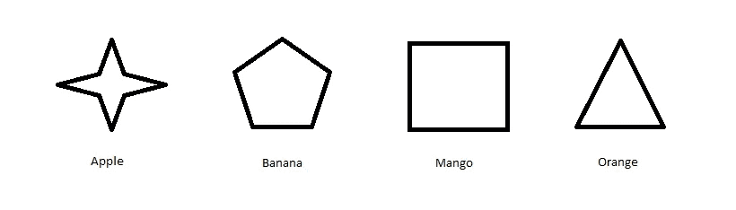

# 在初级水平理解机器学习

> 原文：<https://medium.com/analytics-vidhya/understanding-machine-learning-at-a-beginner-level-24b5080a6905?source=collection_archive---------20----------------------->

# **简介:**

这篇文章是写给想了解什么是机器学习的初学者的。我将借助一个例子来讨论这个问题。所以让我们从什么是机器学习的概念开始。

# **什么是机器学习:**

简而言之，机器学习是机器(比如电脑或笔记本电脑)在提供给它们的算法和数据的帮助下训练自己的过程。然后，学习可以用于预测目的。例如资产价格的预测、股票价格的预测等。

# 机器学习的需求:

机器学习的概念并不新鲜，它可以追溯到 1959 年。但是机器学习的实际应用是在 2000 年以后才开始的。这是因为计算能力的限制和数据量的限制。计算机硬件的出色发展克服了这一限制，带来了更强的计算能力，而且今天产生的数据量是巨大的。数据可以以任何形式呈现，如图像、视频、表格数据、来自电子设备的传感器的数据(可称为传感器数据)、音频信号(如语音)等。如果我们尝试用数字来表示，我们会发现每天都会产生超过 2.5 万亿字节的数据。据估计，到 2020 年，地球上的每个人每秒将创建 1.7 MB 的数据。因此，为了研究这些数据，我们可以利用机器学习算法。

# **通过一个例子理解机器学习:**

看看下面的图片，它包含了一些我用一些水果命名的形状。

现在，我要你记住这些形状的名字。这是另一张图片，其中有一些形状，但它们没有任何名称。现在我要你说出这些图像中的形状。

你一定给上面的图片起了名字，如下图所示。

我肯定你把所有的名字都记对了。如果我们总结一下这个任务，那么你最初会得到一些信息，这些信息是一些形状和它们的名称，可以称为数据。现在你的大脑研究或者更恰当地说是从这些数据中学习。当你被要求识别其他形状时，根据你的学习，你将它们识别为四种形状中的一种(苹果、香蕉、橘子和芒果)。尽管它们在大小和颜色上不完全相同，但它们是相似的，而且是你命名的。如果你没有得到正确的答案，那么你会再次从正确的答案中学习，然后下一次你会更准确。这就是机器学习中发生的事情。想象一下，如果这个任务是由一台机器来完成的，那么我们可以说这台机器已经学习并应用了它的知识来命名未命名的形状。简单来说，这就是机器学习。

机器学习在现实世界中的应用例子有自动驾驶汽车、交通警报、产品推荐等等。我相信机器学习将成为未来，它将应用于产生数据的每个领域。