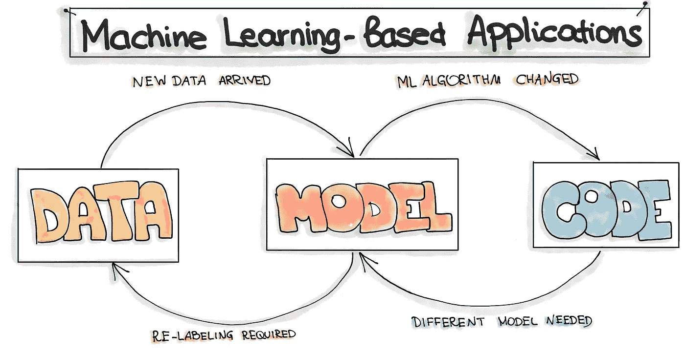
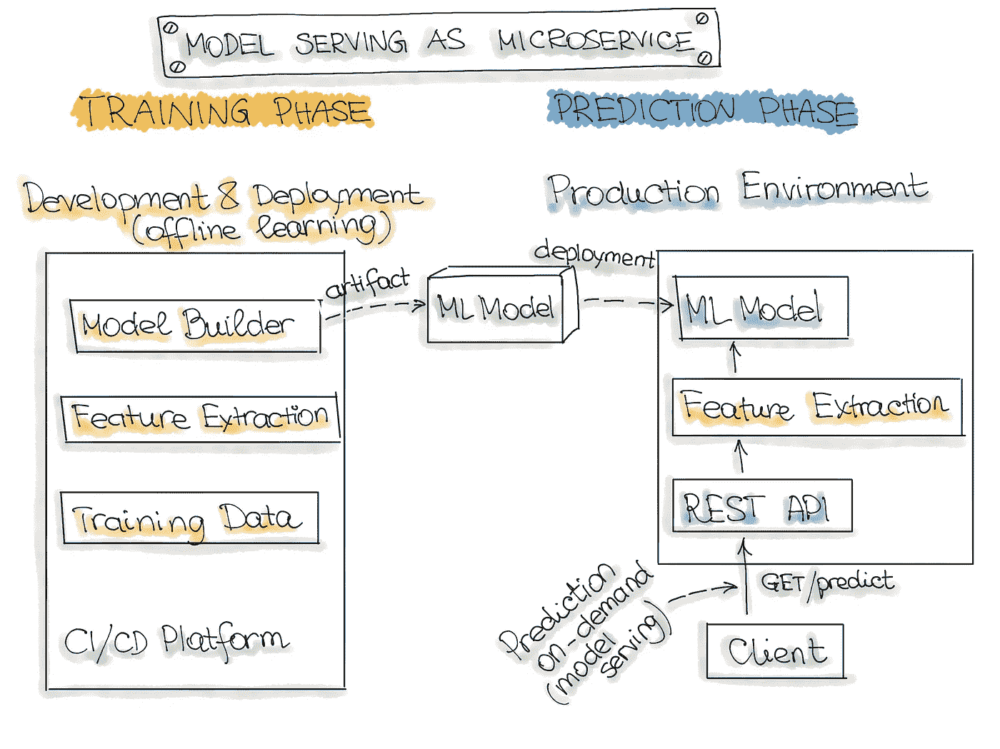
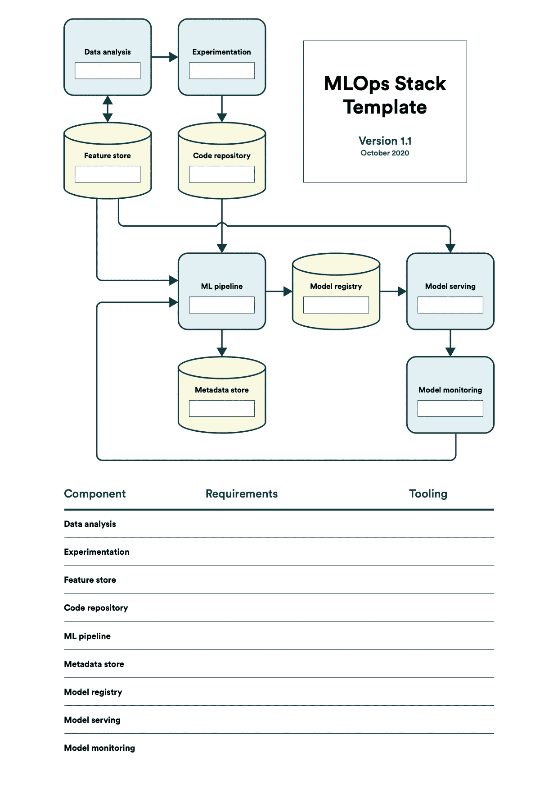

# 了解 MLOps

> 原文：<https://medium.com/analytics-vidhya/understanding-mlops-5f0a425c68b0?source=collection_archive---------18----------------------->

## 随着 ML 从研究走向商业应用的成熟，我们也需要提高其运作过程的效率。

一家初创公司最近聘请 Harry 担任数据科学家。他的工作是使用他获得的关于机器学习(ML)的知识来建立一个预测模型，以确定在特定时期内财产是否可能有保险索赔。Harry 构建了一个很好的模型，所有的性能指标看起来都很棒，演示让大家大吃一惊，高管们问 Harry 多久能开发出一个生产模型。

你认为应该很快。毕竟，哈利已经解决了所有的高级 dy/dx 问题，所以剩下的只是例行的 IT 工作。能有多难？

很难，事实证明。

根据 algorithm ia[“2020 年企业机器学习状况”](https://info.algorithmia.com/hubfs/2019/Whitepapers/The-State-of-Enterprise-ML-2020/Algorithmia_2020_State_of_Enterprise_ML.pdf?utm_campaign=The%20Batch&utm_source=hs_email&utm_medium=email&utm_content=80984419&_hsenc=p2ANqtz--sz-e2gfqUeDvVSmjsXfvwOnLHB2ZkSdQsO1IRRAdnBIb0emf-JTh8NnwFxB-FeZberIw7_rI9ERTy8zFW8jvoTzjOfA&_hsmi=80984419)的一份报告，许多公司还没有想出如何实现他们的 ML/AI 目标。因为弥合 ML 模型构建和实际部署之间的差距仍然是一项具有挑战性的任务。在 Jupyter 笔记本模型中构建 ML 模型和将 ML 模型部署到产生商业价值的生产系统中是有根本区别的。虽然人工智能的预算在增加，但是只有 22%使用机器学习的公司[成功地将人工智能模型部署到生产中。](https://designingforanalytics.com/resources/failure-rates-for-analytics-bi-iot-and-big-data-projects-85-yikes/)

是什么让它如此艰难？我们需要做些什么来改善这种情况？

> **“创建可靠的生产级机器学习系统带来了许多小玩具示例甚至大型离线研究实验中没有的问题。”—**[**ML 测试分数:ML 生产准备就绪和技术债务削减的一项指标**](https://research.google/pubs/pub46555/)

# 挑战

让我们从讨论数据科学家在操作他们的模型并使其在生产中可用时面临的挑战开始。

1.  跟踪我们训练过的意义模型是很困难的。
2.  跟踪代码的不同版本，他们评估的指标中不同超参数的值。
3.  记录下哪些想法被尝试过，哪些可行，哪些不可行。(方法)
4.  重现它，并在完整的生产数据上运行它。再现性是一个主要问题，因为有科学家希望能够通过更全面的参数扫描重新运行最佳模型。
5.  此外，对于生产应用程序，随着新数据的到来，模型需要定期更新，因此可跟踪性变得至关重要。

# **弥补部署缺口**

让我们以操作人员的方式来考虑一个机器学习项目。在一排中，你从时间、资源和质量方面考虑整个系统。如何在保持输出质量的同时，减少分析问题、创建模型和部署解决方案之间的时间？在软件工程中，这种方法称为 DevOps。我们可以借用机器学习中的术语，称之为 MLOps。

[**DevOps**](https://en.wikipedia.org/wiki/DevOps) 让软件在几分钟内交付生产并保持可靠运行成为可能。DevOps 依靠工具、自动化和工作流来抽象掉意外的复杂性，让开发人员专注于需要解决的实际问题。这种方法如此成功，以至于许多公司已经驾轻就熟，那么我们为什么不能简单地继续为 ML 做同样的事情呢？

原因是基于机器学习的应用程序的开发与传统软件的开发有着本质的不同。完整的开发管道包括三个层次的变更:**数据**、 **ML 模型**、**代码**。这意味着在基于机器学习的系统中，构建的触发器可能是代码更改、数据更改或模型更改的组合。这也就是俗称的 [*“改变什么就改变什么”*原理](https://papers.nips.cc/paper/5656-hidden-technical-debt-in-machine-learning-systems.pdf)。

一旦 ML 模型投入生产，有三个常见问题会影响它们的价值。

首先是 ***数据质量*** :由于 ML 模型是建立在数据之上的，所以对传入数据的语义、数量和完整性都很敏感。

第二个是 ***模型衰退***:ML 模型在生产中的性能随着时间退化，因为在模型训练期间没有看到真实数据的变化。

第三个是 ***位置*** :当将 ML 模型转移到新的业务客户时，这些已经针对不同的用户统计数据进行了预训练的模型可能无法根据质量指标正确工作。

由于 ML/AI 正在扩展到新的应用领域并塑造新的行业，构建成功的 ML 项目仍然是一项具有挑战性的任务。如图所示，需要围绕设计、构建和将 ML 模型部署到生产中来建立有效的实践和过程。

# 数据和 ML 管道

数据工程最重要的概念是数据管道。数据管道是在 ML 模型消费数据之前应用于数据的一系列转换。收集好的数据在 ML 模型的性能和质量中起着基本的作用。

数据工程管道包括对可用数据的一系列操作。这些操作的最终目标是为 ML 算法创建训练和测试数据集。大多数 ML 模型需要两个版本的管道:一个用于培训，一个用于服务。

ML 管道是一个纯代码工件，独立于特定的数据实例。这意味着可以在源代码控制中跟踪它的版本，并通过常规的 **CI/CD 管道**自动化它的部署，这是 DevOps 中的核心实践。

*CI/CD 的目标是自动构建、测试和安全部署您的应用程序，这样您就可以在开发新软件时快速迭代。*

## ML 中的 CI/CD

这也称为 CI/CD，代表持续集成/持续交付。

ML 模型可以作为微服务部署。如果你想轻松地创建一个微服务，你应该使用 Docker。您可以将您的应用程序容器化。这意味着您可以确保它在您的本地机器上以完全相同的方式运行。

**持续集成**

构建微服务时，您会创建一个 Docker 映像。这是一个告诉 Docker 如何从你的代码中构建微服务的模板。在这里，您可以运行 CI/CD 范式的 CI(持续集成)部分。

在这里你可以测试你的代码质量，运行单元测试和测量你的模型的预测时间。只有在这些测试成功通过之后，您才能构建并推送 Docker 映像。这可以确保您的微服务正常工作。

**连续部署**

在您创建了您的更改并成功构建和上传了您的 Docker 映像之后，是时候运行您令人敬畏的新 ML 微服务了。您的应用程序在哪里运行并不重要。它可以在云中、本地机器上或在边缘上，部署过程总是相同的。

**运行多个微服务**

在生产中的大多数时候，您有多个容器一起运行，它们也必须相互通信。这就是你需要容器编排器的地方。Kubernetes 是一个很好的工具。几分钟后，你就可以在 Google 云平台或 Azure 上创建一个正在运行的 Kubernetes 集群。

# 数据和模型验证

一个好的数据管道应该从验证输入数据开始。常见的验证包括文件格式和大小、列类型、空值和无效值。这些对于 ML 训练和预测都是必要的，否则你可能会以一个行为不端的模型结束，并挠头寻找原因。因此，建议将您的特性期望存储在模式或 yaml 文件中。虽然传统的软件可以依赖于代码的单元测试和集成测试，但是这里我们尝试添加一组足够的数据测试。

ML 模型更难测试，因为没有模型给出完美的结果。这意味着模型验证测试本质上需要是统计的，而不是断言。为了决定一个模型对于部署来说是否足够好，您需要决定要跟踪的正确度量以及它们的可接受值的阈值，通常是凭经验，并且经常通过与以前的模型或基准进行比较。

除了任何数据管道执行的基本验证之外，ML 管道还应该验证输入的高级统计属性。例如，如果某个要素的平均值或标准偏差在不同的训练数据集之间发生了很大的变化，则可能会影响训练模型和预测。这可能是数据实际变化的反映，也可能是数据处理方式导致的异常，因此检查并排除可能污染模型的系统错误非常重要，必要时可以修复它们

# 监视

在生产中，您希望确保模型性能不会下降。应根据实时和以前未见过的数据监控 ML 模型性能。MLflow 是监控模型性能的一个很好的框架。使用 MLflow，您可以轻松记录关于模型输入(超参数)和性能指标的信息。

特别是，我们对特定于 ML 的信号感兴趣，例如对先前模型性能的预测偏差。这些信号可以用作模型再训练的触发器。

正如我们在传统软件开发中有 CI/CD 一样，MLOps 也有 CT/CM 实践。

*   **持续培训(CT)** 是 ML systems 公司独有的，它会自动重新培训 ML 模型，以便重新部署。
*   **持续监控(CM)** 关注于监控生产数据和模型性能指标，它们与业务指标相关联。

# MLOps 基础设施堆栈

构建 ML 模型是一种迭代的方法。这需要大量的实验。在任何 ML 模型可以被部署到生产之前，它必须经过大量的实验周期，以便确定实现业务目标的正确的 ML 模型。

这个实验阶段增加了任何 ML 项目的额外复杂性，因为它包括三个主要工件:**数据**、**模型**和**代码**。为了管理这种复杂性，我们需要定义良好的结构、过程和适当的软件工具来管理 ML 工件并覆盖机器学习周期。

MLOps 技术堆栈应包括用于以下任务的工具:

*   数据工程，
*   数据、ML 模型和代码的版本控制，
*   持续集成和持续交付管道，
*   自动化部署和实验，
*   模型性能评估，以及
*   生产中的模型监控。

根据需求或限制，组织可以通过组合现有的开源库来实现自己的内部 MLOps 系统。为了构建这样一个系统，我们应该对 MLOps 工具的前景有一个总体的了解。

# 摘要

MLOps 是一个新领域，还没有最佳实践。随着 ML 从研究到商业用例的成熟，我们需要改进操作过程。

也分享你的想法。

如果您有任何问题，可以在这里找到我:

*   推特:@ akinwhande
*   GitHub: [阿金老师](https://github.com/sensei-akin)

# 参考

*   [机器学习的规则:ML 工程的最佳实践](https://developers.google.com/machine-learning/guides/rules-of-ml)
*   [作为工程学科的 m lops](https://towardsdatascience.com/ml-ops-machine-learning-as-an-engineering-discipline-b86ca4874a3f)
*   [什么是 MLOps](/@selfouly/mlops-done-right-47cec1dbfc8d)
*   [机器学习操作](https://ml-ops.org/)
*   [ML 测试分数](https://storage.googleapis.com/pub-tools-public-publication-data/pdf/aad9f93b86b7addfea4c419b9100c6cdd26cacea.pdf)
*   [https://valohai.com/blog/the-mlops-stack/](https://valohai.com/blog/the-mlops-stack/)