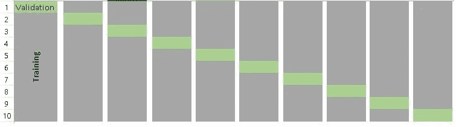

# 通过交叉验证了解模型选择

> 原文：<https://medium.com/analytics-vidhya/understanding-model-selection-through-cross-validation-7638d3c3a139?source=collection_archive---------5----------------------->

交叉验证是机器学习中使用的一种技术，其中每个数据点都用于训练和测试数据集。这有助于我们通过比较不同算法的平均精度来确定更好的算法。

图片提供:[分析 Vidhya](https://www.analyticsvidhya.com/)



如果我们通过编写一些代码来演示如何应用交叉验证，然后选择一个模型来理解这个概念，那就更好了。

我从克里斯·纳伊克的 YouTube [频道](https://www.youtube.com/channel/UCNU_lfiiWBdtULKOw6X0Dig)上了解到下面这个例子。这个例子的工作代码和数据集也上传到我的 [GitHub 库](https://github.com/asheshds/datascience/)中。

那么，让我们开始分析吧。

我们的数据集包含以下特征:

```
UserID : Unique Identifier for every row
Gender: Gender of a particular User
Age: Age of the corresponding user
Estimated Salary: Estimated Salary of the corresponding
Purchased: 0/1 flag denoting that it was a sale or not
```

这是一个典型的分类问题，我们必须预测相应特征的给定数据集的“已购买”标志。我们将用来预测“已购买”标志的算法是 KNN。

为了简单起见(因为我们的目标是理解交叉验证)，我们忽略了“性别”特征，并且没有在我们的分析中使用它。

我们首先导入我们需要用于分析和读取数据的不同库:

```
**import** **pandas** **as** **pd**
**import** **numpy** **as** **np****import** **warnings**
warnings.filterwarnings("ignore", category=**FutureWarning**)
```

一旦我们有了所有必要的数据，我们就使用 [sklearn 的 train_test_split](https://scikit-learn.org/stable/modules/generated/sklearn.model_selection.train_test_split.html) 方法将数据分成训练集和测试集:

```
**from** **sklearn.model_selection** **import** train_test_split

X_train, X_test, y_train, y_test = train_test_split(X, y, test_size = 0.25, random_state = 101)
```

这里我们指定随机状态为 101。随机状态表示将从整个数据集中以随机方式选择训练和测试数据集。对于不同的随机状态值，我们的模型可以以不同的精确度执行。

一旦我们完成了 train_test_split，我们现在将使 KNN 模型适合我们的数据，然后预测结果:

```
**from** **sklearn.neighbors** **import** KNeighborsClassifier

knn = KNeighborsClassifier(n_neighbors=5)
knn.fit(X_train, y_train)predictions = knn.predict(X_test)**from** **sklearn** **import** metrics
metrics.accuracy_score(y_test, predictions)0.82
```

这里我们看到我们的模型已经产生了 82%的准确率。尽管精确度还不错，但现在让我们尝试通过调整随机状态来实现相同的代码:

```
**from** **sklearn.model_selection** **import** train_test_split

X_train, X_test, y_train, y_test = train_test_split(X, y, test_size = 0.25, random_state = 10)**from** **sklearn.neighbors** **import** KNeighborsClassifier

knn = KNeighborsClassifier(n_neighbors=5)
knn.fit(X_train, y_train)predictions = knn.predict(X_test)**from** **sklearn** **import** metrics
metrics.accuracy_score(y_test, predictions)0.87
```

这里我们看到，当我们将随机状态设置为 10 时，我们获得了 87%的准确率。然而，我们仍然不确定我们的模型的准确性，因为它只取决于训练和测试分裂是如何发生的，即以何种随机顺序选择数据集的记录。

这个问题可以通过交叉验证来解决。在交叉验证中，所有数据点都用于训练和测试数据。之后，我们可以比较不同算法的平均精度，以确定哪个算法是最适合的。

在下面的代码中，我们对 KNN 进行了交叉验证，以获得平均准确度:

```
knn = KNeighborsClassifier(n_neighbors=5)**from** **sklearn.model_selection** **import** cross_val_score

print(cross_val_score(knn, X, y, cv=5, scoring='accuracy').mean())0.7745366463509923
```

因此，这里我们看到 KNN 的平均准确率是 77.4%

因此，我们可以得出结论，无论如何进行训练和测试分割，用于该特定数据集的 KNN 算法将总是产生大约 77.4%的准确度。

我也使用逻辑回归在同一个数据集上实现了类似的交叉验证概念。你可以在我的 [GitHub 库](https://github.com/asheshds/datascience/)中找到工作 Jupyter 笔记本。

快乐学习:)