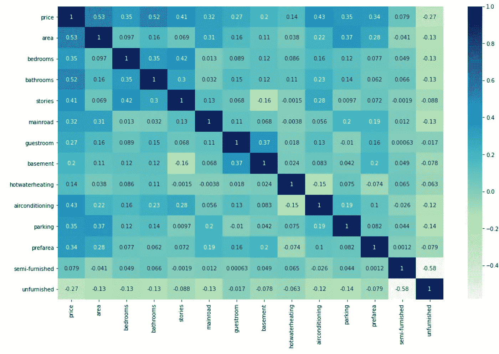

# 了解多元线性回归。

> 原文：<https://medium.com/analytics-vidhya/understanding-multiple-linear-regression-e5cc68bef652?source=collection_archive---------10----------------------->

多元线性回归中的术语“**多重**”表示两个或多个独立输入变量与一个响应变量之间的关系。

当一个变量不足以创建好的模型并做出准确的预测时，就需要多元线性回归。

让我们从一个住房数据集开始理解它…

# 问题陈述。

假设一家房地产公司有一个包含德里地区房产价格的数据集。它希望利用这些数据，根据面积、卧室、停车场等重要因素，优化房产的销售价格。

***本质上，公司想要—***

*   确定影响房价的变量，如面积、房间数量、浴室等。
*   创建一个线性模型，将房价与房间数量、面积、浴室数量等变量定量联系起来。
*   了解模型的准确性，即这些变量对房价的预测能力。

***我们开始编码吧……..***

# 步骤 1:阅读和理解数据

让我们首先导入 NumPy 和 Pandas 并读取住房数据集。

***导入所需的库***

```
# importing required librariesimport numpy as np
import pandas as pd
```

***读取数据集***

```
housing = pd.read_csv("Housing.csv")
```

***显示数据集***

```
# Check the head of the dataset
housing.head()
```


# 步骤 2:可视化数据

现在让我们花一些时间来做可以说是最重要的一步——理解数据。

*   如果存在明显的多重共线性，这是发现它的第一个地方
*   在这里，您还可以确定一些预测因素是否与结果变量直接相关

我们将使用`matplotlib`和`seaborn`来可视化我们的数据。

```
import matplotlib.pyplot as plt
import seaborn as sns
```

## 可视化数字变量

让我们做一个所有数字变量的配对图。

```
sns.pairplot(housing)
plt.show()
```


数值变量的配对图。

## 可视化分类变量

您可能已经注意到，还有一些分类变量。让我们为这些变量做一个箱线图。

```
plt.figure(figsize=(20, 12))
plt.subplot(2,3,1)
sns.boxplot(x = 'mainroad', y = 'price', data = housing)
plt.subplot(2,3,2)
sns.boxplot(x = 'guestroom', y = 'price', data = housing)
plt.subplot(2,3,3)
sns.boxplot(x = 'basement', y = 'price', data = housing)
plt.subplot(2,3,4)
sns.boxplot(x = 'hotwaterheating', y = 'price', data = housing)
plt.subplot(2,3,5)
sns.boxplot(x = 'airconditioning', y = 'price', data = housing)
plt.subplot(2,3,6)
sns.boxplot(x = 'furnishingstatus', y = 'price', data = housing)
plt.show()
```


各种分类变量的箱线图

我们也可以通过使用`hue`论证来平行地想象这些分类特征。下面是以`airconditioning`为色调的`furnishingstatus`的剧情。

```
plt.figure(figsize = (10, 5))
sns.boxplot(x = 'furnishingstatus', y = 'price', hue=airconditioning', data = housing)
plt.show()
```


# 第三步:数据准备

*   您可以看到我们的数据集有许多值为“是”或“否”的列。
*   但是为了拟合回归线，我们需要数值而不是字符串。因此，我们需要将它们转换成 1 和 0，其中 1 表示“是”，0 表示“否”。

```
# List of variables to mapvarlist =  ['mainroad', 'guestroom', 'basement', 'hotwaterheating', 'airconditioning', 'prefarea']# Defining the map function
def binary_map(x):
    return x.map({'yes': 1, "no": 0})# Applying the function to the housing list
housing[varlist] = housing[varlist].apply(binary_map)# Check the housing dataframe nowhousing.head()
```


# 虚拟变量

变量`furnishingstatus`有三个级别。我们还需要将这些级别转换成整数。

为此，我们将使用一个叫做`dummy variables`的东西。

```
# Get the dummy variables for the feature 'furnishingstatus' and store it in a new variable - 'status'status = pd.get_dummies(housing['furnishingstatus'])
```

这里我们为变量“furnishingstatus”创建虚拟变量

```
# Check what the dataset 'status' looks like
status.head()
```


现在，你不需要三列。您可以删除`furnished`列，因为只需最后两列即可识别家具类型，其中—

*   `00`将对应`furnished`
*   `01`将对应`unfurnished`
*   `10`将对应于`semi-furnished`

这是为了避免冗余和多重共线性效应。

```
# Let's drop the first column from status df using 'drop_first = True'status = pd.get_dummies(housing['furnishingstatus'], drop_first = True)
```

在这里我们删除了 ***带家具的*** 变量

```
# Add the results to the original housing dataframehousing = pd.concat([housing, status], axis = 1)
```

将新的虚拟变量连接到数据集

```
# Drop 'furnishingstatus' as we have created the dummies for ithousing.drop(['furnishingstatus'], axis = 1, inplace = True)
```

删除***furnishingstatus***，因为我们已经为它创建了虚拟变量。

```
housing.head()
```


# 步骤 4:将数据分成训练集和测试集

如你所知，回归的第一个基本步骤是执行训练测试分割。

```
from sklearn.model_selection import train_test_split# We specify this so that the train and test data set always have the same rows, respectivelynp.random.seed(0)df_train, df_test = train_test_split(housing, train_size = 0.7, test_size = 0.3, random_state = 100)
```

# 重新缩放要素

这里我们可以看到，除了`area`，所有的列都是小整数值。因此，重新调整变量以使它们具有可比较的规模是极其重要的。

如果我们没有可比较的尺度，那么通过拟合回归模型获得的一些系数与其他系数相比可能非常大或非常小。

在模型评估时，这可能会变得非常烦人。因此，建议使用标准化或规范化，以便获得的系数单位都在同一标度上。

正如我们所知，有两种常见的重新调整方法:

1.  最小-最大缩放
2.  标准化(平均值-0，西格玛-1)

这一次，我们将使用最小最大缩放。

```
from sklearn.preprocessing import MinMaxScaler
```

将 scaler()应用于除“是-否”和“虚拟”变量之外的所有列

```
scaler = MinMaxScaler()# Apply scaler() to all the columns except the 'yes-no' and 'dummy' variablesnum_vars = ['area', 'bedrooms', 'bathrooms', 'stories', 'parking','price']df_train[num_vars] = scaler.fit_transform(df_train[num_vars])
```

让我们检查相关系数，看看哪些变量是高度相关的。

```
# Let's check the correlation coefficients to see which variables are highly correlatedplt.figure(figsize = (16, 10))
sns.heatmap(df_train.corr(), annot = True, cmap="YlGnBu")
plt.show()
```



列车数据热图。

你可能已经注意到了，`area`似乎与`price`最相关。让我们来看看`area`和`price`的配对图。

```
plt.figure(figsize=[6,6])
plt.scatter(df_train.area, df_train.price)
plt.show()
```


x 轴代表面积，y 轴代表价格

因此，我们选择`area`作为第一个变量，并尝试拟合一条回归线。

# 分为 X 和 Y 两个集合进行建模

```
y_train = df_train.pop('price')
X_train = df_train
```

# 步骤 5:建立线性模型

使用`statsmodels`通过训练数据拟合一条回归线。

请记住，在`statsmodels`中，您需要使用`sm.add_constant(X)`明确拟合一个常数，因为如果我们不执行这个步骤，默认情况下，`statsmodels`会拟合一条穿过原点的回归线。

```
import statsmodels.api as sm# Add a constant
X_train_lm = sm.add_constant(X_train[['area']])# Create a first fitted model
lr = sm.OLS(y_train, X_train_lm).fit()
```

lr.params 返回变量的系数。

```
# Check the parameters obtainedlr.params
```


```
# Let's visualise the data with a scatter plot and the fitted regression lineplt.scatter(X_train_lm.iloc[:, 1], y_train)
plt.plot(X_train_lm.iloc[:, 1], 0.127 + 0.462*X_train_lm.iloc[:, 1], 'r')
plt.show()
```


让我们打印线性回归模型的摘要。

```
# Print a summary of the linear regression model obtained
print(lr.summary())
```


得到的 R 平方值为`0.283`。

# 添加另一个变量

既然我们有如此多的变量，我们显然可以做得比这更好。因此，让我们继续添加第二高度相关的变量，即`bathrooms`。

```
# Assign all the feature variables to XX_train_lm = X_train[['area', 'bathrooms']]
```

导入统计库并拟合 OLS

```
# Build a linear modelimport statsmodels.api as sm
X_train_lm = sm.add_constant(X_train_lm)lr = sm.OLS(y_train, X_train_lm).fit()lr.params
```


```
# Check the summary
print(lr.summary())
```


我们明显改进了模型，调整后的 R 平方值从`0.281`上升到`0.477`。让我们继续添加另一个变量`bedrooms`。

```
# Assign all the feature variables to X
X_train_lm = X_train[['area', 'bathrooms','bedrooms']]# Build a linear modelimport statsmodels.api as sm
X_train_lm = sm.add_constant(X_train_lm)lr = sm.OLS(y_train, X_train_lm).fit()lr.params
```


```
# Print the summary of the modelprint(lr.summary())
```


我们再次改进了调整后的 R 平方。现在让我们继续添加所有的特征变量。

# 将所有变量添加到模型中

```
# Check all the columns of the dataframehousing.columns
```


**让我们建立一个线性模型**

```
#Build a linear modelimport statsmodels.api as sm
X_train_lm = sm.add_constant(X_train)lr_1 = sm.OLS(y_train, X_train_lm).fit()lr_1.params
```


```
print(lr_1.summary())
```


查看 p 值，看起来有些变量并不真正重要(在存在其他变量的情况下)。

也许我们可以放弃一些？

我们可以简单地去掉 p 值最高、不重要的变量。一个更好的方法是用 VIF 的信息来补充这一点。

# 检查 VIF

方差膨胀因子或 VIF 给出了一个基本的量化概念，即特征变量之间的相关程度。这是检验我们的线性模型的一个极其重要的参数。计算`VIF`的公式为:

***VIF = 1/1-R .***

```
# Check for the VIF values of the feature variables. from statsmodels.stats.outliers_influence import variance_inflation_factor# Create a dataframe that will contain the names of all the feature variables and their respective VIFsvif = pd.DataFrame()vif['Features'] = X_train.columnsvif['VIF'] = [variance_inflation_factor(X_train.values, i) for i in range(X_train.shape[1])]vif['VIF'] = round(vif['VIF'], 2)vif = vif.sort_values(by = "VIF", ascending = False)
vif 
```


我们通常希望 VIF 小于 5。所以很明显我们需要去掉一些变量。

为什么我们还要考虑数字 5？？？我来解释……

假设 VIF=5。即

1/1-R = 5

1-R = 1/5

1-R = 0.2

R = 0.8

这意味着任何 VIF 分数大于等于 5 的变量都可以解释数据中 80%以上的变异。

如果是这种情况，我们可能会面临多重共线性问题。

因此有了数字 5。

# 删除变量并更新模型

从摘要和 VIF 数据框架中可以看出，一些变量仍然无关紧要。其中一个变量是`semi-furnished`，因为它具有非常高的 p 值`0.938`。让我们继续下去，放弃这个变量。

```
# Dropping highly correlated variables and insignificant variablesX = X_train.drop('semi-furnished', 1,)# Build a third fitted model
X_train_lm = sm.add_constant(X)lr_2 = sm.OLS(y_train, X_train_lm).fit()# Print the summary of the model
print(lr_2.summary())
```


让我们再次计算 vif 分数。

```
# Calculate the VIFs again for the new modelvif = pd.DataFrame()vif['Features'] = X.columnsvif['VIF'] = [variance_inflation_factor(X.values, i) for i in range(X.shape[1])]vif['VIF'] = round(vif['VIF'], 2)vif = vif.sort_values(by = "VIF", ascending = False)
vif 
```


# 删除变量并更新模型

正如您所注意到的，一些变量具有高 VIF 值和高 p 值。这样的变量是无关紧要的，应该放弃。

您可能已经注意到，变量`bedroom`具有非常高的 VIF ( `6.6`)和高 p 值(`0.206`)。因此，这个变量没有多大用处，应该删除。

```
# Dropping highly correlated variables and insignificant variables
X = X.drop('bedrooms', 1)# Build a second fitted model
X_train_lm = sm.add_constant(X)lr_3 = sm.OLS(y_train, X_train_lm).fit()# Print the summary of the modelprint(lr_3.summary())
```


```
# Calculate the VIFs again for the new model
vif = pd.DataFrame()vif['Features'] = X.columnsvif['VIF'] = [variance_inflation_factor(X.values, i) for i in range(X.shape[1])]vif['VIF'] = round(vif['VIF'], 2)vif = vif.sort_values(by = "VIF", ascending = False)vif 
```


# 删除变量并更新模型

正如你可能已经注意到的，掉落`semi-furnised`也减少了`mainroad`的 VIF，所以它现在低于 5。

但是从总结中，我们仍然可以看到他们中的一些人有很高的 p 值。例如，`basement`的 p 值为 0.03。我们也应该去掉这个变量。

```
X = X.drop('basement', 1)# Build a fourth fitted modelX_train_lm = sm.add_constant(X)lr_4 = sm.OLS(y_train, X_train_lm).fit()lr_4.params
```


***现在你可以看到，VIFs 和 p 值都在可接受的范围内。所以我们只使用这个模型进行预测。***

***我们训练数据集的最终 R 分数是 0.676***

# 步骤 7:训练数据的残差分析

因此，现在检查误差项是否也是正态分布的(事实上，这是线性回归的主要假设之一)，

让我们画出误差项的直方图，看看它是什么样子。

```
y_train_price = lr_4.predict(X_train_lm)# Plot the histogram of the error terms
fig = plt.figure()sns.distplot((y_train - y_train_price), bins = 20)fig.suptitle('Error Terms', fontsize = 20)   

plt.xlabel('Errors', fontsize = 18) 
```


# 步骤 8:使用最终模型进行预测

既然我们已经拟合了模型并检查了误差项的正态性，那么是时候继续使用最终模型，即第四个模型进行预测了。

## 对测试集应用缩放

```
num_vars = ['area', 'bedrooms', 'bathrooms', 'stories', 'parking','price']df_test[num_vars] = scaler.transform(df_test[num_vars])
```

## 分为 X 检验和 y 检验

```
y_test = df_test.pop('price')X_test = df_test# Adding constant variable to test dataframeX_test_m4 = sm.add_constant(X_test)# Creating X_test_m4 dataframe by dropping variables from X_test_m4X_test_m4 = X_test_m4.drop(["bedrooms", "semi-furnished", "basement"], axis = 1)# Making predictions using the fourth modely_pred_m4 = lr_4.predict(X_test_m4)
```

计算测试数据集的 R 分数

```
from sklearn.metrics import r2_scorer2_score(y_true=y_test,y_pred=y_pred_m4)
```


***我们训练数据集的最终 R 分数是 0.676***

***对于我们的测试数据集，我们得到了 0.66 的 R 分数。***

这意味着我们的模型在测试数据集上也表现良好。

# 步骤 9:模型评估

现在让我们绘制实际值与预测值的图表。

```
# Plotting y_test and y_pred to understand the spreadfig = plt.figure()plt.scatter(y_test, y_pred_m4)fig.suptitle('y_test vs y_pred', fontsize = 20)  

plt.xlabel('y_test', fontsize = 18)  

plt.ylabel('y_pred', fontsize = 16)
```


我们可以看到，最佳拟合线的方程为:

𝑝𝑟𝑖𝑐𝑒=**0.236×𝑎𝑟𝑒𝑎+0.202×𝑏𝑎𝑡ℎ𝑟𝑜𝑜𝑚𝑠+0.11×𝑠𝑡𝑜𝑟𝑖𝑒𝑠+0.05×𝑚𝑎𝑖𝑛𝑟𝑜𝑎𝑑+0.04×𝑔𝑢𝑒𝑠𝑡𝑟𝑜𝑜𝑚+0.0876×ℎ𝑜𝑡𝑤𝑎𝑡𝑒𝑟ℎ𝑒𝑎𝑡𝑖𝑛𝑔+0.0682×𝑎𝑖𝑟𝑐𝑜𝑛𝑑𝑖𝑡𝑖𝑜𝑛𝑖𝑛𝑔+0.0629×𝑝𝑎𝑟𝑘𝑖𝑛𝑔+0.0637×𝑝𝑟𝑒𝑓𝑎𝑟𝑒𝑎−0.0337×𝑢𝑛𝑓𝑢𝑟𝑛𝑖𝑠ℎ𝑒𝑑.**

**注意:为了删除与目标变量相关性低的变量，我们可以*使用 sklearn 提供的递归特征消除。***

**结论:**

我希望读者对多元线性回归有一个直观的认识。