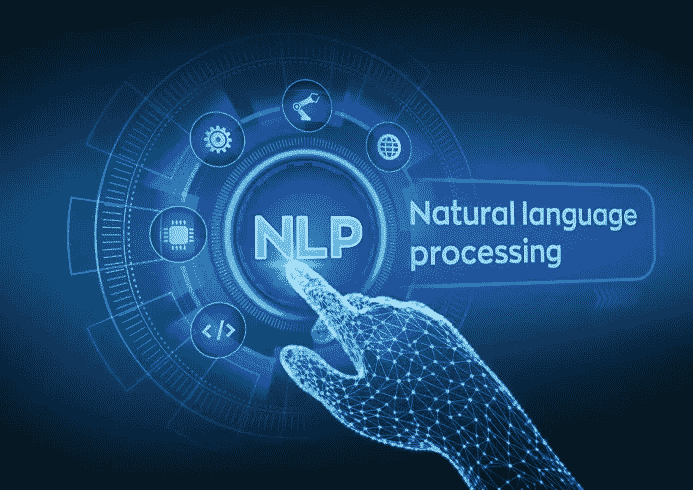
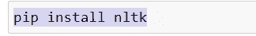
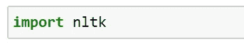
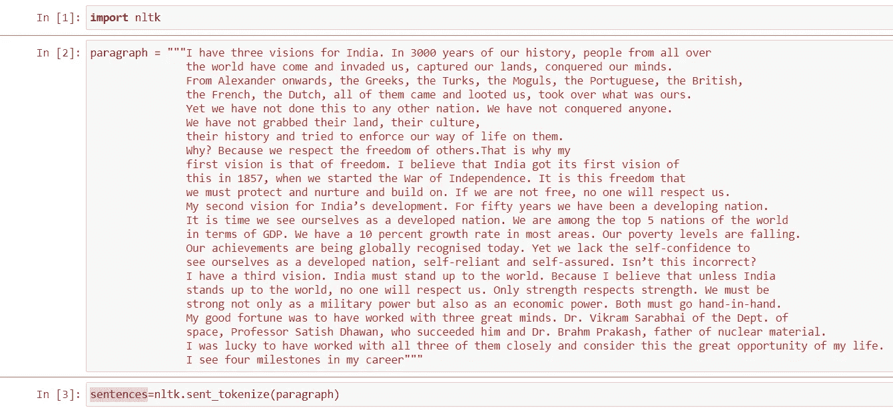
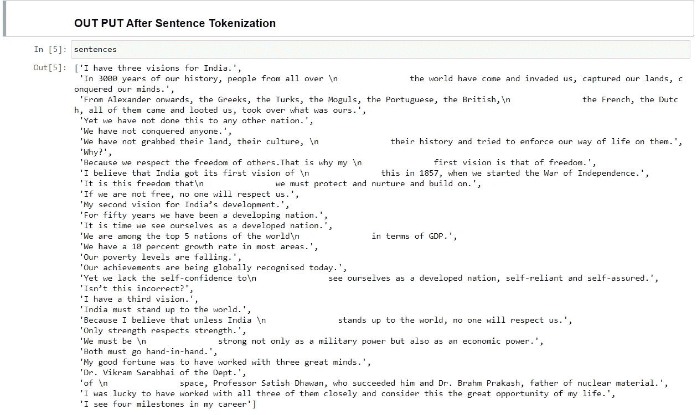
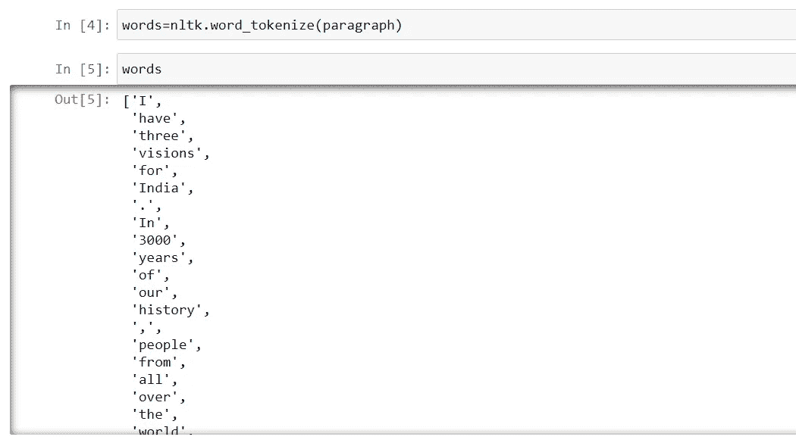
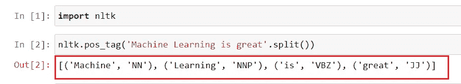
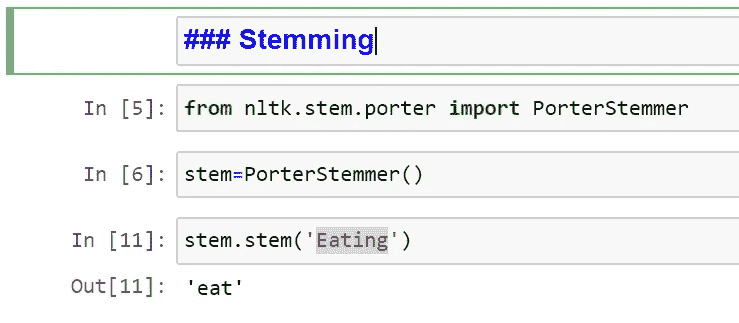
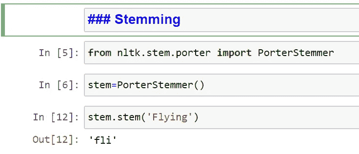
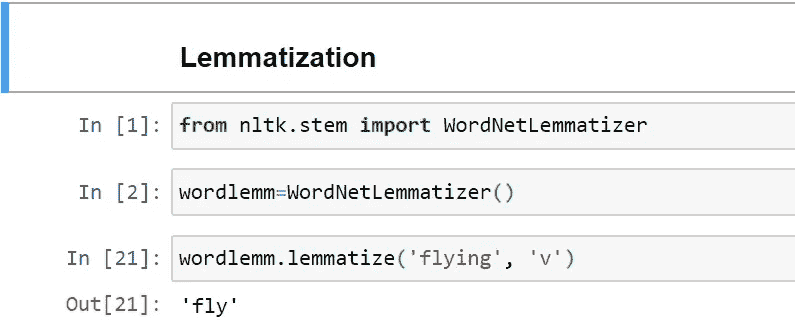

# 理解自然语言处理(NLP)

> 原文：<https://medium.com/analytics-vidhya/understanding-natural-language-processing-nlp-4666faad979a?source=collection_archive---------18----------------------->

图片:loginworks

## **概述:**

自然语言是人类可读的语言，如文本、消息。由机器处理这些语言以用于不同的应用被称为自然语言处理或 NLP。

NLP 的一些实际例子是情感分析，分析餐馆评论，google/Alexa 语音搜索，它将语音转换为文本，然后用于内部处理。

## **涵盖话题:**

1.关于 NLP 应用程序的详细信息

2.使用自然语言处理(NLP)的应用

3.使用 Python & NLTK 库理解 NLP

4.单词分词器和句子分词器

5.词性标注

6.词干化和词汇化

## **NLP 申请详情:**

正如我们所知，今天几乎每个人都有智能手机/笔记本电脑和方便上网。因此，每天都会产生数百万千兆字节(gb)的数据。

出于商业目的，公司使用从社交媒体网站、脸书、LinkedIn、twitter 或 WhatsApp、Telegram 等 messing 系统等各种来源生成的数据。

他们分析数据并试图理解个人需求，如食物选择、服装品牌、假期选择等。然后他们使用他们的应用程序如推荐系统来锁定这些客户，这些客户是他们收入的主要来源。

## **使用自然语言处理(NLP)的应用程序:**

1.  我们邮箱中的垃圾邮件或垃圾邮件检测器会将大部分垃圾邮件过滤到垃圾邮件文件夹中。

2.像谷歌这样的搜索引擎理解你，并显示与你的选择相关的东西。

3.像脸书、LinkedIn show news 这样的社交媒体网站，文章与你的选择有关。

4.像谷歌 Alexa，苹果 Siri 这样的 Speach 识别引擎。

5.像亚马逊和卡丁车这样的网站根据你的兴趣和选择显示品牌。

## **使用 Python 理解 NLP&NLTK 库:**

我们将使用 python 来实现所有的 NLP。首先，让我们先安装 python 中最重要的库(如果还没有安装的话)

NLTK 库是最常见的，并且大量用于大多数 NLP 应用程序实现。NLTK 代表自然语言工具包。

## **句子分词器和单词分词器:**

句子分词器用于将段落/语料库拆分成句子。众所周知，当我们阅读 NLP 应用程序的任何段落时，我们需要将该段落拆分成句子以进一步分析它。

单词分词器用于将句子拆分成每个单词，以便进一步处理。

## 词性标注(词性标注):

根据 nltk.org，词性标注的定义如下

[https://www.nltk.org/book/ch05.html](https://www.nltk.org/book/ch05.html)

将单词分类到它们的**词性**并相应地标注它们的过程被称为**词性标注**、**词性标注**，或者简称为**标注**。词类又称为**词类**或**词类**。

**POS 标签列表:**

*   CC 并列连词
*   CD 基数
*   DT 限定词
*   EX 存在性 there(比如:“存在”…想象成“存在”)
*   FW 外来词
*   在介词/从属连词中
*   JJ 形容词‘大’
*   JJR 形容词，比较级“更大”
*   JJS 形容词，最高级“最大的”
*   LS 列表标记 1)
*   MD modal 可能会
*   NN 名词，单数‘书桌’
*   NNS 名词复数‘书桌’
*   专有名词，单数‘哈里森’
*   NNPS 专有名词，复数“美国人”
*   PDT 预先确定“所有孩子”
*   词尾所有格父母的
*   PRP 人称代词我，他，她
*   PRP$所有格代词我的，他的，她的
*   非常安静地，
*   RBR 副词，比较级更好
*   RBS 副词，最高级 best
*   RP 粒子放弃
*   去商店。
*   呃感叹词 errrrrrrrm
*   VB 动词，基本形式 take
*   VBD 动词，过去时态 take
*   动词，动名词/现在分词
*   VBN 动词，过去分词 taken
*   VBP 动词，唱。当前，非 3d 拍摄
*   **VBZ** 动词，第三人称唱。当前拍摄
*   WDT 疑问词 which
*   代词谁，什么
*   WP$所有格 wh-代词谁的
*   wh-ab 动词 where，when

## 词干化和词汇化:

**词干:**

这用于从语料库中的任何给定单词中获取词根。因为多个不同单词在转换为基本单词时具有相同的含义。这有助于 NLP 申请的处理。

例:' **Eating'** 要去掉它的后缀 **'ing'** 这个词根/基词，转换成' **eat'** 。

**用于词干分析的库是 nltk 的 PorterStemmer】**

从 nltk.stem.porter 导入 PorterStemmer

在词干提取中，有时可能会发生一个单词没有正确转换成它的词根，因此它的意义变得更小。例如

现在你可以在这里看到单词“Flying”已经被转换成了“fli ”,我们没有任何这样的单词来降低这个单词的意思。

## 词汇化:

为了解决这个问题，我们使用了引理化。词干化通常可以创建不存在的单词，但可以正确转换为实际单词的词汇化。

**用于**术语化**的库是 nltk** 的 wordnet 术语化器

从 nltk.stem 导入 WordNetLemmatizer

**结论**:自然语言处理是一个广阔的研究和开发领域，并在各种应用中大量使用，因为用户生成的数据是巨大的，从中获得洞察力使商业成功。我将在下一篇文章中讨论其他 NLP 主题。

请写下您的疑问和意见，并分享您的反馈。

希望你喜欢我的文章。请鼓掌👏(50 次)激励我继续写下去。

想要连接:

链接地:【https://www.linkedin.com/in/anjani-kumar-9b969a39/ 

如果你喜欢我在 Medium 上的帖子，并希望我继续做这项工作，请考虑在[上支持我](https://www.patreon.com/anjanikumar)