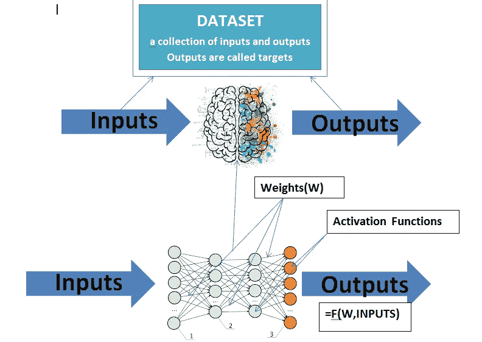
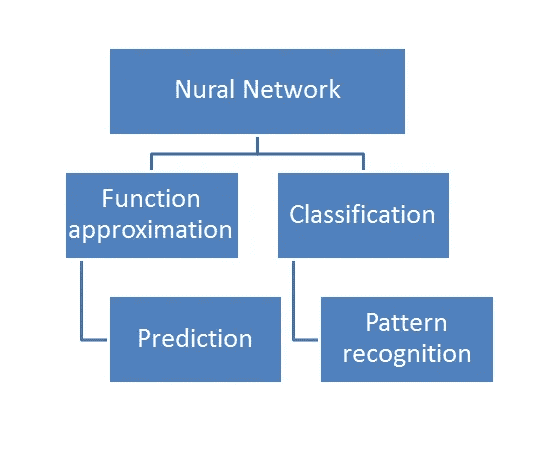
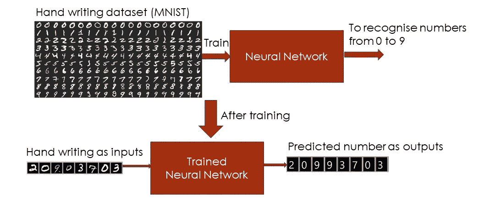
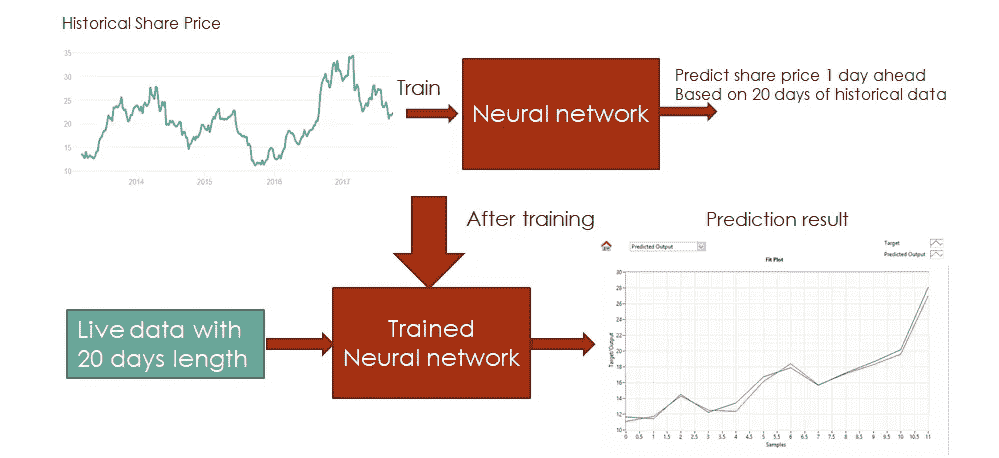
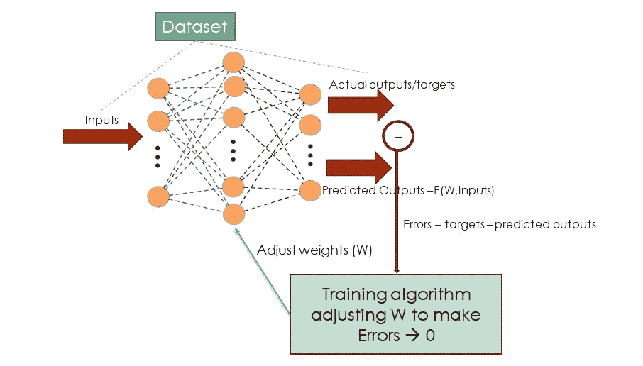

# 理解神经网络

> 原文：<https://medium.com/analytics-vidhya/understanding-neural-network-2b67a719154b?source=collection_archive---------45----------------------->

**什么是神经网络？**

图 1:什么是神经网络？

神经网络是一个模仿人脑结构的系统。图 1 展示了一个多层前馈神经网络结构，它包含一个输入层(绿色)、隐藏层(粉红色)和一个输出层(橙色)。每一层包含由小圆圈表示的多个节点，例如，输入节点为绿色，隐藏节点为粉红色，输出节点为橙色。

不同层的节点可以相互连接，两个节点之间的连接强度称为这些节点之间的权重。连接流程从输入层开始到隐藏层，然后到输出层。隐藏层中的每个节点都可以接受来自先前隐藏层或输入层的输入连接。这些输入连接将被求和并馈入一个称为激活函数的特殊函数，以形成其节点的输出。因此，只有隐藏层和输出层具有激活功能。有不同类型的激活函数定义了神经网络的特征。

简而言之，对于给定的神经网络结构，该神经网络的输出可以基于其输入来计算。神经网络权重由从数据集学习模式或特征的学习过程来确定。这个数据集是输入和目标对的集合。

**神经网络应用**

图 2:神经网络应用

因为神经网络可以逼近任何数学函数。它的应用主要是在函数逼近和分类领域。这些领域包括函数拟合、预测和模式识别，如图 2 所示。

**模式识别示例**

图 3:手写识别示例

在这个例子中，手写识别应用程序的数据集包含 60000 个 28 像素×28 像素灰度图像样本，代表从 1 到 9 的数字。此示例的目的是使用图像样本来训练神经网络识别数字 1 到 9。因此，神经网络输入将是 28 像素×28 像素的灰度图像，其目标将是任何数字(从 1 到 9 ),如图 3 所示。在被训练之后，神经网络将具有正确的知识来从手写的 28x28 灰度图像中识别正确的数字。换句话说，经过训练的神经网络将能够识别手写图像中的模式，以正确识别它们。

**函数拟合/预测示例**

图 4:函数拟合/预测示例

在本例中，历史数据代表一段时间内的股价，该数据可能由连续的数学函数表示。如果知道这个数学函数，就可以预测未来的股票价格。不幸的是，股票市场的情况并非如此。被称为函数拟合的不同技术已经被探索来基于历史数据形式化数学函数。具有学习能力的神经网络是这种应用的完美候选。

图 4 展示了神经网络的函数拟合应用。首先，历史股票价格数据用于训练神经网络来学习其特征。经过训练后，神经网络可以预测该股票的未来价格。

**神经网络如何学习？**

图 5:如何训练一个神经网络？

由于神经网络的学习能力，能够识别模式或逼近未知函数。为了训练神经网络，需要包含输入-目标对集合的数据集。对于数据集的给定输入，相应的目标是预期的神经网络输出。图 5 展示了神经网络学习过程。

对于给定的神经网络结构，可以基于其当前权重和来自数据集的输入来计算其输出(输出= F(W，输入))。然后，将这些输出与数据集中的目标进行比较，以形成训练信号，从而通过优化程序调整神经网络的权重。重复该过程，直到神经网络输出和相应目标之间没有显著差异，也称为误差。由于误差是从神经网络输出层计算的，并用于调整从隐藏层到输入层的权重，因此该过程也称为反向传播过程。通过这个训练过程，神经网络将最终学习数据集的行为。