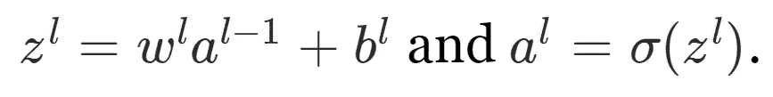

# 理解神经网络

> 原文：<https://medium.com/analytics-vidhya/understanding-neural-networks-776fa70d055c?source=collection_archive---------27----------------------->

资料来源:cognex.com

语音识别、图像处理、面部识别是由基于神经网络工作的深度学习驱动的人工智能应用的一些例子。

神经网络是由芝加哥大学的两位研究人员沃伦·麦卡洛和沃尔特·皮茨于 1944 年首次提出的

# **什么是神经网络？**

神经网络是设计用来模仿人脑运作的计算机程序。神经网络(也称为神经元)中的每个程序只能执行基本计算。但是通过将众多的神经元连接在一起，整个网络的计算能力变得比每个单独的部分都强。在神经网络内的神经元之间建立连接的过程被称为训练并使用该数据变得更聪明——类似于人类学习信息的方式。

在该结构的上下文中，模式通过*输入层*被引入网络，该输入层具有输入数据中每个分量的输入，该输入数据随后被传递到*隐藏层*。在隐藏层中，所有的处理实际上都是通过以权重和偏好为特征的连接系统进行的。在输入层接收输入，神经元计算一个加权和加上偏置，并根据结果和预设的激活函数，决定是否应该触发或激活它。在这个过程的最后，最后一个隐藏层被链接到*输出层*，它有一个神经元用于每个可能的期望输出。

神经网络的基本结构

# **神经网络是如何工作的？**

为了理解神经网络如何工作，我们需要理解可以包含在我们的网络中的不同类型的神经元

第一种类型的神经元是*感知器*，即使有更多的现代作品，理解感知器也是有益的。第二种重要的神经元类型是*s 形神经元*

# **感知器**

感知器接受几个二进制输入 x1、x2…并产生一个二进制输出，即 0 或 1。感知器遵循的三个主要步骤是:

1.  输入 x1，x2，x3…被引入感知器。它可以接受更少或更多输入
2.  重量 w1、w2、w3…它们是表示各个输入对输出的重要性的实数
3.  神经元输出 0 或 1 通过加权和∑wjxj 是小于还是大于阈值来计算。

用数学术语来说:

为了简化上述等式，我们可以进行以下更改:

1.  将 wjxj 的总和替换为点积 w.x，其中 w 和 x 是向量，其分量分别是权重和输入
2.  将阈值移动到不等式的另一边，并替换为 bias -b

偏差可以描述为感知器输出 1 的难易程度。如果偏差为负，感知器会发现很难输出 1，如果偏差为正，则很容易输出 1。

感知器的优势之一是我们可以改变权重和偏差来获得决策模型。我们可以给这些输入分配更多的权重，这样如果它们将输出一个正输出。如果我们注意公式，我们可以观察到一个大的正偏差会使输出 1 变得非常容易；然而，非常负的偏差将使输出 1 的任务变得非常不可能。然而，感知器的一个缺点是，即使在单个神经元中，权重或偏差的微小变化也会使输出从 0 到 1 发生剧烈变化，反之亦然。这就是一种更现代的神经元派上用场的地方:s ***igmoid 神经元。***sigmoid 神经元和感知器的主要区别在于，输入和输出可以是 0 到 1 之间的任何连续值

# **乙状结肠**

Sigmoid 类似于感知器，但权重和偏差的微小变化只会导致其输出的微小变化。

1.  就像感知器一样，sigmoid 接受输入 x1，x2，x3…但是这些值可以是 0 到 1 之间的任何连续值，而不仅仅是 0 或 1
2.  权重 w1、w2、w3 和偏差 b 被引入网络。
3.  但输出不是 0 或 1 而是σ(w⋅x+b)，其中σ称为 sigmoid 函数，定义为:

更明确地说:

sigmoid 函数的形状是阶跃函数的平滑版本

事实上，如果σ是一个阶跃函数，那么 sigmoid 神经元将是一个感知器，因为输出将是 0 或 1。

σ的平滑性意味着权重的小变化δwj 和偏置的小变化δb 将产生神经元输出的小变化δoutput。事实上，微积分告诉我们，δ输出很好地近似为:

# **神经网络如何学习？**

机器学习的主要优势是它们每次在预测输出时学习和改进的能力。就神经网络而言，它是指一种算法，可以帮助我们找到权重和偏差，从而使网络的输出接近所有训练输入 x 的 y(x)。为此，我们定义了一个成本函数:

其中 w 是网络中所有权重的集合，b 是所有偏差，n 是训练输入的总数，a 是当 x 是输入时网络输出的向量，而∑是所有训练输入的总和，C 是二次成本函数，也称为均方误差或 MSE。

该算法的目的是找到使成本尽可能小的权重和偏差，为此，我们将使用梯度下降。

让我们假设我们试图最小化某个函数，C(v)。这可以是任何多变量的实值函数，v=v1，v2…为了最小化 C(v ),可以把 C 想象成两个变量的函数，我们称之为 v1 和 v2

识别这一点的一种方法是使用微积分来试图找到全局最小值。我们可以计算导数，并用它们来寻找 C 达到最小值或最大值的地方。当 C 是一个或几个变量的函数时，这可能行得通。但当我们有更多的变量时，这将变成一场噩梦，对于神经网络，我们通常需要更多的变量。用微积分来最小化是行不通的。

我们可以计算导数来计算最小值的位置，或者我们可以从一个随机点开始，尝试做一个小的移动，从数学上来说，在 v1 方向移动δv1，在 v2 方向移动δv2，并计算函数δc 的变化，我们可以将函数的变化表示为:

我们需要选择δv1 和δv2，以便使δC 为负。为此，将δv 定义为 v 的变化向量，δv≦(δv1，δv2)会有所帮助。我们也将 C 的梯度定义为偏导数的向量

根据这些定义，我们可以将δc 写成δv 和梯度∇C，如下所示:

上面的等式表明我们如何选择δv 以使δC 为负。

特别是，假设我们选择δv=−η∇c

其中η是一个小的正参数(称为*学习率*)。那么上面的等式告诉我们

因为∥∇C∥2≥0，这保证了δc≤0，也就是说，c 会一直减少，永远不会增加。

总而言之，梯度下降算法的工作方式是重复计算梯度∇C，然后向相反的方向移动。

我们选择向任何方向移动的量称为学习率，它定义了我们多快达到全局最小值。为了使梯度下降正确工作，我们需要选择足够小的学习率，使得上面的方程是一个很好的近似。如果我们不这样做，我们可能会以δC > 0 结束，这显然是不好的！同时，我们不希望学习率太小，因为这将使变化δv 很小，因此梯度下降算法将非常慢。在实际实现中，学习速率经常变化，因此上述方程仍然是一个很好的近似，但算法不会太慢。

应用梯度下降规则有许多挑战。一个主要问题是训练大量训练样本所需的时间。一种叫做*随机梯度下降*的算法可以用来加速学习。其思想是通过计算随机选择的训练输入的小样本的梯度来估计梯度∇C。通过对这个小样本求平均，我们可以很快得到真实梯度∇C 的良好估计，这有助于加速梯度下降，从而加快学习。

随机梯度下降通过随机挑选出少量 m 个随机选择的训练输入来工作，我们称之为小批量。我们计算这个小批量的梯度。然后，我们挑选出另一个随机选择的小批量和训练。这个过程一直重复，直到我们用尽了训练输入，这就是所谓的训练时期。在这一点上，我们重新开始一个新的训练时期。

# 神经网络中的反向传播

如上所述，神经网络可以使用梯度下降算法学习权重和偏差。但是为了计算成本函数的梯度，我们需要另一种叫做*反向传播*的算法。反向传播的目标是计算成本函数 c 相对于网络中任何权重 w 或偏差 b 的偏导数∂C/∂w 和∂C/∂b。

# 关于反向传播工作成本函数的假设

在做出假设之前，让我们定义成本函数:

其中:n 为训练样本总数；总和超过单个训练示例 x；y=y(x)是相应的期望输出；l 表示网络的层数；和 a^L=a^L(x)是当输入 x 时从网络输出的激活向量。

我们需要的第一个假设是成本函数可以写成平均值:

个别训练例子的成本函数 Cx。

在这种假设下，反向传播让我们计算单个训练样本的偏导数∂Cx/∂w 和∂Cx/∂b。然后，我们通过对训练样本进行平均来计算∂C/∂w 和∂C/∂b。

我们对成本所做的第二个假设是，它可以写成神经网络输出的函数，如下所示:

# 反向传播背后的四个基本方程

反向传播计算成本函数相对于权重和偏差的偏导数。但要做到这一点，我们必须引入一个中间量δ，我们称之为第 1 层的第 j 个神经元中的*误差*。反向传播基于四个基本方程。这些等式共同为我们提供了一种计算第 1 层中的误差δ和成本函数的梯度的方法。这四个等式描述如下:

**输出层误差的一个等式，**δL**:**δL 的分量由下式给出

上述等式可以用基于矩阵的形式写成:

**误差方程** δ^l **关于下一层的误差，** δ^l+1 **:**

**关于网络中任何偏差的成本变化率的等式:**

**关于网络中任意权重的成本变化率的等式:**

# 反向传播算法

反向传播方程为我们提供了一种计算成本函数梯度的方法。

1.  **输入** x **:** 设置输入层对应的激活 a。
2.  **前馈:**对于每个 l=2，3，…L 计算

3.**输出误差** δL **:** 计算矢量

4.**反向传播误差:**对于每个 l = L，L2，…，2 计算

**5。输出:**成本函数的梯度由下式给出

因为我们从最后一层开始向后计算误差向量δ^l，所以该算法被称为反向传播。向后移动是成本是网络输出的函数这一事实的结果。为了理解成本如何随着先前的权重和偏差而变化，我们需要重复应用链式法则，通过各层反向工作以获得可用的表达式。

参考资料:

[神经网络和深度学习](http://neuralnetworksanddeeplearning.com/) —迈克尔·尼尔森

[神经网络——什么、如何以及为什么](https://towardsdatascience.com/understanding-neural-networks-what-how-and-why-18ec703ebd31)——[Euge Inzaugarat](https://towardsdatascience.com/@meinzaugarat?source=follow_footer--------------------------follow_footer-)