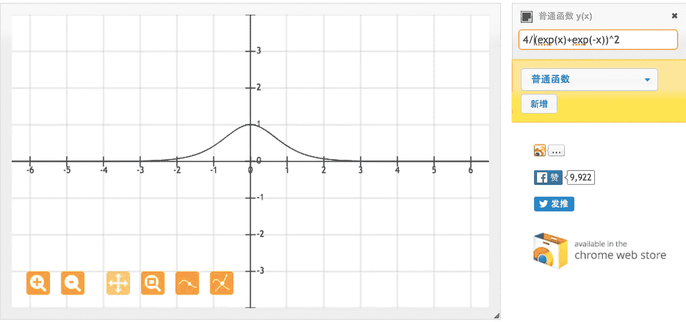
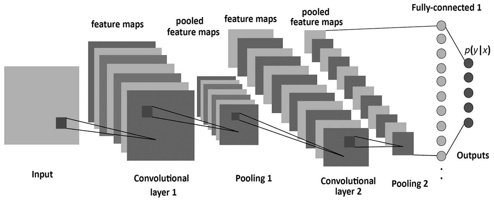

# 理解神经网络。从神经元到 RNN、CNN 和深度学习

> 原文：<https://medium.com/analytics-vidhya/understanding-neural-networks-from-neuron-to-rnn-cnn-and-deep-learning-cd88e90e0a90?source=collection_archive---------0----------------------->

图片来源:取自谷歌搜索，未提及出处。让我知道，如果这是你的形象，我可以添加信用

神经网络是目前最流行的机器学习算法之一。随着时间的推移，神经网络在准确性和速度方面优于其他算法，这一点已得到决定性的证明。有各种变体，如 CNN(卷积神经网络)、RNN(递归神经网络)、自动编码器、深度学习等。对于数据科学家或机器学习从业者来说，神经网络正慢慢成为统计学家的线性回归。因此，有必要对什么是神经网络、它是如何构成的以及它的范围和局限性有一个基本的了解。这篇文章试图解释一个神经网络，从其最基本的构建模块神经元开始，然后深入研究其最流行的变体，如 CNN，RNN 等。

**什么是神经元？**

顾名思义，神经网络的灵感来自人脑的神经结构，就像人脑一样，基本的构建模块被称为神经元。它的功能类似于人的神经元，即它接受一些输入并激发一个输出。在纯数学术语中，机器学习世界中的神经元是数学函数的占位符，它唯一的工作是通过对提供的输入应用该函数来提供输出。

图片来源:取自谷歌搜索，未提及出处。让我知道，如果这是你的形象，我可以添加信用

神经元中使用的功能通常被称为激活功能。迄今为止，已经尝试了 5 种主要的激活功能，step、sigmoid、tanh、ReLU 和 leaky ReLU。下面将详细描述其中的每一项。

**激活功能**

**步进功能**

阶跃函数被定义为

图片来源:取自谷歌搜索，未提及出处。让我知道，如果这是你的形象，我可以添加到学分

其中，如果 x 的值大于等于零，则输出为 1，如果 x 的值小于零，则输出为 0。可以看出，阶跃函数在零点是不可微的。目前，神经网络使用反向传播方法和梯度下降来计算不同层的权重。由于阶跃函数在零处是不可微的，因此它不能利用梯度下降方法取得进展，并且在更新权重的任务中失败。

为了克服这个问题，引入了 sigmoid 函数来代替阶跃函数。

**s 形函数**

sigmoid 函数或逻辑函数在数学上定义为

图片来源:取自谷歌搜索，未提及出处。让我知道，如果这是你的形象，我可以添加信用

当 z 或自变量趋于负无穷大时函数值趋于零，当 z 趋于无穷大时函数值趋于 1。需要记住的是，该函数代表因变量行为的近似值，并且是一种假设。现在问题来了，为什么我们使用 sigmoid 函数作为近似函数之一。这有一些简单的原因。

> 1.它捕捉数据中的非线性。尽管是近似的形式，但是非线性的概念对于精确建模是必不可少的。
> 
> 2.sigmoid 函数始终是可微分的，因此可以与梯度下降和反向传播方法一起用于计算不同层的权重
> 
> 3.因变量遵循 sigmoid 函数的假设本质上假设自变量为高斯分布，这是我们在许多随机发生的事件中看到的一般分布，这是一个很好的一般分布。

然而，sigmoid 函数也有梯度消失的问题。从图中可以看出，sigmoid 函数将其输入压缩到一个非常小的输出范围[0，1]，并且具有非常陡峭的梯度。因此，存在输入空间的大区域，其中即使大的变化也会在输出中产生非常小的变化。这被称为消失梯度问题。这个问题随着层数的增加而增加，从而使神经网络的学习停滞在某一水平。

**双曲正切函数**

双曲正切( *z* )函数是 sigmoid 的重新缩放版本，其输出范围为[1，1]而非[0，1]。[1]

图片来源:取自谷歌搜索，未提及出处。让我知道，如果这是你的形象，我可以添加信用

在某些地方使用双曲正切函数而不是 sigmoid 函数的一般原因是因为数据以 0 为中心，所以导数较高。较高的梯度有助于提高学习速度。下面附上的是两个函数 tanh 和 sigmoid 的梯度图。[2]

对于双曲正切函数，对于[-1，1]之间的输入，我们有[0.42，1]之间的导数。

图片来源:取自谷歌搜索，未提及出处。让我知道，如果这是你的形象，我可以添加信用

另一方面，对于 sigmoid 函数，对于[0，1]之间的输入，我们有[0.20，0.25]之间的导数

图片来源:取自谷歌搜索，未提及出处。让我知道，如果这是你的形象，我可以添加信用

从上面的图片可以看出，双曲正切函数的导数范围比 Sigmoid 函数更大，因此学习速度更快。然而，消失梯度的问题仍然存在于双曲正切函数中。

**ReLU 功能**

校正的线性单元是深度学习模型中最常用的激活函数。如果接收到任何负输入，函数返回 0，但是对于任何正值 x，它返回该值。所以，可以写成 f(x)=max (0，x)。

图形看起来是这样的[3]

图片来源:取自谷歌搜索，未提及出处。让我知道，如果这是你的形象，我可以添加信用

泄漏的 ReLU 是最著名的之一。它与正数的 ReLU 相同。但它不是所有负值都为 0，而是具有恒定的斜率(小于 1。).

> 该斜率是用户在构建模型时设置的参数，通常称为α。例如，如果用户设置α=0.3，则激活函数为。`f(x) = max (0.3*x, x)`这具有理论上的优势，即通过在所有值上受到`x`的影响，它可以更完整地利用包含在 x 中的信息

还有其他的选择，但是从业者和研究人员普遍发现使用 ReLU 之外的任何东西都没有足够的好处。在一般实践中，ReLU 也比 sigmoid 或 tanh 函数表现得更好。

**神经网络**

到目前为止，我们已经讨论了神经元和激活函数，它们共同构成了任何神经网络的基本构件。现在，我们将深入探讨什么是神经网络及其不同类型。我强烈建议人们，如果他们对此有疑问，重新审视神经元和激活功能。

在了解神经网络之前，必须了解神经网络中的层是什么。层只不过是神经元的集合，这些神经元接受输入并提供输出。这些神经元中的每一个的输入都通过分配给神经元的激活功能来处理。例如，这里有一个小的神经网络。

图片来源:取自谷歌搜索，未提及出处。让我知道，如果这是你的形象，我可以添加信用

> 网络最左边的层称为**输入层**，最右边的层称为**输出层**(在这个例子中，它只有一个节点)。节点的中间层被称为**隐藏层**，因为在训练集中没有观察到它的值。我们还说我们的示例神经网络有 3 个**输入单元**(不包括偏差单元)、3 个**隐藏单元**和 1 个**输出单元**【4】

任何神经网络都有一个输入层和一个输出层。例如，隐藏层的数量在不同的网络之间根据要解决的问题的复杂性而不同。

这里要注意的另一个要点是，每个隐藏层可以具有不同的激活函数，例如，隐藏层 1 可以使用 sigmoid 函数，隐藏层 2 可以使用 ReLU，后面是隐藏层 3 中的 Tanh，它们都在同一神经网络中。再次使用的激活函数的选择取决于所讨论的问题和所使用的数据类型。

现在，为了让神经网络做出准确的预测，这些神经元中的每一个都在每一层学习一定的权重。他们学习权重的算法被称为反向传播，其细节超出了本文的范围。

**具有一个以上隐藏层的神经网络通常被称为深度神经网络**。

**卷积神经网络**

卷积神经网络(CNN)是在计算机视觉领域大量使用的神经网络的变体之一。它的名字来源于它所包含的隐藏层的类型。CNN 的隐藏层通常由卷积层、汇集层、全连接层和标准化层组成。这里它仅仅意味着不使用上面定义的正常激活函数，而是使用卷积和汇集函数作为激活函数。

图片来源:取自谷歌搜索，未提及出处。让我知道，如果这是你的形象，我可以添加信用

为了详细理解它，我们需要理解什么是卷积和汇集。这两个概念都是从计算机视觉领域借来的，定义如下。

> **卷积**:卷积对两个信号(在 1D)或两个图像(在 2D)进行运算:你可以把其中一个看作“输入”信号(或图像)，另一个(称为内核)作为输入图像上的“滤波器”，产生一个输出图像(所以卷积把两个图像作为输入，产生第三个作为输出)。[5]
> 
> 通俗地说，它接收输入信号并对其应用滤波器，本质上是将输入信号与内核相乘以获得修改后的信号。数学上，两个函数 f 和 g 的卷积定义为

也就是输入函数和核函数的点积。

在图像处理的情况下，更容易将内核想象为在整个图像上滑动，从而在该过程中改变每个像素的值。

图片来源:取自谷歌搜索，未提及出处。让我知道，如果这是你的形象，我可以添加信用

图片鸣谢:机器学习大师[6]

**汇集**:汇集是一个**基于样本的离散化过程**。目标是对输入表示(图像、隐藏层输出矩阵等)进行下采样。)，减少其维数，并允许对包含在被装仓的子区域中的特征进行假设。

> 有两种主要类型的池，通常称为最大和最小池。顾名思义，最大池基于从所选区域选取最大值，最小池基于从所选区域选取最小值。

图片鸣谢:[https://computersciencewiki . org/index . PHP/Max-Pooling _/_ Pooling](https://computersciencewiki.org/index.php/Max-pooling_/_Pooling)

因此，可以看出，卷积神经网络或 CNN 基本上是一种深度神经网络，除了用于引入非线性的激活功能之外，它还包括具有卷积和汇集功能的隐藏层。

更详细的解释可以在

http://colah.github.io/posts/2014-07-Conv-Nets-Modular/

**递归神经网络(RNN)**

递归神经网络或简称为 RNN，是在自然语言处理中大量使用的神经网络的一个非常重要的变体。在一般的神经网络中，假设两个连续的输入是相互独立的，则通过若干层来处理输入并产生输出。

然而，这一假设在许多现实生活场景中并不成立。例如，如果一个人想要预测一只股票在给定时间的价格，或者想要预测一个序列中的下一个单词，那么必须考虑对先前观察的依赖性。

> rnn 被称为*递归*，因为它们对序列的每个元素执行相同的任务，输出取决于之前的计算。考虑 rnn 的另一种方式是，它们有一个“存储器”，可以捕获到目前为止已经计算过的信息。理论上，rnn 可以利用任意长序列中的信息，但实际上，它们仅限于回顾几个步骤。[7]

从建筑的角度来看，RNN 是这样的。人们可以把它想象成一个多层神经网络，每一层代表某一时刻 t 的观测值。

图片来源:取自谷歌搜索，未提及出处。让我知道，如果这是你的形象，我可以添加信用

RNN 在自然语言处理方面取得了巨大的成功，特别是他们的变体 LSTM，能够比 RNN 追溯更久。如果你有兴趣了解 LSTM，我当然会鼓励你去参观

[**http://colah.github.io/posts/2015-08-Understanding-LSTMs/**](http://colah.github.io/posts/2015-08-Understanding-LSTMs/)

在这篇文章中，我试图从理论的角度介绍神经网络，从最基本的结构——神经元开始，一直到最流行的神经网络版本。这篇文章的目的是让读者了解一个神经网络是如何从零开始建立的，它被用于哪些领域，它最成功的变体是什么。

我知道还有许多其他流行的版本，我会在以后的文章中介绍。如果您想提前讨论某个主题，请随时提出建议。

**参考**

1.http://ufldl.stanford.edu/wiki/index.php/Neural_Networks

2.[https://stats . stack exchange . com/questions/101560/tanh-activation-function-vs-sigmoid-activation-function](https://stats.stackexchange.com/questions/101560/tanh-activation-function-vs-sigmoid-activation-function)

3.[https://www . ka ggle . com/dans Becker/rectified-linear-units-relu-in-deep-learning](https://www.kaggle.com/dansbecker/rectified-linear-units-relu-in-deep-learning)

4.[http://ufldl . Stanford . edu/tutorial/supervised/MultiLayerNeuralNetworks/](http://ufldl.stanford.edu/tutorial/supervised/MultiLayerNeuralNetworks/)

5.[https://www . cs . Cornell . edu/courses/cs 1114/2013 sp/sections/S06 _ convolution . pdf](https://www.cs.cornell.edu/courses/cs1114/2013sp/sections/S06_convolution.pdf)

6.[http://machine learning uru . com/computer _ vision/basics/convolution/image _ convolution _ 1 . html](http://machinelearninguru.com/computer_vision/basics/convolution/image_convolution_1.html)

7.[http://www . wild ml . com/2015/09/recurrent-neural-networks-tutorial-part-1-introduction-to-rnns/](http://www.wildml.com/2015/09/recurrent-neural-networks-tutorial-part-1-introduction-to-rnns/)