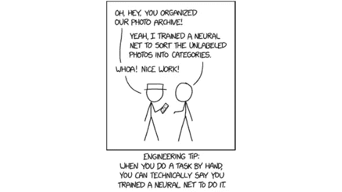
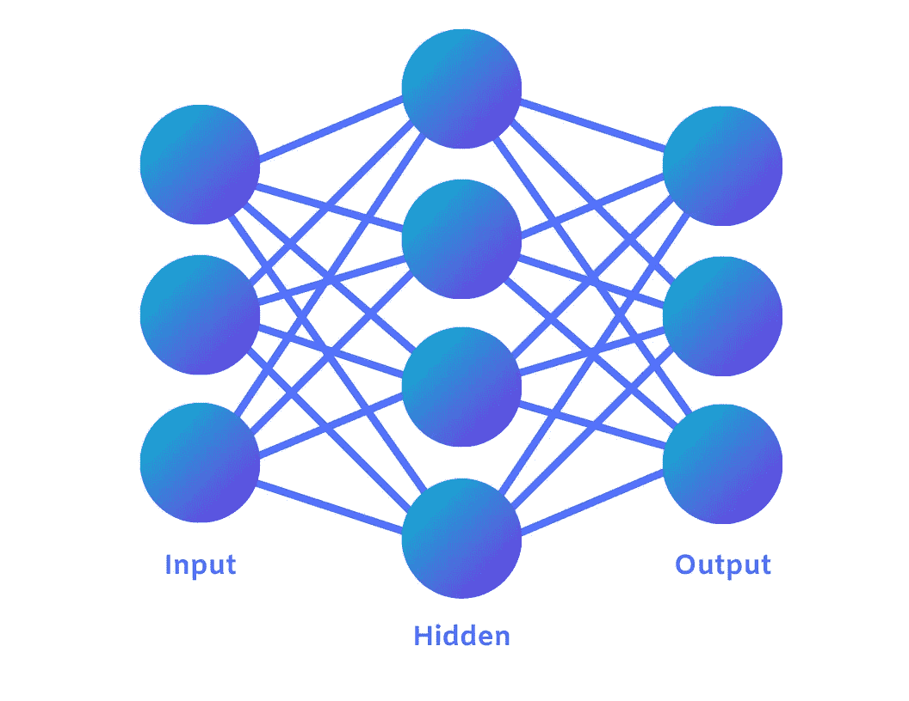
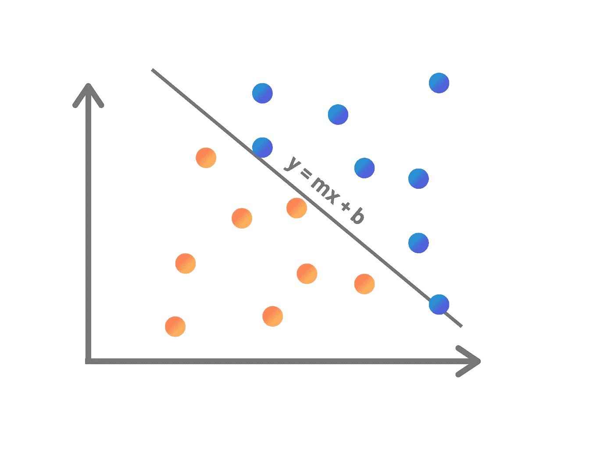
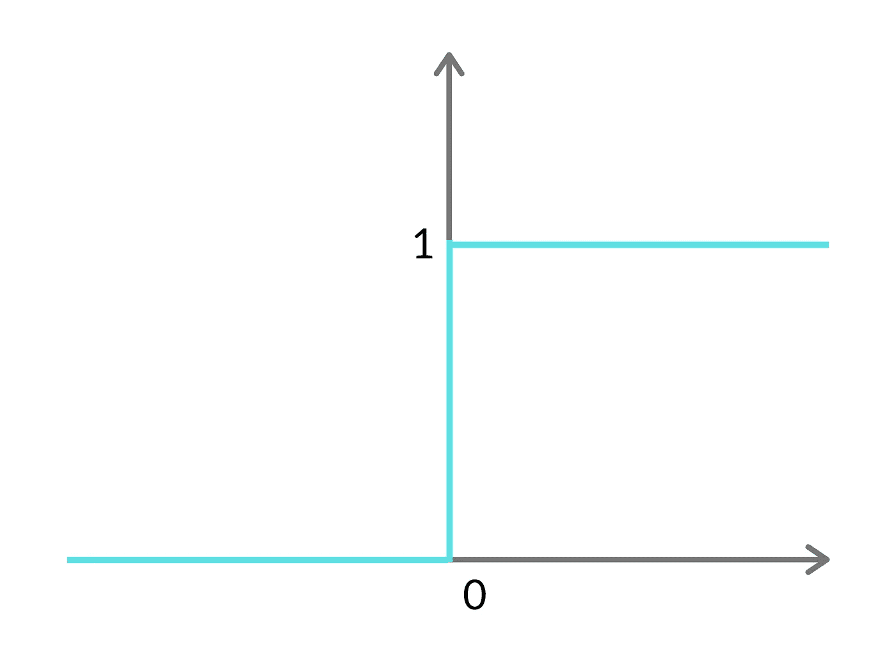
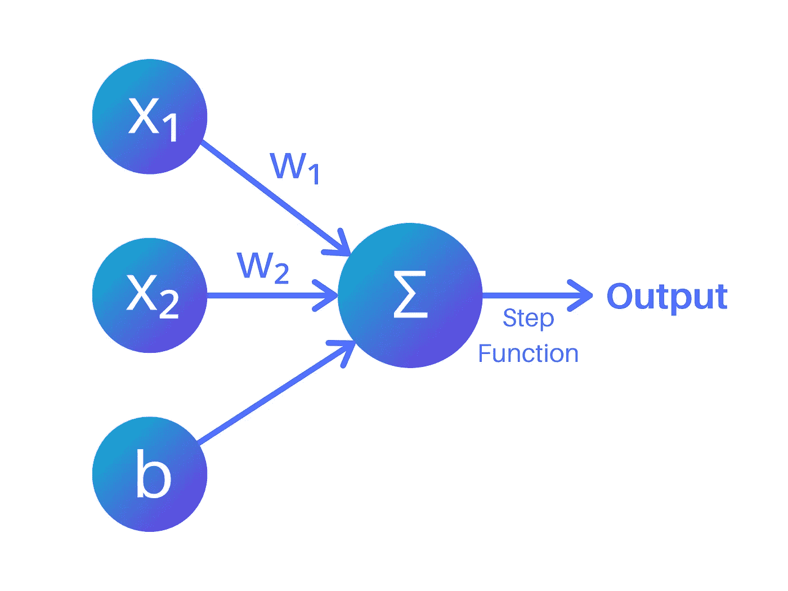
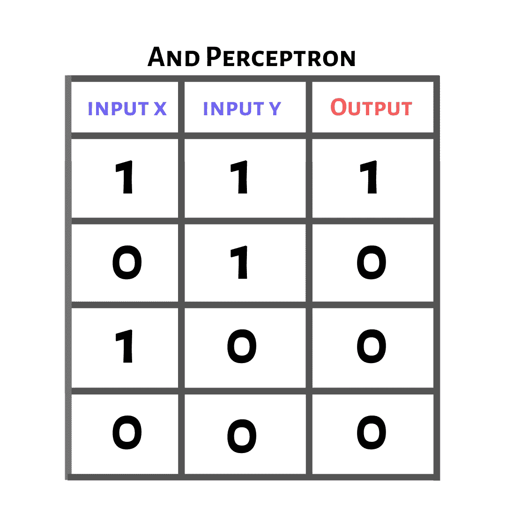
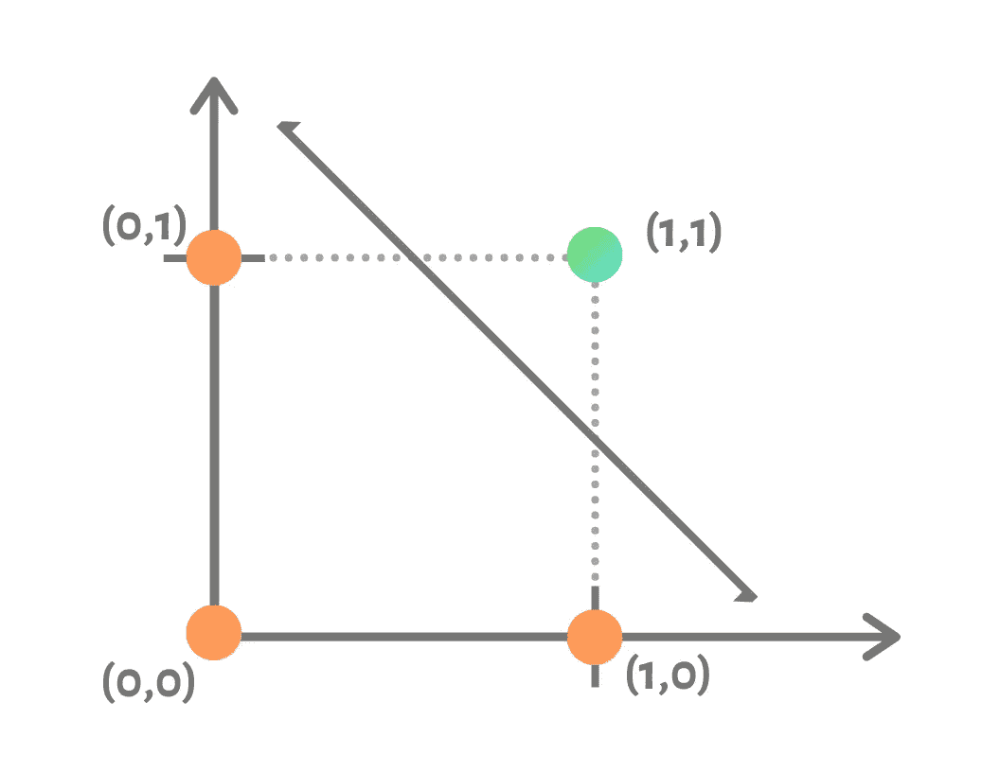

# 理解神经网络:秘密在于我们的大脑

> 原文：<https://medium.com/analytics-vidhya/understanding-neural-networks-the-secret-lies-in-our-brains-5d8dc907ab34?source=collection_archive---------11----------------------->

阅读是我能保证你能做到的事情。

从我们埋头苦干的长篇报告到每个周末阅读的简短购物清单，这是我们自然而然就会有的东西。

另一方面，机器学习算法具有令人难以置信的能力，它们可以检测欺诈，驾驶自动驾驶汽车，并以比我们大脑高得多的速度解释数据。然而，让程序理解一个简单的手写文本已经困扰了许多人近半个世纪。

所以，寻找能够理解文字的东西是合乎逻辑的，比如我们的大脑！我们的大脑是一个**高度复杂的信息处理系统**，有各种各样的**行为**(有些像自然语言一样不可思议，有些像沉迷于第十块巧克力一样)。



学分:讲解 xkcd[https://www . Explain xkcd . com/wiki/index . PHP/2173:_ Trained _ a _ Neural _ Net](https://www.explainxkcd.com/wiki/index.php/2173:_Trained_a_Neural_Net)

图像识别和自然语言处理都是人工智能以前的弱点，随着神经网络的出现，这一点已经改变。神经网络从我们大脑的神经元和行为中获得灵感(除了巧克力)，它们是一种由许多**人工神经元链在一起**组成的程序，以产生**复杂的行为**。

单个**神经元**本身很缺乏，只有一套简单的指令。另一方面，连接系统的**行为**变得更加**复杂**。

> 注意:系统的行为依赖于神经元的结构。

**神经网络有几个关键特征:**

## 信息处理📁

在传统情况下，信息在一个 **CPU** (中央处理器)中处理，它一次只能完成**一项任务**。另一方面，神经网络由神经元的组合组成，所有的神经元都单独处理信息。

## 存储数据📚

在一台计算机内，**数据存储**由**存储器**处理，**处理**由 **CPU** 负责。在神经网络**中，神经元**和**都处理**和**存储数据**。

*数据可以通过两种方式存储:*

1.  **短期**——储存在神经元内
2.  **长期** —存储在权重内(连接每个神经元的通道)

# 神经网络如何工作📝

所有的神经网络在输入层、隐藏层或输出层都有神经元。



**输入层**是接收输入**数据**并将其传递给神经网络其余部分的层**。**

**隐藏层**从输入节点接收数据，它们**将**乘以一个称为**权重**的值，并且**将一个称为**偏差**的值加到**上。(整个网络依靠**调整权重**和**偏置**来产生尽可能精确的输出。)

**输出层**是**评估**信息和**计算**输出或结果**标号**的最后一层。

最简单的形式，它是一种绘制线条来划分和分类数据的算法。总而言之，他们学习输入的数据和输出的标签之间的关系。

## 找到正确的路线

让我们从一个简单的例子开始，我们画一条直线。

我们可以给我们的模型一组输入数据，包括学生的 GPA 和 ACT 成绩。利用这些数据，我们可以试着预测一个学生是否被哈佛录取。感知器所做的是，用 x 坐标**作为他们的 GPA，y 坐标**作为他们的 ACT 分数，在**图**上将每个学生绘制成**点**。我们可以训练这种感知去做的是找到一条线，在这条线上，高于的学生*被哈佛录取，低于*的学生*被拒绝。*****

## 绘制线条

首先，我们来了解一下单个神经元是如何运作的。神经元试图使用*线性回归**两个变量**(在这种情况下是它们的 GPA 和 ACT 分数)之间的线性关系建模。这个线性模型方程是对九年级的一种回归…*

> *y = mx + b*

**

*这条线的目标是尽可能地**区分**被录取的学生和被拒绝的学生。你也可以把这条线看作是你被接受和拒绝的可能性相等的平衡点。*

# *理解感知机🎓*

*现在让我们放大一个**感知器**。一个**感知器**是一种单层的神经网络，它们是**线性分类器**。感知器接受多个输入，在我们的例子中，我们有两个 GPA 和 ACT 分数。这些**输入(x)** 乘以一个**权重(w)** 。如果更容易想象的话，你可以把权重想象成神经元之间连接的强度。在输入与它们相应的权重相乘后，它们被加在一起，一个**偏差**被**相加**(通常偏差也有它自己的权重被乘以)。*

****一般形式如下:****

> *w₁x₁ + w₂x₂ + b = 0*

****下面是一般形式的简化:****

> *y = mx + b*

## *激活功能*

*然后我们需要通过一个**激活函数**来传递它，激活函数**定义**神经元的**输出**。在我们的例子中，我们将从 ***步骤开始激活功能*** 。*

****预测(ŷ):****

> *如果 wx + b >= 0，则ŷ = 1*
> 
> *如果 wx + b < 0*

*In actual words, this means that is the equation calculated to above or equal to 0 the algorithm will predict True, otherwise it will predict False.*

**

> *Note: Y hat (ŷ) stands for the **预测了 y 的**值，ŷ = 0(在我们的例子中，因变量**是学生是否被录取)***
> 
> *旁注:如果你深入研究神经网络，你会学到 sigmoid 函数，它将一个值转换成从 0 到 1 的数字。*

## *错误*

*我们今天编程的错误是正确标签和我们的算法预测之间的**差异**。*

> ***错误值=标签—输出***

*稍后，您还可以学习使用*梯度下降*来计算误差，梯度下降沿最陡下降的方向移动。换句话说，算法离正确的标签有多远，决定了对算法的改变程度。*

## *学习率*

*所以现在你有了一个误差值，我们可以**重新调整**线方程来正确分类更多的点。所以我们可以把这个方程中误分类点的值输入为 x 来修正权重，进而调整线条。*

> ***新权重=前一权重+ (x *误差值*学习率)***

*现在你可能想知道**的学习率**是多少。学习率是为了防止生产线的巨大变化。如果您有一个**异常值**点，并更改整条线以正确分类该点，您最终会得到比以前多得多的错误分类点。*

## *把所有的放在一起*

*在这里，我们可以看到输入乘以权重并加上偏差。然后应用阶跃函数生成预测输出，这个通过网络传播信息的过程被称为*正向传播*。*

**

*然后，我们查看乘以误差和学习率的点，以创建更好更准确的权重。(如果你使用梯度下降来计算误差，这个通过网络发回数据的过程被称为*反向传播*。)*

# *用 Python 编码💻*

*现在让我们从编码一个感知器开始。我们将编写 AND 逻辑运算符，这不是最实用的，但它非常简单，有助于解释神经网络的基础知识。*

**

****“与”逻辑运算符仅在两个输入都为真时返回真。****

*首先，我们取两个可能的输入，真或假，并把它们转换成二进制的*

*这也是我们稍后用来训练算法的数据。*

*我们将编写的算法简单地根据两个**输入**预测**最终输出**。*

*在这里，我们将不同的可能输入标绘成图形中的点，我们的目标是用**将**不同颜色的点分开的**线**。*

**

## *设置变量*

*在我们的 python 程序中，我们将从定义权重、偏差和学习率的变量开始。*

```
*# The AND logic gate coded as a neural network
# This perceptron is not the most efficient neural network but it's simple to code! It's a nice classifer for explaining concepts!import random
inputOne_Weights = random.random()#Let's randomly assign values
inputTwo_Weights = random.random()#We will adjust the weights later
bias_Weights = random.random()bias = 1
learning_Rate = 1 #usually it's a lot smaller but we have less data and it's a simple preceptron*
```

*接下来，我们将定义一个函数，返回直接从输入、权重和偏差导出的输出*

```
*def calcOutput (x,y):
 output = x*inputOne_Weights + y*inputTwo_Weights+bias*bias_Weights
 return output*
```

*在这里，我们定义了主感知器。这是我们计算输出、应用激活函数并使用误差相应地编辑权重的地方。*

```
*# x and y are the two different inputs and the label is the correct result for each case
def perceptron (x, y, label):
  output = calcOutput(x,y)
  if output > 0:    output = 1  #Here comes the step function
  else:             output = 0
  errorValue = label - output  #find the error value# Adjust the weights according to the error value times the learning rate
# Make sure you edit the global variable (outside function)
  global inputOne_Weights  
# Let's edit the weights according to the input, error, and learning rates
  inputOne_Weights += x * errorValue * learning_Rateglobal inputTwo_Weights
  inputTwo_Weights += y * errorValue * learning_Rateglobal bias_Weights
  bias_Weights += bias * errorValue * learning_Rate*
```

*定义感知器后，我们需要训练它更好地预测正确的结果。这只是用不同的数据点反复运行感知器。*

```
*def training (epoch): #epoch ~ is number of passes of training data
  for i in range(epoch):
    # Since an AND function only takes two inputs and two types of      values (0 or 1) there are only four pieces of data
    # Here's our test data! We're running it through the perceptron
    perceptron(0,0,0)      
    perceptron(1,0,0)      
    perceptron(0,1,0)
    perceptron(1,1,1)*
```

*现在我们把所有的功能放在一起，我们运行整个程序，看看我们的感知是否有效。*

```
*def test (x,y):
  training(56)  # here we choose how many epochs
  output = calcOutput(x,y)
  if output > 0:    output = 1           # Here's our step function
  else:             output = 0
  return outputx = int(input())   # These are the two inputs
y = int(input())
print(test(x,y))     # Now let's run through the whole program and check if it works*
```

*运行程序，看看是否有效！浏览所有测试用例，检查程序是否计算出正确的输出。*

# *关键要点📌*

*   *神经网络受到我们自己大脑的神经元和结构的启发，它们由神经元组成，每个神经元单独处理信息并通过网络传递*
*   *与传统方法相比，神经网络在**信息处理**和它们如何**存储数据**方面有一些关键差异，神经元既处理又存储数据*
*   *神经网络由相互连接的神经元组成，形成三个不同的层:**输入**、**隐藏**和**输出***
*   *该算法的核心原理是用一条**线**将**分离**和**分类**(利用 ***线性回归*** 建立**线性关系**)。*
*   *感知器将**输入**乘以**权重**，加上**偏差**，并将总和通过**激活函数**。*
*   *我们使用的激活函数是一个**二进制阶跃函数**，这意味着如果输入数据高于一个**阈值**(在我们的例子中为 0)，神经元将被**激活**，并且**将数据向前**发送到下一层。*
*   *将**输入数据通过**网络从一个神经元传递到另一个神经元的行为被称为**前向传播**。*
*   *计算误差并调整权重使其最小化使用了一种叫做**反向传播**的东西。其中**输出误差**向后传播到**调整每层的权重**。*

*唷，这篇文章真长！恭喜你，现在你对神经网络如何运作有了更好的理解，你甚至已经编写了一个代码！*

*我希望这激起了你对神经网络的兴趣，并且你学到了一些有趣的东西！*

*看到下面的图标了吗，有拍手标志的那个？试试点击它，继续试试吧！五彩纸屑，酷吧？如果你想在未来阅读更多的文章或喜欢纸屑，给我的帐户一个关注！*

*与此同时，请随时在 ariel.yc.liu@gmail.com 联系我，或者在 LinkedIn 上联系我。你也可以在这里阅读我的每月简讯[！](https://mailchi.mp/929cce6b6e5c/september-newsletter)*

*下次见！👋*