# 理解神经类型转移

> 原文：<https://medium.com/analytics-vidhya/understanding-neural-style-transfer-3061cd92648?source=collection_archive---------10----------------------->

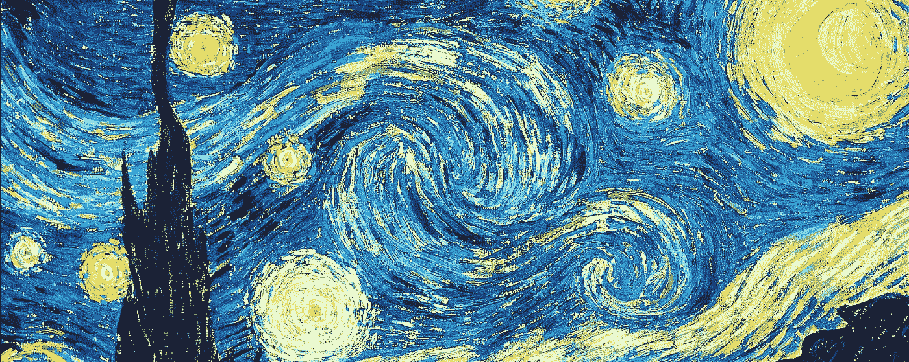

图像到图像的翻译是一个众所周知的问题，在深度学习中得到了广泛的研究。

对于那些不知道图像到图像翻译的人来说，它是一种将图像从一个领域翻译到另一个领域的方法。例如白天夜晚、黑白图像、彩色图像、素描图像等。

图像到图像转换中的一个特殊问题是**样式转移，**其中样式从一个图像(样式-图像)转移到另一个图像(内容-图像)。

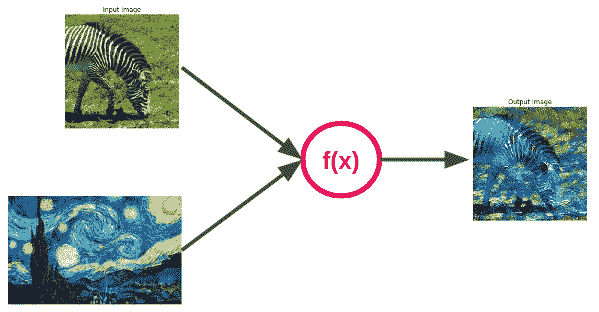

然而，不像其他图像到图像的翻译问题利用每像素的[损失](https://deepai.org/machine-learning-glossary-and-terms/per-pixel-loss-function)作为目标函数，很难根据相同的损失来测量风格转换。

*那么，我们如何确定风格转换问题的损失函数呢？*

[一种艺术风格转移的神经算法](https://arxiv.org/abs/1508.06576)提出使用一种在对象识别上训练的卷积神经网络( **VGG-19** )来计算风格转移的客观损失。

本文的主要思想是图像的风格和内容可以在卷积神经网络中分别表示。这允许我们将一个图像的样式表示(样式-图像)和另一个图像的内容表示(内容-图像)组合起来，以生成新的**样式转换图像**。

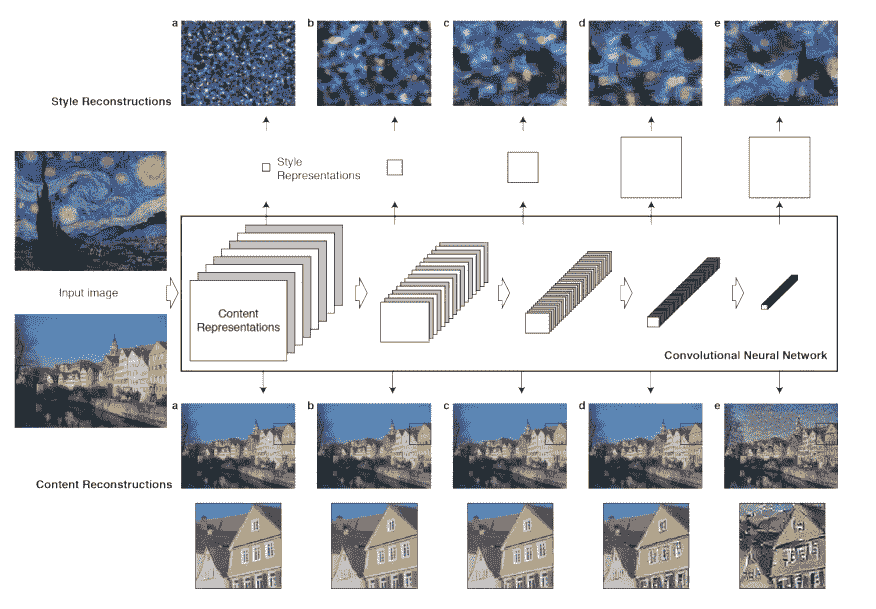

使用 VGG-19 网络的风格和内容重建。( [arXiv:1508.06576](https://arxiv.org/abs/1508.06576) )

*内容和风格表现的真正含义是什么？*

# 内容表示

> 网络中的较高层根据对象及其在输入图像中的排列来捕获高级内容，但是不约束重建的精确像素值。相比之下，较低层的重建只是简单地再现原始图像的精确像素值。

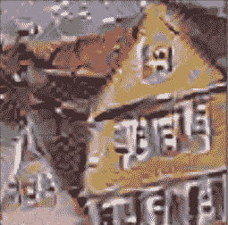

更高层的内容表示( [arXiv:1508.06576v2](https://arxiv.org/abs/1508.06576v2)

我们知道，在为物体识别而训练的 CNN 中，网络的每一层都学习图像的表示，并且随着我们深入各层，这些表示变得更加具体。例如，初始层学习检测边缘和轮廓，而较高层学习检测一些对象。这意味着图像内容在 CNN 的较高层中被更好地表示，而较低层仅提供相同的像素值。我们使用这种内容表示来计算内容损失。

## 内容损失

在风格转换中，我们需要内容图像和生成图像的内容表示是相同的。我们假设一层 CNN 的输出由 ***ϕ(x).给出*** 内容损失简单地说就是内容图像的内容表示和来自特定层的生成图像之间的欧几里德距离，计算如下

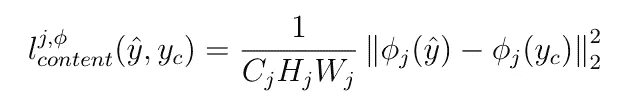

VGG 网络第 j 层的内容丢失。

注意:**，****【hⱼ】****，****【wⱼ】***分别代表第 j 层输出的通道、高度和宽度。*

# *风格表现*

> *为了获得输入图像风格的表示，我们使用最初设计的特征空间来捕获纹理信息。*

*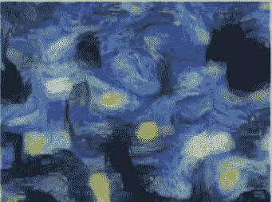*

*来自一个层面的星夜风格表现。( [arXiv:1508.06576v2](https://arxiv.org/abs/1508.06576v2) )*

*卷积神经网络的每一层都提供一个特征图作为输出。对于在物体识别上训练的 CNN，特征图中的每个通道代表图像的某些方面，例如边缘、圆、螺旋等。这些特征图不同通道之间存在相关性。从多个层考虑这些相关性，我们获得捕捉纹理的输入图像的多尺度表示。*

## *风格丧失*

*使用这种技术，我们可以获得任何图像的风格表示。现在，为了执行正确的样式转换，我们需要输入图像的样式表示和参考样式图像的样式表示相同。因此，这两种风格表现之间的距离可以作为我们需要最小化的损失。*

*但是我们如何计算相关性和相关性之间的距离呢？*

***Gram 矩阵**可用于计算特征图不同通道之间的相关性。我们假设一层 CNN 的输出由***【ϕ(x】***给出。那么特征图的 gram 矩阵可以被计算为*

*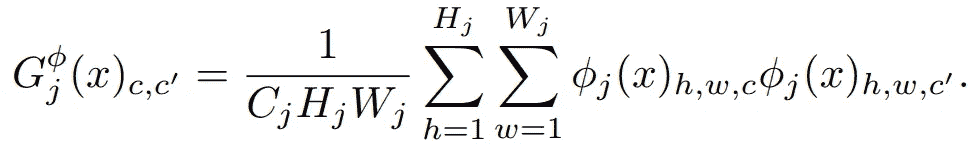*

*CNN 第 j 层的 Gram 矩阵。*

*一旦我们知道如何计算特征之间的相关性，现在我们就可以继续计算风格损失。这种损失不过是样式图像( *yₛ* )和生成图像( *ŷ* )的 gram 矩阵之间的欧几里德距离。注意，该论文提到了 gram 矩阵的差之间的 Frobenius 范数，它只不过是欧几里得距离。因为我们使用了多个层，所以我们对每个层的距离求和。*

*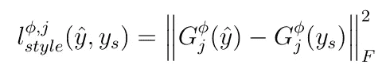*

*VGG 网络的第 j 次风格丧失。*

*内容损失和风格损失统称为**感知损失**。确切地说，感知损失是内容损失和风格损失的加权和。*

*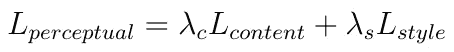*

*内容损失和风格损失的加权和*

# *感知优化*

*使用我们之前讨论的损失，现在我们需要设置算法来生成风格转移图像。我们使用感知优化来完成这项任务。*

*感知优化将白噪声、风格图像和内容图像作为输入。我们的目标是以这样一种方式更新白噪声，使得它匹配样式图像的样式表示和内容图像的内容表示。为此，我们计算感知损失，即白噪声和风格图像之间的风格损失(用于匹配风格表示)以及白噪声和内容图像之间的内容损失(用于匹配内容表示)。一旦我们得到损失，然后我们反向传播计算梯度和更新白噪声。我们重复这个过程，直到感知损失收敛到最小值。
**注意:**我们也可以使用内容-图像来代替白噪声。*

*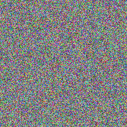*

*感知优化的可视化。*

*Pytorch 有一个非常好的[教程](https://pytorch.org/tutorials/advanced/neural_style_tutorial.html)用于神经风格转移的感知优化。一定要去看看！！。*

*这种算法的缺点是，每次对新图像，我们都需要从头开始执行感知优化。这样效率不高。*

**那么，如何才能让这个过程更快呢？**

# *变压器网络*

*我们可以根据感知损失训练一个网络，而不是更新白噪声。这个想法是在论文[实时风格转换和超分辨率的感知损失](https://arxiv.org/abs/1603.08155)中给出的，该论文使用了图像变换网络，并使用预先训练好的 **VGG-16** 网络对感知损失进行训练。*

*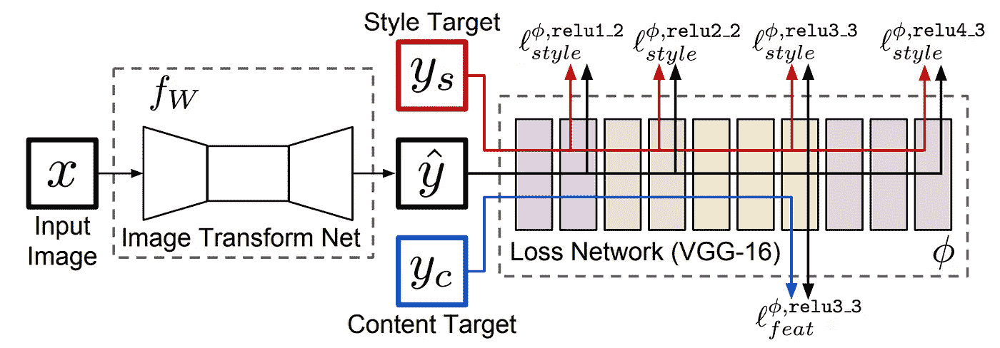*

*使用感知损失训练变压器网络( [arXiv:1603.08155](https://arxiv.org/abs/1603.08155)*

*使用这种方法，我们只需要训练网络一次。一旦我们训练了变压器网络，我们现在可以用它来进行风格转换。与前一种方法相比，这花费的时间要少得多。*

*但是，我们只能针对一种风格——形象来训练网络。我们需要从头开始训练一个不同的风格-形象的新网络。训练一个全新的网络是一项耗时的任务。*

**单个网络有可能学会所有风格吗？**

*是的，答案是**条件实例规范化**。*

# *多风格传输网络*

*论文[艺术风格的学习表示](https://arxiv.org/abs/1610.07629)提到许多风格可能共享某种程度的计算，并且这种共享被从零开始训练 N 个网络所丢弃。*

*为了在多种风格上训练单个模型，我们需要有一个条件网络。*

*但是我们应该把我们的条件放在哪里呢？*

*规范化层可以用来整合我们的条件。在我们进入集成条件之前，让我们回顾一下规范化层的作用。*

## *正常化*

*标准化层接收前一卷积层的输出特征，计算平均值( **μ** 和标准偏差( **σ** )并标准化这些特征。然后使用可学习的权重 ***γ*** 和 ***β*** 对标准化特征进行缩放和转换。*

*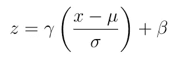*

*正常化*

## *条件实例规范化*

*现在我们知道了规范化是如何工作的，我们可以继续前进了。发现我们可以为不同的风格使用不同的可学习权重。每种风格有不同的可学习权重，这使我们有可能调节网络。通过对不同的风格使用不同的 ***γ*** 和 ***β*** ，我们能够单独学习每种风格。*

*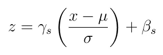*

*条件实例规范化。下标“s”是条件。*

*由于归一化仅缩放和转换特征，所以训练 N 型转移模型比从头开始训练 N 个单独的网络需要更少的参数。*

*该模型的感知结果类似于单风格转移网络。*

*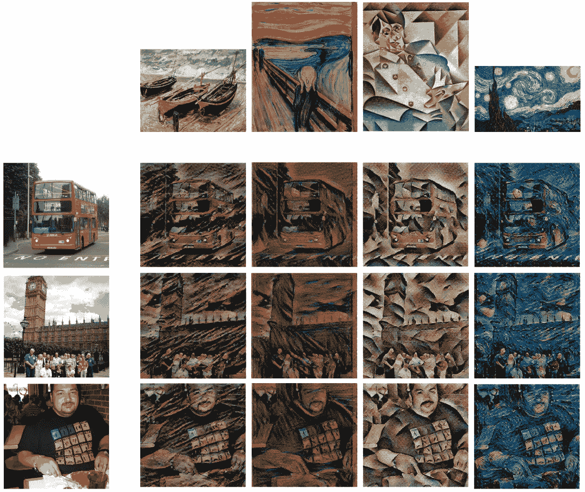*

*不同风格的风格转换结果。*

*除了能够执行多种风格转换之外。该网络在视频输入方面也表现良好，并实时提供结果。*

*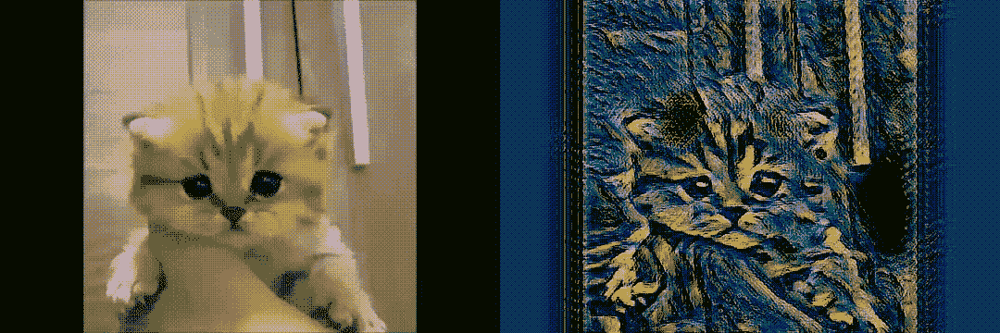*

*学习神经类型转移帮助我理解卷积神经网络中每一层的工作。此外，用于计算损失的技术让我对如何在神经网络中观察纹理有了很好的了解。我希望这篇文章能让你对风格转移网络的工作原理有一点直觉，并向你解释使用感知损失函数的原因。*

*如果你感兴趣，想看看风格转换是如何工作的，那么我在 Github 上有一个实现。请检查一下！[神经式转移](https://github.com/ChinmayLad/neural-style-transfer)。*

*请随意分享你对内容的想法，因为这是我的第一篇帖子，请帮助我改进它。谢谢你。*

# *参考*

1.  *[艺术风格转换的神经算法](https://arxiv.org/abs/1508.06576v2)*
2.  *[实时风格转换和超分辨率的感知损失](https://arxiv.org/abs/1603.08155)*
3.  *[艺术风格的学术表现](https://arxiv.org/abs/1610.07629)*