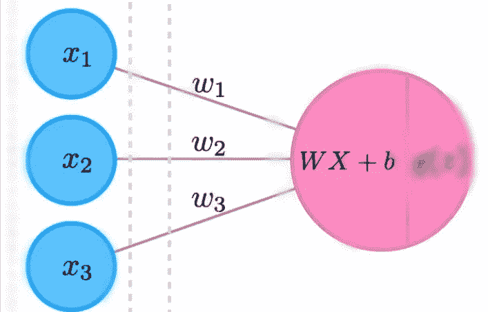
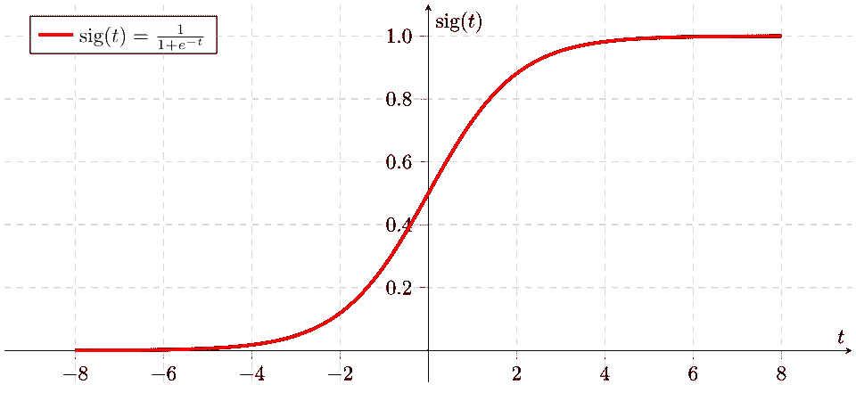
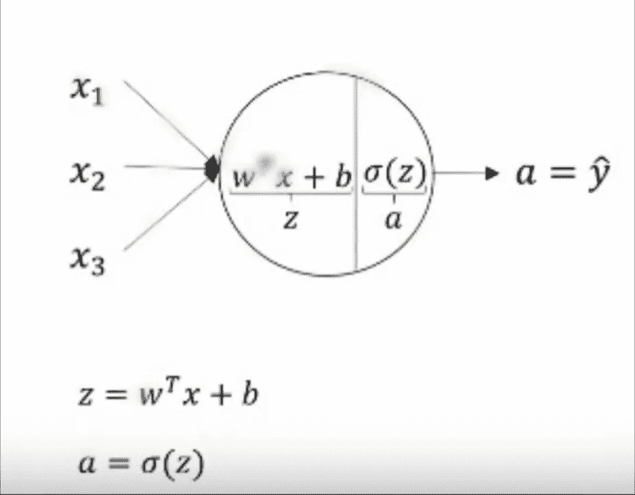

# 理解深度学习中的神经元

> 原文：<https://medium.com/analytics-vidhya/understanding-neurons-in-deep-learning-8308ce91271f?source=collection_archive---------8----------------------->

神经元是深度学习中神经网络的构建模块。在这篇文章中，我已经详细解释了神经元内部发生了什么！

想象你是一名小学生的绘画老师。你让他们画动物。所有的孩子都画了不同的动物给你看。看完这些生动的图画后，你可能会感到困惑，花上相当长的时间才知道这是哪种动物！

嗯，这幅画很有趣！你观察了画中动物的各种特征，如耳朵、尾巴、眼睛，得出的结论是这种动物是猫，那是狗等等。
机器将如何学习对动物图像进行分类？人类的思维方式也可以进行类似的类比。

让我们假设一台计算机是一个孩子，我们是它的主管(例如:老师、父母)，我们希望这个孩子(计算机)学习一只猫的样子。我们会给孩子看几幅不同的图片，其中一些是猫，其余的可以是任何东西的图片(狗、鸟等等)
当我们看到猫时，我们会喊‘猫！’。当它不是猫的时候，不！不是猫。对孩子这样做几次后，我们给他们看一张新图片(之前没有展示过)，并问“这是一只猫吗？”，他们会正确地(大多数时候)说“猫！”或者‘不！“不是猫”，取决于图片是什么。
同样，我们给定标记的输入数据(标记为猫或非猫),以推导出在给定新的未标记数据时产生适当输出的函数。
现在让我们深入了解它是如何做到的。

在深度学习中，我们使用神经元来获得输出函数。
什么是神经元？
人工神经元是一种数学函数，它采用一个或多个输入来获得线性函数，然后将其传递给非线性函数，也称为激活函数，以获得神经元的输出。如果你在想，这个神经元对我来说似乎很神秘，不要担心，我已经非常详细地解释了这个神经元内部实际发生的事情:)

我们将特征作为神经元的输入。让我们看看单个神经元内部发生了什么。
假设我们有三个输入特征 x1、x2 和 x3。所以，下一个问题是——所有的特性都同样重要吗？。考虑一下，x1 特征告诉我们它是否有尾巴，这比 x2 特征告诉我们它是否有翅膀更有分量。因此，我们的下一个目标是确定这些特性在决定最终输出中的重要性。我们通过使用“权重”来做到这一点。假设每个特征的权重为 w1、w2 和 w3。这里，权重 w1 告诉我们特征 X1 相对于其他特征具有多少权重，权重 w2 告诉我们 x2 具有多少权重，等等..
我们还添加了偏差项“b ”,这有助于更好地拟合数据。
现在我们了解了特性及其权重和偏差。现在让我们看看神经元如何从这些特征中学习。

设输出为 z。

## z =(x1 * w1+B1)+(x2 * w2+B2)+(x3 * w3+B3)

神经元将根据我们作为数据输入到模型中的示例，从权重和偏差值中学习。一个神经元可以决定哪个特征更重要，例如:猫的图像中有一条尾巴，所以权重必须大且正，哪个特征不重要，例如:猫的图像没有翅膀，所以权重必须负且大。通过这样做，神经元调整权重。

我们基于输入特征导出了一个简单的线性函数(z)。我在神经元的定义中也提到过，我们将把这个线性函数作为一个参数传递给非线性函数，以得到神经元中的输出。

为什么需要非线性函数？
当我们有一个大的数据集并且有许多特征时，线性函数(z)的值变得非常大。我们希望将该值限制在 0 到 1 的区间内，即概率在 0-100%之间，其中 0 表示它不是猫，1 表示它是猫。如果值在 0 和 1 之间(例如:0.97)，我们将知道它有多大可能是一只猫！
有许多非线性函数，也称为激活函数，可供选择。Sigmoid、Relu、tanh 是激活函数的一些例子。我将在下一篇文章中给出关于每个激活函数的更多见解。
现在，让我们使用 sigmoid 函数。

从 sigmoid 函数的曲线图可以看出，该值位于 0 和 1 之间。

## sigmoid(z)= sigmoid((x1 * w1+B1)+(x2 * w2+B2)+(x3 * w3+B3))

因此，我们通过将线性函数传递给激活函数来获得神经元的输出。
所以现在我们有了一个如下所示的神经元:

恭喜你。现在你明白了神经元内部实际发生了什么！

为了获得更恰当的直觉，让我们看看大脑的类比。这是大脑中的一个神经元。

在这张生物神经元的图片中，神经元接收像 x1、x2 和 x3 这样的电信号并进行计算。然后，如果神经元触发(激活>阈值)，它会沿着轴突发送一个电脉冲。
我在神经网络中的单个神经元和生物神经元之间使用了这个简单的类比，只是为了让你理解，但即使是今天，神经科学家也几乎不知道大脑中的单个神经元在做什么，因为它更复杂。

希望你能够理解深度学习中神经元内部的黑盒。