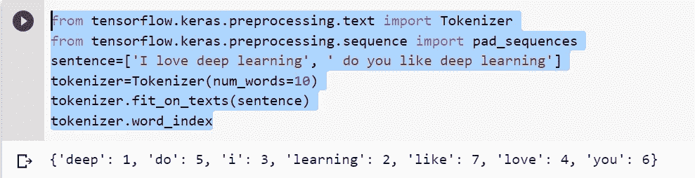
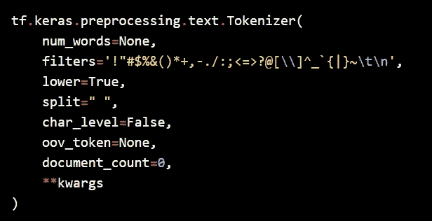
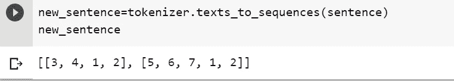
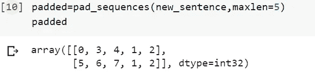

# 通过示例了解 NLP Keras 标记器类参数

> 原文：<https://medium.com/analytics-vidhya/understanding-nlp-keras-tokenizer-class-arguments-with-example-551c100f0cbd?source=collection_archive---------3----------------------->

众所周知，对于图像和文本相关的问题，输入的准备是完成深度学习管道中非常重要的步骤。在这篇博客中，我们将尝试理解一种最重要的文本预处理技术，称为**记号赋予器**以及 keras 中可用的参数。

首先，我们将通过一个简单的例子来理解 tokenizer 的基本含义。

机器不理解文本，所以我们需要将文本转换成机器可读的语言，这就是数字。为了将文本转换成数字，我们在 keras 中有一个名为 **Tokenizer 的类。请看下面的简单例子，以便更清楚地理解上下文**

“我爱深度学习”这句话将由 keras 中的 Tokenizer 指定为以下数字

I — 2，love — 4，deep — 1，learning — 3(注:以前是按字母顺序分配数字的。

就像这样，如果我们将一个包含大量文档的大型数据集传递到 keras tokenizer 中，它会将所有文本单词转换为数字序列。我们已经了解了 token 的概念，现在，我们将尝试了解如何在大型数据集上使用 Keras API 来实现它。

为此，我们需要首先使用下面的代码从 keras 文本预处理中导入 tokenizer 类

**从 tensor flow . keras . preprocessing . text 导入标记器**

一旦我们导入了 Tekenizer 类，现在我们将创建一个 Tokenizer 类的对象实例。创建对象实例后，我们将在创建的对象实例上使用名为“fit_on_texts”的方法，并将句子或大型数据集作为“fit_on_texts”方法中的参数传递。需要注意的一点是，fit_on_text 方法接受 list，因此我们需要将我们计划对其应用 tokenizer 的语句或数据集中的列转换为 list。这可以通过下面的代码来完成。

对句子应用标记的代码

现在，我们将尝试理解上述代码第 3 行中标记化器的重要类参数。以下是参数列表:

Keras 标记器参数

第一个参数是 num_words。在我们的例子中，我们使用 num_words 作为 10。num_words 就是你的词汇量。我们在选择这个参数时需要非常谨慎，因为这将影响模型的性能。默认情况下，num_words 的值为 none。num_words 的最佳值是"`len(tokenizer.word_index) + 1".`

第二个是过滤器，即所有元素都是字符的字符串，将从输入文本中过滤掉。默认情况下，该值是所有标点符号，加上制表符和换行符，减去`'`字符。

第三个是 lower，即一个布尔值，表示是否将所有传递的文本转换为小写。默认情况下，它被设置为 True。

第四个是 split，表示给定的文本将从指定的分隔符中分离出来。例如，在句子“我/爱/深度/学习”中，如果我选择分隔符= "/"，结果输出将是['我'，'爱'，'深度'，'学习']

第五个是 char_level，默认为 False。这意味着它在询问我们是想要字符级还是单词级的标记化。如果我们将 char_level 设置为 True，那么我们示例将被标记为“I=1，l-2，o-3，v-4，e-5，m-6，a-7 等等”。高级别标记化操作将发生在字符级别，因此通常我们需要将该参数设置为 False。

第六个是 oov_tokens。这是最重要的参数之一，默认情况下没有，但建议我们需要指定"<oov>"，因为当我们在 tokenizer 对象上执行 text_to-sequence 调用时，我们之前创建的对象将用"<oov>"单词替换所有超出词汇表的单词。text_to_sequence 什么也不是，但是它按照我们提供给 tokenizer 类的句子转换序列中生成的标记。从下面的片段中会更清楚。</oov></oov>

文本 _ 至序列

> 从上面的例子中，我们可以清楚地看到，我们输入给分词器的文本序列现在被转换成了数字序列。我们可以参考前面的代码片段输出进行比较。

我们已经非常接近于将数据输入到我们的神经网络层，因为我们已经了解了如何将单词转换为令牌以及如何将单词序列转换为数字序列。

我们需要知道一件非常重要的事情，我们的神经网络期望相同长度的输入序列，但是现实世界的数据集或句子在 99.9%的情况下会有不同的序列长度。所以我们的最后一个目标是让所有的句子长度相同，我们可以使用 keras " **填充**"和"**截断**"逻辑来实现。为了填充和截断，我们需要从 keras 中的“keras.preprocessing.text”导入“pad_sequences”类。

我们可以在句首或句尾加 0，使所有句子长度相同。我们曾经找到最长的句子，并应用填充 0 来匹配相同大小的序列长度。这可以使用下面的代码来完成

填料

我们需要将 sequence 和 maxlen 指定为 pad_sequences 类中的一个属性。在我们的例子中，我们有两个句子，最长句子的长度是 5，所以我们将 maxlen 作为 5 传递，我们得到了输出句子，两个句子的长度都是 5。这是填充的例子，现在我们将看到截断

**截断:**假设我们有 200 个句子，一个句子的长度为 100，所有其他 199 个句子的长度在 15-20 之间。在这种情况下，填充不是一个好的选择，因此我们将选择截断，其中我们将 maxlen 指定为 20 或 25。一旦我们将 maxlen 指定为 25，所有 199 个句子将被填充为长度 25，最长的句子将从 100 被截断为 25。至此，我们已经实现了所有输入序列的相同长度，祝贺我们已经为神经网络的输入准备好了数据集。下面是我们在处理填充和截断时需要记住的几点。

1.  **默认情况下 pad_sequences 填充到最长的序列**
2.  **指定 maxlen 来设置序列的长度**
3.  **默认情况下，从序列的开始处填充或截断序列**

恭喜，现在我们一步一步地理解了标记化的概念，最后我们为神经网络的输入准备好了数据集。在下一篇博客中，我们将逐步了解更多关于嵌入和预训练嵌入的内容，如 word2vec、glove 和 BERT。

要获得更多参考，我建议浏览 keras 官方文档。如果你对标记化有任何疑问，请在下面评论。

# 敬请关注

句子=['我爱深度学习'，'你喜欢深度学习吗']