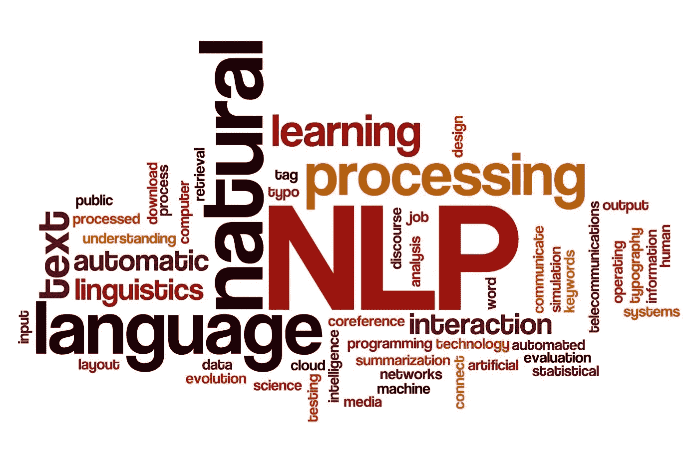

# 了解 NLP 管道

> 原文：<https://medium.com/analytics-vidhya/understanding-nlp-pipeline-9af8cba78a56?source=collection_archive---------3----------------------->

## 自然语言处理流水线阶段介绍

自然语言处理(来源:Wootric)

自然语言处理是世界上发展最快的领域之一。它是人工智能的一个分支，处理人类与计算机的交互。NLP 中的主要挑战包括[语音识别](https://en.wikipedia.org/wiki/Speech_recognition)、[自然语言理解](https://en.wikipedia.org/wiki/Natural_language_understanding)和[自然语言生成](https://en.wikipedia.org/wiki/Natural_language_generation)。NLP 正在进入许多产品和…