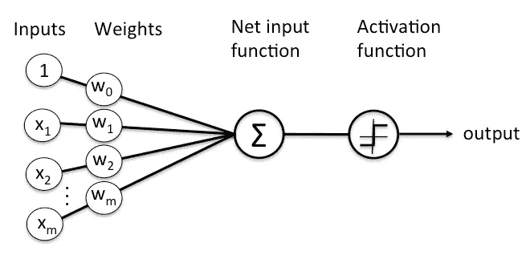
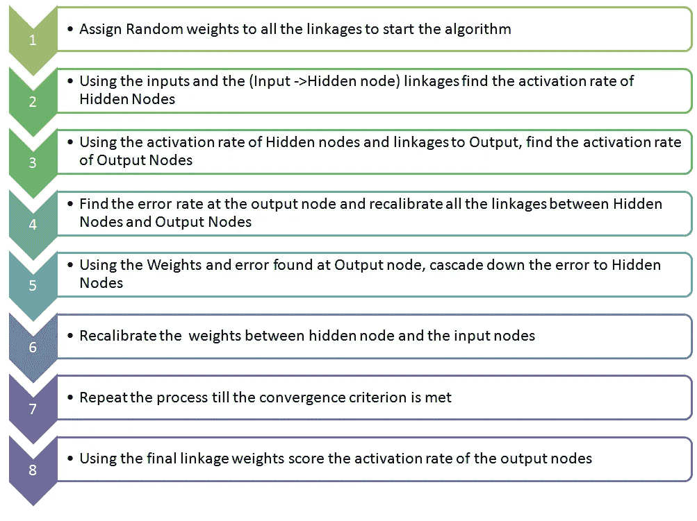
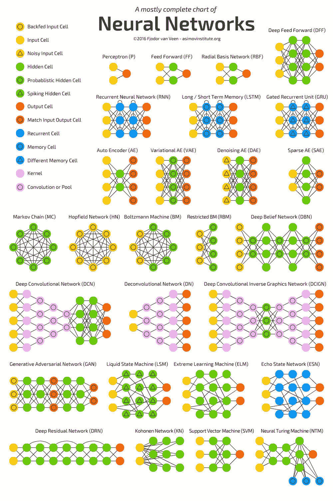

# 理解人工神经网络(ANN)

> 原文：<https://medium.com/analytics-vidhya/understanding-of-artificial-neural-networks-ann-a2037abec00b?source=collection_archive---------12----------------------->

# **简介**

人工神经网络基于连接节点的集合，并且被设计来识别模式。它们是深度学习的一部分，在深度学习中，计算机系统通过分析训练样本来学习识别模式和执行任务。例如，对象识别系统可以被提供给数以千计的房屋、汽车、交通信号、动物等标记图像。并且将识别图像中的视觉图案，以便它能够始终与定义的标签相关联。这些灵感来自我们大脑的生物神经网络。神经网络是像人脑一样松散地建模的，可以由数百万个简单的处理节点组成，这些节点被称为密集互连的感知机。一个单独的节点可以连接到它下面的层中的几个节点，它从这些节点接收数据，也可以连接到它上面的层中的几个节点，它向这些节点发送数据。每个节点可以接收多个输入，对其进行处理，并将输出传输到下一层的神经元。这些连接也被称为边。节点和边都有权重，用于调整连接处的信号强度。当网络激活时，节点通过其每个连接接收不同的数字/信号，并乘以相关的权重。每个节点的输出(集合信号)通过其输入之和的非线性函数来计算。如果输出低于阈值，节点不会将数据传递到下一层。然而，如果输出超过阈值，节点将数据传递给下一层的所有输出连接。

最初，当训练神经网络时，权重和阈值被设置为一些随机值。在这里，训练数据被馈送到输入层，输入层传递到随后的隐藏层，在每个节点被相乘和转换，并以复杂的方式相加，直到到达输出层，在输出层，最终预测输出与预期输出进行比较，并计算误差。在训练过程中，不断调整每个节点的阈值和权重，直到训练数据产生一致的预期输出。在现代，神经网络算法作为一种新的人工智能技术出现，可以应用于实时问题。

# **神经网络架构**

神经网络由输入层(最左边的层)组成，输入层内的神经元称为输入神经元。最右边的层是由输出神经元组成的输出层。在下图中，输出层由单个神经元组成。中间层也称为隐藏层。下图由两个隐藏层组成。这种由多层组成的神经网络也被称为多层感知器或 MLPs。

**神经网络架构**

现在，让我们探索一下，每个节点上的计算。节点松散地模仿人脑的一个神经元。它使用一组权重或系数来计算输入数据，这些权重或系数根据算法试图处理的任务来放大或抑制输入。输入和权重乘积的总和通过节点的激活函数传递。基于其值与阈值的比较来决定输出信号是否应该通过，以及该信号应该在多大程度上进一步通过神经网络以影响最终结果。如果信号通过该节点，则表明特定节点被激活。

**节点计算**

一层是一排多个这样的节点或神经元，就像开关一样，当输入通过神经网络时打开或关闭。每一层的输出都是下一层的输入。可调权重与输入特征的配对确定了这些特征对于神经网络如何对输入进行分类和聚类的重要性。下面是人工神经网络(ANN)的框架

【人工神经网络(ANN)框架】作者:analyticsvidhya.com

# **神经网络的类型**

有多种类型的神经网络，它们在确定自己的规则和学习模式时使用不同的原理。他们每个人都有自己独特的优势。下图描述了各种类型的神经网络。

**神经网络的类型**

# **总结**

神经网络代表了非常强大的人工智能技术，因为它们从空白状态开始，并找到通往精确模型的道路。神经网络是有效的，但其建模方法复杂，因为它不能对输入和输出之间的财务依赖关系做出假设。神经网络最好的部分是，它们的设计方式类似于人脑中的生物神经元。因此，它们被设计为在大量数据中更快地学习和更准确地识别复杂模式，并且其性能随着更多的数据和使用而提高。因此，神经网络是构建关键人工智能(AI)系统的基本框架。

# **参考书目**

1.  Nguyen，h . Bui，x-n .，Bui，h-b .，& Mai，n-l .(2020 年)。人工神经网络预测越南德奥奈露天煤矿爆炸引起的空气爆炸超压的比较研究。神经计算和应用，32(8)，3939–3955。[https://doi.org/10.1007/s00521-018-3717-5](https://doi.org/10.1007/s00521-018-3717-5)
2.  Orimoloye，L. O .，Sung，m-c .，Ma，t .，& Johnson，J. E. V. (2020 年)。比较深层前馈神经网络和浅层结构预测股票价格指数的有效性。专家系统与应用，139，112828。[https://doi.org/https://doi.org/10.1016/j.eswa.2019.112828](https://doi.org/https://doi.org/10.1016/j.eswa.2019.112828)
3.  舍斯汀斯基(2020)。递归神经网络(RNN)和长短期记忆(LSTM)网络基础。物理 D:非线性现象，404，132306。https://doi.org/https://doi.org/10.1016/j.physd.2019.132306
4.  姚平，吴，h，高，b，唐，j，张，张，w，杨，j，钱，h(2020)。完全硬件实现的忆阻器卷积神经网络。自然，577(7792)，641–646。【https://doi.org/10.1038/s41586-020-1942-4 
5.  [https://www . analyticsvidhya . com/blog/2014/10/ann-work-simplified/](https://www.analyticsvidhya.com/blog/2014/10/ann-work-simplified/)
6.  [https://pathmind.com/wiki/neural-network](https://pathmind.com/wiki/neural-network)
7.  [https://medium . com/@ ODSC/5-本质-神经网络-算法-9336093fdf56](/@ODSC/5-essential-neural-network-algorithms-9336093fdf56)
8.  [http://neuralnetworksanddeeplearning.com/chap1.html](http://neuralnetworksanddeeplearning.com/chap1.html)
9.  [https://www.digitalvidya.com/blog/types-of-neural-networks/](https://www.digitalvidya.com/blog/types-of-neural-networks/)