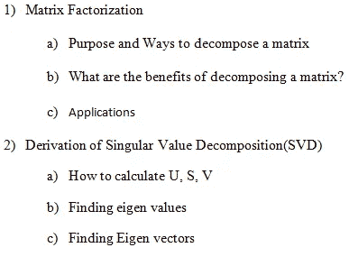
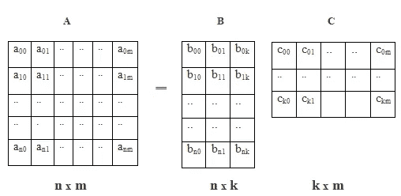
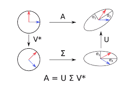
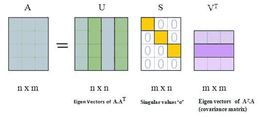
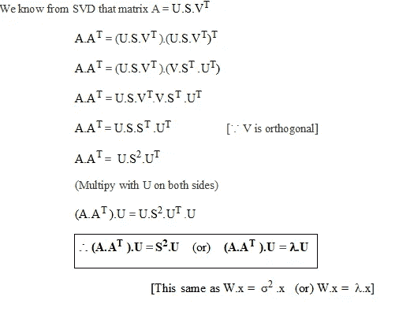
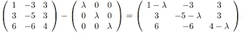
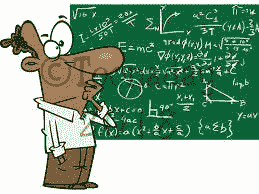
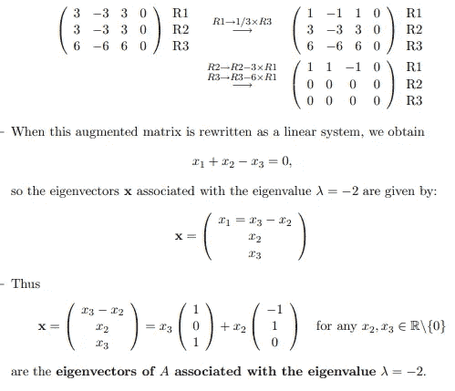

# 理解矩阵分解和奇异值分解

> 原文：<https://medium.com/analytics-vidhya/understanding-of-matrix-factorization-mf-and-singular-value-decomposition-svd-1a38c2d5bbaa?source=collection_archive---------4----------------------->

在这篇博客中，我将简要介绍矩阵分解的理论方面，比如分解的目的和好处，用简单的术语介绍矩阵分解的应用，以便对矩阵分解有一个清晰的了解。

除此之外，它还涵盖了奇异值分解(SVD)的一步一步的推导，解释清楚每一步。

目录

# **矩阵分解**

矩阵分解**矩阵分解**是将一个矩阵近似为一个矩阵的乘积。它们用于实现高效的矩阵算法。

> *“一般的想法是，你可以将所有的结果‘因子’矩阵相乘，得到原始矩阵。”*

例如:6 = 2 * 3，其中 2，3 被视为 6 的因子，我们可以通过这些因子的乘积再次生成 6(即 2，3)。

以类似的方式， **A = B.C** ，A 可以表示为两个低维矩阵 B，C 的乘积，这里 k =维数(超参数)。

## **a)分解矩阵的目的和方法**

有许多不同的矩阵分解技术，每一种都可以在一类特定的问题中找到用途。

> 简而言之，这是两大类分解:
> a)一些只适用于‘n×n’矩阵
> b)一些适用于更一般的‘m×n’矩阵

**1)解线性方程组**，其中大部分矩阵分解成 2 部分。

*   LU 分解将矩阵分解为下三角和上三角矩阵。
*   QR 分解将矩阵 A 分解成正交矩阵 Q 和上三角矩阵 r 的乘积 A = QR。
*   Cholskey 分解等。
*   非负矩阵分解(NMF)将矩阵 A 分解成两个具有非负元素的矩阵。(A 也必须有非负元素)

**2)基于特征值的分解**，大多适用于方阵。其中矩阵分解成 3 个部分(最终旋转、缩放、初始旋转)。

*   PCA 是一种使用特征分解来获得变换矩阵的变换。
*   奇异值分解(SVD)将任何维数的矩阵分解为 3 部分 USV。

许多其他可能的方法是可用的。请参考[这里的](https://en.wikipedia.org/wiki/Matrix_decomposition)。

## **b)分解矩阵有什么好处？**

*   矩阵分解，将一个矩阵分解成两个比原始矩阵更容易求解的矩阵。这不仅使问题容易解决，而且减少了计算机计算答案所需的时间。
*   矩阵分解主要用于以简单的方式或快速的方式求解线性系统。
*   矩阵因式分解减少了计算机存储矩阵的空间，而不是存储大的非因式分解矩阵(A)，我们可以使用更少的存储空间来存储它的因子(即 B，C)，当矩阵的秩小时，有时甚至更小。

## c)应用

1.  缺失/不完整数据的插补。
2.  成像:分割和噪声去除。
3.  文本挖掘/主题建模。
4.  使用协同过滤的推荐。
5.  特征脸。

MF 的流行技术之一是 SVD，它以平滑的方式被完整地覆盖。

# **奇异值分解的推导**

SVD 是实(或)复矩阵的因式分解，它通过极坐标分解的扩展将标准方阵的特征分解推广到任何 **m x n** 矩阵。

换句话说，SVD 将任何维矩阵近似为 3 个低维矩阵，通过“旋转和缩放”保持最大方差，其形式为具有“前 k 个本征向量和本征值”的矩阵 USV。

> A = U S V '(最终旋转||缩放||初始旋转)

其中，U =左奇异值矩阵，S =奇异值矩阵，以及

v =右奇异值矩阵。

*   旋转矩阵由变换的数据点组成，其特征向量构成奇异矩阵 U 或 v
*   缩放矩阵具有按因子缩放的值

u，V 是正交矩阵，表示空间的旋转或反射，它们是彼此正交的特征向量。

> 特征向量的主要目的是保持向量的方向。

s 是对角矩阵，代表每个值按值‘σ’的缩放。

## a)如何计算 U，S，V？

因为 u，v 是正交矩阵，我们有一个性质 **U.Uᵀ =1** 和 **V.Vᵀ =1** 并且那些 u，v 矩阵包含 **A.Aᵀ** 和 **Aᵀ.的特征向量答**

(Aᵀ.的本征向量 a)构成 v 的列,(A.Aᵀ)的本征向量构成 u 的列

同样， **S** 中的奇异值是来自 A.Aᵀ(或)Aᵀ.的特征值的平方根 A 中的这些‘σ’值按降序排列。

将矩阵的所有数据点投影到低维空间中，使得这些特征向量在该维中保持最大方差，并且与每个特征向量相关联的每个特征值描述了“在该维中解释了多少%的方差”。

**注:**

1.  λ~ σ(即特征值相当于奇异值的平方)。
2.  如果 W 是矩阵，那么特征向量可以通过 W. **x** = λ来计算。x (or) W.x= σ。x

其中，x=特征向量，λ (or) σ =特征/奇异值。

让我们开始推导 U 和 s。

**语句:(A.Aᵀ)。x = λ。x** 要找到 u，先从 A.Aᵀ的特征向量‘x’开始

**证明:**

## **b)寻找特征值(** λ) **:**

如果 x 不为零，那么这个特征方程(W- λ。我)。x = 0 会有解。

W.x- λ.I.x = 0 ……(‘w’不过是 A.Aᵀ矩阵)。

矩阵的行列式(W- λ。I)必须等于零。从而从特征方程的解中， **det |W- λ。I|=0**

例子: **W — λ。我**

det |W- λ。I| **=** λ -12 λ + 16 **=** 0

∴求上述方程的根，我们得到 a 的特征值

λ = 4, −2.

求解这个行列式方程，我们得到特征值'λ',从中我们可以导出奇异值'σ'。

**哎呀！**

## c)找到特征向量(x):

*   将这些λ代入方程(W- λ)。我)。x=0，我们得到矩阵的第一种形式为(W-4。我)。x 和(W+2I)。x
*   构建增广矩阵(W+2I ),并通过执行行操作转换为行梯队形式。[ [高斯·乔丹消去法](https://en.wikipedia.org/wiki/Gaussian_elimination#Example_of_the_algorithm)

**特征向量的计算示例**

对于每个‘λ’值，我们得到一个特征向量。

所以，最后得到的向量就是 w(即 A.Aᵀ)的本征向量。

所有这些向量被组合成特征向量矩阵，这是我们的左/右奇异矩阵 U 或 v。

详细计算参见 [**本**](https://www.scss.tcd.ie/Rozenn.Dahyot/CS1BA1/SolutionEigen.pdf) 。

重复同样的过程，计算 Aᵀ.的特征值和特征向量一个可以做‘V’的。

**参考文献:**

*   [https://www.scss.tcd.ie/Rozenn.dah yot/cs1ba 1/solution eigen . pdf](https://www.scss.tcd.ie/Rozenn.Dahyot/CS1BA1/SolutionEigen.pdf)
*   [http://web . MIT . edu/be . 400/www/SVD/Singular _ Value _ 分解. htm](http://web.mit.edu/be.400/www/SVD/Singular_Value_Decomposition.htm)
*   [https://en.wikipedia.org/wiki/Singular_value_decomposition](https://en.wikipedia.org/wiki/Singular_value_decomposition)
*   [https://www . quora . com/What-the-different-species-of-matrix-decomposition-and-What-purpose-does-one-serve](https://www.quora.com/What-are-the-different-kinds-of-matrix-decomposition-and-what-purpose-does-each-one-serve)