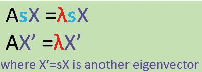
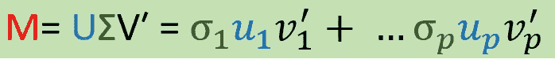
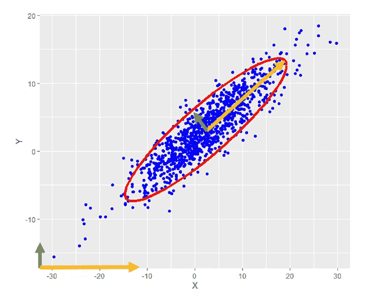

# 理解奇异值分解和主成分分析

> 原文：<https://medium.com/analytics-vidhya/understanding-of-svd-and-pca-2ebeae8c6ad0?source=collection_archive---------4----------------------->

我们不喜欢复杂的东西，我们喜欢简洁的形式，或者在不丢失重要信息的情况下代表复杂事物的模式，以使我们的生活更容易。

当我们处理一个高维的矩阵(作为收集由行和列组成的数据的工具)时，有没有一种方法可以让我们更容易理解数据信息，并找到它的低维代表？

# **内容:**

1、特征分解的几何解释

2、奇异值分解

3、如何将 SVD 连接到数据？

4、方差-协方差矩阵的性质

5、主成分分析

6、主成分分析的局限性

# **特征分解的几何解释:**

特征分解的概念在计算机视觉和机器学习等许多领域都非常重要。矩阵特征分解的几何解释有助于使冗长的理论更容易理解。让我们来看一个等式:

*   其中 A—方阵；X —特征向量；λ —特征值。
*   右边的图是左边方程的一个简单例子。
*   如果两边都乘以任何一个正标量，两边仍然相等

X 和 X’都对应于相同的特征向量λ。由于 s 可以是任何非零标量，我们看到这个唯一的λ可以有无穷多个特征向量。那么特征向量和特征值是什么意思呢？让我们看看 2×2 矩阵的几何。在飞机上:

这两个向量(红色和蓝色线从原点开始到点(2，1)和(4，5))对应矩阵 a 的两个列向量，根据例子，λ = 6，X = (1，1)′，我们在上面的 RHS 子图上加上向量(1，1)′

*   子情节的解释(rhs):

## **在向量 X 上应用矩阵 A 将等于向量 X 的λ倍拉伸(** λ可视为扩展的幅度)**。**最长的红线(λX)是将特征向量 X= (1，1)’拉伸特征值(λ = 6)倍。

再次，在方程中:AsX = λsX，如果我们设 s = 2，那么特征向量更新，AX′=λX′，新的特征向量 X′= 2X =(2，2)′但是对应的λ不变。下面是 A 的特征分解的另一个几何图形。最长的红色向量意味着当在特征向量 X′=(2，2)′上应用矩阵 A 时，它将等于将新的特征向量 X′=(2，2)′λ= 6 倍拉伸的最长的红色向量。

## **有意思吧？如果找到矩阵的特征向量和特征值，就可以用更简单的方式来表示了！**

# **奇异值分解(SVD):**

奇异值分解基于特征值计算，它将方阵 A 的特征分解推广到任意 m×n 维矩阵 M。

*   m 被分解成三个矩阵 U，σ和 V，它可以展开为系数为σ的正交基方向(U 和 V)的线性组合。
*   u 和 V 都是正交矩阵，这意味着 UU′= VV′= I，I 是单位矩阵。所以在上面的等式中:

*   σ是对角线矩阵，奇异值位于对角线上。σ1 ≥ σ2 ≥ … ≥ σp ≥ 0，降序排列，非常类似于本征分解中的伸缩参数λ。

**σ1 ≥ σ2 ≥ … ≥ σp ≥ 0 均为奇异值，p=min(m，n)**

*   方程 M = uσV′的几何解释:

将矩阵 M = uσV’应用于 X，

*   步骤 1–2:V′X 是 X 上的旋转。
*   步骤 2–3:σ(V’X)进行拉伸。
*   步骤 3–4:U(σV′X)= MX 再次旋转。

# **记得我们提到过“拉伸”，对吗？那么奇异值分解和特征分解有什么关系呢？**

回想在特征分解中，AX = λX，a 是方阵，我们也可以把方程写成:A = XλX^(-1).

(1)在特征分解中，我们对行和列空间使用相同的基 X(特征向量),但是在 SVD 中，我们使用两个不同的基 U 和 V，其中列跨越 m 的列和行空间。

(2)特征分解中 U 和 V 的列是正交基，而 X 的列不是正交基。

(3) SVD 用于所有有限维矩阵，而特征分解仅用于方阵。

(4) **对于对称正定矩阵 S 如协方差矩阵，SVD 和特征分解相等，我们可以写成:**

# **如何将 SVD 连接到数据？**

让我们来看看 x 和 y 的散点图:

假设我们收集两个维度的数据，乍一看，你认为可以表征数据的重要特征是什么？

(1)所有那些数据的位置，对吗？例如，这组数据的中心位置——平均值

(2)数据如何在不同的方向上传播(幅度)。—方差

你有没有一种感觉，这个图与我们已经讨论过的一些图非常相似？下一个呢？

是不是很像我们现在在 SVD 的几何解释里？旋转方向和拉伸之类的东西？这两者之间有什么联系吗？

好了，我们来看上面这个图，两个有方向的轴 X(黄色箭头)和 Y(绿色箭头)是互相正交的。散点图的主要形状，由椭圆线(红色)显示，清晰可见。椭圆内的新箭头(黄色和绿色)仍然是正交的。想象一下我们如何把原来的 X 和 Y 轴旋转到新的轴上，也许还可以把它们拉伸一点。现在，

太棒了。

我们能在数据分布上应用奇异值分解的概念吗？如果能找到正交基和拉伸量级，就能表征数据了吗？如果当数据有很多维度时，我们还能使用 SVD 吗？它将如何帮助我们处理高维空间？

先来看看方差-协方差矩阵的好性质。

# **方差-协方差矩阵性质:**

很幸运我们知道方差-协方差矩阵是:

(1)对称

(2)正定(至少半定，这里我们忽略半定)

因此，对方差-协方差矩阵进行特征分解和奇异值分解是相同的。并且在方差-协方差矩阵 s 上计算特征分解或 SVD 是如此容易

# **主成分分析(PCA):**

让我们一起研究方程式，我们有

*   x = uσV′
*   s = X′X = VDV′，D =σ×σ和

*   给定 VV′= I，我们可以得到 XV = UΣ，并让:

*   因为σ1 ≥ σ2 ≥ … ≥ σp ≥ 0，所以 Z1 被称为 X 对应于最大σ1 的第一分量。Var(Z1) = Var(u1σ1) = σ1× σ1。
*   u1 是所谓的归一化第一主分量。
*   我们看到 Z1 是 X = (X1，X2，X3，… Xm)在 m 维空间的线性组合。

*   如果σp 明显小于之前的σi，那么我们可以忽略它，因为它对总方差-协方差的贡献较小。对于那些明显小于前面σ的，我们可以全部忽略。

# **这就是我们如何通过两步将方差-协方差的主成分分析作为降维方法:**

(1)对原始数据进行线性变换，形成作为新轴方向的正交基主分量。

(2)第一个分量具有最大的可能方差。第二个在与前一个正交的基础上具有第二大方差，依此类推。然后，我们只保留前 j 个有效的最大主分量，它们描述了方差的大部分(对应于前 j 个最大拉伸幅度),因此降低了维数。

# PCA 的局限性:

*   很难解释当我们进行真实世界数据回归分析时，我们不能说哪些变量是最重要的，因为每一个分量都是原始特征空间的线性组合。
*   它依赖于线性假设。
*   计算速度慢。
*   取决于原始数据结构的质量。