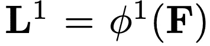

# 理解 OpenPose(带代码参考)—第 1 部分

> 原文：<https://medium.com/analytics-vidhya/understanding-openpose-with-code-reference-part-1-b515ba0bbc73?source=collection_archive---------0----------------------->

人体 2D 姿态估计是从输入图像或视频中定位人体部位如肩膀、肘部和脚踝的问题。在当今人类姿态估计的大多数真实世界应用中，需要高度的准确性以及“实时”推断。

由卡内基梅隆大学的研究人员开发的 OpenPose 可以被认为是实时人体姿态估计的最先进方法。代码库在 [github](https://github.com/CMU-Perceptual-Computing-Lab/openpose) 上是开源的，并且有很好的文档记录。Openpose 最初是用 C++和 Caffe 写的。

在整篇文章中，我可能还会引用来自[的一些代码，这里是](https://github.com/ildoonet/tf-pose-estimation)，OpenPose 的一个精确 Tensorflow 实现。以这篇文章为起点，然后阅读整篇文章，因为为了节省空间，我已经从文章中删除了一些具体的细节。

这篇文章分为三个不同的部分。第一部分将分析 OpenPose 的整体设置；本文中使用的主要神经网络体系结构和常用符号。第二部分将详细介绍置信度图和零件相似度图。文章的第三部分将讨论如何通过将问题视为图形匹配问题，从神经网络的输出中最终正确地组装关键点。

在我们进入 OpenPose 的细节之前，值得注意的是存在两个版本的论文 [this](https://arxiv.org/abs/1611.08050) 和 [this](https://arxiv.org/abs/1812.08008) 。第一份原始论文于 2016 年 11 月 24 日提交，最近一份于 2018 年 12 月 18 日提交。有几个小的区别，如神经网络架构和一些后处理方面，从而提高了速度和准确性。然而，总体思路和总体流水线仍然是相同的。关于这些差异的更多细节，你可以在最近的文章[的第一部分找到。在本文中，我们将探索本文的原始版本，因为在撰写本文时，github 上的大多数实现仍在使用第一篇文章中描述的步骤。](https://arxiv.org/abs/1812.08008)

# 整体管道

图一。整体管道。图像取自“使用部分亲和场的实时多人 2D 姿势估计”。

OpenPose 的管道实际上非常简单明了。

**首先**，一个输入的 RGB 图像(图 1a)作为输入馈入一个 ***【两分支多级】*** CNN。两个分支意味着 CNN 产生两种不同的输出。多阶段简单地说就是网络在每个阶段都是一层一层地堆叠起来。(*这一步类似于简单地增加神经网络的深度，以便为后面的阶段捕捉更精确的输出。*)

图二。两分支多级 CNN 的体系结构。图像取自“使用部分亲和场的实时多人 2D 姿势估计”。

**两个分支:**顶部分支，以米色显示，预测不同身体部位位置的置信图(图 1b)，例如右眼、左眼、右肘和其他部位。以蓝色显示的底部分支预测亲和场(图 1c)，其表示不同身体部分之间的关联程度。

**多阶段:**在第一阶段 **( *图 2 的左半部分* )** ，网络产生一组初始的检测置信图 **S** 和一组零件亲和场**l**然后，在每个后续阶段 **( *图 2 的右半部分* )** ，来自前一阶段两个分支的预测，连同原始图像特征 **F 在 OpenPose 实现中，最终阶段 ***t*** 被选择为 6。**

图三。多级网络的结果。**顶部**行显示了网络预测右手腕的置信图，而**底部**行显示了网络预测右前臂(右肩-右手腕)在不同阶段的部分亲和场。

图 3 显示了多阶段设置的积极益处。在这个例子中，我们观察到在最初的几个阶段，在身体的左右部分之间有一些最初的混淆。但是随着阶段的进展，网络变得更善于做出这些区分。

**最后**，置信图和亲和场正被贪婪推理处理(图 1d)，以输出图像中所有人的 2D 关键点(图 1e)。

# 置信图

返回参考图 2，神经网络的顶部分支产生一组检测置信图 **S** 。这在数学上定义如下。

图 4。集合 S 的数学表达式

**J，**身体部位的总数取决于训练 OpenPose 的数据集。对于 COCO 数据集，J = 19，因为有 18 个不同的身体关键点+ 1 个背景。下图显示了 COCO 数据集的不同身体部位及其分配的 ID。

图五。COCO 数据集的关键点 ID

为了更好地理解集合 **S** 代表什么，考虑这个例子。对于用 COCO 数据集训练的模型，集合 **S** 将具有 **S1、S2、S3、…、S19** 的元素。对于这个例子，让我们假设元素 **S1** 对应于关键点 id 为 0(在图 5 中)的置信图，该关键点 id 指的是鼻子。然后，置信图可能如下所示。

图六。这是一个非常简单的图表，显示了一个置信度图，其中表格中的每个单元格对应于原始图像中尺寸为 w x h 的一个像素。每个单元格中的值表示鼻子存在的置信度。

在图 6 中，我们假设全图的宽度和高度为 5，从而得到 5×5 的置信图。在这个例子中，图片中只有一张脸。因此，对于置信图 **S1(预测检测鼻子的置信)，**我们仅在有鼻子的区域中看到高置信区域，0.9。

# 零件亲缘场(PAF)图

返回参考图 2，神经网络的底部分支产生一组零件亲和场图 **L** 。这在数学上定义如下。

图 7。集合 l 的数学表达式。

**C，**肢体总数，取决于 OpenPose 的训练数据集。为了清楚起见，该论文将部分对称为肢体，尽管事实上一些身体部分对不是人的肢体。对于 COCO 数据集， **C** = 19。下图显示了不同的零件对。

图 8。元组的数组。每个元组对表示身体部位 ID 对。

您可以想象集合 **L** 中的每个元素是一个大小为 w x h 的映射，其中每个单元格包含一个表示元素对方向的 2d 向量。例如，在图 1c 中，身体部位对由右肩到右肘组成。该图显示了一个从右肩指向右肘的方向向量。

现在我们对数学符号及其代表的意义有了更好的理解，我们可以进入下一部分了。

# 神经网络细节

图像首先由预训练的卷积神经网络(例如 VGG-19 的前 10 层)进行分析，以产生一组特征图 **F** 。这种选择特征提取器产生 **F** 并不局限于 VGG-19。OpenPose 还有[的其他](https://github.com/ildoonet/tf-pose-estimation)变体，它使用 Mobilenet 或 Resnet 来提取图像特征，然后将其传递给图 2 所示的神经网络的其余部分。

**阶段 1:** 网络产生一组检测置信图 **S** 和一组部分相似性字段 **L.** 符号 **𝛒** 被用作表示具有输入 **F** 的 CNN 的函数变量以产生输出图 **S.** 符号 **𝛟** 被用作表示具有输入 **F** to 的 CNN 的函数变量

**阶段 t:** 来自前一阶段的两个分支的预测，连同原始图像特征 **F** ，被连接并用于产生更精确的预测。

在 OpenPose 论文中， **t** 从 2 到 6。上图中的逗号表示地图之间的连接。

**损失函数:**为了让网络学习如何生成最佳的 **S** 和 **L，**集合，作者在每个阶段的末尾应用两个损失函数，分别在每个分支应用一个。该论文在估计的预测和地面真实地图和字段之间使用了标准的 L2 损失。(*我们稍后还将看到作者如何想出一种方法来为每个* ***S*** *和* ***L*** )创建地面真值图)。此外，作者给损失函数增加了一些权重，以解决一些数据集不能完全标记所有人的实际问题。特定阶段 **t** 的损失函数如下所示。

1.  符号 **p** 表示在 **w** x **h** 图像中的单个像素位置。
2.  set **S** 和 **L** 旁边的 ***** 符号表示这是地面实况
3.  **S(p)** 的输出是一维向量，其由图像位置 **p.** 处的特定身体部位 **j** 的置信度得分组成
4.  L **(p)** 的输出是一个二维向量，它由图像位置 **p.** 处的特定肢体 **c** 的方向向量组成
5.  在 OpenPose 论文中， **J，**身体部位的总数是 19。同样， **C** ,“肢体”或身体到身体连接的总数是 19。
6.  **W(p)** 代表前面提到的称重功能。 **W(p) = 0** 当注释在图像位置 **p.** 处丢失时，使用掩码来避免在训练期间惩罚真正的正面预测。

**总体损失函数:**最后，结合两个损失函数，我们得出总体目标。

总体目标

# 神经网络实现(在 Caffe 中)

OpenPose 的作者使用 [Caffe](https://caffe.berkeleyvision.org/) 实现神经网络。如果你不熟悉 Caffe 也不用担心，和其他很多深度学习框架一样，Caffe 非常直观易懂。Caffe 模型在中定义。prototxt 文件。下面是使用 Caffe 定义的神经网络模型的截断版本。完整的模型文件占用了很多空间，因此我决定只显示前几行。你可以在这里找到[的完整型号定义。](https://github.com/CMU-Perceptual-Computing-Lab/openpose/blob/master/models/pose/coco/pose_deploy_linevec.prototxt)

为了更好地可视化神经网络架构，我们使用一个网络可视化工具，如[https://ethereon.github.io/netscope/quickstart.html](https://ethereon.github.io/netscope/quickstart.html)，它将文本转换成一些更容易理解的可视化。我建议你亲自尝试一下，因为它有一些交互性，你可以悬停在那里，它会向你显示每个模块的更多细节。

图九。openpose 神经网络前几层的快照。该部分对应于神经网络的一部分，在该部分中，它试图生成一组特征图

图 10。openpose 神经网络前几层的快照，续图 9。该部分对应于神经网络的一部分，在该部分中，它试图生成一组特征图

这里需要注意的一个**重要点**是模块 **relu4_4_CPM** 的输出是论文中描述的图像特征 **F** 的集合(图 2)。这组图像特征 **F** 与来自图 2 所示的两个分支的预测连接在一起，以在后面的阶段产生更精确的预测。

# 第一阶段

图 11。神经网络第**阶段的快照。**

如图 11 所示，你可以看到模块**“relu 4 _ 4 _ CPM”**的输出被送入两个模块“ **conv5_1_CPM_L1** ”和“ **conv5_1_CPM_L2** ”。第一个模块对应于图 2 的**底部**分支*(预测 PAF 向量组)*，而第二个模块对应于图 2 的**顶部**分支*(预测置信向量组)*。“ **conv5_5_CPM_L2** 的输出维数为(w x h x 19)，其中 19 对应于 COCO 数据集中的 19 个不同的关键点。“ **conv5_5_CPM_L1** 的输出维度为(w x h x 38)，其中 *38 = 19 * 2* 对应于 COCO 数据集中定义的 19 个不同的“肢体”。并且乘以 2，因为每个肢体的图中的每个单元表示具有 x&y 值的向量。

# 阶段 t

图 12。神经网络的第二个阶段**的快照。**

如图 12 所示，这里需要注意的一点是级联级采用三个输入。即 **F** 和第一级 **S 和 l**的输出，然后再次馈入两个不同的分支。这个过程重复进行，直到 t = 6，最终返回最精确的值。

图 13。神经网络的**最终**阶段(阶段 6)的快照。

最终的输出然后被连接并返回进行贪婪匹配，这将在本文接下来的几个部分中讨论。