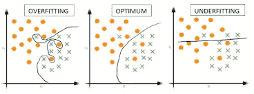
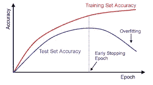

# 理解机器学习中的过拟合和欠拟合

> 原文：<https://medium.com/analytics-vidhya/understanding-overfitting-and-underfitting-in-machine-learning-2a2f3577fb27?source=collection_archive---------3----------------------->

如果你只是机器学习领域的“新手”，你听到有人说“这个模型不能很好地概括数据”，哎呀！这是我们应该理解的最重要的事情之一，如果我们试着实际地看待它，这是相当容易的。

# 上面写了什么？

> 在机器学习中，泛化通常指的是算法在一系列输入和应用中有效的能力。

假设我们正在设计一个机器学习模型。一个模型如何被说成是好的机器学习模型？->通过检查它是否以适当的方式从问题域中归纳出任何新的输入数据。这有助于我们对未来的数据进行预测，这是数据模型从未见过的。

现在，假设我们想检查我们的机器学习模型对新数据的学习和推广情况。为此，我们有过拟合和欠拟合，这是机器学习算法性能差的主要原因。

> 如果一个模型既不欠拟合也不过拟合，那么它就是好的。

如果它超出了你的头脑，那没关系，我们会慢慢地让它进入你的头脑。

机器学习如何工作的基本概述是，我们有数据，数据包含模型用来预测未来的许多特征(信息)。我们使用训练数据训练模型，以便它为预测未来实例做好准备。

# 欠拟合

当一个统计模型不能捕捉数据的潜在趋势时，它就被称为拟合不足。这就像，如果我把一个三年级的孩子送去上微积分课，这个孩子只熟悉基本的算术运算。就是这样！如果数据包含太多模型无法接受的信息，那么模型肯定会不足。

如果我们只有较少的数据来训练我们的模型，但有大量的特征，或者当我们试图用非线性数据建立线性模型时，通常会发生这种情况。在这种情况下，机器学习模型的规则过于简单和灵活，无法应用于如此少量的数据，因此该模型可能会做出许多错误的预测。

具体来说，如果模型或算法显示出**低方差**但**高偏差**，则发生欠拟合。拟合不足通常是模型过于简单的结果。

要了解什么是偏差和方差，请参考[https://machine learning mastery . com/gentle-introduction-to-the-bias-variance-trade-off-in-machine-learning/](https://machinelearningmastery.com/gentle-introduction-to-the-bias-variance-trade-off-in-machine-learning/)

对偏差和方差的理解会让你的概念更加清晰。

# 过度拟合

当统计模型或机器学习算法捕捉到数据的噪声时，就会发生过拟合。直觉上，当模型或算法与数据拟合得太好时，就会发生过度拟合。具体来说，如果模型或算法显示出**低偏差**但**高方差**，则发生过度拟合。过度拟合通常是将过于复杂的模型应用于不太复杂的数据集的结果。

让我们举一个回归模型的例子:

这些图片清楚地显示了模型捕捉数据趋势的不同方式，我们可以看到，不满足的模型看起来并不关心数据点要去哪里，他只是想直接去，不知道去哪里😐。当我们将线性模型应用于非线性数据时，就会发生这种情况。它在训练数据和测试数据上的表现都不好。

过度拟合的模型把趋势看得太重了，它捕捉了训练数据中的每一件事，拟合得非常好。但是，这并不意味着它概括得很好，因为它也捕获了噪声，即没有告诉我们关于目标函数的信息。它将在训练数据上给出高精确度，但是那不是我们想要的。它会在测试数据上崩溃。

我认为对于我们拥有的健壮模型图片没有什么可说的😃这就是一个通用模型的样子。

我们可以在分类模型上看到同样的东西:

# 如何避开它们？

嗯，欠拟合很容易克服，可以通过使用更多数据以及通过特征选择减少特征来避免。

但是当涉及到过度拟合时，我们可以尝试建立一个更简单的模型，或者使用各种方法，一些常见的方法有:

## 交叉验证

交叉验证是防止过度拟合的有力预防措施。

这个想法很聪明:使用你的初始训练数据来生成多个迷你训练测试分割。使用这些分割来调整您的模型。

在标准的 k 折叠交叉验证中，我们将数据分成 k 个子集，称为折叠。然后，我们在 k-1 个折叠上迭代地训练算法，同时使用剩余的折叠作为测试集(称为“保持折叠”)。

交叉验证允许您仅使用原始训练集来调整超参数。这允许您将您的测试集作为一个真正不可见的数据集来选择您的最终模型。

## 用更多数据训练

不是每次都有效，但是用更多的数据进行训练可以帮助算法更好地检测信号。当然，情况并不总是这样。如果我们只是添加更多的噪声数据，这种技术不会有帮助。这就是为什么您应该始终确保您的数据是干净的和相关的。

## 移除功能

您可以通过移除不相关的输入要素来手动提高它们的概化能力。

## 提前停止

当你迭代地训练一个学习算法时，你可以测量模型的每一次迭代的表现。

直到一定数量的迭代，新的迭代改进了模型。然而，在这一点之后，模型的概括能力会减弱，因为它开始过度拟合训练数据。

提前停止指的是在学习者通过该点之前停止训练过程。

历元指的是模型被训练的迭代次数。这种技术主要用于深度学习，而其他技术(例如正则化)则更适合经典机器学习。

## 正规化

正则化指的是一系列技术，用于人为地使你的模型变得更简单。

这种方法取决于你所使用的学习者的类型。例如，您可以修剪决策树，在神经网络上使用 dropout，或者在回归中向成本函数添加惩罚参数。

**如果你不知道我们在“如何避免”中谈到的术语，不要害怕部分，当你了解越来越多的机器学习算法背后的直觉时，你最终会熟悉它们，现在就让它去吧。**