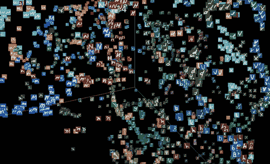

# 直观地理解主成分分析和 T-SNE

> 原文：<https://medium.com/analytics-vidhya/understanding-pca-and-t-sne-intuitively-f8f0e196aee4?source=collection_archive---------3----------------------->

在这篇文章中，我希望提出一种直观的方式来理解降维技术，如 PCA 和 T-SNE，而不要深究其背后的数学。

> **降维**
> 
> 在现实世界中，我们经常会遇到维数非常高(数千)的数据集。如果你不知道维度是什么，它们是帮助识别数据的东西或者是数据的属性。为了前任。如果我们以一个人为例，我们可以用他/她的身高、体重、肤色、年龄等来表示他们的尺寸。尺寸和特征这两个词可以互换使用。降维非常重要，因为:
> 
> 人类最多只能看到 3 维空间(至少在外星人入侵之前)
> 
> 通常，在所有特征上训练 ML 模型在计算上将是昂贵的

迷失在更高维度来源:[链接](https://www.cam.ac.uk/research/news/lost-in-high-dimensional-space-study-improves-the-cure-for-the-curse-of-dimensionality)

# 主成分分析:

如前所述，在现实世界中，我们处理多维数据。降低维度是很有意义的。PCA 是广泛使用的降维技术之一。为了理解 PCA，让我们首先理解几个术语。

方差:它衡量我们的数据在任何给定维度上的分布情况。它在数学上可以定义为平均值的均方差。

协方差:它衡量我们的数据之间的线性关系，即如果 x 增加，y 也增加，则值为正，如果 x 增加，y 减少，则值为负，如果找不到线性关系，则值接近零。

协方差矩阵是对称矩阵，其中对角元素是特征的方差，而维度对的协方差是非对角元素。现在，用外行的话来说，我们想要减少维度，这样最大量的信息被保留。从几何角度来看，这意味着我们应该保留具有高方差(或具有最大数据分布)的特征。PCA 就是这么做的！它会创建新要素，从而保留最大方差。PCA 使用特征向量来实现这一点。在 PCA 中，我们找到协方差矩阵的特征向量和前 n 个特征向量(阅读新特征/维度),其中 n 的值取决于我们选择偏好的信息量。

> 在 PCA 之后，我们得到一组相互正交的特征，这意味着它们是线性独立的。这是通过创建新要素来实现的，这些新要素是数据集中原始要素的线性组合。此外，当线性无关特征之间的协方差为零时，我们还得到非对角元素为零。

PCA 源:[链接](https://stats.stackexchange.com/questions/2691/making-sense-of-principal-component-analysis-eigenvectors-eigenvalues)后沿绿线变换的特征

认证后活动应遵循的步骤:

1.  归一化数据集并计算其协方差矩阵 x。
2.  求其特征向量和特征值。
3.  为了减少到 k 维，排序并选择对应于前 k 个特征值的特征向量。
4.  将 n 维数据转换为新的 k 维数据。

> 注意:我们可以根据想要保留的方差百分比来选择我们想要的维数。例如，如果我们希望保留 90%的信息，我们可以这样选择 k:k 个特征值之和/n 个特征值之和= .9

其中λI 对应于第 I 个特征值

根据上述公式构建一个图表，并选择最佳的“k”

***PCA 的局限性:***

1.  当要素不相关时，保留的方差会相对较低。例如，如果一个二维数据集是圆形的，我们试图把它投影到一个轴上，只有 50%的信息会被保留。
2.  PCA 考虑全局结构，因此邻域点/簇可能不会被保留。
3.  PCA 可能会发现很难捕捉非线性关系。
4.  PCA 不能在不同尺度的数据集上工作(这可以通过标准化数据来克服)
5.  PCA 容易在数据中产生异常值。(除了最大化方差之外，PCA 的替代公式是构建一个距离最小化的特征。这是使用离差的平方和来完成的，这对于异常值来说将非常高，从而支配了分量)

**一个代码简单的例子:**

让我们不要从零开始实现 PCA，因为我们不想深入研究数学。(但是，如果您选择查找输入数据的协方差矩阵，并使用来自 [Scipy](https://docs.scipy.org/doc/scipy/reference/generated/scipy.linalg.eigh.html) 的 eigh 模块查找它们的特征向量。)下面的代码使用 Scikit 的 PCA 实现将神圣的 [MNIST](http://yann.lecun.com/exdb/mnist/) 数据集的维数从 784 维减少到 2 维。

使用 Scikit-learn 对 MNIST 进行 PCA 分析

虽然会有大量的信息丢失，但我们可以按照下面的第一个主成分来可视化数据。

沿着前两个主成分可视化的 MNIST 数据集。

# SNE 霸王龙:

首先，T-SNE 代表 T-分布式随机邻域嵌入。虽然 PCA 是用于降维的最古老的技术之一，但是 T-SNE 是相对较新的(大约十年前！).T-SNE 的关键是通过将高维数据拟合成概率分布，将高维数据转换成低维数据，使得邻域点保持在低维中。然而，当我们试图将分布拟合到低维空间中时，中心附近的点变得拥挤，这也被称为拥挤问题(拥挤是由于维数灾难而发生的。简而言之，在像超球体这样的高维空间中有更多的点，但是当减少到 2-d 平面时，就没有多少空间了，这意味着这些点在有限的空间中变得拥挤。为了绕过这个事实，算法使用了一个学生 t 分布(因此 t-sne 中的字母“t ”),它具有更宽的尾部。

> 简而言之，该算法试图通过将数据拟合到学生 t 分布中来将点从高维嵌入到低维，从而保留点的邻域。

现在，让我们试着理解 t-sne 的一些参数:

困惑:对应于我们在给定空间中选择保留的邻居数量

迭代次数:您希望算法运行的迭代次数(t-sne 在每次迭代中不断移动点，并在一个确定的点停止)

t-sne 应用于高 dim word2vec 来源:[链接](https://www.ibm.com/blogs/research/2017/11/interactive-supervision-tensorboard/)

> 注意:由于 t-sne 是一种迭代随机算法，对多个迭代和困惑值运行它并选择最适合我们数据集的算法总是更明智的。运行和发挥周围的 t-sne 参数[在这里](https://distill.pub/2016/misread-tsne/)。

***t-SNE***的注意事项/局限性:

1.  由于它是一种非确定性算法，因此必须在改变参数值的情况下运行多次，并选择最适合我们数据集的算法。
2.  t-sne 中的簇大小没有任何意义，因为该算法操纵更密集和更稀疏的簇以适应更低维度的空间。
3.  即使参数值适合我们的数据集，也要使用相同的值多次运行相同的算法，以确保形状不会改变。

**一个代码简单的例子:**

从 Scikit Learn 导入 T-sne，并在数据集上运行算法以获得迭代和困惑的多个值。

T-SNE 对 MNIST 使用 Scikit 学习

下面是用 T-SNE 在二维空间显示的 MINIST。

使用 T-SNE 的二维空间上的 MNIST

**PCA vs T-SNE:**

1.  PCA 致力于保存数据的全局结构，而 T-SNE 保存局部结构。
2.  PCA 和 T-SNE 都产生难以解释的特征。
3.  当特征之间存在线性关系时，PCA 工作得很好，而 T-SNE 即使在非线性数据集中也做得不错。
4.  PCA 是一种确定性算法(每次产生相同的输出)，而 T-SNE 在本质上是非确定性的(每次可能产生不同的输出)

参考资料:

1.  [www.appliedaicourse.com](http://www.appliedaicourse.com)
2.  [https://stats . stack exchange . com/questions/2691/making-sense-of-principal-component-analysis-features vectors-environments](https://stats.stackexchange.com/questions/2691/making-sense-of-principal-component-analysis-eigenvectors-eigenvalues)
3.  [https://ml explained . com/2018/09/14/paper-parsed-visualizing-data-using-t-SNE-explained/](https://mlexplained.com/2018/09/14/paper-dissected-visualizing-data-using-t-sne-explained/)

其他资源:

1.  [http://colah.github.io/posts/2014-10-Visualizing-MNIST/](http://colah.github.io/posts/2014-10-Visualizing-MNIST/)
2.  [https://distill.pub/2016/misread-tsne/](https://distill.pub/2016/misread-tsne/)