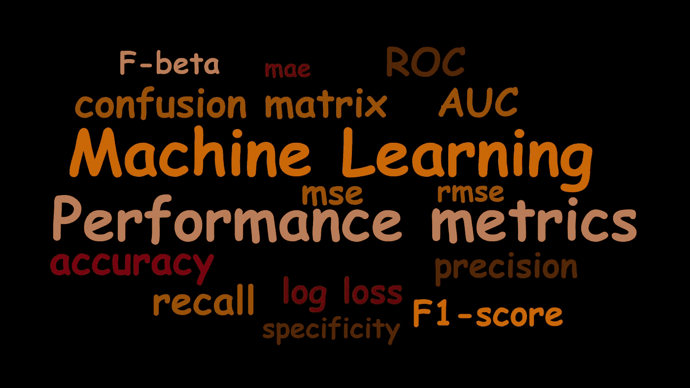

# 了解机器学习算法的性能指标

> 原文：<https://medium.com/analytics-vidhya/understanding-performance-metrics-for-machine-learning-algorithms-996dd7efde1e?source=collection_archive---------3----------------------->

## 解释了性能指标——它们如何工作以及何时使用？

性能指标用于评估机器学习算法的整体性能，并了解我们的机器学习模型在不同场景下对给定数据的执行情况。选择正确的指标…