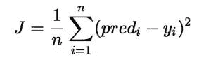

# 了解多项式回归！！！

> 原文：<https://medium.com/analytics-vidhya/understanding-polynomial-regression-5ac25b970e18?source=collection_archive---------0----------------------->


在我之前的文章中，我们概述了[](/analytics-vidhya/understanding-the-linear-regression-808c1f6941c0)**和 [**逻辑回归**](/analytics-vidhya/understanding-logistic-regression-b3c672deac04) 。
再来看回归家族的另一个算法。**

# **内容:**

1.  **什么是多项式回归？**
2.  **多项式回归的假设。**
3.  **为什么我们需要多项式回归？**
4.  **如何求多项式方程的右次？**
5.  **多项式方程背后的数学。**
6.  **多项式回归的代价函数。**
7.  **梯度下降多项式回归。**

# **什么是多项式回归？**

*   ****多项式回归**是回归分析的一种形式，其中自变量和因变量之间的关系用 n 次多项式建模。**
*   ****多项式回归**模型通常用最小二乘法拟合。*最小二乘法最小化系数的方差，下* [***高斯马尔可夫定理***](https://en.wikipedia.org/wiki/Gauss%E2%80%93Markov_theorem#:~:text=In%20statistics%2C%20the%20Gauss%E2%80%93Markov,and%20expectation%20value%20of%20zero.) *。***
*   **多项式回归是线性回归的一种特殊情况，我们将**多项式方程**拟合到因变量和自变量之间具有曲线关系的数据上。**

> **二次方程是二次多项式方程。但是，这个度数可以增加到第 n 个值。**

****

**现在，你知道什么是多项式回归了。让我们看一下假设列表，因为每个回归分析都有自己的假设。**

# **多项式回归的假设:**

*   **因变量的行为可以用因变量和一组 *k* 自变量 *(xi，i=1 到 k)之间的线性或曲线加性关系来解释。***
*   **因变量和任何自变量之间的关系是线性的或曲线的(特别是多项式)。**
*   **自变量是相互独立的。**
*   **误差是独立的，正态分布，均值为零，方差恒定( *OLS* )。**

# **为什么我们需要多项式回归？**

**我们来考虑一个 [***简单线性回归***](/analytics-vidhya/understanding-the-linear-regression-808c1f6941c0) 的情况。**

*   **我们制作了模型，发现它表现很差，**
*   **我们观察实际值和我们预测的最佳拟合线之间的情况，看起来实际值在图中有某种曲线，我们的线没有接近切割点的平均值。**
*   **这就是多项式回归发挥作用的地方，它预测遵循数据模式(曲线)的最佳拟合线，如下图所示:**

****

*   ****多项式回归不要求数据集中的自变量和因变量之间的关系是线性的，**这也是线性回归和多项式回归的主要区别之一。**
*   **当数据中的点没有被线性回归模型捕获，并且[线性回归](/analytics-vidhya/understanding-the-linear-regression-808c1f6941c0)不能清楚地描述最佳结果时，通常使用多项式回归。**

> **当我们增加模型中的次数时，往往会增加模型的性能。然而，增加模型的次数也会增加数据过度拟合和欠拟合的风险[。](/analytics-vidhya/over-fitted-and-under-fitted-models-f5c96e9ac581)**

# **如何找到方程的正确次数？**

**为了找到模型的正确程度以防止[过度装配或](/analytics-vidhya/over-fitted-and-under-fitted-models-f5c96e9ac581)装配不足，我们可以使用:**

1.  ****前向选择:** 该方法增加度数，直到其足够显著，以定义最佳可能模型。**
2.  ****后向选择:** 该方法降低程度，直到它足够显著以定义最佳可能模型。**

# **多项式回归背后的数学！**

**如果你知道什么是线性回归，那么你可能也会理解多项式回归背后的数学原理。
线性回归基本上是一次多项式。
我希望下面的图片能说明问题。**

****

**现在用矩阵乘法求出 b 的值。
对于多变量，矩阵计算通过以下方式完成:**

****

> **为了更好地理解背后的数学，我建议你参考这个[链接](http://polynomialregression.drque.net/math.html)，它清楚地解释了数学。**

# **多项式回归的成本函数**

****

**Pepi Stojanovski 在 [Unsplash](https://unsplash.com?utm_source=medium&utm_medium=referral) 上拍摄的照片**

****成本函数**是**针对给定数据衡量机器学习模型**性能的函数。
成本函数基本上是预测值和期望值之间的误差的计算，**以单个实数的形式呈现**。
许多人混淆了**成本函数**和**损失函数**，
简单来说**成本函数**是数据中 n 个样本的平均误差，而**损失函数**是单个数据点的误差。换句话说，**损失函数**是针对一个训练样本的，**成本函数**是针对整个训练集的。**

**所以，当我们清楚什么是成本函数时，让我们继续。**

> **如果你读过我关于[线性回归](/analytics-vidhya/understanding-the-linear-regression-808c1f6941c0)的文章，你就会知道线性回归的成本函数。**

*   **多项式回归的成本函数也可以取为*均方误差*，但是方程会有微小的变化。**

****

```
#Cost Function of Linear Regression
J = 1/n*sum(square(pred - y))Which, can also be written as :
J = 1/n*sum(square(pred-(b0 + b1x1)))  i.e, y = mx+b#Cost Function of Polynomial Ression
J = 1/n*sum(square(pred - y))
However,here the eqaution of y will change.So,the equation can also be written as:
J = 1/n*sum(square(pred - (b0 + b1x + b2x^2 + b3x^3.....))
```

*   **多项式回归可以减少成本函数返回的成本。它给你的回归线一个曲线形状，使它更适合你的基础数据。通过应用高阶多项式，您可以更精确地拟合数据的回归线。**

**现在，我们知道成本函数的理想值是 0 或接近 0 的某个值。
为了得到理想的成本函数，我们可以执行梯度下降，更新权重，从而使误差最小化。**

# **多项式回归的梯度下降**

****

**梯度下降是一种优化算法，用于找到使成本函数(成本)最小化的函数的参数(系数)值。**

> **为了更多地了解它，并对梯度下降有一个完美的理解，我建议阅读杰森·布朗利的博客。**

**要更新 m 和 b 值以降低成本函数(最小化 MSE 值)并获得最佳拟合线，您可以使用梯度下降。想法是从随机的 m 和 b 值开始，然后迭代地更新这些值，达到最小成本。**

****梯度下降后获得较低成本函数的步骤:****

**→最初，m 和 b 的值将为 0，学习率(α)将被引入函数。
学习率(α)的值取得很小，大约在 0.01 或 0.0001 之间。**

> ****学习率是优化算法中的调整参数，该优化算法在向成本函数的最小值移动时确定每次迭代的步长。****

**→然后根据斜率(m)计算成本函数方程的偏导数，并计算截距(b)的导数。**

> ***熟悉微积分的人会理解导数是如何产生的。***
> 
> ***如果你不知道微积分，不要担心，只要理解它是如何工作的，就足够直观地思考幕后发生的事情了。***

**→计算导数后，斜率(m)和截距(b)在以下等式的帮助下更新。
m = m 的 m-α*导数
b = b 的 b-α*导数
上面计算了 m 和 b 的导数，α是学习率。**

> ***如果你浏览过杰森·布朗利的博客*[](https://machinelearningmastery.com/gradient-descent-for-machine-learning/)**你可能已经理解了梯度下降背后的直觉，以及它如何试图达到全局最优(最低成本函数值)。****

> ******为什么要用导数减去权重(m 和 b)？*** *梯度给我们损失函数的最陡上升的方向，最陡下降的方向与梯度相反，这就是为什么我们从权重(m 和 b)中减去梯度****

***→更新 m 和 b 的值的过程继续，直到成本函数达到理想值 0 或接近 0。
m 和 b 的值现在将是描述最佳拟合线的最佳值。***

> ***我希望以上内容对你有意义。***

***快乐学习！！！！！***

***喜欢我的文章？请为我鼓掌并分享它，因为这将增强我的信心。此外，我每周日都会发布新文章，所以请保持联系，以了解数据科学和机器学习基础系列的未来文章。***

***还有，一定要在 LinkedIn 上和我联系。***

******

***[Alex](https://unsplash.com/@alx_andru?utm_source=medium&utm_medium=referral) 在 [Unsplash](https://unsplash.com?utm_source=medium&utm_medium=referral) 上拍摄的照片***