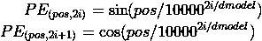
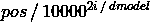
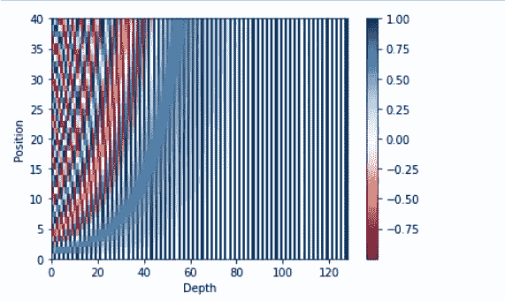
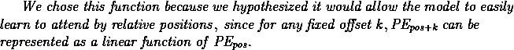
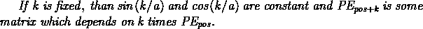
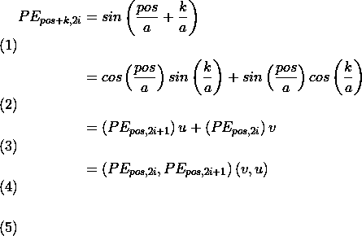
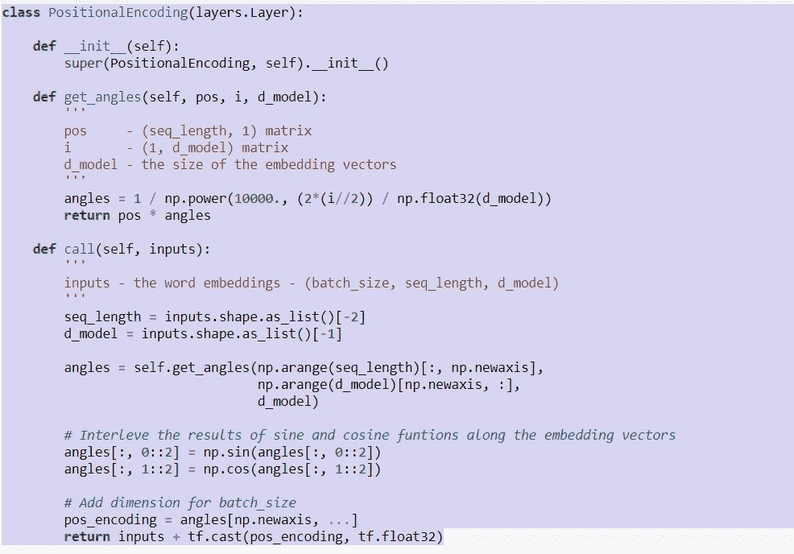

# 了解变压器中的位置编码

> 原文：<https://medium.com/analytics-vidhya/understanding-positional-encoding-in-transformers-def92aca1dfe?source=collection_archive---------2----------------------->

理解变压器模型的一个重要关键

当我开始学习 transformer 模型时，我发现理解它们如何工作的最大障碍是位置编码和自我关注的概念。所以我写了这篇文章，希望它能帮助别人。我将在这里处理位置编码，在以后的文章中处理自我关注。

这篇文章不是关于变形金刚，只是位置编码。如果你在学习变形金刚的时候陷入概念的话，它更像是一种资源。出于学习变形金刚的目的，我建议你先读一读引发这一切的研究论文，[注意力是你所需要的全部](https://arxiv.org/abs/1706.03762)。你也可以看看杰伊·阿拉玛的神奇贴[《变形金刚》](http://jalammar.github.io/illustrated-transformer/)。

**位置编码**

与“RNN”和“LSTM”等顺序算法不同，变压器没有内置的机制来捕捉单词在句子中的相对位置。这很重要，因为单词之间的距离提供了重要的上下文信息。这就是位置编码介入的地方。

位置编码不是模型架构的一部分。它实际上是预处理的一部分。位置编码向量被生成为与每个单词的嵌入向量大小相同。计算之后，位置编码矢量被加到嵌入矢量上。“注入”到嵌入向量中的模式允许算法学习该空间信息。

那么它是如何工作的呢？

请注意，在下面的公式中，‘*PE’*是单词在序列中的位置(*pos’*)和嵌入(I)的函数。

**位置编码公式**

首先，使用以下公式计算角度:

**角度计算**

然后，取角度的*正弦*或*余弦*。这给出了在位置*‘位置’*和嵌入索引’*I’*的单词的值。*‘pos’*保持单词的常数，因为嵌入索引， *i* 增加，给出该单词的唯一模式

在转到下一个单词时，‘*pos’*递增。这将模式稍微向右移动。' *PE'* 公式对偶数嵌入索引应用正弦函数( *i'* )，对奇数嵌入索引应用余弦函数。这就是为什么您会在下图中看到交错模式(棋盘)。

**图 1:位置编码**

为什么这个公式？论文的作者是这样解释的:

数学解释来自下面提到的 [Reddit](https://www.reddit.com/r/MachineLearning/comments/6jdi87/r_question_about_positional_encodings_used_in/) post. > If k is fixed, than sin(k/a) and cos(k/a) are constant and PE_{pos+k} is some matrix which depends on) 。

史蒂文·斯密特在他的[博客](https://stevensmit.me/taking-a-look-at-transformer-architecture/)中做了另一个很好的解释:

> 使用正弦和余弦函数的原因之一是它们是周期性的，因此无论模型是在长度为 5 的序列上学习，还是在长度为 500 的序列上学习，编码将总是具有相同的范围([-1，1])。

注意，变压器内的剩余连接有助于逐层加强位置编码。

**位置编码代码:**

**图 2:代码**

现在你知道了。同样，位置嵌入被添加到嵌入向量，该嵌入向量成为变换器的输入。转换器是一个深度学习模型，在训练时将学习嵌入的位置数据的含义。

下一次:自我关注