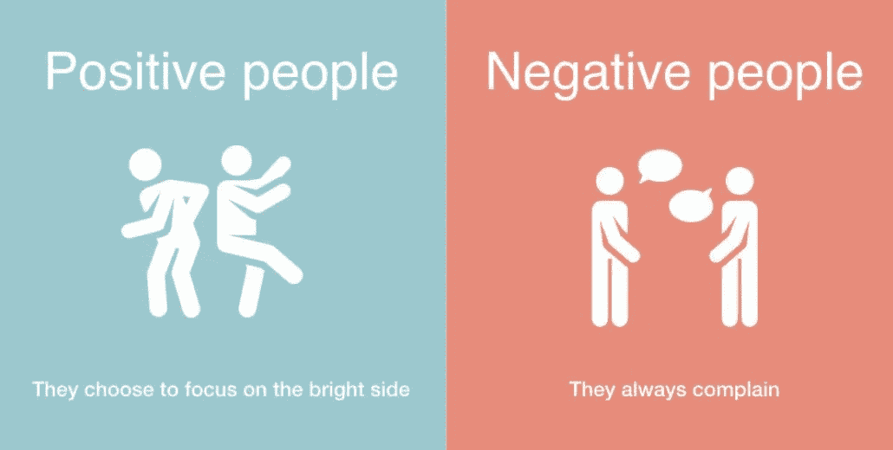

# 理解积极和消极的关系(关于社会网络概念)

> 原文：<https://medium.com/analytics-vidhya/understanding-positive-and-negative-relationships-with-respect-to-social-network-concepts-4a729590e995?source=collection_archive---------4----------------------->

对于地球上的所有生物来说，关系从出生开始，一直持续到死亡。至少人类是这样的(就朋友、家人、邻居、同事等而言……)。它们在人生的任何阶段都是不可避免的。必要时，社交网络是与人联系和互动的好方法。理解…