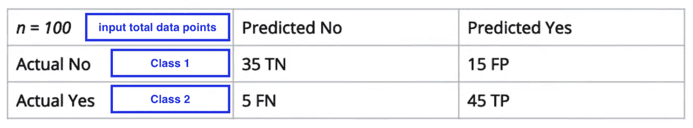

# 什么是精度、召回率、F1-得分和混淆矩阵？

> 原文：<https://medium.com/analytics-vidhya/understanding-precision-recall-f1-score-and-confusion-matrix-b701659b9a21?source=collection_archive---------14----------------------->

我相信这是一个容易混淆的常见话题。然而，我分享我是如何理解这些概念的，因为我花了一段时间来理解这些概念。

首先，让我们从 [**混淆矩阵**](https://en.wikipedia.org/wiki/Confusion_matrix#Table_of_confusion) 开始，它也被称为**误差矩阵**。这是机器学习领域需要理解的一个基本概念。

*   **混淆矩阵**显示给定一些输入数据点(*通常为* `n`)的真阳性、真阴性、假阳性和假阴性的数量

从上图来看，`n`是*输入数据点*。这里我们有两个类:

*   实际编号:1 级
*   实际是:2 级

> 混淆矩阵帮助你理解你的模型的**精度**和**召回**。怎么会？我将回到这一点。先说**精密**和**召回**。

精确度和召回率只是衡量一个训练好的模型的成功或表现的不同标准。

**Precision** 显示模型预测阳性标签时的正确频率。即**真阳性**(在这种情况下)的数量除以 ***所有*** **阳性**，并且当假阳性的数量较低时会更高。公式是**T**rue**P**Positives(**TP**)除以总预测阳性数( **TP + FP** )。 **FP** 表示**F**alse**P**positive。

> [**假阳性**](https://en.wikipedia.org/wiki/False_positives_and_false_negatives) 是指模型错误地指示某个条件的存在。

检查示例，实际是**不是**，但模型预测**是**。

所以在上面的例子中，对于 75%的**精度**分数，这将是 **45** 除以 **60** ( *其中 45 是 TP，FP 是 15 = 60* )。

**回忆**显示你的模型预测了多少个 **T** rue **P** 正数。公式是**T**rue**P**Positives 除以总实数 Positives(**TP**+**FN**)。这是真阳性的数量超过真阳性的数量*加上假阴性的数量*，并且当假阴性的数量低时会更高。

> [***假阴性***](https://en.wikipedia.org/wiki/False_positives_and_false_negatives) *是指当某个条件存在时，模型错误地未能指示该条件的存在*。([读取类型 I & II 错误](https://en.wikipedia.org/wiki/Type_I_and_type_II_errors))

因此，召回率为 90%时，满分为 **50** 中的 **45** 。

回到我之前说的，混淆矩阵如何帮助你理解你的模型的精度和召回率？

> *简单来说，它通过计算出真阳性和假阳性，以及真阴性和假阴性来提供帮助。*

接下来，我们来说说 F1-Score。

F1 分数是精确度和召回率的完美结合。因为经常会有权衡，并且以更高的精度或更高的召回率为目标，所以可以以提高 F1 分数为目标。

该公式如下图所示。

F1 的最高分是 1，表示完美的精确度和召回率，最低分是 0。

在本文开头给出的示例中，该示例的 F1 分数大约为 0.83。

感谢您的阅读。